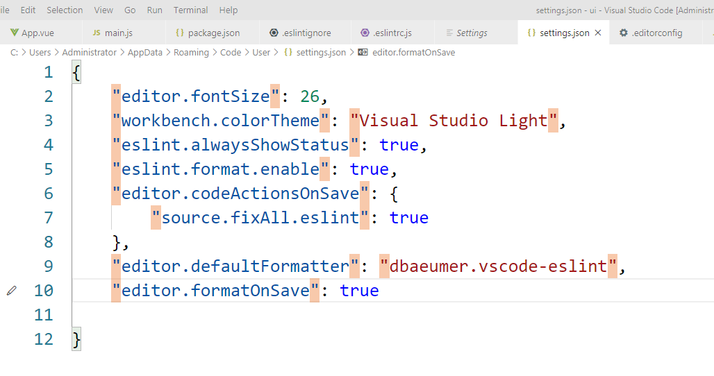

# 設定自動格式化

在編輯器的settings.json 加上以下這段

```
{
    "eslint.alwaysShowStatus": true,
    "eslint.format.enable": true,
    "editor.codeActionsOnSave": {
        "source.fixAll.eslint": true
    },
    "editor.defaultFormatter": "dbaeumer.vscode-eslint",
    "editor.formatOnSave": true
}
```

