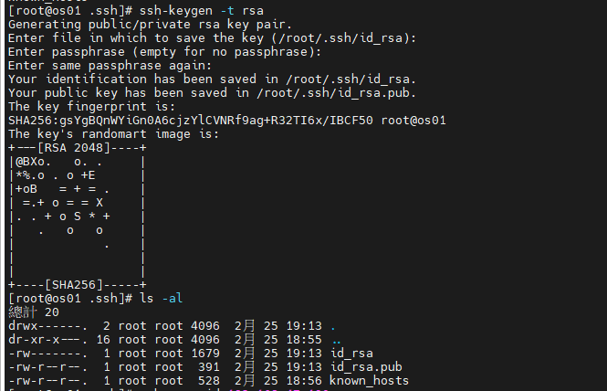
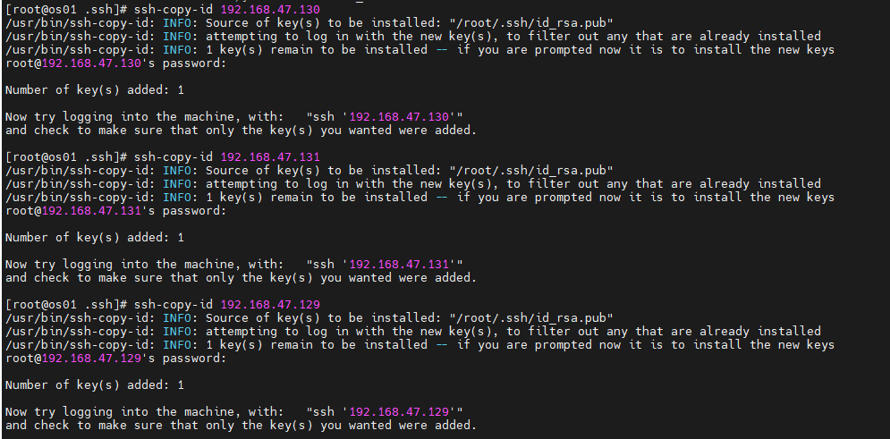
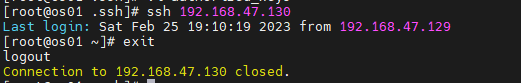
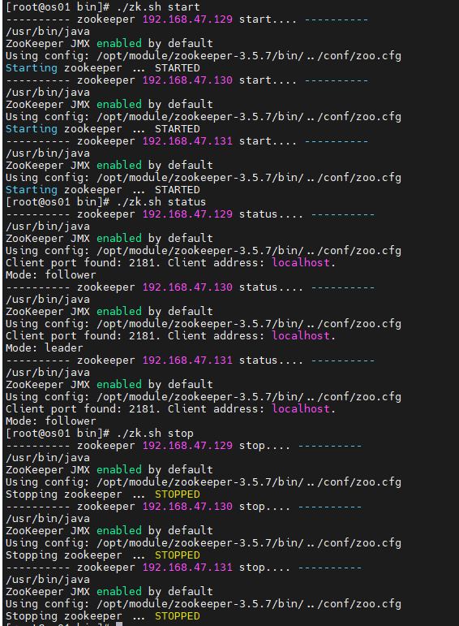
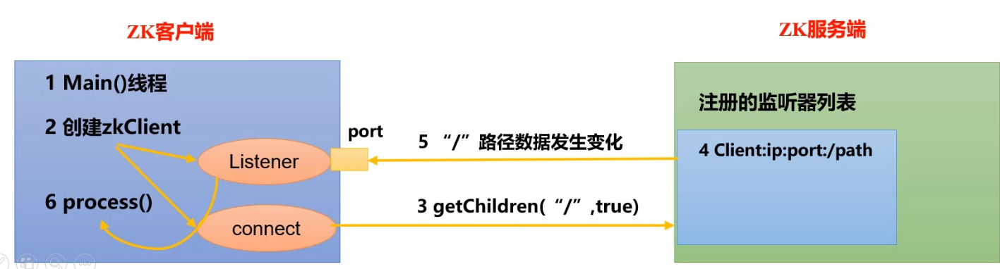
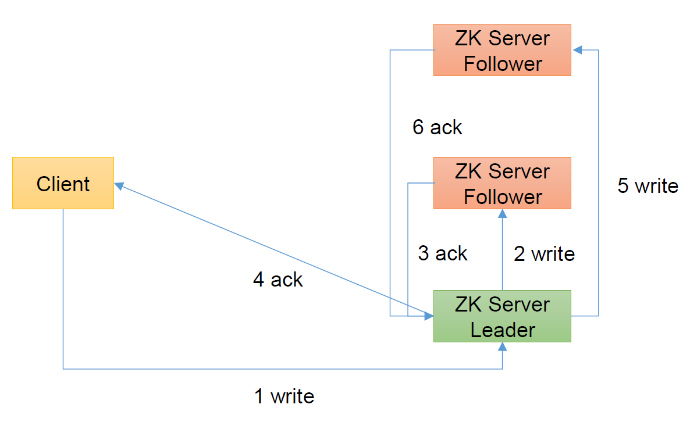
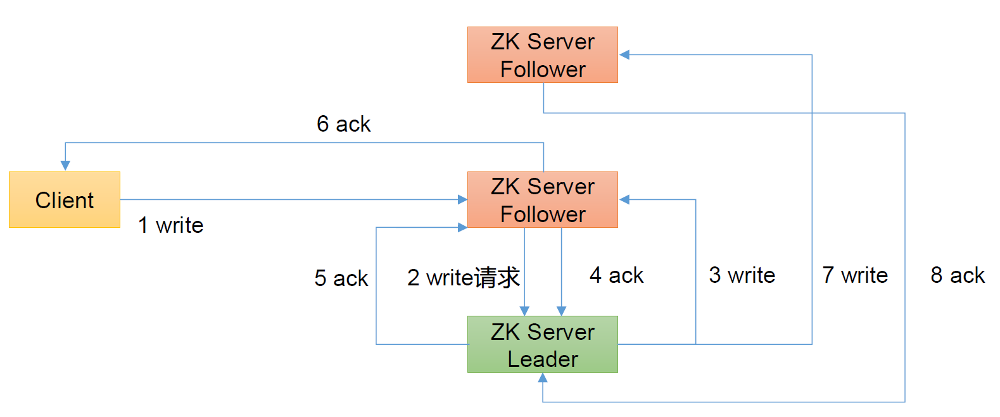
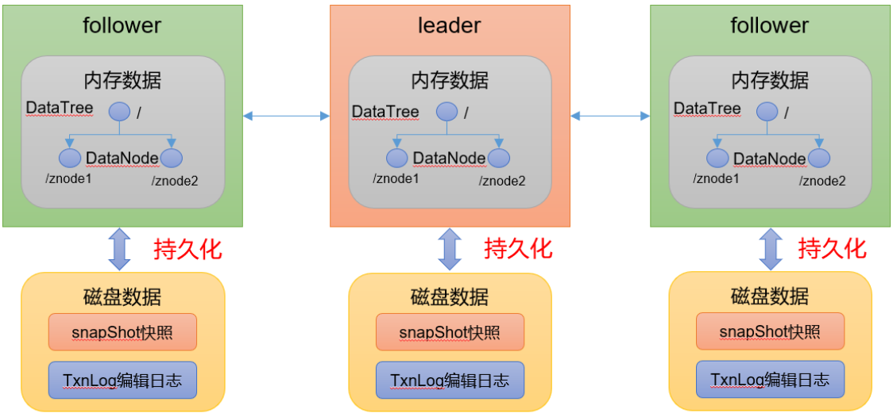
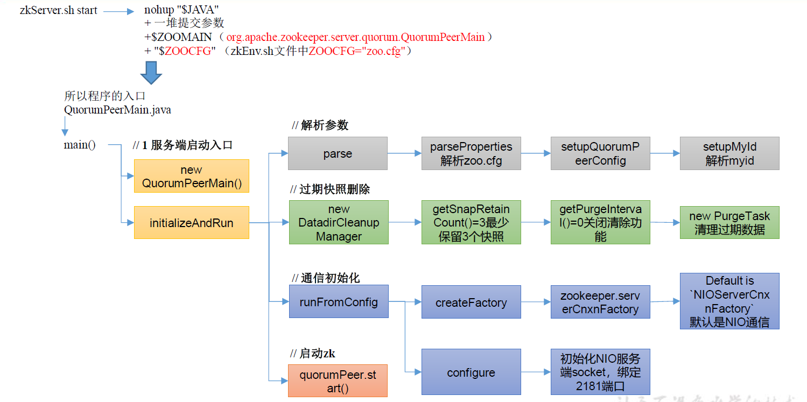
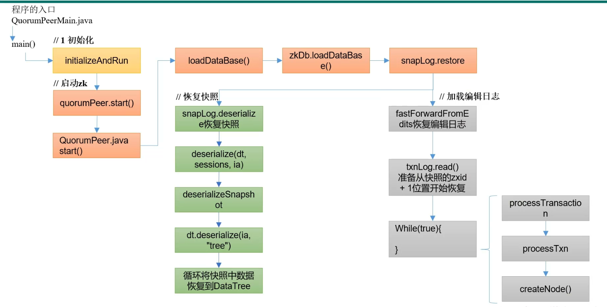

# 一般指令

## 1.啟動
```
zkServer.sh start
```
## 2.停止
```
zkServer.sh stop
```

## 3.查看狀態
```
zkServer.sh status
```


# 集群搭建

## 1.準備好3台CentOs

* 1.將zookeeper 個致解壓縮到 /opt/module/zookeeper-3.5.7
* 2.機器配置IP 192.168.47.129、192.168.47.129、192.168.47.129
* 3.配置好公鑰，讓ssh登入其他台不用密碼
  * a. 在home底下的.ssh資料夾下配置(如果是root 在/root底下)
  ```
  ```
  * b. 產生公鑰跟私鑰
  ```
  ssh-keygen -t rsa
  ```
  
  * c. 將公鑰配置到其他服務器(自己也要配)
  ```
  #自己也要配
  ssh-copy-id 192.168.47.129
  ssh-copy-id 192.168.47.130
  ssh-copy-id 192.168.47.131
  ```
  
  * d. 測試

  ```
  #登入
  ssh 192.168.47.130

  #退出
  exit
  ```
  

## 2.設置conf/zoo.cfg

* 1.配置以下設置(每台階需配置)
```
#####Cluster######
server.129=192.168.47.129:2888:3888
server.130=192.168.47.130:2888:3888
server.131=192.168.47.131:2888:3888

```
* 2.配置參數說明

```
server.A=B:C:D
```

* 1.A:是一個數字，表示這個是第幾傲的服務器 
  * 集群模式下配置一個文件 myid 這個文件在 dataDir目錄下，這個文件裡面有一個數據就是A的值，Zookeeper啟動時讀取此文件，拿到裡面的數據與 zoo.cfg裡面的配置信息比較從而判斷到底是哪個 server
* 2.B:是指這台服務器的IP
* 3.C:是指這個服務器Follower與集群中的Lerder服務器交換信息的端口
* 4.D:是指萬一集群中的 Leader 服務器掛了，需要一個端口來重新進行選舉，選出一個新的 Leader，而這個端口就是用來執行選舉時服務器相互通信的端口。

## 3.打開Zookeeper需要的端口號

```
# 開啟3888 port
firewall-cmd --zone=public --add-port=3888/tcp --permanent

# 開啟2888 port
firewall-cmd --zone=public --add-port=2888/tcp --permanent

#重啟防火牆
service firewalld restart

#查看開啟的端口號
firewall-cmd --permanent --list-port
```

## 4.啟動3台zookeeper 即可

## 5.邊寫腳本

* 1.創建zk.sh檔案

* 2.編寫腳本
```
#!bin/bash

case $1 in 
"start"){
	
	for i in 192.168.47.129 192.168.47.130 192.168.47.131
	do
		echo ---------- zookeeper $i start.... ----------
		ssh $i "/opt/module/zookeeper-3.5.7/bin/zkServer.sh start"
	done
}
;;
"stop"){

	for i in 192.168.47.129 192.168.47.130 192.168.47.131
	do
		echo ---------- zookeeper $i stop.... ----------
		ssh $i "/opt/module/zookeeper-3.5.7/bin/zkServer.sh stop"
	done

}
;;
"status"){
	for i in 192.168.47.129 192.168.47.130 192.168.47.131
	do
		echo ---------- zookeeper $i status.... ----------
		ssh $i "/opt/module/zookeeper-3.5.7/bin/zkServer.sh status"
	done

}
;;
esac
```

* 3.更改權限

```
chmod 777 zk.sh
```

* 4.執行結果


# 客戶端命令操作



# 客戶端API操作

## 1.pom

```xml
  <dependencies>
	  <!-- https://mvnrepository.com/artifact/org.apache.zookeeper/zookeeper -->
	<dependency>
	    <groupId>junit</groupId>
	    <artifactId>junit</artifactId>
	    <version>RELEASE</version>
	</dependency>
	<dependency>
	    <groupId>org.apache.logging.log4j</groupId>
	    <artifactId>log4j-core</artifactId>
	    <version>2.8.2</version>
	</dependency>
	<dependency>
	    <groupId>org.apache.zookeeper</groupId>
	    <artifactId>zookeeper</artifactId>
	    <version>3.5.7</version>
	</dependency>

  </dependencies>
```

```java
package com.frank.zoo;

import org.apache.zookeeper.*;
import org.apache.zookeeper.data.Stat;
import org.junit.Before;
import org.junit.Test;

import java.io.IOException;
import java.util.List;

public class ZkClient {

    // 注意：逗号左右不能有空格
    private String connectString = "192.168.47.129:2181,192.168.47.130:2181,192.168.47.131:2181";
    private int sessionTimeout = 200000;
    private ZooKeeper zkClient;

    @Before
    public void init() throws IOException {

        zkClient = new ZooKeeper(connectString, sessionTimeout, new Watcher() {
            public void process(WatchedEvent watchedEvent) {
                System.out.println("-------------------------------");
                List<String> children = null;
                try {
                    children = zkClient.getChildren("/", true);//再次註冊監聽

                    for (String child : children) {
                        System.out.println(child);
                    }

                    System.out.println("-------------------------------");
                } catch (KeeperException e) {
                    e.printStackTrace();
                } catch (InterruptedException e) {
                    e.printStackTrace();
                }
            }
        });
    }

    @Test
    public void create() throws KeeperException, InterruptedException {
        String nodeCreated = zkClient.create("/fran113k", "ss.avi".getBytes(), ZooDefs.Ids.OPEN_ACL_UNSAFE, CreateMode.PERSISTENT);
        System.out.println("create res = "+nodeCreated);
    }

    @Test
    public void getChildren() throws KeeperException, InterruptedException {
        List<String> children = zkClient.getChildren("/", true);//監聽

        for (String child : children) {
            System.out.println(child);
        }

        // 延时
        Thread.sleep(Long.MAX_VALUE);
    }

    @Test
    public void exist() throws KeeperException, InterruptedException {

        Stat stat = zkClient.exists("/9999", false);

        System.out.println(stat==null? "not exist " : "exist");
    }
}

```

# 客戶端項服務器寫數據流程

## 1.Client直接訪問Leader


* 1.Leader寫入數據
* 2.寫得請求通知第2台服務器
* 3.第2台回覆Leader寫完
* 4.只要超過半數服務器寫完，就通知client說寫完
* 5.繼續告訴剩下的服務器寫數據
* 6.剩下的服務器回覆Leader寫完

## 2.Client訪問Follower



* 1.Follower轉發請求給Leader寫入數據
* 2.Leader寫入數據
* 3.寫得請求通知第2台服務器
* 3.第2台回覆Leader寫完
* 4.只要超過半數服務器寫完，就通知client請求的那台服務器說寫完
* 5.client請求的那台服務器會覆Client寫完
* 6.繼續告訴剩下的服務器寫數據
* 7.剩下的服務器回覆Leader寫完


# 數據存儲



# ZK服務端初始化






