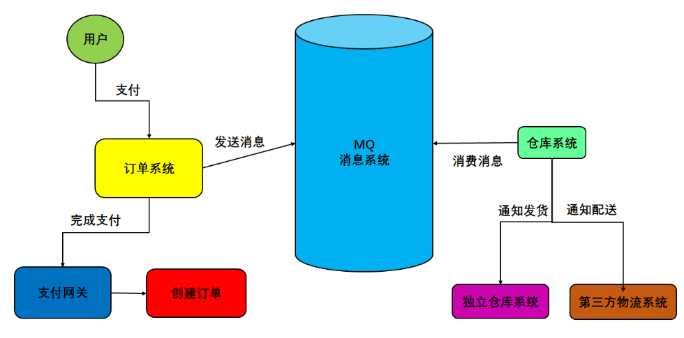
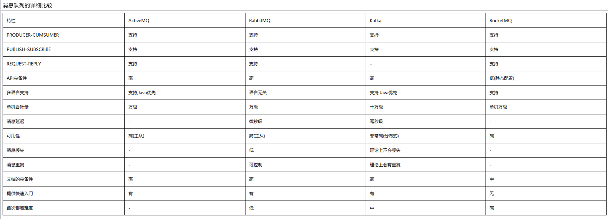
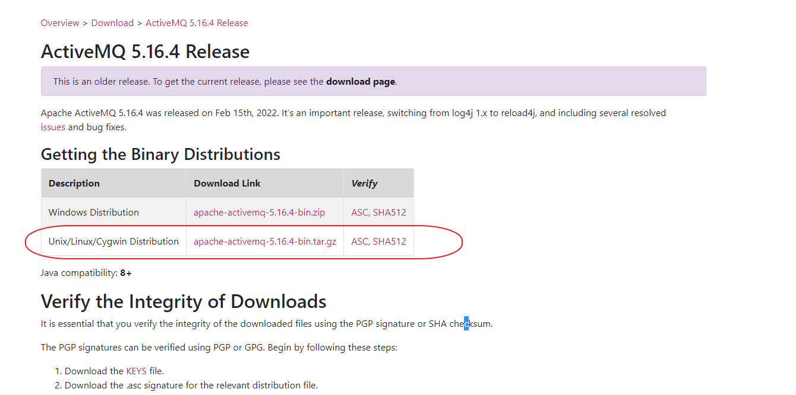
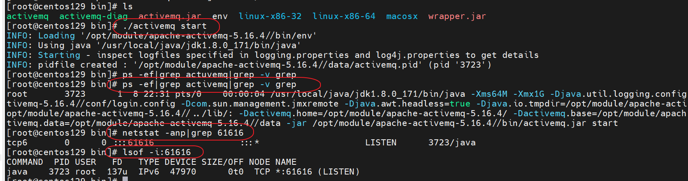
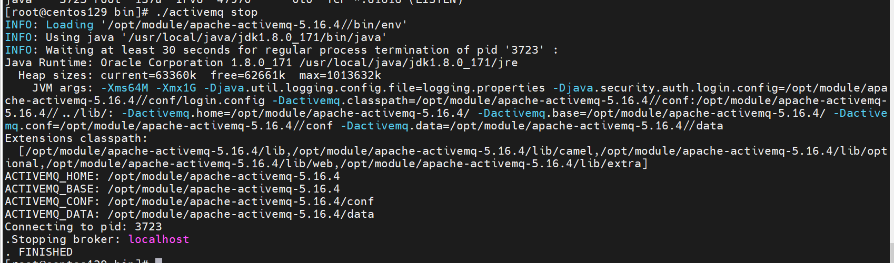
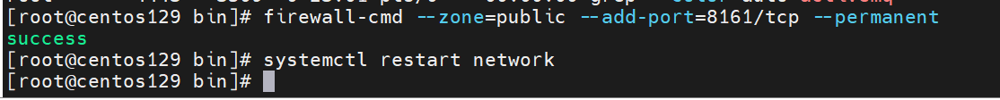

 # MQ簡介

 * MQ就是消息間件

## 定義
- 面向消息的中間件（message-oriented middleware）MOM能夠很好的解決以上問題，是指利用高效可靠的消息傳遞機制與平台無關的數據交流，並基於數據通信來進行分佈式系統的集成。
- 通過提供消息傳遞和消息排隊模型在分佈式環境下提供應用解耦，彈性伸縮，冗餘存儲、流量削峰，異步通信，數據同步等功能。
- 大致的過程是這樣的：
  - 發送者把消息發送給消息服務器，消息服務器將消息存放在若干隊列/主題topic中，在合適的時候，消息服務器回將消息轉發給接受者。在這個過程中，發送和接收是異步的，也就是發送無需等待，而且發送者和接受者的生命週期也沒有必然的關係；
  - 尤其在發布pub/訂閱sub模式下，也可以完成一對多的通信，即讓一個消息有多個接受者。


## 相關功能技術點

- 1.api發送和接收
- 2.MQ的高可用性
- 3.MQ的集群和容錯配置
- 4.MQ的持久化
- 5.延時發送/定時發送
- 6.簽收機制
- 7.與spring整合
-  ....

## 特點

- 1.採異步處理模式
  - 消息發送者可以發送一個消息而無須等待響應。
  - 消息發送者將消息發送到一條虛擬的通道（主題或者隊列）上
  - 消息接收者則訂閱或者監聽該愛通道。一條消息可能最終轉發給一個或者多個消息接收者，這些消息接收者都無需對消息發送者做出同步回應。整個過程都是異步的。
  - 案例：
    - 也就是說，一個系統跟另一個系統之間進行通信的時候，假如係統A希望發送一個消息給系統B，讓他去處理。但是系統A不關注系統B到底怎麼處理或者有沒有處理好，所以系統A把消息發送給MQ，然後就不管這條消息的“死活了”，接著系統B從MQ裡面消費出來處理即可。至於怎麼處理，是否處理完畢，什麼時候處理，都是系統B的事兒，與系統A無關。


這樣的一種通信方式，就是所謂的“異步”通信方式，對於系統A來說，只需要把消息發送給MQ，然後系統B就會異步的去進行處理了，系統A不需要“同步”的等待系統B處理完成。這樣的好處是什麼呢？兩個字：解耦

- 2.應用系統之間的解耦合
  - 發送者和接受者不必了解對方，只需要確認消息
  - 發送者和接受者不必同時在線

- 3.案例


## 相關產品

- (1)	kafka
  - 編程語言：scala。
  - 大數據領域的主流MQ。

- (2)	rabbitmq
  - 編程語言：erlang
  - 基於erlang語言，不好修改底層，不要查找問題的原因，不建議選用。

- (3)	rocketmq
  - 編程語言：java
  - 適用於大型項目。適用於集群。

- (4)	activemq
  - 編程語言：java
  - 適用於中小型項目。



# 安裝

## 下載
https://activemq.apache.org/activemq-5016004-release



## 啟動、關閉
```
#查看有無開啟
ps -ef|grep activemq|grep -v grep

#查看port
netstat -anp|grep 61616

#
lsof -i:61616

#將log寫入LOG檔
./activemq start > /opt/module/apache-activemq-5.16.4/log
```




## 開啟後台

### 對外開放port號

```
#開啟 8161 port
firewall-cmd --zone=public --add-port=8161/tcp --permanent

#重啟防火牆
systemctl restart network
```


### 修改conf/jetty.xml

```xml

    <bean id="jettyPort" class="org.apache.activemq.web.WebConsolePort" init-method="start">
             <!-- the default port number for the web console -->
        <property name="host" value="192.168.47.129"/>
        <property name="port" value="8161"/>
    </bean>

```
