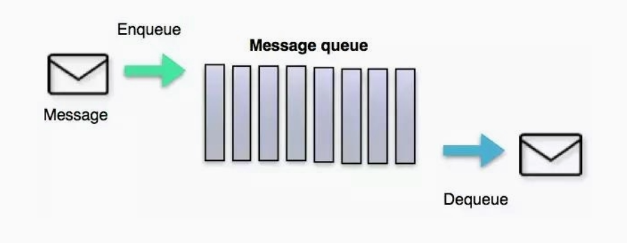

 # MQ簡介

 * MQ就是消息間件

## 定義
- 面向消息的中間件（message-oriented middleware）MOM能夠很好的解決以上問題，是指利用高效可靠的消息傳遞機制與平台無關的數據交流，並基於數據通信來進行分佈式系統的集成。
- 通過提供消息傳遞和消息排隊模型在分佈式環境下提供應用解耦，彈性伸縮，冗餘存儲、流量削峰，異步通信，數據同步等功能。
- 大致的過程是這樣的：
  - 發送者把消息發送給消息服務器，消息服務器將消息存放在若干隊列/主題topic中，在合適的時候，消息服務器回將消息轉發給接受者。在這個過程中，發送和接收是異步的，也就是發送無需等待，而且發送者和接受者的生命週期也沒有必然的關係；
  - 尤其在發布pub/訂閱sub模式下，也可以完成一對多的通信，即讓一個消息有多個接受者。



## 相關功能技術點

- 1.api發送和接收
- 2.MQ的高可用性
- 3.MQ的集群和容錯配置
- 4.MQ的持久化
- 5.延時發送/定時發送
- 6.簽收機制
- 7.與spring整合
-  ....

## 特點

- 1.採異步處理模式
  - 消息發送者可以發送一個消息而無須等待響應。
  - 消息發送者將消息發送到一條虛擬的通道（主題或者隊列）上
  - 消息接收者則訂閱或者監聽該愛通道。一條消息可能最終轉發給一個或者多個消息接收者，這些消息接收者都無需對消息發送者做出同步回應。整個過程都是異步的。
  - 案例：
    - 也就是說，一個系統跟另一個系統之間進行通信的時候，假如係統A希望發送一個消息給系統B，讓他去處理。但是系統A不關注系統B到底怎麼處理或者有沒有處理好，所以系統A把消息發送給MQ，然後就不管這條消息的“死活了”，接著系統B從MQ裡面消費出來處理即可。至於怎麼處理，是否處理完畢，什麼時候處理，都是系統B的事兒，與系統A無關。


這樣的一種通信方式，就是所謂的“異步”通信方式，對於系統A來說，只需要把消息發送給MQ，然後系統B就會異步的去進行處理了，系統A不需要“同步”的等待系統B處理完成。這樣的好處是什麼呢？兩個字：解耦

- 2.應用系統之間的解耦合
  - 發送者和接受者不必了解對方，只需要確認消息
  - 發送者和接受者不必同時在線

- 3.案例


## 相關產品

- (1)	kafka
  - 編程語言：scala。
  - 大數據領域的主流MQ。

- (2)	rabbitmq
  - 編程語言：erlang
  - 基於erlang語言，不好修改底層，不要查找問題的原因，不建議選用。

- (3)	rocketmq
  - 編程語言：java
  - 適用於大型項目。適用於集群。

- (4)	activemq
  - 編程語言：java
  - 適用於中小型項目。


# 安裝

## 下載
https://activemq.apache.org/activemq-5016004-release


## 啟動、關閉
```
#查看有無開啟
ps -ef|grep activemq|grep -v grep

#查看port
netstat -anp|grep 61616

#
lsof -i:61616

#將log寫入LOG檔
./activemq start > /opt/module/apache-activemq-5.16.4/log

# 有修改設定檔，依照修改的設定檔啟動

./activemq start xbean:file:/opt/module/apache-activemq-5.16.4/conf/activemq02.xml
```


## 開啟後台

### 對外開放port號

```
#開啟 8161 port
firewall-cmd --zone=public --add-port=8161/tcp --permanent
firewall-cmd --zone=public --add-port=61616/tcp --permanent

#重啟防火牆
systemctl restart network
```


### 修改conf/jetty.xml

```xml

    <bean id="jettyPort" class="org.apache.activemq.web.WebConsolePort" init-method="start">
             <!-- the default port number for the web console -->
        <property name="host" value="192.168.47.129"/>
        <property name="port" value="8161"/>
    </bean>

```

## JMS編碼結構


### Activemq遵循了JMS規範，總體的流程分為以下幾步：

  * 1.創建ConnectionFactory
  * 2.使用ConnectionFactory創建一個Connection
  * 3.使用Connection創建一個Session
  * 4.使用Session創建消息的生產者(Message Producer)和消息的消費者(MessageConsumer)
  * 5.生產者往Destination發送消息
  * 6.消費者從Destination消費消息
### Destination分成兩個部分


* 1.隊列(Queue)
  
* 2.主題(Topic)
  

## 使用JAVA放入消息，處理消息(queue)

### 消息生產者

```
package com.frank.activemq.queue;

import javax.jms.Connection;
import javax.jms.Destination;
import javax.jms.JMSException;
import javax.jms.MessageProducer;
import javax.jms.Queue;
import javax.jms.Session;
import javax.jms.TextMessage;

import org.apache.activemq.ActiveMQConnectionFactory;

public class JmsProduce {
	
	public static final String ACTIVEMQ_URL = "tcp://192.168.47.129:61616";
	public static final String QUEUE_NAME = "queue01";
	
	public static void main(String[] args) throws JMSException {
		//1.創建連接工廠，按照給定的URL地址，採用默認用戶名和密碼
		ActiveMQConnectionFactory actuActiveMQConnectionFactory = new ActiveMQConnectionFactory(ACTIVEMQ_URL);
		
		//2.通過連接工廠，獲得連接connection並開啟訪問
		Connection connection = actuActiveMQConnectionFactory.createConnection();
		connection.start();
		
		//3.創建session
		//兩個參數，第一個叫事務/第二個叫簽收
		Session session = connection.createSession(false, Session.AUTO_ACKNOWLEDGE);
		
		
		//4.創建目的地(具體是對列還是主題topic)
//		Destination destination = session.createQueue(QUEUE_NAME);
		Queue queue = session.createQueue(QUEUE_NAME);
		
		//5.創建消息的生產者
		MessageProducer messageProducer = session.createProducer(queue);
		
		//6.通過使用 MessageProducer 生產3條消息發送到MQ隊列裡面
		for(int i = 1 ;i<=3;i++) {
			
			//7.創建消息
			TextMessage textMessage = session.createTextMessage("msg----"+i);//理解為一個字串
			
			//8.通過MessageProducer發送給MQ
			messageProducer.send(textMessage);
		}
		
		//9.關閉資源
		messageProducer.close();
		session.close();
		connection.close();
		
		System.out.println("消息發布完成");
	}
}

```


 

### 消息消費者

- 1.阻塞式消費者(receive)

  - 訂閱者或接收者抵用MessageConsumer的receive()方法來接收消息，receive方法在能接收到消息之前（或超時之前）將一直阻塞。

 

```java
package com.frank.activemq.queue;

import java.io.IOException;

import javax.jms.Connection;
import javax.jms.JMSException;
import javax.jms.Message;
import javax.jms.MessageConsumer;
import javax.jms.MessageListener;
import javax.jms.Queue;
import javax.jms.Session;
import javax.jms.TextMessage;

import org.apache.activemq.ActiveMQConnectionFactory;

public class JmsConsumer {
	
	public static final String ACTIVEMQ_URL = "tcp://192.168.47.129:61616";
	public static final String QUEUE_NAME = "queue01";

	public static void main(String[] args) throws JMSException, IOException {
		//1.創建連接工廠，按照給定的URL地址，採用默認用戶名和密碼
		ActiveMQConnectionFactory actuActiveMQConnectionFactory = new ActiveMQConnectionFactory(ACTIVEMQ_URL);
		
		//2.通過連接工廠，獲得連接connection並開啟訪問
		Connection connection = actuActiveMQConnectionFactory.createConnection();
		connection.start();
		
		//3.創建session
		//兩個參數，第一個叫事務/第二個叫簽收
		Session session = connection.createSession(false, Session.AUTO_ACKNOWLEDGE);
		
		
		//4.創建目的地(具體是對列還是主題topic)
//		Destination destination = session.createQueue(QUEUE_NAME);
		Queue queue = session.createQueue(QUEUE_NAME);
		
		//5.創建消費者
		MessageConsumer messageConsumer = session.createConsumer(queue);
		
		while(true) {
			
			/*
			 * 同步阻塞方式(receive())
			 * 訂閱者或接收者調用MessageConsumer的receive()方法來接收消息，receive方法在能夠接收到消息之前(或超時之前)將一直堵塞
			 * */
			TextMessage textMessage = (TextMessage) messageConsumer.receive();//一直等
			//			TextMessage textMessage = (TextMessage) messageConsumer.receive(1000);//等待一秒後離開
			if(null != textMessage) {
				System.out.println("***消費者接收到消息:"+textMessage.getText());
			}else{
				break;
			}
		}
		
		
		System.in.read();
		
		messageConsumer.close();
		session.close();
		connection.close();
		
		

	}
}


```
- 2.異步監聽式消費者（監聽器onMessage()）
  - 訂閱者或接收者通過MessageConsumer的setMessageListener(MessageListener listener)註冊一個消息監聽器，
  - 當消息到達之後，系統會自動調用監聽器MessageListener的onMessage(Message message)方法。

```java
package com.frank.activemq.queue;

import java.io.IOException;

import javax.jms.Connection;
import javax.jms.JMSException;
import javax.jms.Message;
import javax.jms.MessageConsumer;
import javax.jms.MessageListener;
import javax.jms.Queue;
import javax.jms.Session;
import javax.jms.TextMessage;

import org.apache.activemq.ActiveMQConnectionFactory;

public class JmsConsumer {
	
	public static final String ACTIVEMQ_URL = "tcp://192.168.47.129:61616";
	public static final String QUEUE_NAME = "queue01";

	public static void main(String[] args) throws JMSException, IOException {
		//1.創建連接工廠，按照給定的URL地址，採用默認用戶名和密碼
		ActiveMQConnectionFactory actuActiveMQConnectionFactory = new ActiveMQConnectionFactory(ACTIVEMQ_URL);
		
		//2.通過連接工廠，獲得連接connection並開啟訪問
		Connection connection = actuActiveMQConnectionFactory.createConnection();
		connection.start();
		
		//3.創建session
		//兩個參數，第一個叫事務/第二個叫簽收
		Session session = connection.createSession(false, Session.AUTO_ACKNOWLEDGE);
		
		
		//4.創建目的地(具體是對列還是主題topic)
//		Destination destination = session.createQueue(QUEUE_NAME);
		Queue queue = session.createQueue(QUEUE_NAME);
		
		//5.創建消費者
		MessageConsumer messageConsumer = session.createConsumer(queue);
		
		//通過監聽的方式來消費消息
		//異步非阻塞方式(監聽器onMessage())
		//訂閱者或接收者通過MmessageConsumer的setMessageListener(MessageListener listener)註冊一個消息監聽器
		//當消息到達之後，系統自動調用監聽器MessageListener 的onMessage(Message message)方法
		messageConsumer.setMessageListener(new MessageListener() {
			
			public void onMessage(Message message) {
				if(null != message && message instanceof TextMessage) {
					TextMessage textMessage = (TextMessage) message;
					
					try {
						System.out.println("***消費者接收到消息:"+textMessage.getText());
					} catch (JMSException e) {
						// TODO Auto-generated catch block
						e.printStackTrace();
					}
				}
			}
		});
		
		System.in.read();
		
		messageConsumer.close();
		session.close();
		connection.close();
		
		

	}
}
```


 

 ### 控制台說明

* Number Of Pending Messages=等待消費的消息，這個是未出隊列的數量，公式=總接收數-總出隊列數。
* Number Of Consumers=消費者數量，消費者端的消費者數量。
* Messages Enqueued=進隊消息數，進隊列的總消息量，包括出隊列的。這個數只增不減。
* Messages Dequeued=出隊消息數，可以理解為是消費者消費掉的數量。

- 總結：
  - 當有一個消息進入這個隊列時，等待消費的消息是1，進入隊列的消息是1。
  - 當消息消費後，等待消費的消息是0，進入隊列的消息是1，出隊列的消息是1。
  - 當再來一條消息時，等待消費的消息是1，進入隊列的消息就是2。

### 案例


- 1.先生產，只啟動1號消費者，問題:1號消費者還能消費消息嗎?
  - 可以
- 2.先生產，先啟動1號消費者，再啟動2號消費者 ，問題:2號消費者還能消費消息嗎?
  - 2.1 1號可以消費
    - 可以
  - 2.2 2號可以消費嗎?
    - 不能
 
- 3. 先啟動2個消費者，在生產6條消息，請問消費情況如何?
  - 3.2先到先得，6條權給給一個
    - 不是
  - 3.3一人一半
    - 輪流分配

## 使用JAVA放入消息，處理消息(topic)

- 發布/訂閱消息傳遞域的特點如下：
  - （1）生產者將消息發佈到topic中，每個消息可以有多個消費者，屬於1：N的關係；
  - （2）生產者和消費者之間有時間上的相關性。訂閱某一個主題的消費者只能消費自它訂閱之後發布的消息。
  - （3）生產者生產時，topic不保存消息它是無狀態的不落地，假如無人訂閱就去生產，那就是一條廢消息，所以，一般先啟動消費者再啟動生產者。
 
- JMS規範允許客戶創建持久訂閱，這在一定程度上放鬆了時間上的相關性要求。持久訂閱允許消費者消費它在未處於激活狀態時發送的消息。一句話，好比微信公眾號訂閱

 

### 生產者

```java
package com.frank.activemq.topic;

import javax.jms.Connection;
import javax.jms.Destination;
import javax.jms.JMSException;
import javax.jms.MessageProducer;
import javax.jms.Queue;
import javax.jms.Session;
import javax.jms.TextMessage;
import javax.jms.Topic;

import org.apache.activemq.ActiveMQConnectionFactory;

public class JmsProduce_topic {
	
	public static final String ACTIVEMQ_URL = "tcp://192.168.47.129:61616";
	public static final String TOPIC_NAME = "topic01";
	
	public static void main(String[] args) throws JMSException {
		//1.創建連接工廠，按照給定的URL地址，採用默認用戶名和密碼
		ActiveMQConnectionFactory actuActiveMQConnectionFactory = new ActiveMQConnectionFactory(ACTIVEMQ_URL);
		
		//2.通過連接工廠，獲得連接connection並開啟訪問
		Connection connection = actuActiveMQConnectionFactory.createConnection();
		connection.start();
		
		//3.創建session
		//兩個參數，第一個叫事務/第二個叫簽收
		Session session = connection.createSession(false, Session.AUTO_ACKNOWLEDGE);
		
		
		//4.創建目的地(具體是對列還是主題topic)
//		Destination destination = session.createQueue(QUEUE_NAME);
		Topic topic = session.createTopic(TOPIC_NAME);
		
		//5.創建消息的生產者
		MessageProducer messageProducer = session.createProducer(topic);
		
		//6.通過使用 MessageProducer 生產3條消息發送到MQ隊列裡面
		for(int i = 1 ;i<=3;i++) {
			
			//7.創建消息
			TextMessage textMessage = session.createTextMessage("msg----"+i);//理解為一個字串
			
			//8.通過MessageProducer發送給MQ
			messageProducer.send(textMessage);
		}
		
		//9.關閉資源
		messageProducer.close();
		session.close();
		connection.close();
		
		System.out.println("消息發布完成");
	}
}

```

### 消費者
```java
package com.frank.activemq.topic;

import java.io.IOException;

import javax.jms.Connection;
import javax.jms.JMSException;
import javax.jms.Message;
import javax.jms.MessageConsumer;
import javax.jms.MessageListener;
import javax.jms.Queue;
import javax.jms.Session;
import javax.jms.TextMessage;
import javax.jms.Topic;

import org.apache.activemq.ActiveMQConnectionFactory;

public class JmsConsumer_topic {
	
	public static final String ACTIVEMQ_URL = "tcp://192.168.47.129:61616";
	public static final String TOPIC_NAME = "topic01";

	public static void main(String[] args) throws JMSException, IOException {
		System.out.println("我是消費者3...........");
		//1.創建連接工廠，按照給定的URL地址，採用默認用戶名和密碼
		ActiveMQConnectionFactory actuActiveMQConnectionFactory = new ActiveMQConnectionFactory(ACTIVEMQ_URL);
		
		//2.通過連接工廠，獲得連接connection並開啟訪問
		Connection connection = actuActiveMQConnectionFactory.createConnection();
		connection.start();
		
		//3.創建session
		//兩個參數，第一個叫事務/第二個叫簽收
		Session session = connection.createSession(false, Session.AUTO_ACKNOWLEDGE);
		
		
		//4.創建目的地(具體是對列還是主題topic)
//		Destination destination = session.createQueue(QUEUE_NAME);
		Topic topic = session.createTopic(TOPIC_NAME);
		
		//5.創建消費者
		MessageConsumer messageConsumer = session.createConsumer(topic);
		
		messageConsumer.setMessageListener(message -> {
				if(null != message && message instanceof TextMessage) {
					TextMessage textMessage = (TextMessage) message;
					
					try {
						System.out.println("***消費者接收到消息:"+textMessage.getText());
					} catch (JMSException e) {
						e.printStackTrace();
					}
				}
		});
		
		System.in.read();
		
		messageConsumer.close();
		session.close();
		connection.close();
		
		
	}
}

```

 

 ## Topic 跟 Queue比較

|比較項目|Topic隊列模式  | Queue隊列模式 |  |
| ---------- | --- |--- |--- |
|工作模式|"訂閱-發布"模式，如果當前沒有訂閱者，消息將會被丟棄，如果有多個訂閱者，那麼這些訂閱者都會收到所有消息| "負載均衡"模式，如果當前沒有消費者，消息也不會被丟棄；如果有多個消費者，那麼一條消息也只會發送給其中一個消費者，並且要求消費者ack(簽收)訊息|
|有無狀態|無狀態|Queue數據默認會在mq服務器上以文件形式保存，比如Active MQ一般保存在$AMQ_HOME\data\kr-store\data下面，也可以配置成DB存儲|
|傳遞完整性|如果沒有訂閱者，消息會被丟棄|消息不會被丟棄|
|處理效率|由於消息要按照訂閱者的數量進行複制，所以處理性能會隨著訂閱者的增加而明顯降低，並且還要結合不同消息協議自身的性能差異|由於一條消息只發送給一個消費者，所以就算消費者再多，性能也不會有明顯降低。當然不同消息協議的具體性能也是有差異的|


# JMS 簡介

[JMS](./jms.md )

# ActiveMQ的Broker

## 是什麼
- 相當於一個ActiveMQ服務器實例
 
- 說白了，Broker其實就是實現了用代碼的形式啟動ActiveMQ將MQ嵌入到Java代碼中，以便隨時用隨時啟動，
在用的時候再去啟動這樣能節省了資源，也保證了可用性。

### pom.xml

以下Jackson 的包一定要加，不然會報錯
```xml
		<!--  broker 的绑定  -->
		<dependency>
			<groupId>com.fasterxml.jackson.core</groupId>
			<artifactId>jackson-databind</artifactId>
			<version>2.9.10.4</version>
		</dependency>
```

### 程式範例

```java
package com.frank.activemq.broker;

import org.apache.activemq.broker.BrokerService;

public class EmbedBroker {
	public static void main(String[] args) throws Exception {
		BrokerService brokerService = new BrokerService();
		brokerService.setUseJmx(true);
		brokerService.addConnector("tcp://localhost:61616");
		brokerService.start();
		
		System.in.read();
	}
}

```

### 測試驗證

- 和Linux上的ActiveMQ是一樣的,Broker相當於一個Mini版本的ActiveMQ

# Spring整合ActiveMQ

## pom

```
<?xml version="1.0" encoding="UTF-8"?>
<project xmlns="http://maven.apache.org/POM/4.0.0" xmlns:xsi="http://www.w3.org/2001/XMLSchema-instance"
	xsi:schemaLocation="http://maven.apache.org/POM/4.0.0 http://maven.apache.org/xsd/maven-4.0.0.xsd">
	<modelVersion>4.0.0</modelVersion>
	<groupId>com.frank.avtivemq</groupId>
	<artifactId>activemq_spring</artifactId>
	<version>1.0-SNAPSHOT</version>
	<packaging>war</packaging>
	<name>activemq_demo Maven Webapp</name>
	<!-- FIXME change it to the project's website -->
	<url>http://www.example.com</url>
	<properties>
		<project.build.sourceEncoding>UTF-8</project.build.sourceEncoding>
		<maven.compiler.source>1.8</maven.compiler.source>
		<maven.compiler.target>1.8</maven.compiler.target>
	</properties>
	<dependencies>
		<!--activemq所需要的jar包-->
		<dependency>
			<groupId>org.apache.activemq</groupId>
			<artifactId>activemq-all</artifactId>
			<version>5.12.0</version>
		</dependency>
		<!--  activemq 和 spring 整合的基礎包 -->
		<dependency>
			<groupId>org.apache.xbean</groupId>
			<artifactId>xbean-spring</artifactId>
			<version>3.16</version>
		</dependency>
		<!--  嵌入式activemq的broker所需要的依賴包   -->
		<dependency>
			<groupId>com.fasterxml.jackson.core</groupId>
			<artifactId>jackson-databind</artifactId>
			<version>2.10.1</version>
		</dependency>
		<!-- activemq連接池 -->
		<dependency>
			<groupId>org.apache.activemq</groupId>
			<artifactId>activemq-pool</artifactId>
			<version>5.12.0</version>
		</dependency>
		<!-- spring支持jms的包 -->
		<dependency>
			<groupId>org.springframework</groupId>
			<artifactId>spring-jms</artifactId>
			<version>5.2.1.RELEASE</version>
		</dependency>
		<!--spring相關依賴包-->
		<dependency>
			<groupId>org.apache.xbean</groupId>
			<artifactId>xbean-spring</artifactId>
			<version>4.15</version>
		</dependency>
		<dependency>
			<groupId>org.springframework</groupId>
			<artifactId>spring-aop</artifactId>
			<version>4.3.23.RELEASE</version>
		</dependency>
		<!-- Spring核心依賴 -->
		<dependency>
			<groupId>org.springframework</groupId>
			<artifactId>spring-core</artifactId>
			<version>4.3.23.RELEASE</version>
		</dependency>
		<dependency>
			<groupId>org.springframework</groupId>
			<artifactId>spring-context</artifactId>
			<version>4.3.23.RELEASE</version>
		</dependency>
		<dependency>
			<groupId>org.springframework</groupId>
			<artifactId>spring-aop</artifactId>
			<version>4.3.23.RELEASE</version>
		</dependency>
		<dependency>
			<groupId>org.springframework</groupId>
			<artifactId>spring-orm</artifactId>
			<version>4.3.23.RELEASE</version>
		</dependency>
	</dependencies>
	<build>
		<finalName>activemq_spring</finalName>
		<pluginManagement>
			<!-- lock down plugins versions to avoid using Maven defaults (may be moved to parent pom) -->
			<plugins>
				<plugin>
					<artifactId>maven-clean-plugin</artifactId>
					<version>3.1.0</version>
				</plugin>
				<!-- see http://maven.apache.org/ref/current/maven-core/default-bindings.html#Plugin_bindings_for_war_packaging -->
				<plugin>
					<artifactId>maven-resources-plugin</artifactId>
					<version>3.0.2</version>
				</plugin>
				<plugin>
					<artifactId>maven-compiler-plugin</artifactId>
					<version>3.8.0</version>
				</plugin>
				<plugin>
					<artifactId>maven-surefire-plugin</artifactId>
					<version>2.22.1</version>
				</plugin>
				<plugin>
					<artifactId>maven-war-plugin</artifactId>
					<version>3.2.2</version>
				</plugin>
				<plugin>
					<artifactId>maven-install-plugin</artifactId>
					<version>2.5.2</version>
				</plugin>
				<plugin>
					<artifactId>maven-deploy-plugin</artifactId>
					<version>2.8.2</version>
				</plugin>
			</plugins>
		</pluginManagement>
		<plugins>
			<plugin>
				<groupId>org.apache.maven.plugins</groupId>
				<artifactId>maven-compiler-plugin</artifactId>
				<configuration>
					<source>1.8</source>
					<target>1.8</target>
				</configuration>
			</plugin>
		</plugins>
	</build>
</project>


```

## Spring配置文件(applicationContext.xml)

```xml
<?xml version="1.0" encoding="UTF-8"?>
<beans xmlns="http://www.springframework.org/schema/beans"
	xmlns:xsi="http://www.w3.org/2001/XMLSchema-instance"
	xmlns:context="http://www.springframework.org/schema/context"

	xsi:schemaLocation="http://www.springframework.org/schema/beans
       http://www.springframework.org/schema/beans/spring-beans.xsd
          http://www.springframework.org/schema/context
         http://www.springframework.org/schema/context/spring-context.xsd
        http://www.springframework.org/schema/aop
     http://www.springframework.org/schema/aop/spring-aop.xsd
     http://camel.apache.org/schema/spring http://camel.apache.org/schema/spring/camel-spring.xsd">

	<!-- 開啟包的自動掃描 -->
	<context:component-scan
		base-package="com.frank.activemq" />

	<!-- 配置生產者 -->
	<bean id="jmsFactory"
		class="org.apache.activemq.pool.PooledConnectionFactory"
		destroy-method="stop">
		<property name="connectionFactory">
			<bean class="org.apache.activemq.ActiveMQConnectionFactory">
				<property name="brokerURL"
					value="tcp://192.168.47.129:61616"></property>
			</bean>
		</property>
		<property name="maxConnections" value="100"></property>
	</bean>


	<!-- 這個是對列的目的地,點對點的Queue -->
	<bean id="destinationQueue"
		class="org.apache.activemq.command.ActiveMQQueue">
		<!-- 通過構造注入Queue名 -->
		<constructor-arg index="0" value="spring-active-queue" />
	</bean>

	<!-- 這個是隊列目的地, 發布訂閱的主題Topic -->
	<bean id="destinationTopic"
		class="org.apache.activemq.command.ActiveMQTopic">
		<constructor-arg index="0" value="spring-active-topic" />
	</bean>

	<!-- Spring提供的JMS工具類,他可以進行消息發送,接收等 -->
	<bean id="jmsTemplate"
		class="org.springframework.jms.core.JmsTemplate">
		<!-- 傳入連接工廠 -->
		<property name="connectionFactory" ref="jmsFactory" />
		<!-- 傳入目的地看要傳入Queue或者Topic -->
		<property name="defaultDestination" ref="destinationQueue" />
		<!-- 消息自動轉換器 -->
		<property name="messageConverter">
			<bean
				class="org.springframework.jms.support.converter.SimpleMessageConverter" />
		</property>
	</bean>
	
	<!--  配置Jms消息監聽器  -->
    <bean id="defaultMessageListenerContainer" class="org.springframework.jms.listener.DefaultMessageListenerContainer">
        <!--  Jms連接的工廠     -->
        <property name="connectionFactory" ref="jmsFactory"/>
        <!--   設置默認的監聽目的地     -->
        <property name="destination" ref="destinationTopic"/>
        <!--  指定自己實現了MessageListener的類     -->
        <property name="messageListener" ref="myMessageListener"/>
    </bean>

	<!--<bean id = "myMessageListener" class="com.frank.activemq.MyMessageListener"></bean>-->
</beans>
```

## Queue隊列

### 生產者

```java
package com.frank.activemq;

import org.springframework.beans.factory.annotation.Autowired;
import org.springframework.context.ApplicationContext;
import org.springframework.context.ConfigurableApplicationContext;
import org.springframework.context.support.ClassPathXmlApplicationContext;
import org.springframework.jms.core.JmsTemplate;
import org.springframework.stereotype.Service;

@Service
public class SpringMQ_Produce {

	@Autowired
	private JmsTemplate jsmTemplate;
	
	public static void main(String[] args) {
		ApplicationContext ctx = new ClassPathXmlApplicationContext("applicationContext.xml");
		
		SpringMQ_Produce produce = (SpringMQ_Produce) ctx.getBean("springMQ_Produce");
		
		produce.jsmTemplate.send(session -> {
			return session.createTextMessage("****Spring和activeMQ的整合case33333*****");
		});
		
		System.out.println("send task OK....");
		
		//關閉Spring
//		((ConfigurableApplicationContext)ctx).close();
	}
}

```

### 消費者

```java
package com.frank.activemq;

import javax.jms.JMSException;
import javax.jms.Message;
import javax.jms.TextMessage;

import org.springframework.beans.factory.annotation.Autowired;
import org.springframework.context.ApplicationContext;
import org.springframework.context.support.ClassPathXmlApplicationContext;
import org.springframework.jms.core.JmsTemplate;
import org.springframework.stereotype.Service;

@Service
public class SpringMQ_Consumer {

	@Autowired
	private JmsTemplate jmsTemplate;
	
	public static void main(String[] args) throws JMSException {
		ApplicationContext ctx = new ClassPathXmlApplicationContext("applicationContext.xml");
		
		SpringMQ_Consumer consumer = (SpringMQ_Consumer) ctx.getBean("springMQ_Consumer");
		
		TextMessage textMessage = (TextMessage)consumer.jmsTemplate.receive();
//		
//		System.out.println("消費者得到消息...."+textMessage.getText());
		consumer.jmsTemplate.setReceiveTimeout(3000);
//		consumer.jmsTemplate.set
		String returnValue = (String) consumer.jmsTemplate.receiveAndConvert();
		System.out.println("消費者得到消息11...."+returnValue);
		
		//關閉Spring
//		((ConfigurableApplicationContext)ctx).close();
	}
}

```

## Topic 主題

### receive方式

- 只需要改spring 配置文件 applicationContext.xml，把傳入目的地(defaultDestination)改成Topic即可，如下

```java

	<!-- Spring提供的JMS工具類,他可以進行消息發送,接收等 -->
	<bean id="jmsTemplate"
		class="org.springframework.jms.core.JmsTemplate">
		<!-- 傳入連接工廠 -->
		<property name="connectionFactory" ref="jmsFactory" />
		<!-- 傳入目的地看要傳入Queue或者Topic -->
		<property name="defaultDestination" ref="destinationTopic" />
		<!-- 消息自動轉換器 -->
		<property name="messageConverter">
			<bean
				class="org.springframework.jms.support.converter.SimpleMessageConverter" />
		</property>
	</bean>
```

### 使用監聽方式

- 在Spring裡面實現消費者不啟動，直接通過配置監聽完成

- 在配置文件裡applicationContext.xml，加入以下訊息

```xml
	<!--  配置Jms消息監聽器  -->
    <bean id="defaultMessageListenerContainer" class="org.springframework.jms.listener.DefaultMessageListenerContainer">
        <!--  Jms連接的工廠     -->
        <property name="connectionFactory" ref="jmsFactory"/>
        <!--   設置默認的監聽目的地     -->
        <property name="destination" ref="destinationTopic"/>
        <!--  指定自己實現了MessageListener的類     -->
        <property name="messageListener" ref="myMessageListener"/>
    </bean>
```

- 創建實作MessageListener的myMessageListener類

```java
package com.frank.activemq;

import javax.jms.JMSException;
import javax.jms.Message;
import javax.jms.MessageListener;
import javax.jms.TextMessage;

import org.springframework.stereotype.Component;

@Component
public class MyMessageListener implements MessageListener{

	@Override
	public void onMessage(Message message) {
		if(null != message && message instanceof TextMessage) {
			TextMessage textMessage = (TextMessage) message;
			try {
				System.out.println("監聽器3333:"+textMessage.getText());
			} catch (JMSException e) {
				e.printStackTrace();
			}
		}
		
	}

}

```

- 執行結果


 

 消費者配置了自動監聽，就相當於在spring裡面後台運行，有消息就運行我們實現監聽類裡面的方法


 # SpringBoot整合ActiveMQ

- 新建父組件 POM
- 名稱:activemq
- POM

```xml
<project xmlns="http://maven.apache.org/POM/4.0.0" xmlns:xsi="http://www.w3.org/2001/XMLSchema-instance" xsi:schemaLocation="http://maven.apache.org/POM/4.0.0 https://maven.apache.org/xsd/maven-4.0.0.xsd">
	<modelVersion>4.0.0</modelVersion>
	<groupId>com.frank</groupId>
	<artifactId>activemq</artifactId>
	<version>0.0.1-SNAPSHOT</version>
	<packaging>pom</packaging>
	<modules>
		<module>springboot_activemq_api</module>
		<module>springboot_activemq_queue_produce</module>
		<module>springboot_activemq_queue_consumer</module>
		<module>springboot_activemq_topic_produce</module>
		<module>springboot_activemq_topic_consumer</module>
	</modules>
	<properties>
		<project.build.sourceEncoding>UTF-8</project.build.sourceEncoding>
		<maven.compiler.source>1.8</maven.compiler.source>
		<maven.compiler.target>1.8</maven.compiler.target>
		<junit.version>4.12</junit.version>
		<log4j.version>1.2.17</log4j.version>
		<lombok.version>1.16.18</lombok.version>
	</properties>
	<dependencyManagement>
		<dependencies>
			<dependency>
				<groupId>org.springframework.boot</groupId>
				<artifactId>spring-boot-starter-parent</artifactId>
				<version>2.7.13</version>
				<type>pom</type>
				<scope>import</scope>
			</dependency>
			<dependency>
				<groupId>mysql</groupId>
				<artifactId>mysql-connector-java</artifactId>
				<version>5.0.4</version>
			</dependency>
			<dependency>
				<groupId>com.alibaba</groupId>
				<artifactId>druid</artifactId>
				<version>1.0.31</version>
			</dependency>
			<dependency>
				<groupId>org.mybatis.spring.boot</groupId>
				<artifactId>mybatis-spring-boot-starter</artifactId>
				<version>1.3.0</version>
			</dependency>
			<dependency>
				<groupId>ch.qos.logback</groupId>
				<artifactId>logback-core</artifactId>
				<version>1.2.3</version>
			</dependency>
			<dependency>
				<groupId>junit</groupId>
				<artifactId>junit</artifactId>
				<version>${junit.version}</version>
				<scope>test</scope>
			</dependency>
			<dependency>
				<groupId>log4j</groupId>
				<artifactId>log4j</artifactId>
				<version>${log4j.version}</version>
			</dependency>
		</dependencies>
	</dependencyManagement>
	<build>
		<finalName>activemq</finalName>
		<resources>
			<resource>
				<directory>src/main/resources</directory>
				<filtering>true</filtering>
			</resource>
		</resources>
		<plugins>
			<plugin>
				<groupId>org.apache.maven.plugins</groupId>
				<artifactId>maven-resources-plugin</artifactId>
				<configuration>
					<delimiters>
						<delimit>$</delimit>
					</delimiters>
				</configuration>
			</plugin>
		</plugins>
	</build>
</project>
```
## 新建共用API

- name:springboot_activemq_api
- POM

```xml
<project xmlns="http://maven.apache.org/POM/4.0.0" xmlns:xsi="http://www.w3.org/2001/XMLSchema-instance" xsi:schemaLocation="http://maven.apache.org/POM/4.0.0 https://maven.apache.org/xsd/maven-4.0.0.xsd">
  <modelVersion>4.0.0</modelVersion>
  <parent>
    <groupId>com.frank</groupId>
    <artifactId>activemq</artifactId>
    <version>0.0.1-SNAPSHOT</version>
  </parent>
  <artifactId>springboot_activemq_api</artifactId>
</project>
```
- 建立共用DTO

```java
package com.frank.activemq.dto;

import java.io.Serializable;

public class Message implements Serializable{

	private static final long serialVersionUID = -5292603378214046021L;
	private String id;
	private String msg;
	
	
	
	public Message(String id, String msg) {
		super();
		this.id = id;
		this.msg = msg;
	}


	public String getId() {
		return id;
	}


	public void setId(String id) {
		this.id = id;
	}


	public String getMsg() {
		return msg;
	}


	public void setMsg(String msg) {
		this.msg = msg;
	}


	@Override
	public String toString() {
		return "Message [id=" + id + ", msg=" + msg + "]";
	}
	
	
}

```

## Queue 隊列

### 隊列生產者

####  建立maven module
- name:springboot_activemq_queue_produce

#### POM

```xml
<project xmlns="http://maven.apache.org/POM/4.0.0" xmlns:xsi="http://www.w3.org/2001/XMLSchema-instance" xsi:schemaLocation="http://maven.apache.org/POM/4.0.0 https://maven.apache.org/xsd/maven-4.0.0.xsd">
	<modelVersion>4.0.0</modelVersion>
	<parent>
		<groupId>com.frank</groupId>
		<artifactId>activemq</artifactId>
		<version>0.0.1-SNAPSHOT</version>
	</parent>
	<artifactId>springboot_activemq_queue_produce</artifactId>
	<dependencies>
		<dependency>
			<groupId>com.frank</groupId>
			<artifactId>springboot_activemq_api</artifactId>
			<version>${project.version}</version>
		</dependency>
		<dependency>
			<groupId>org.springframework.boot</groupId>
			<artifactId>spring-boot-starter-activemq</artifactId>
		</dependency>
		<dependency>
			<groupId>org.springframework.boot</groupId>
			<artifactId>spring-boot-starter-web</artifactId>
		</dependency>
		<dependency>
			<groupId>org.springframework.boot</groupId>
			<artifactId>spring-boot-starter-test</artifactId>
			<scope>test</scope>
		</dependency>
	</dependencies>
</project>
```

#### 配置yml

```yml
server: 
  port: 8081

spring: 
  activemq:
    broker-url: tcp://192.168.47.129:61616 #MQ服務器地址
    user: admin
    password: admin
  
  jms: 
    pub-sub-domain: false # false = Queue(默認)，true = Topic


```

#### 配置bean

- 類似於Spring的ApplicationContext.xml文件
- 開啟JMS註解 @EnableJms

```java
package com.frank.activemq.config;

import javax.jms.Queue;

import org.apache.activemq.command.ActiveMQQueue;
import org.springframework.beans.factory.annotation.Value;
import org.springframework.context.annotation.Bean;
import org.springframework.jms.annotation.EnableJms;
import org.springframework.stereotype.Component;

@Component
@EnableJms//開啟JMS註解
public class ConfigBean {
	
//	@Value("${frank.myqueue}")
	private String myQueue="boot-activemq-queue";
	
	@Bean
	public ActiveMQQueue queue() {
		return new ActiveMQQueue(this.myQueue);
	}
}

```

#### Queue_Producer

```java
package com.frank.activemq.produce;

import javax.jms.Queue;

import org.springframework.beans.factory.annotation.Autowired;
import org.springframework.jms.core.JmsMessagingTemplate;
import org.springframework.scheduling.annotation.Scheduled;
import org.springframework.stereotype.Component;

import com.frank.activemq.dto.Message;

@Component
public class Queue_Produce {

	@Autowired
	private JmsMessagingTemplate jsmMessagingTemplate;
	
	@Autowired
	private Queue queue;
	
	private int count=1;
	
	public void produceMsg() {
		
		//轉換+發送
		jsmMessagingTemplate.convertAndSend(queue,"TESTTEST");
		jsmMessagingTemplate.convertAndSend(queue,new Message("001", "Object..."));
		System.out.println("  produceMessage  send   ok   ");
	}
	
	//間隔時間3秒鐘定投
	@Scheduled(fixedDelay = 3000)
	public void produceMsgScheduled() {
		jsmMessagingTemplate.convertAndSend(queue,new Message("@Scheduled00"+count, "Object..."));
//		jsmMessagingTemplate.convertAndSend(queue,"TESTTEST"+count);
		count++;
		System.out.println("  produceMsgScheduled  send   ok ....  ");
	}
}

```

#### 主啟動類

```java
package com.frank.activemq;

import org.springframework.boot.SpringApplication;
import org.springframework.boot.autoconfigure.SpringBootApplication;
import org.springframework.scheduling.annotation.EnableScheduling;

@SpringBootApplication
@EnableScheduling
public class Queue_Produce_App {

	public static void main(String[] args) {
		SpringApplication.run(Queue_Produce_App.class, args);
	}

}

```


### 隊列消費者

####  建立maven module
- name:springboot_activemq_queue_consumer

#### POM

```xml
<project xmlns="http://maven.apache.org/POM/4.0.0" xmlns:xsi="http://www.w3.org/2001/XMLSchema-instance" xsi:schemaLocation="http://maven.apache.org/POM/4.0.0 https://maven.apache.org/xsd/maven-4.0.0.xsd">
	<modelVersion>4.0.0</modelVersion>
	<parent>
		<groupId>com.frank</groupId>
		<artifactId>activemq</artifactId>
		<version>0.0.1-SNAPSHOT</version>
	</parent>
	<artifactId>springboot_activemq_queue_consumer</artifactId>
	<dependencies>
		<dependency>
			<groupId>com.frank</groupId>
			<artifactId>springboot_activemq_api</artifactId>
			<version>${project.version}</version>
		</dependency>
		<dependency>
			<groupId>org.springframework.boot</groupId>
			<artifactId>spring-boot-starter-activemq</artifactId>
		</dependency>
		<dependency>
			<groupId>org.springframework.boot</groupId>
			<artifactId>spring-boot-starter-web</artifactId>
		</dependency>
		<dependency>
			<groupId>org.springframework.boot</groupId>
			<artifactId>spring-boot-starter-test</artifactId>
			<scope>test</scope>
		</dependency>
	</dependencies>
</project>
```

#### 配置yml

- 如果接收的消息是ObjectMessage，需要在yml配置packages.trust-all = true

```yml
server: 
  port: 8083

spring: 
  activemq:
    broker-url: tcp://192.168.47.129:61616 #MQ服務器地址
    user: admin
    password: admin
    packages:
      trust-all: true #傳遞物件需要打開他
     # trusted:
     # - com.frank.activemq.dto.Message

      
  jms: 
    pub-sub-domain: false # false = Queue(默認)，true = Topic


```

#### Queue_Consumer

- 設置springboot的消息監聽註解 @JmsListener(destination = "boot-activemq-queue")
- 監聽過後會隨著springboot一起啟動,有消息就執行加了該註解的方法

```java
package com.frank.activemq.consumer;

import javax.jms.JMSException;
import javax.jms.ObjectMessage;
import javax.jms.TextMessage;

import org.springframework.beans.factory.annotation.Autowired;
import org.springframework.jms.annotation.JmsListener;
import org.springframework.jms.core.JmsMessagingTemplate;
import org.springframework.stereotype.Component;


@Component
public class Queue_Consumer {
	
	@JmsListener(destination = "boot-activemq-queue")
	public void receive(ObjectMessage objectmessage) throws JMSException {
			System.out.println("textMessage:"+objectmessage.getObject());
//			System.out.println("textMessage:"+message.getBody(Message.class));
	}
}

```

## Topic 主題訂閱發佈

### Topic生產者

####  建立maven module
- name:springboot_activemq_topic_produce

#### POM

```xml
<project xmlns="http://maven.apache.org/POM/4.0.0" xmlns:xsi="http://www.w3.org/2001/XMLSchema-instance" xsi:schemaLocation="http://maven.apache.org/POM/4.0.0 https://maven.apache.org/xsd/maven-4.0.0.xsd">
	<modelVersion>4.0.0</modelVersion>
	<parent>
		<groupId>com.frank</groupId>
		<artifactId>activemq</artifactId>
		<version>0.0.1-SNAPSHOT</version>
	</parent>
	<artifactId>springboot_activemq_topic_produce</artifactId>
	<dependencies>
		<dependency>
			<groupId>com.frank</groupId>
			<artifactId>springboot_activemq_api</artifactId>
			<version>${project.version}</version>
		</dependency>
		<dependency>
			<groupId>org.springframework.boot</groupId>
			<artifactId>spring-boot-starter-activemq</artifactId>
		</dependency>
		<dependency>
			<groupId>org.springframework.boot</groupId>
			<artifactId>spring-boot-starter-web</artifactId>
		</dependency>
		<dependency>
			<groupId>org.springframework.boot</groupId>
			<artifactId>spring-boot-starter-test</artifactId>
			<scope>test</scope>
		</dependency>
	</dependencies>
</project>
```

#### 配置yml

```yml
server: 
  port: 5501

spring: 
  activemq:
    broker-url: tcp://192.168.47.129:61616 #MQ服務器地址
    user: admin
    password: admin
  
  jms: 
    pub-sub-domain: true # false = Queue(默認)，true = Topic


```

#### 配置Bean

```java
package com.frank.activemq.config;

import javax.jms.Topic;

import org.apache.activemq.command.ActiveMQTopic;
import org.springframework.beans.factory.annotation.Value;
import org.springframework.context.annotation.Bean;
import org.springframework.jms.annotation.EnableJms;
import org.springframework.stereotype.Component;

@Component
@EnableJms//開啟JMS註解
public class ConfigBean {
	
	private String myTopic="boot-activemq-topic";
	
	@Bean
	public Topic topic() {
		return new ActiveMQTopic(this.myTopic);
	}
}

```

#### Topic_Producer

```java
package com.frank.activemq.produce;

import javax.jms.Queue;
import javax.jms.Topic;

import org.springframework.beans.factory.annotation.Autowired;
import org.springframework.jms.core.JmsMessagingTemplate;
import org.springframework.scheduling.annotation.Scheduled;
import org.springframework.stereotype.Component;


@Component
public class Topic_Produce {

	@Autowired
	private JmsMessagingTemplate jsmMessagingTemplate;
	
	@Autowired
	private Topic topic;
	
	private int count=1;
	
	
	//間隔時間3秒鐘定投
	@Scheduled(fixedDelay = 3000)
	public void produceMsgScheduled() {
		jsmMessagingTemplate.convertAndSend(topic,"test_topic_"+count);
//		jsmMessagingTemplate.convertAndSend(queue,"TESTTEST"+count);
		count++;
		System.out.println("  produceMsgScheduled  send   ok ....  ");
	}
}

```

#### 主啟動類

```java
package com.frank.activemq;

import org.springframework.boot.SpringApplication;
import org.springframework.boot.autoconfigure.SpringBootApplication;
import org.springframework.scheduling.annotation.EnableScheduling;

@SpringBootApplication
@EnableScheduling
public class Topic_Produce_App {

	public static void main(String[] args) {
		SpringApplication.run(Topic_Produce_App.class, args);
	}

}

```
- 先啟動消費者,後啟動生產者

### Topic消費者

####  建立maven module
- name:springboot_activemq_topic_consumer

#### POM

```xml
<project xmlns="http://maven.apache.org/POM/4.0.0" xmlns:xsi="http://www.w3.org/2001/XMLSchema-instance" xsi:schemaLocation="http://maven.apache.org/POM/4.0.0 https://maven.apache.org/xsd/maven-4.0.0.xsd">
	<modelVersion>4.0.0</modelVersion>
	<parent>
		<groupId>com.frank</groupId>
		<artifactId>activemq</artifactId>
		<version>0.0.1-SNAPSHOT</version>
	</parent>
	<artifactId>springboot_activemq_topic_consumer</artifactId>
	<dependencies>
		<dependency>
			<groupId>com.frank</groupId>
			<artifactId>springboot_activemq_api</artifactId>
			<version>${project.version}</version>
		</dependency>
		<dependency>
			<groupId>org.springframework.boot</groupId>
			<artifactId>spring-boot-starter-activemq</artifactId>
		</dependency>
		<dependency>
			<groupId>org.springframework.boot</groupId>
			<artifactId>spring-boot-starter-web</artifactId>
		</dependency>
		<dependency>
			<groupId>org.springframework.boot</groupId>
			<artifactId>spring-boot-starter-test</artifactId>
			<scope>test</scope>
		</dependency>
	</dependencies>
</project>
```

#### 配置yml

```yml
server: 
  port: 55666

spring: 
  activemq:
    broker-url: tcp://192.168.47.129:61616 #MQ服務器地址
    user: admin
    password: admin
    packages:
      trust-all: true #傳遞物件需要打開他

      
  jms: 
    pub-sub-domain: true # false = Queue(默認)，true = Topic


```

#### Topic_Consumer

```java
package com.frank.activemq.consumer;

import javax.jms.JMSException;
import javax.jms.ObjectMessage;
import javax.jms.TextMessage;

import org.springframework.jms.annotation.JmsListener;
import org.springframework.stereotype.Component;


@Component
public class Topic_Consumer {
	
	@JmsListener(destination = "boot-activemq-topic")
	public void receive(TextMessage textmessage) throws JMSException {
			System.out.println("textMessage:"+textmessage.getText());
//			System.out.println("textMessage:"+message.getBody(Message.class));
	}
}

```

#### 主啟動類

```java
package com.frank.activemq;

import org.springframework.boot.SpringApplication;
import org.springframework.boot.autoconfigure.SpringBootApplication;

@SpringBootApplication
public class Topic_Consumer_App5555 {

	public static void main(String[] args) {
		SpringApplication.run(Topic_Consumer_App5555.class, args);
	}

}

```

####  建立maven module
- name:springboot_activemq_topic_consumer

#### POM

```xml
```

#### 配置yml

#### Topic_Consumer

#### 主啟動類