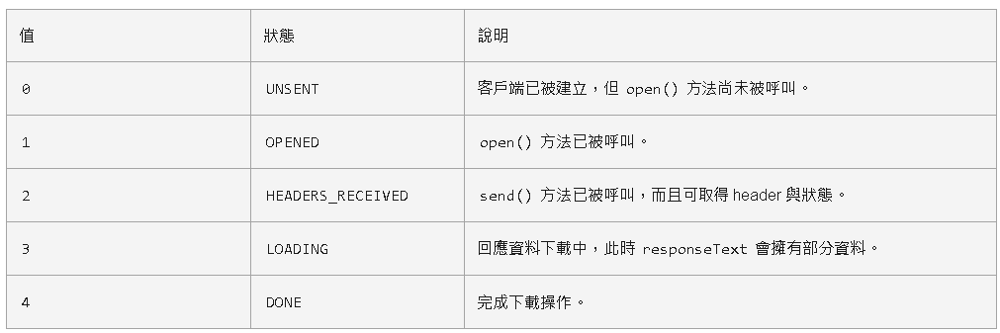

# `XMLHttpRequest`

a.JavaScript腳本使用XMLHttpRequest物件向服務器發送請求，發送請求時，既可以發送GET請求也可以發送POST請求

b.JavaScript腳本使用XMLHttpRequest物件解析服務器響應數據

c.JavaScript腳本通過DOM動態更新HTML頁面

ajax特徵:

​	a.發送非同步請求

​	b.服務器響應的是數據，而不是整個頁面

## XMLHttpRequest.readyState




## GET example

- 1.參數在URL後面傳遞

```javascript
    const xhr = new XMLHttpRequest();
    //2. 初始化 設置請求方法和 url
    xhr.open('GET', 'http://127.0.0.1:8000/server?a=100&b=200&c=300');
    //3. 發送
    xhr.send();
    //4. 事件綁定 處理服務端返回的結果
    // on  when 當....時候
    // readystate 是 xhr 對像中的屬性, 表示狀態 0 1 2 3 4
    // change  改變
    xhr.onreadystatechange = function () {
        //判斷 (服務端返回了所有的結果)
        if (xhr.readyState === 4) {
            //判斷響應狀態碼 200  404  403 401 500
            // 2xx 成功
            if (xhr.status >= 200 && xhr.status < 300) {
                //處理結果  行 頭 空行 體
                //響應 
                // console.log(xhr.status);//狀態碼
                // console.log(xhr.statusText);//狀態字符串
                // console.log(xhr.getAllResponseHeaders());//所有響應頭
                // console.log(xhr.response);//響應體
            } else {
                //失敗處理
            }
        }
    }
```

## post example

- 1.在 xhr.send('a=100&b=200&c=300')，方法裡傳送body數據

```javascript
    const result = document.getElementById("result");
    result.addEventListener("mouseover", function(){
    const xhr = new XMLHttpRequest();
    //2. 初始化 設置類型與 URL
    xhr.open('POST', 'http://127.0.0.1:8000/server');
    //設置請求頭
    xhr.setRequestHeader('Content-Type','application/x-www-form-urlencoded');
    xhr.setRequestHeader('name','atguigu');
    //3. 發送
    xhr.send('a=100&b=200&c=300');
    // xhr.send('a:100&b:200&c:300');
    // xhr.send('1233211234567');

    //4. 事件綁定
    xhr.onreadystatechange = function(){
        //判斷
        if(xhr.readyState === 4){
            if(xhr.status >= 200 && xhr.status < 300){
                //處理服務端返回的結果
                result.innerHTML = xhr.response;
            }
        }
    }
    });
```

## json data

- 1.使用JSON.parse 處理json數據
- 2.使用xhr.responseType = 'json'處理json數據

```javascript
const result = document.getElementById('result');
    //發送請求
    const xhr = new XMLHttpRequest();
    //設置響應體數據的類型
    xhr.responseType = 'json';
    //初始化
    xhr.open('GET','http://127.0.0.1:8000/json-server');
    //發送
    xhr.send();
    //事件綁定
    xhr.onreadystatechange = function(){
        if(xhr.readyState === 4){
            if(xhr.status >= 200 && xhr.status < 300){
                //
                // console.log(xhr.response);
                // result.innerHTML = xhr.response;
                // 1. 手動對數據轉化
                // let data = JSON.parse(xhr.response);
                // console.log(data);
                // result.innerHTML = data.name;
                // 2. 自動轉換
                console.log(xhr.response);
                result.innerHTML = xhr.response.name;
            }
        }
    }
```

## 超時設置

- 1.使用 xhr.timeout 設置幾秒後停止等待回應
- 2.可以使用xhr.ontimeout 設置操時候的回調函數
- 3.xhr.onerror 可以設置網路異常的回調函數

```javascript
    const xhr = new XMLHttpRequest();
        //超時設置 2s 設置
        xhr.timeout = 2000;
        //超時回調
        xhr.ontimeout = function(){
            alert("網路異常, 請稍後重試!!");
        }
        //網路異常回調
        xhr.onerror = function(){
            alert("你的網路似乎出了一些問題!");
        }

        xhr.open("GET",'http://127.0.0.1:8000/delay');
        xhr.send();
        xhr.onreadystatechange = function(){
            if(xhr.readyState === 4){
                if(xhr.status >= 200 && xhr.status< 300){
                    result.innerHTML = xhr.response;
                }
            }
        }
```

## 取消請求

- 1.可以用xhr.abort()取消請求

```javascript
    const btns = document.querySelectorAll('button');
    let xhr = null;

    btns[0].onclick = function(){
        xhr = new XMLHttpRequest();
        xhr.open("GET",'http://127.0.0.1:8000/delay');
        xhr.send();
    }

    // 取消按鈕
    btns[1].onclick = function(){
        xhr.abort();
    }
```

## 處理重複發送方式


```javascript
    const btns = document.querySelectorAll('button');
    let x = null;
    //標識變量
    let isSending = false; // 是否正在發送AJAX請求

    btns[0].onclick = function(){
        //判斷標識變量
        if(isSending) return;// 如果正在發送, 則取消該次請求
        x = new XMLHttpRequest();
        //修改 標識變量的值
        isSending = true;
        x.open("GET",'http://127.0.0.1:8000/delay');
        x.send();
        x.onreadystatechange = function(){
            if(x.readyState === 4){
                //請求成功後，修改標識變量
                isSending = false;
            }
        }
    }

    // abort
    btns[1].onclick = function(){
        x.abort();
    }
```

## 處理IE`緩存問題`
- 1.加上時間戳參數(t=Date.now)，URL每次都不一樣，就不會有緩存問題
    在URL後面加上時間戳
    EX:http://127.0.0.1:8000/ie?t=xxxxxxx

## 使用JSOUP放事處理跨域問題

- 1.使用script標籤去加載跨域的URL資源，再以回掉函數的方式實現

```html
<!DOCTYPE html>
<html lang="en">
<head>
    <meta charset="UTF-8">
    <meta name="viewport" content="width=device-width, initial-scale=1.0">
    <title>案例</title>
</head>
<body>
    用戶名: <input type="text" id="username">
    <p></p>
    <script>
        //獲取 input 元素
        const input = document.querySelector('input');
        const p = document.querySelector('p');
        
        //聲明 handle 函數
        function handle(data){
            input.style.border = "solid 1px #f00";
            //修改 p 標籤的提示文本
            p.innerHTML = data.msg;
        }

        //綁定事件
        input.onblur = function(){
            //獲取用戶的輸入值
            let username = this.value;
            //向服務器端發送請求 檢測用戶名是否存在
            //1. 創建 script 標籤
            const script = document.createElement('script');
            //2. 設置標籤的 src 屬性
            script.src = 'http://127.0.0.1:8000/check-username';
            //3. 將 script 插入到文檔中
            document.body.appendChild(script);
        }
    </script>
</body>
</html>
```

server端

```javascript

app.all('/checkCORSTest', (request,response)=>{
    const data = {
        exist:1,
        msg:'哈哈哈'
    }

    let str = JSON.stringify(data)

    response.end(`handle(${str})`)

})
```