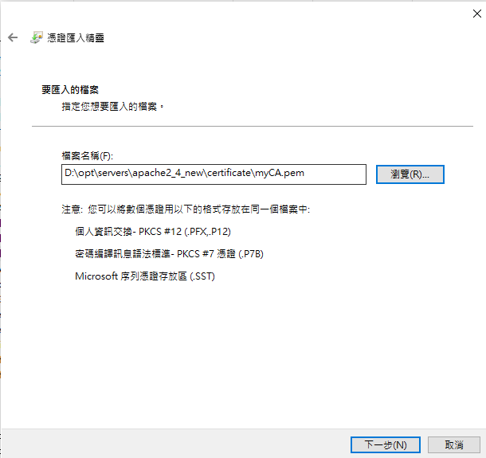

# 建立SSL憑證

- 可參考https://deliciousbrains.com/ssl-certificate-authority-for-local-https-development/


- 1.步驟1：建立root certificate private key，使用密碼password

```
openssl genrsa -des3 -out myCA.key 2048

Enter pass phrase for myCA.key:
Verifying - Enter pass phrase for myCA.key:
```

- 2.步驟2：建立root certificate

```
openssl req -x509 -new -nodes -key myCA.key -sha256 -days 1825 -out myCA.pem

nter pass phrase for myCA.key:
-----
Country Name (2 letter code) [AU]:TW
State or Province Name (full name) [Some-State]: Taiwan
Locality Name (eg, city) []: Taipei
Organization Name (eg, company) [Internet Widgits Pty Ltd]: PayEasy
Organizational Unit Name (eg, section) []: PayEasy
Common Name (e.g. server FQDN or YOUR name) []: PayEasy
Email Address []: frank_lai@payeasy.com.tw
```

  

- 3.步驟3：將root certificate加入至憑證/本機電腦/受信任的根憑證授權單位

 - 依照下列圖片，將剛剛產出的myCA.pem匯入本機

 
  
  
  
  
  
  
  
  
  
  
  
  
  
  
  
  

- 步驟4：建立apache private key

```
openssl genrsa -out apache.key 2048
```
  

- 步驟5：建立apache csr

```
λ openssl req -new -key apache.key -out apache.csr
```


- 步驟6：新增設定檔(config.cnf),並且輸入以下內容

 -  DNS.1 要輸入要建立的domain

```
authorityKeyIdentifier=keyid,issuer
basicConstraints=CA:FALSE
keyUsage = digitalSignature, nonRepudiation, keyEncipherment, dataEncipherment
subjectAltName = @alt_names

[alt_names]
DNS.1=XXXXX
DNS.2=XXXX

```


- 步驟7：建立apache crt
 - 密碼為一開始建立的password

```
openssl x509 -req -in apache.csr -CA myCA.pem -CAkey myCA.key -CAcreateserial -out apache.crt -days 7300 -sha256 -extfile config.cnf
```


- 步驟8：將檔案(apache.key、apache.crt)複製至D:\opt\servers\apache2.4\conf\extra\ssl

- 步驟9：編輯D:\opt\servers\apache2.4\conf\extra\httpd-ssl.conf

```
SLCertificateFile "${SRVROOT}/conf/extra/ssl/apache.crt"
SLCertificateKeyFile "${SRVROOT}/conf/extra/ssl/apache.key"
```


- 步驟10：重新啟動apache