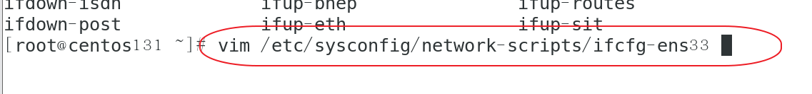
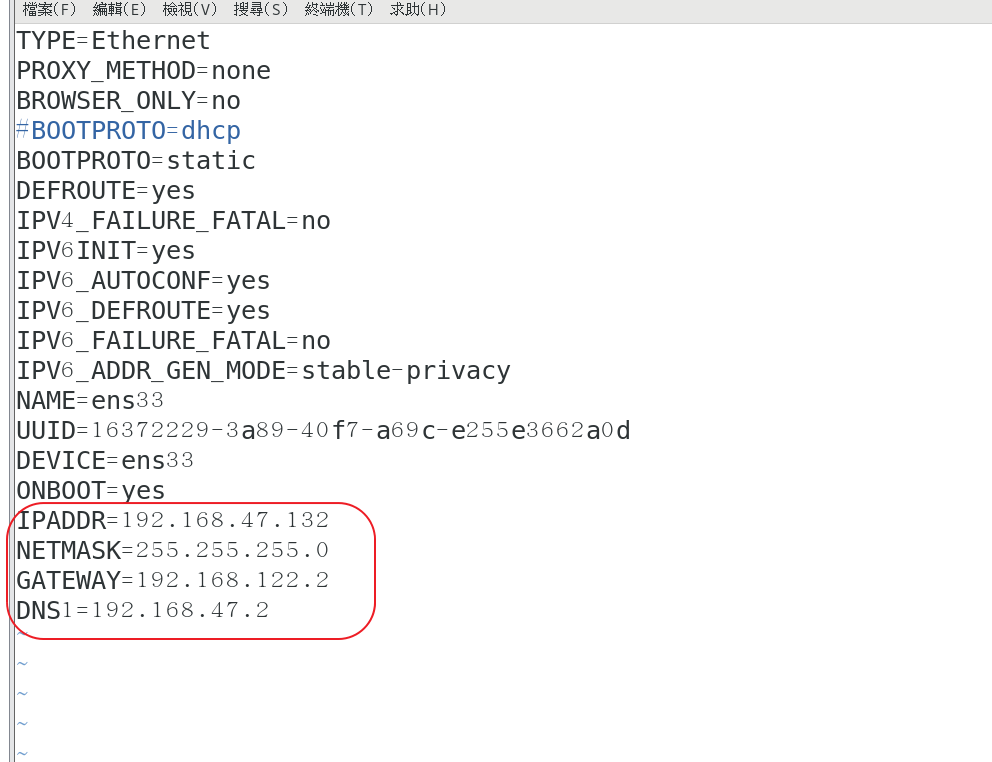

## 1.查詢檔案大小

```
ls -al --block-size=M 檔案大小改用M顯示 
ls -alt 新到舊
ls -alrt 舊到新

```

##2.查找檔案中關鍵字

```
find .|xargs grep -ri "app_notification_rec_log" -l 


find . -name "*.java" |xargs grep -ri "APP_NOTIFICATION_REC_LOG" -l

```

## 3.dos2unix 多個檔案轉換

```
find . -name "*.sh" | xargs dos2unix
```

##　4.解壓縮指令

```
tar -zxvf 壓說包名稱
```
```
tar -zxvf 壓說包名稱 -C 目的地目錄
```

## 5.移動指令

```
mv 要移動的檔案 移動目的地
```

## 6.開啟port號

```
# 開啟3888 port
firewall-cmd --zone=public --add-port=3888/tcp --permanent

# 開啟2888 port
firewall-cmd --zone=public --add-port=2888/tcp --permanent

#重啟防火牆
service firewalld restart

#查看開啟的端口號
firewall-cmd --permanent --list-port
```

## CentOS7 新建虛擬機改固定IP

### 修改 /etc/sysconfig/network-scripts/ifcfg-ens33




### 設定好之後，重啟系統或重啟網路卡即可

```
systemctl restart network
```