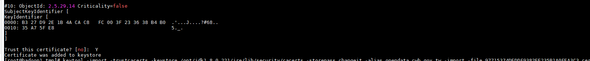

# **windows JAVA 匯入憑證方式**

指令:

keytool -import -trustcacerts -keystore "**${JAVA_HOME}\jre\lib\security\cacerts**" -storepass **changeit** -alias "**取個別名**" -import -file "**要匯入的憑證**"

P.S. 密碼預設為 changeit 

### **win環境因多了JDK外的JRE，故這個外面的JRE也需要匯入**

EX:

```console
keytool -import -trustcacerts -keystore "C:\Program Files\Java\jdk1.8.0_161\jre\lib\security\cacerts" -storepass changeit -alias "opendata_cwb_gov_tw" -import -file "97715374DEDDF9382EE235B1A0FEA3C3.cer"
```


# **Linux JAVA 匯入憑證方式**

基本上與windows相同，差別在於路徑不用加上雙引號

指令:

keytool -import -trustcacerts -keystore "**${JAVA_HOME}\jre\lib\security\cacerts**" -storepass **changeit** -alias "**取個別名**" -import -file "**要匯入的憑證**"

EX:

```
keytool -import -trustcacerts -keystore /opt/jdk1.8.0_221/jre/lib/security/cacerts -storepass changeit -alias opendata_cwb_gov_tw -import -file 97715374DEDDF9382EE235B1A0FEA3C3.cer
```


