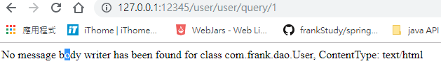
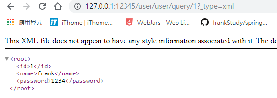
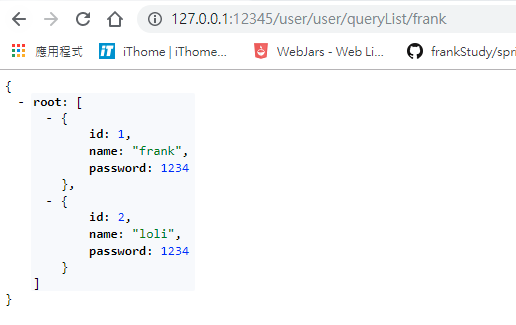
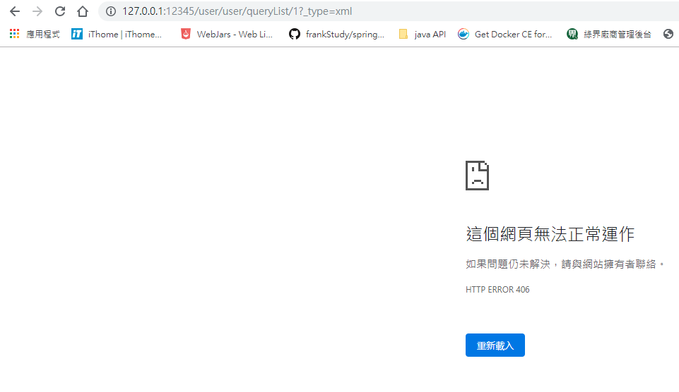
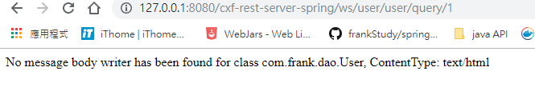
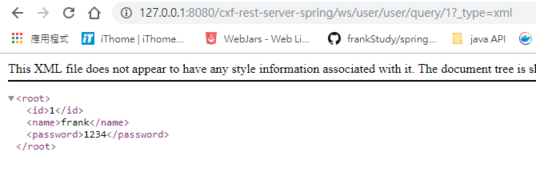
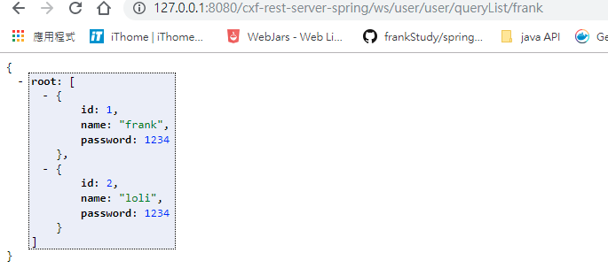
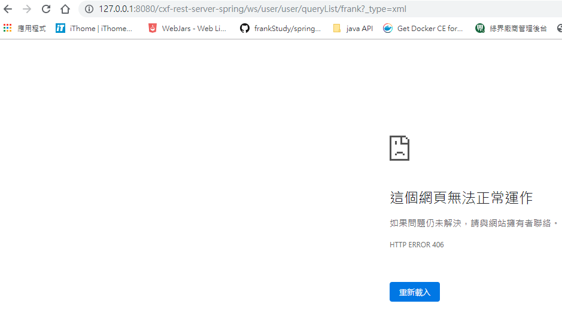

1.創建web 工程

2.pom.xml

```xml
	<dependencies>
		<!-- https://mvnrepository.com/artifact/org.apache.cxf/cxf-rt-frontend-jaxws -->
		<dependency>
			<groupId>org.apache.cxf</groupId>
			<artifactId>cxf-rt-frontend-jaxws</artifactId>
			<version>3.3.2</version>
		</dependency>
		<!-- https://mvnrepository.com/artifact/org.apache.cxf/cxf-distribution-manifest -->
		<dependency>
			<groupId>org.apache.cxf</groupId>
			<artifactId>cxf-distribution-manifest</artifactId>
			<version>3.3.2</version>
		</dependency>
		<!-- https://mvnrepository.com/artifact/org.apache.cxf/cxf-rt-bindings-soap -->
		<dependency>
		    <groupId>org.apache.cxf</groupId>
		    <artifactId>cxf-rt-bindings-soap</artifactId>
		    <version>3.3.2</version>
		</dependency>
		<!-- https://mvnrepository.com/artifact/org.apache.cxf/cxf-rt-transports-http -->
		<dependency>
		    <groupId>org.apache.cxf</groupId>
		    <artifactId>cxf-rt-transports-http</artifactId>
		    <version>3.3.2</version>
		</dependency>
		

		<!-- https://mvnrepository.com/artifact/com.fasterxml.jackson.core/jackson-databind -->
		<dependency>
			<groupId>com.fasterxml.jackson.core</groupId>
			<artifactId>jackson-databind</artifactId>
			<version>2.9.9.3</version>
		</dependency>
		<!-- https://mvnrepository.com/artifact/org.apache.httpcomponents/httpclient -->
		<dependency>
			<groupId>org.apache.httpcomponents</groupId>
			<artifactId>httpclient</artifactId>
			<version>4.5.9</version>
		</dependency>
		<!-- https://mvnrepository.com/artifact/org.jsoup/jsoup -->
		<dependency>
			<groupId>org.jsoup</groupId>
			<artifactId>jsoup</artifactId>
			<version>1.12.1</version>
		</dependency>


	</dependencies>

```

3.


# 創建RestFul Webservice

obj:

```java
import javax.xml.bind.annotation.XmlRootElement;

@XmlRootElement(name="root")//指定回傳後跟標籤的名子
public class User {
	
	private long id;
	private String name;
	private String password;
	public long getId() {
		return id;
	}
	public void setId(long id) {
		this.id = id;
	}
	public String getName() {
		return name;
	}
	public void setName(String name) {
		this.name = name;
	}
	public String getPassword() {
		return password;
	}
	public void setPassword(String password) {
		this.password = password;
	}
	public User(long id, String name, String password) {
		super();
		this.id = id;
		this.name = name;
		this.password = password;
	}
	public User() {
		super();
	}
	@Override
	public String toString() {
		return "User [id=" + id + ", name=" + name + ", password=" + password + "]";
	}
	
	
	
}

```

service:

```java
import javax.jws.WebService;
import javax.ws.rs.GET;
import javax.ws.rs.Path;
import javax.ws.rs.PathParam;
import javax.ws.rs.Produces;
import javax.ws.rs.core.MediaType;
import com.frank.dao.User;

@WebService
@Path("/user")
public interface UserService {

	@GET
//	@Produces(MediaType.APPLICATION_JSON)
    @Path("/query/{id}")
	public User query(@PathParam("id") long id);
	
	
	@GET
	@Produces(MediaType.APPLICATION_JSON)//用於指定回傳值類型
	@Path("/queryList/{username}")
	public List<User> queryList(@PathParam("username") String name);
}

```

impl:

```java
import java.util.ArrayList;
import java.util.List;

import com.frank.dao.User;
import com.frank.service.UserService;

public class UserServiceImpl implements UserService {

	@Override
	public User query(long id) {
		User user=new User(id,"frank","1234");
		return user;
	}

	@Override
	public List<User> queryList(String name) {
		List<User> list=new ArrayList<>();
		User user=new User(1,"frank","1234");
		User user1=new User(2,"loli","1234");
		list.add(user);
		list.add(user1);
		return list;
	}

}
```


如果@Produces沒有指定回傳類型，請求的URL後面需要加參數，否則無法回傳

參數  **__type=json  OR  _type=xml**

沒有帶參數



帶入 _type=xml



如果@Produces有指定回傳值，那就不必帶參數，帶了反而會出現406錯誤

沒有帶參數:



帶入 _type=xml




# 創建Restful Webservice 與spring

web:

```xml
<!-- needed for ContextLoaderListener -->
	<context-param>
		<param-name>contextConfigLocation</param-name>
		<param-value>classpath:applicationContext.xml</param-value>
	</context-param>

	<!-- Bootstraps the root web application context before servlet initialization -->
	<listener>
		<listener-class>org.springframework.web.context.ContextLoaderListener</listener-class>
	</listener>
	
	<servlet>
		<servlet-name>CXF</servlet-name>
		<servlet-class>org.apache.cxf.transport.servlet.CXFServlet</servlet-class>
	</servlet>
	<servlet-mapping>
		<servlet-name>CXF</servlet-name>
		<url-pattern>/ws/*</url-pattern>
	</servlet-mapping>
```

applicationContext.xml:

```xml
    <!--通過spring發布webservice服務-->
    <!-- 1.創建服務物件-->
    <bean id="userService1" class="com.frank.service.impl.UserServiceImpl"></bean>

    <!-- 2.發布服務
    -->
    <jaxrs:server address="/user" id="apple" >
    	<jaxrs:serviceBeans>
    		<ref bean="userService1"/>
    	</jaxrs:serviceBeans>
    </jaxrs:server>
```

如果@Produces沒有指定回傳類型，請求的URL後面需要加參數，否則無法回傳

參數  **__type=json  OR  _type=xml**

沒有帶參數



帶入 _type=xml



如果@Produces有指定回傳值，那就不必帶參數，帶了反而會出現406錯誤

沒有帶參數:



帶入 _type=xml

