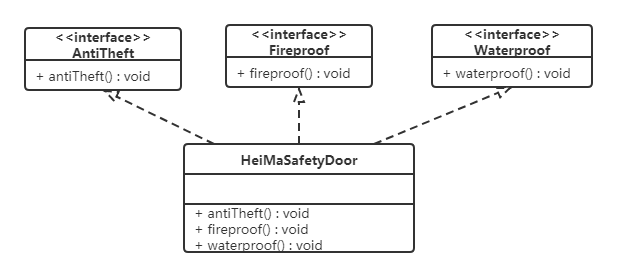
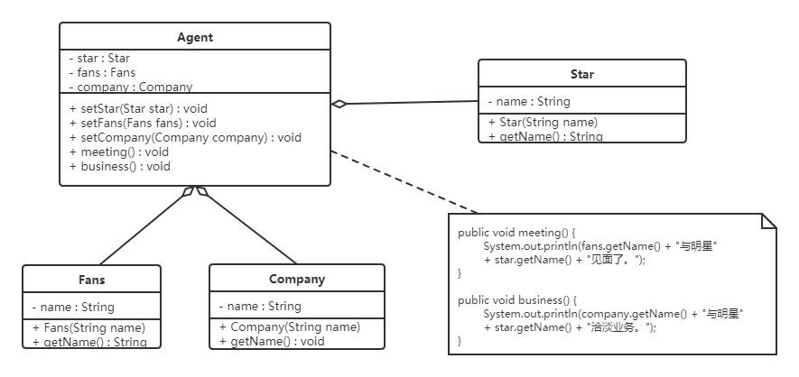

# 設計模式的七大原則

## (1)單一職責原則 (single Responsibility principle)，簡稱SRP

***一個類應該只有一個發生變化的原因***

每個類應該只負責一向職責，如果A類負責兩個不同職責(職責1、職責2)，當職責1需求變更而改動A時，可能造成職責2執行錯誤
所以需要將A類的職責分解為A1、A2

## (2)依賴倒轉原則 (DIP:Dependence Inversion Principle)

### ***1.高層模塊不應該依賴低層模塊，兩者都應該依賴其抽象。***

### ***2.抽象不應該依賴細節，細節應該依賴抽象***


1.高層模塊不應該依賴低層模塊，兩者都應該依賴其抽象
2.抽象不應該依賴細節，細節應該依賴抽象
3.依賴倒轉原則是基於這樣的設計理念:相對於具體實現類的多變性，
抽象類或接口的東西要穩定的多，以抽象類或接口為基礎建立的架構比已具體實現類為基礎的架構要穩定的多
4.使用接口或抽象類的目的是制定好的規範，而不涉及任何具體的操作，把展現細節的任務交給他們的實現類去完成

## (3)里氏替換原則 (LSP:Liskov substitution principle)

***子類型必須能夠替換掉他們的父類型***
***繼承必須保證父類所擁有的性質在子類中依然成立***

里氏替換原則通俗來說就是:子類可以擴展父類的功能，但不能改變父類原有的功能。也就是說:子類繼承父類時，除添加新的方法完成新增功能外，盡量不要重寫父類的方法

1.子類可以實現父類的抽象方法，但不能覆蓋父類的非抽象方法
2.子類中可以增加自己特有的方法
3.當子類的方法重載父類的方法時，方法的前置條件(即方法的輸入參數)要比父類的方法更寬鬆
4.當仔類的方法實現父類的方法時(重寫/重載獲實現抽象方法)，方法的後置條件(即方法的輸出/返回值)要比父類的方法更嚴格或相等


## (4)接口分離原則(ISP:Interface Segregation Principle)

***客戶端不應該被迫依賴於它不使用的方法；一個類對另一個類的依賴應該建立在最小的接口上。***

### 【例】安全門案例

* 我們需要創建一個黑马品牌的安全門，該安全門具有防火、防水、防盜的功能。可以將防火，防水，防盜功能提取成一個接口，形成一套規範。類圖如下：


* 上面的設計我們發現了它存在的問題，黑馬品牌的安全門具有防盜，防水，防火的功能。現在如果我們還需要再創建一個傳智品牌的安全門，而該安全門只具有防盜、防水功能呢？很顯然如果實現SafetyDoor接口就違背了接口隔離原則，那麼我們如何進行修改呢？看如下類圖：




代碼如下：

AntiTheft（接口）：
```java
public  interface  AntiTheft {
    void  antiTheft ();
}
```

Fireproof（接口）：
```java

public  interface  Fireproof {
    void  fireproof ();
}
```

Waterproof（接口）：
```java
public  interface  Waterproof {
    void  waterproof ();
}
```

HeiMaSafetyDoor（類）：
```java

public  class  HeiMaSafetyDoor  implements  AntiTheft , Fireproof , Waterproof {
    public  void  antiTheft () {
        System . out . println ( "防盜" );
    }
​
    public  void  fireproof () {
        System . out . println ( "防火" );
    }
​
​
    public  void  waterproof () {
        System . out . println ( "防水" );
    }
}
```

ItcastSafetyDoor（類）：
```java

public  class  ItcastSafetyDoor  implements  AntiTheft , Fireproof {
    public  void  antiTheft () {
        System . out . println ( "防盜" );
    }
​
    public  void  fireproof () {
        System . out . println ( "防火" );
    }
}
```

## (5)迪米特原則(LOD:Law of Demter)

***最少知道，減少依賴***

只和你的直接朋友交談，不跟“陌生人”說話（Talk only to your immediate friends and not to strangers）。

* 其含義是：如果兩個軟件實體無須直接通信，那麼就不應當發生直接的相互調用，可以通過第三方轉發該調用。其目的是降低類之間的耦合度，提高模塊的相對獨立性。

* 迪米特法則中的“朋友”是指：當前對象本身、當前對象的成員對象、當前對象所創建的對象、當前對象的方法參數等，這些對象同當前對象存在關聯、聚合或組合關係，可以直接訪問這些對象的方法。

### 【例】明星與經紀人的關係實例

明星由於全身心投入藝術，所以許多日常事務由經紀人負責處理，如和粉絲的見面會，和媒體公司的業務洽淡等。這裡的經紀人是明星的朋友，而粉絲和媒體公司是陌生人，所以適合使用迪米特法則。



明星類（Star）
```java
public  class  Star {
    private  String  name ;
​
    public  Star ( String  name ) {
        this . name = name ;
    }
​
    public  String  getName () {
        return  name ;
    }
}
```

粉絲類（Fans）
```java

public  class  Fans {
    private  String  name ;
​
    public  Fans ( String  name ) {
        this . name = name ;
    }
​
    public  String  getName () {
        return  name ;
    }
}
```

媒體公司類（Company）
```java
public  class  Company {
    private  String  name ;
​
    public  Company ( String  name ) {
        this . name = name ;
    }
​
    public  String  getName () {
        return  name ;
    }
}
```

經紀人類（Agent）
```java
public  class  Agent {
    private  Star  star ;
    private  Fans  fans ;
    private  Company  company ;
​
    public  void  setStar ( Star  star ) {
        this . star  =  star ;
    }
​
    public  void  setFans ( Fans  fans ) {
        this . fans  =  fans ;
    }
​
    public  void  setCompany ( Company  company ) {
        this . company  =  company ;
    }
​
    //和粉絲見面的方法
    public  void  meeting () {
        System . out . println ( fans . getName () +  "與明星"  +  star . getName () +  "見面了。" );
    }
​
    //與媒體公司洽談的方法
    public  void  business () {
        System . out . println ( company . getName () +  "與明星"  +  star . getName () +  "洽淡業務。" );
    }
}
```


## (6)開放封閉原則(OCP:open for Extension,closed for Modification)


***對擴展開放，對修改關閉***

***對軟體實體(類別、模組、函數等等)應該可以擴充，但是不可以修改***

* 你可以擴展邏輯，但不要修改原有方法
* 例如說有個已經存在的類，不要去變動他，用繼承的方式去擴展邏輯，不更改父類的原有方法的邏輯
* 把共用的部分些在父類，一些個別客製的部分用繼承寫在子類

* 1.想要達到這樣的效果，需要使用接口和抽象類
* 2.把程式中不易發生改變的部分或者通用的部分寫在接口或抽象中，易發生改變的部分用實例物件來實現


## (7)合成赴用原則

* 合成複用原則是指：盡量先使用組合或者聚合等關聯關係來實現，其次才考慮使用繼承關係來實現。

* 通常類的複用分為繼承復用和合成複用兩種:
  * 繼承復用雖然有簡單和易實現的優點，但它也存在以下缺點：
    * 1.繼承復用破壞了類的封裝性。因為繼承會將父類的實現細節暴露給子類，父類對子類是透明的，所以這種複用又稱為“白箱”復用。
    * 2.子類與父類的耦合度高。父類的實現的任何改變都會導致子類的實現發生變化，這不利於類的擴展與維護。
    * 3.它限制了復用的靈活性。從父類繼承而來的實現是靜態的，在編譯時已經定義，所以在運行時不可能發生變化。
  * 採用組合或聚合復用時，可以將已有對象納入新對像中，使之成為新對象的一部分，新對象可以調用已有對象的功能，它有以下優點：
    * 1.它維持了類的封裝性。因為成分對象的內部細節是新對像看不見的，所以這種複用又稱為“黑箱”復用。
    * 2.對象間的耦合度低。可以在類的成員位置聲明抽象。
    * 3.復用的靈活性高。這種複用可以在運行時動態進行，新對象可以動態地引用與成分對像類型相同的對象。


### 【例】汽車分類管理程序

汽車按“動力源”劃分可分為汽油汽車、電動汽車等；按“顏色”劃分可分為白色汽車、黑色汽車和紅色汽車等。如果同時考慮這兩種分類，其組合就很多。類圖如下：


從上麵類圖我們可以看到使用繼承復用產生了很多子類，如果現在又有新的動力源或者新的顏色的話，就需要再定義新的類。我們試著將繼承復用改為聚合復用看一下。


# 設計模式分為3種類型

## 1.生成型模式 Creational Patterns(物件創建時應該怎麼樣設計)
    - 單例模式
    - 抽象工廠模式
    - 原型模式
    - 建造者模式
    - 工廠模式

## 2.結構型模式 Structural Patterns:
    - 適配器模式
    - 橋接模式
    - 裝飾模式
    - 組合模式
    - 外觀模式
    - 享元模式
    - 代理模式
  -

## 3.行為型模式 Behavioral Patterns:
    - 模板方法模式
    - 命令模式
    - 訪問者模式
    - 迭代器模式
    - 觀察者模式
    - 中介者模式
    - 備忘錄模式
    - 解釋器模式(interpreter模式)
    - 狀態模式
    - 策略模式
    - 職責鏈模式(責任鏈模式)


# 生成模式(Creational Patterns)

[單利模式(Singleton)](designPattern/Singleton.md )

[工廠模式](designPattern/factoryPattern.md )

[原型模式(prototype)](designPattern/prototype.md )

[建造者模式 OR 生成模式(Builder Pattern)](designPattern/builder.md )

[簡單工廠模式](designPattern/simpleFactory.md )

[工廠方法模式(factoryMethod)](designPattern/factoryMethod.md )


# 結構型模式

- 結構型模式描述如何將類或對象按某種佈局組成更大的結構。它分為類結構型模式和對象結構型模式，前者採用繼承機制來組織接口和類，後者釆用組合或聚合來組合對象。

- 由於組合關係或聚合關係比繼承關係耦合度低，滿足“合成複用原則”，所以對象結構型模式比類結構型模式具有更大的靈活性。

[代理模式 (Proxy Pattern)](designPattern/proxy.md )

[適配器模式 (Adapter Pattern)](designPattern/adapter.md )

[裝飾者模式 (decorator Pattern)](designPattern/decorator.md )

[橋接模式 (Bridge Pattern)](designPattern/bridge.md )

[門面模式(外觀模式) (Facade Pattern)](designPattern/facade.md )

[組合模式 (Composite Pattern)](designPattern/composite.md )

[享元模式 (Flyweight Pattern)](designPattern/flyweight.md )

# 行為型模式

- 行為型模式用於描述程序在運行時復雜的流程控制，即描述多個類或對象之間怎樣相互協作共同完成單個對像都無法單獨完成的任務，它涉及算法與對象間職責的分配。

- 行為型模式分為類行為模式和對象行為模式，前者採用繼承機制來在類間分派行為，後者採用組合或聚合在對象間分配行為。由於組合關係或聚合關係比繼承關係耦合度低，滿足“合成複用原則”，所以對象行為模式比類行為模式具有更大的靈活性。

- 行為型模式分為：


[模板方法模式 (Template Method Pattern)](designPattern/templateMethod.md )

[策略模式 (Strategy Pattern)](designPattern/strategy.md )

[命令模式 (Command Pattern)](designPattern/command.md )