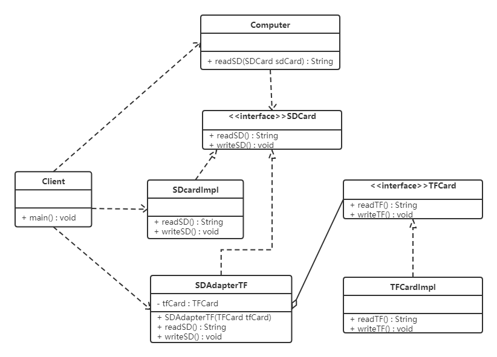
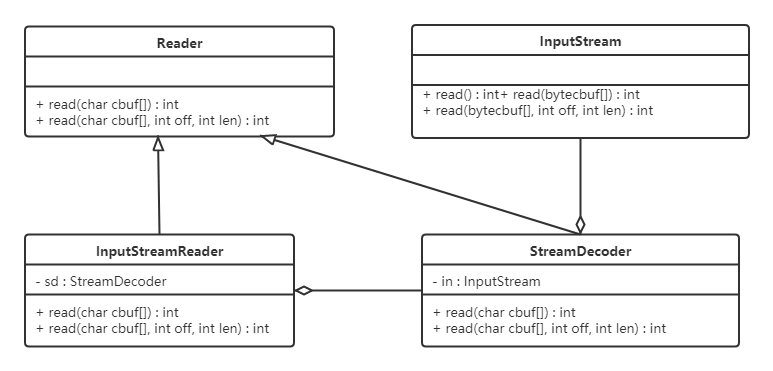

# 適配器模式
## 1 概述

- 如果去歐洲國家去旅遊的話，他們的插座如下圖最左邊，是歐洲標準。而我們使用的插頭如下圖最右邊的。因此我們的筆記本電腦，手機在當地不能直接充電。所以就需要一個插座轉換器，轉換器第1面插入當地的插座，第2面供我們充電，這樣使得我們的插頭在當地能使用。生活中這樣的例子很多，手機充電器（將220v轉換為5v的電壓），讀卡器等，其實就是使用到了適配器模式。


- 定義：

  - 將一個類的接口轉換成客戶希望的另外一個接口，使得原本由於接口不兼容而不能一起工作的那些類能一起工作。

  - 適配器模式分為類適配器模式和對象適配器模式，前者類之間的耦合度比後者高，且要求程序員了解現有組件庫中的相關組件的內部結構，所以應用相對較少些。


## 2 結構
- 適配器模式（Adapter）包含以下主要角色：

  - 目標（Target）接口：當前系統業務所期待的接口，它可以是抽像類或接口。
  - 適配者（Adaptee）類：它是被訪問和適配的現存組件庫中的組件接口。
  - 適配器（Adapter）類：它是一個轉換器，通過繼承或引用適配者的對象，把適配者接口轉換成目標接口，讓客戶按目標接口的格式訪問適配者。
  
## 3 類適配器模式
- 實現方式：定義一個適配器類來實現當前系統的業務接口，同時又繼承現有組件庫中已經存在的組件。

- 【例】讀卡器

  - 現有一台電腦只能讀取SD卡，而要讀取TF卡中的內容的話就需要使用到適配器模式。創建一個讀卡器，將TF卡中的內容讀取出來。

類圖如下：


```java
//SD卡的接口
public  interface  SDCard {
    //讀取SD卡方法
    String  readSD ();
    //寫入SD卡功能
    void  writeSD ( String  msg );
}
​
//SD卡實現類
public  class  SDCardImpl  implements  SDCard {
    public  String  readSD () {
        String  msg  =  "sd card read a msg :hello word SD" ;
        return  msg ;
    }
​
    public  void  writeSD ( String  msg ) {
        System . out . println ( "sd card write msg : "  +  msg );
    }
}
​
//電腦類
public  class  Computer {
​
    public  String  readSD ( SDCard  sdCard ) {
        if ( sdCard  ==  null ) {
            throw  new  NullPointerException ( "sd card null" );
        }
        return  sdCard . readSD ();
    }
}
​
//TF卡接口
public  interface  TFCard {
    //讀取TF卡方法
    String  readTF ();
    //寫入TF卡功能
    void  writeTF ( String  msg );
}
​
//TF卡實現類
public  class  TFCardImpl  implements  TFCard {
​
    public  String  readTF () {
        String  msg  = "tf card read msg : hello word tf card" ;
        return  msg ;
    }
​
    public  void  writeTF ( String  msg ) {
        System . out . println ( "tf card write a msg : "  +  msg );
    }
}
​
//定義適配器類（SD兼容TF）
public  class  SDAdapterTF  extends  TFCardImpl  implements  SDCard {
​
    public  String  readSD () {
        System . out . println ( "adapter read tf card " );
        return  readTF ();
    }
​
    public  void  writeSD ( String  msg ) {
        System . out . println ( "adapter write tf card" );
        writeTF ( msg );
    }
}
​
//測試類
public  class  Client {
    public  static  void  main ( String [] args ) {
        Computer  computer  =  new  Computer ();
        SDCard  sdCard  =  new  SDCardImpl ();
        System . out . println ( computer . readSD ( sdCard ));
​
        System . out . println ( "------------" );
​
        SDAdapterTF  adapter  =  new  SDAdapterTF ();
        System . out . println ( computer . readSD ( adapter ));
    }
}
```

- 類適配器模式違背了合成複用原則。類適配器是客戶類有一個接口規範的情況下可用，反之不可用。


## 4 對象適配器模式
- 實現方式：對象適配器模式可釆用將現有組件庫中已經實現的組件引入適配器類中，該類同時實現當前系統的業務接口。

- 【例】讀卡器

  - 使用對象適配器模式將讀卡器的案例進行改寫。類圖如下：
  
  

- 類適配器模式的代碼，我們只需要修改適配器類（SDAdapterTF）和測試類。

```java
//創建適配器對象（SD兼容TF）
public  class  SDAdapterTF   implements  SDCard {
​
    private  TFCard  tfCard ;
​
    public  SDAdapterTF ( TFCard  tfCard ) {
        this . tfCard  =  tfCard ;
    }
​
    public  String  readSD () {
        System . out . println ( "adapter read tf card " );
        return  tfCard . readTF ();
    }
​
    public  void  writeSD ( String  msg ) {
        System . out . println ( "adapter write tf card" );
        tfCard . writeTF ( msg );
    }
}
​
//測試類
public  class  Client {
    public  static  void  main ( String [] args ) {
        Computer  computer  =  new  Computer ();
        SDCard  sdCard  =  new  SDCardImpl ();
        System . out . println ( computer . readSD ( sdCard ));
​
        System . out . println ( "------------" );
​
        TFCard  tfCard  =  new  TFCardImpl ();
        SDAdapterTF  adapter  =  new  SDAdapterTF ( tfCard );
        System . out . println ( computer . readSD ( adapter ));
    }
}
```

- 注意：還有一個適配器模式是接口適配器模式。當不希望實現一個接口中所有的方法時，可以創建一個抽像類Adapter ，實現所有方法。而此時我們只需要繼承該抽像類即可。

## 5 應用場景
- 以前開發的系統存在滿足新系統功能需求的類，但其接口同新系統的接口不一致。
- 使用第三方提供的組件，但組件接口定義和自己要求的接口定義不同。

## 6 JDK源碼解析
- Reader（字符流）、InputStream（字節流）的適配使用的是InputStreamReader。

- InputStreamReader繼承自java.io包中的Reader，對他中的抽象的未實現的方法給出實現。如：
  
```java

public  int  read () throws  IOException {
    return  sd . read ();
}
​
public  int  read ( char  cbuf [], int  offset , int  length ) throws  IOException {
    return  sd . read ( cbuf , offset , length );
}
```

- 如上代碼中的sd（StreamDecoder類對象），在Sun的JDK實現中，實際的方法實現是對sun.nio.cs.StreamDecoder類的同名方法的調用封裝。類結構圖如下：



從上圖可以看出：

- InputStreamReader是對同樣實現了Reader的StreamDecoder的封裝。
- StreamDecoder不是Java SE API中的內容，是Sun JDK給出的自身實現。但我們知道他們對構造方法中的字節流類（InputStream）進行封裝，並通過該類進行了字節流和字符流之間的解碼轉換。

- 結論：

  - 從表層來看，InputStreamReader做了InputStream字節流類到Reader字符流之間的轉換。而從如上Sun JDK中的實現類關係結構中可以看出，是StreamDecoder的設計實現在實際上採用了適配器模式。