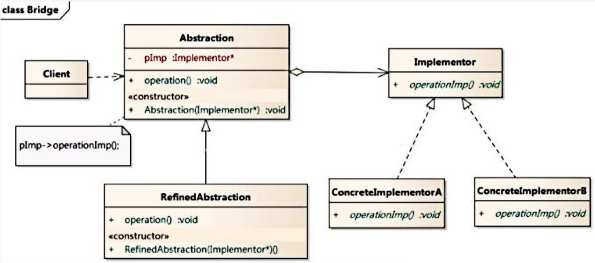

# 橋接模式 Bridge Pattern

## 1.概述

- 現在有一個需求，需要創建不同的圖形，並且每個圖形都有可能會有不同的顏色。我們可以利用繼承的方式來設計類的關係：


- 我們可以發現有很多的類，假如我們再增加一個形狀或再增加一種顏色，就需要創建更多的類。

- 試想，在一個有多種可能會變化的維度的系統中，用繼承方式會造成類爆炸，擴展起來不靈活。每次在一個維度上新增一個具體實現都要增加多個子類。為了更加靈活的設計系統，我們此時可以考慮使用橋接模式。

定義：

- 將抽象與實現分離，使它們可以獨立變化。它是用組合關係代替繼承關係來實現，從而降低了抽象和實現這兩個可變維度的耦合度。
* 1.將抽象和實現放在兩個不同的類層次中，使兩個類層次可以獨立改變
* 2.Bridge模式基於類的最小設計原則，通過使用封裝、聚合及繼承等行為讓不同的類承擔不同的職責
* 3.主要特點為把抽象與行為實現分離開來，從而可以保持各個部份的獨立性以及應對他們的功能擴展

## 2.結構



* 1.Client:橋接模式的調用者
* 2.抽象類(Abstraction):用於定義抽像類的接口，充當橋接類，它一般是抽像類而不是接口，其中定義了一個Implementor（實現類接口）聚合了Implementor
*  3.RefinedAbstraction（擴充抽像類）：擴充由Abstraction定義的接口，通常情況下它不再是抽像類而是具體類，它實現了在Abstraction中聲明的抽象業務方法，在RefinedAbstraction中可以調用在Implementor中定義的業務方法。
* 4.Implementor（實現類接口）：定義行為實現類的接口，這個接口不一定要與Abstraction的接口完全一致，事實上這兩個接口可以完全不同，一般而言，Implementor接口僅提供基本操作，而Abstraction定義的接口可能會做更多更複雜的操作。 Implementor接口對這些基本操作進行了聲明，而具體實現交給其子類。通過關聯關係，在Abstraction中不僅擁有自己的方法，還可以調用到Implementor中定義的方法，使用關聯關係來替代繼承關係。
* 5.ConcreteImplementorA/B（具體實現類）：行為具體實現Implementor接口，在不同的ConcreteImplementor中提供基本操作的不同實現，在程序運行時，ConcreteImplementor物件將替換其父類物件，提供給抽像類具體的業務操作方法。
* 從UML圖:這裡的抽象類和接口是聚合的關係，同時也是調用者和被調用者的關係


## 3 案例
- 【例】視頻播放器

  - 需要開發一個跨平台視頻播放器，可以在不同操作系統平台（如Windows、Mac、Linux等）上播放多種格式的視頻文件，常見的視頻格式包括RMVB、AVI、WMV等。該播放器包含了兩個維度，適合使用橋接模式。

```java
//視頻文件
public  interface  VideoFile {
    void  decode ( String  fileName );
}
​
//avi文件
public  class  AVIFile  implements  VideoFile {
    public  void  decode ( String  fileName ) {
        System . out . println ( "avi視頻文件：" +  fileName );
    }
}
​
//rmvb文件
public  class  REVBBFile  implements  VideoFile {
​
    public  void  decode ( String  fileName ) {
        System . out . println ( "rmvb文件："  +  fileName );
    }
}
​
//操作系統版本
public  abstract  class  OperatingSystemVersion {
​
    protected  VideoFile  videoFile ;
​
    public  OperatingSystemVersion ( VideoFile  videoFile ) {
        this . videoFile  =  videoFile ;
    }
​
    public  abstract  void  play ( String  fileName );
}
​
//Windows版本
public  class  Windows  extends  OperatingSystem {
​
    public  Windows ( VideoFile  videoFile ) {
        super ( videoFile );
    }
​
    public  void  play ( String  fileName ) {
        videoFile . decode ( fileName );
    }
}
​
//mac版本
public  class  Mac  extends  OperatingSystemVersion {
​
    public  Mac ( VideoFile  videoFile ) {
        super ( videoFile );
    }
​
    public  void  play ( String  fileName ) {
        videoFile . decode ( fileName );
    }
}
​
//測試類
public  class  Client {
    public  static  void  main ( String [] args ) {
        OperatingSystem  os  =  new  Windows ( new  AVIFile ());
        os . play ( "戰狼3" );
    }
}
```

- 好處：

  - 橋接模式提高了系統的可擴充性，在兩個變化維度中任意擴展一個維度，都不需要修改原有系統。

  - 如：如果現在還有一種視頻文件類型wmv，我們只需要再定義一個類實現VideoFile接口即可，其他類不需要發生變化。

- 實現細節對客戶透明

## 4 使用場景
- 當一個類存在兩個獨立變化的維度，且這兩個維度都需要進行擴展時。
- 當一個系統不希望使用繼承或因為多層次繼承導致系統類的個數急劇增加時。
- 當一個系統需要在構件的抽象化角色和具體化角色之間增加更多的靈活性時。避免在-兩個層次之間建立靜態的繼承聯繫，通過橋接模式可以使它們在抽象層建立一個關聯關係。

