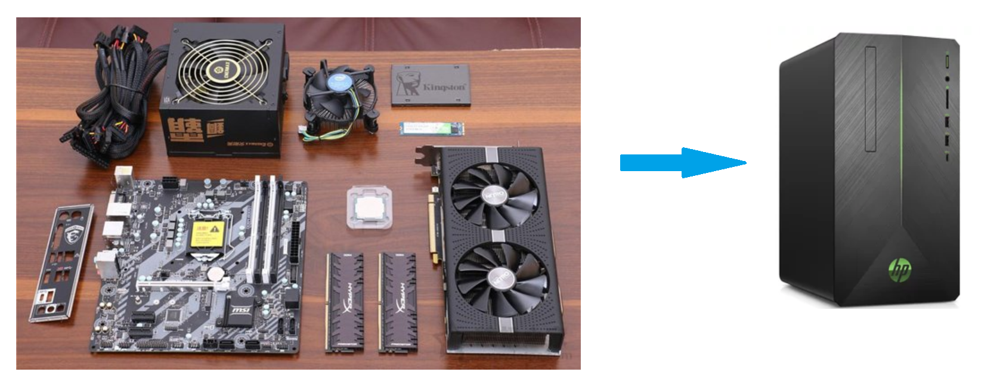

# 建造者模式 OR 生成器模式 (Builder Pattern)

## 1 概述
- 將一個複雜對象的構建與表示分離，使得同樣的構建過程可以創建不同的表示。



- 分離了部件的構造(由Builder來負責)和裝配(由Director負責)。從而可以構造出複雜的對象。這個模式適用於：某個對象的構建過程複雜的情況。
- 由於實現了構建和裝配的解耦。不同的構建器，相同的裝配，也可以做出不同的對象；相同的構建器，不同的裝配順序也可以做出不同的對象。也就是實現了構建算法、裝配算法的解耦，實現了更好的複用。
- 建造者模式可以將部件和其組裝過程分開，一步一步創建一個複雜的對象。用戶只需要指定複雜對象的類型就可以得到該對象，而無須知道其內部的具體構造細節。

## 2 結構

- 建造者（Builder）模式包含如下角色：

  - 抽象建造者類（Builder）：這個接口規定要實現複雜對象的那些部分的創建，並不涉及具體的部件對象的創建。
  - 具體建造者類（ConcreteBuilder）：實現Builder 接口，完成複雜產品的各個部件的具體創建方法。在構造過程完成後，提供產品的實例。
  - 產品類（Product）：要創建的複雜對象。
  - 指揮者類（Director）：調用具體建造者來創建複雜對象的各個部分，在指導者中不涉及具體產品的信息，只負責保證對象各部分完整創建或按某種順序創建。他主要有兩個作用:
      * 一、 隔離了客戶與物件的生產過程 

      * 二、 負責控制產品物件的生產過程


```java
//自行車類
public  class  Bike {
    private  String  frame ;
    private  String  seat ;
​
    public  String  getFrame () {
        return  frame ;
    }
​
    public  void  setFrame ( String  frame ) {
        this . frame  =  frame ;
    }
​
    public  String  getSeat () {
        return  seat ;
    }
​
    public  void  setSeat ( String  seat ) {
        this . seat  =  seat ;
    }
}
​
// 抽象builder 類
public  abstract  class  Builder {
​
    protected  Bike  mBike  =  new  Bike ();
​
    public  abstract  void  buildFrame ();
    public  abstract  void  buildSeat ();
    public  abstract  Bike  createBike ();
}
​
//摩拜單車Builder類
public  class  MobikeBuilder  extends  Builder {
​
    @Override
    public  void  buildFrame () {
        mBike . setFrame ( "鋁合金車架" );
    }
​
    @Override
    public  void  buildSeat () {
        mBike . setSeat ( "真皮車座" );
    }
​
    @Override
    public  Bike  createBike () {
        return  mBike ;
    }
}
​
//ofo單車Builder類
public  class  OfoBuilder  extends  Builder {
​
    @Override
    public  void  buildFrame () {
        mBike . setFrame ( "碳纖維車架" );
    }
​
    @Override
    public  void  buildSeat () {
        mBike . setSeat ( "橡膠車座" );
    }
​
    @Override
    public  Bike  createBike () {
        return  mBike ;
    }
}
​
//指揮者類
public  class  Director {
    private  Builder  mBuilder ;
​
    public  Director ( Builder  builder ) {
        mBuilder  =  builder ;
    }
​
    public  Bike  construct () {
        mBuilder . buildFrame ();
        mBuilder . buildSeat ();
        return  mBuilder . createBike ();
    }
}
​
//測試類
public  class  Client {
    public  static  void  main ( String [] args ) {
        showBike ( new  OfoBuilder ());
        showBike ( new  MobikeBuilder ());
    }
    private  static  void  showBike ( Builder  builder ) {
        Director  director  =  new  Director ( builder );
        Bike  bike  =  director . construct ();
        System . out . println ( bike . getFrame ());
        System . out . println ( bike . getSeat ());
    }
}
```

- 注意：

  - 上面示例是Builder模式的常規用法，指揮者類Director 在建造者模式中具有很重要的作用，它用於指導具體構建者如何構建產品，控制調用先後次序，並向調用者返回完整的產品類，但是有些情況下需要簡化系統結構，可以把指揮者類和抽象建造者進行結合

```java

// 抽象builder 類
public  abstract  class  Builder {
​
    protected  Bike  mBike  =  new  Bike ();
​
    public  abstract  void  buildFrame ();
    public  abstract  void  buildSeat ();
    public  abstract  Bike  createBike ();
    
    public  Bike  construct () {
        this . buildFrame ();
        this . BuildSeat ();
        return  this . createBike ();
    }
}
```

- 說明：

  - 這樣做確實簡化了系統結構，但同時也加重了抽象建造者類的職責，也不是太符合單一職責原則，如果construct() 過於復雜，建議還是封裝到Director 中。

## 4 優缺點
- 優點：

  - 建造者模式的封裝性很好。使用建造者模式可以有效的封裝變化，在使用建造者模式的場景中，一般產品類和建造者類是比較穩定的，因此，將主要的業務邏輯封裝在指揮者類中對整體而言可以取得比較好的穩定性。
  - 在建造者模式中，客戶端不必知道產品內部組成的細節，將產品本身與產品的創建過程解耦，使得相同的創建過程可以創建不同的產品對象。
  - 可以更加精細地控制產品的創建過程。將復雜產品的創建步驟分解在不同的方法中，使得創建過程更加清晰，也更方便使用程序來控制創建過程。
  - 建造者模式很容易進行擴展。如果有新的需求，通過實現一個新的建造者類就可以完成，基本上不用修改之前已經測試通過的代碼，因此也就不會對原有功能引入風險。符合開閉原則。
- 缺點：

  - 造者模式所創建的產品一般具有較多的共同點，其組成部分相似，如果產品之間的差異性很大，則不適合使用建造者模式，因此其使用範圍受到一定的限制。

## 5 使用場景
- 建造者（Builder）模式創建的是複雜對象，其產品的各個部分經常面臨著劇烈的變化，但將它們組合在一起的算法卻相對穩定，所以它通常在以下場合使用。

- 創建的對象較複雜，由多個部件構成，各部件面臨著複雜的變化，但構件間的建造順序是穩定的。
- 創建複雜對象的算法獨立於該對象的組成部分以及它們的裝配方式，即產品的構建過程和最終的表示是獨立的。

## 6 模式擴展
- 建造者模式除了上面的用途外，在開發中還有一個常用的使用方式，就是當一個類構造器需要傳入很多參數時，如果創建這個類的實例，代碼可讀性會非常差，而且很容易引入錯誤，此時就可以利用建造者模式進行重構。

重構前代碼如下：

```java
public  class  Phone {
    private  String  cpu ;
    private  String  screen ;
    private  String  memory ;
    private  String  mainboard ;
​
    public  Phone ( String  cpu , String  screen , String  memory , String  mainboard ) {
        this . cpu  =  cpu ;
        this . screen  =  screen ;
        this . memory  =  memory ;
        this . mainboard  =  mainboard ;
    }
​
    public  String  getCpu () {
        return  cpu ;
    }
​
    public  void  setCpu ( String  cpu ) {
        this . cpu  =  cpu ;
    }
​
    public  String  getScreen () {
        return  screen ;
    }
​
    public  void  setScreen ( String  screen ) {
        this . screen  =  screen ;
    }
​
    public  String  getMemory () {
        return  memory ;
    }
​
    public  void  setMemory ( String  memory ) {
        this . memory  =  memory ;
    }
​
    public  String  getMainboard () {
        return  mainboard ;
    }
​
    public  void  setMainboard ( String  mainboard ) {
        this . mainboard  =  mainboard ;
    }
​
    @Override
    public  String  toString () {
        return  "Phone{"  +
                "cpu='"  +  cpu  +  '\''  +
                ", screen='"  +  screen  +  '\''  +
                ", memory='"  +  memory  +  '\''  +
                ", mainboard='"  +  mainboard  +  '\''  +
                '}' ;
    }
}
​
public  class  Client {
    public  static  void  main ( String [] args ) {
        //構建Phone對象
        Phone  phone  =  new  Phone ( "intel" , "三星屏幕" , "金士頓" , "華碩" );
        System . out . println ( phone );
    }
}
```

- 上面在客戶端代碼中構建Phone對象，傳遞了四個參數，如果參數更多呢？代碼的可讀性及使用的成本就是比較高。

重構後代碼：

```java
public  class  Phone {
​
    private  String  cpu ;
    private  String  screen ;
    private  String  memory ;
    private  String  mainboard ;
​
    private  Phone ( Builder  builder ) {
        cpu  =  builder . cpu ;
        screen  =  builder . screen ;
        memory  =  builder . memory ;
        mainboard  =  builder . mainboard ;
    }
​
    public  static  final  class  Builder {
        private  String  cpu ;
        private  String  screen ;
        private  String  memory ;
        private  String  mainboard ;
​
        public  Builder () {}
​
        public  Builder  cpu ( String  val ) {
            cpu  =  val ;
            return  this ;
        }
        public  Builder  screen ( String  val ) {
            screen  =  val ;
            return  this ;
        }
        public  Builder  memory ( String  val ) {
            memory  =  val ;
            return  this ;
        }
        public  Builder  mainboard ( String  val ) {
            mainboard  =  val ;
            return  this ;
        }
        public  Phone  build () {
            return  new  Phone ( this );}
    }
    @Override
    public  String  toString () {
        return  "Phone{"  +
                "cpu='"  +  cpu  +  '\''  +
                ", screen='"  +  screen  +  '\''  +
                ", memory='"  +  memory  +  '\''  +
                ", mainboard='"  +  mainboard  +  '\''  +
                '}' ;
    }
}
​
public  class  Client {
    public  static  void  main ( String [] args ) {
        Phone  phone  =  new  Phone . Builder ()
                . cpu ( "intel" )
                . mainboard ( "華碩" )
                . memory ( "金士頓" )
                . screen ( "三星" )
                . build ();
        System . out . println ( phone );
    }
}
```

- 重構後的代碼在使用起來更方便，某種程度上也可以提高開發效率。從軟件設計上，對程序員的要求比較高。


## 6 創建者模式對比
### 6.1 工廠方法模式VS建造者模式
- 工廠方法模式註重的是整體對象的創建方式；而建造者模式註重的是部件構建的過程，意在通過一步一步地精確構造創建出一個複雜的對象。

- 我們舉個簡單例子來說明兩者的差異，如要製造一個超人，如果使用工廠方法模式，直接產生出來的就是一個力大無窮、能夠飛翔、內褲外穿的超人；而如果使用建造者模式，則需要組裝手、頭、腳、軀乾等部分，然後再把內褲外穿，於是一個超人就誕生了。

### 6.2 抽象工廠模式VS建造者模式
- 抽象工廠模式實現對產品家族的創建，一個產品家族是這樣的一系列產品：具有不同分類維度的產品組合，採用抽象工廠模式則是不需要關心構建過程，只關心什麼產品由什麼工廠生產即可。

- 建造者模式則是要求按照指定的藍圖建造產品，它的主要目的是通過組裝零配件而產生一個新產品。

- 如果將抽象工廠模式看成汽車配件生產工廠，生產一個產品族的產品，那麼建造者模式就是一個汽車組裝工廠，通過對部件的組裝可以返回一輛完整的汽車。

 


## 細節和注意事項

* 1) 客戶端使用程序不必知道產品內部組成的細節，將產品本身與產品的創建過程解耦，使得相同的創建過程可以創建不同的產品物件
* 2) 每一個具體建造者都相對獨立，而與其他的具體建造者無關，因此可以很方便地替換具體建造者或增加新的具體建造者，用戶使用不同的具體建造者即可得到不同的產品物件
* 3) 可以更加精細地控制產品的創建過程。將復雜產品的創建步驟分解在不同的方法中，使得創建過程更加清晰，也更方便使用程序來控制創建過程
* 4)增加新的具體建造者無須修改原有類庫的代碼 ，指揮者類針對抽象建造者類編程系統擴展方便，符合 “開閉原則
* 5)建造者模式所創建的產品一般具有較多的共同點，其組成部分相似， 如果產品之間的差異性很大，則不適合使用建造者模式，因此其使用範圍受到一定的限制。
* 6)如果產品的內部變化複雜，可能會導致需要定義很多具體建造者類來實現這種變化，導致系統變得很龐大，因此在這種情況下，要考慮是否選擇建造者模式
* 7)抽象工廠模式 VS 建造者模式
  * 抽象工廠模式實現對產品家族的創建，一個產品家族是這樣的一系列產品：具有不同分類維度的產品組合，採用抽象工廠模式不需要關心構建過程，只關心什麼產品由什麼工廠生產即可。而建造者模式則是要求按照指定的藍圖建造產品，它的主要目的是通過組裝零配件而產生一個新產品