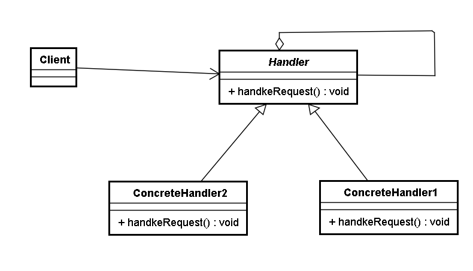

# 責任鏈模式 (Chain of Responsibility Pattern)

## 1 概述
- 在現實生活中，常常會出現這樣的事例：一個請求有多個對象可以處理，但每個對象的處理條件或權限不同。例如，公司員工請假，可批假的領導有部門負責人、副總經理、總經理等，但每個領導能批准的天數不同，員工必鬚根據自己要請假的天數去找不同的領導簽名，也就是說員工必須記住每個領導的姓名、電話和地址等信息，這增加了難度。這樣的例子還有很多，如找領導出差報銷、生活中的“擊鼓傳花”遊戲等。

- 定義：

  - 又名職責鏈模式，為了避免請求發送者與多個請求處理者耦合在一起，將所有請求的處理者通過前一對象記住其下一個對象的引用而連成一條鏈；當有請求發生時，可將請求沿著這條鏈傳遞，直到有對象處理它為止。

## 2 結構
- 職責鏈模式主要包含以下角色:

  - 抽象處理者（Handler）角色：定義一個處理請求的接口，包含抽象處理方法和一個後繼連接。
  - 具體處理者（Concrete Handler）角色：實現抽象處理者的處理方法，判斷能否處理本次請求，如果可以處理請求則處理，否則將該請求轉給它的後繼者。
  - 客戶類（Client）角色：創建處理鏈，並向鏈頭的具體處理者對象提交請求，它不關心處理細節和請求的傳遞過程。



## 3 案例實現
- 現需要開發一個請假流程控制系統。請假一天以下的假只需要小組長同意即可；請假1天到3天的假還需要部門經理同意；請求3天到7天還需要總經理同意才行。


```java

//請假條
public  class  LeaveRequest {
    private  String  name ; //姓名
    private  int  num ; //請假天數
    private  String  content ; //請假內容
​
    public  LeaveRequest ( String  name , int  num , String  content ) {
        this . name  =  name ;
        this . num  =  num ;
        this . content  =  content ;
    }
​
    public  String  getName () {
        return  name ;
    }
​
    public  int  getNum () {
        return  num ;
    }
​
    public  String  getContent () {
        return  content ;
    }
}
​
//處理者抽像類
public  abstract  class  Handler {
    protected  final  static  int  NUM_ONE  =  1 ;
    protected  final  static  int  NUM_THREE  =  3 ;
    protected  final  static  int  NUM_SEVEN  =  7 ;
​
    //該領導處理的請假天數區間
    private  int  numStart ;
    private  int  numEnd ;
​
    //領導上面還有領導
    private  Handler  nextHandler ;
​
    //設置請假天數範圍上不封頂
    public  Handler ( int  numStart ) {
        this . numStart  =  numStart ;
    }
​
    //設置請假天數範圍
    public  Handler ( int  numStart , int  numEnd ) {
        this . numStart  =  numStart ;
        this . numEnd  =  numEnd ;
    }
​
    //設置上級領導
    public  void  setNextHandler ( Handler  nextHandler ){
        this . nextHandler  =  nextHandler ;
    }
​
    //提交請假條
    public  final  void  submit ( LeaveRequest  leave ){
        if ( 0  ==  this . numStart ){
            return ;
        }
​
        //如果請假天數達到該領導者的處理要求
        if ( leave . getNum () >=  this . numStart ){
            this . handleLeave ( leave );
​
            //如果還有上級並且請假天數超過了當前領導的處理範圍
            if ( null  !=  this . nextHandler  &&  leave . getNum () >  numEnd ){
                this . nextHandler . submit ( leave ); //繼續提交
            } else {
                System . out . println ( "流程結束" );
            }
        }
    }
​
    //各級領導處理請假條方法
    protected  abstract  void  handleLeave ( LeaveRequest  leave );
}
​
//小組長
public  class  GroupLeader  extends  Handler {
    public  GroupLeader () {
        //小組長處理1-3天的請假
        super ( Handler . NUM_ONE , Handler . NUM_THREE );
    }
​
    @Override
    protected  void  handleLeave ( LeaveRequest  leave ) {
        System . out . println ( leave . getName () +  "請假"  +  leave . getNum () +  "天,"  +  leave . getContent () +  "。" );
        System . out . println ( "小組長審批：同意。" );
    }
}
​
//部門經理
public  class  Manager  extends  Handler {
    public  Manager () {
        //部門經理處理3-7天的請假
        super ( Handler . NUM_THREE , Handler . NUM_SEVEN );
    }
​
    @Override
    protected  void  handleLeave ( LeaveRequest  leave ) {
        System . out . println ( leave . getName () +  "請假"  +  leave . getNum () +  "天,"  +  leave . getContent () +  "。" );
        System . out . println ( "部門經理審批：同意。" );
    }
}
​
//總經理
public  class  GeneralManager  extends  Handler {
    public  GeneralManager () {
        //部門經理處理7天以上的請假
        super ( Handler . NUM_SEVEN );
    }
​
    @Override
    protected  void  handleLeave ( LeaveRequest  leave ) {
        System . out . println ( leave . getName () +  "請假"  +  leave . getNum () +  "天,"  +  leave . getContent () +  "。" );
        System . out . println ( "總經理審批：同意。" );
    }
}
​
//測試類
public  class  Client {
    public  static  void  main ( String [] args ) {
        //請假條來一張
        LeaveRequest  leave  =  new  LeaveRequest ( "小花" , 5 , "身體不適" );
​
        //各位領導
        GroupLeader  groupLeader  =  new  GroupLeader ();
        Manager  manager  =  new  Manager ();
        GeneralManager  generalManager  =  new  GeneralManager ();
​
        groupLeader . setNextHandler ( manager ); //小組長的領導是部門經理
        manager . setNextHandler ( generalManager ); //部門經理的領導是總經理
        //之所以在這裡設置上級領導，是因為可以根據實際需求來更改設置，如果實戰中上級領導人都是固定的，則可以移到領導實現類中。
​
        //提交申請
        groupLeader . submit ( leave );
    }
}
```

## 4 優缺點
- 1，優點：

  - 降低了對象之間的耦合度

  - 該模式降低了請求發送者和接收者的耦合度。

  - 增強了系統的可擴展性

  - 可以根據需要增加新的請求處理類，滿足開閉原則。

  - 增強了給對象指派職責的靈活性

  - 當工作流程發生變化，可以動態地改變鏈內的成員或者修改它們的次序，也可動態地新增或者刪除責任。

  - 責任鏈簡化了對象之間的連接

  - 一個對像只需保持一個指向其後繼者的引用，不需保持其他所有處理者的引用，這避免了使用眾多的if 或者if···else 語句。

  - 責任分擔

    - 每個類只需要處理自己該處理的工作，不能處理的傳遞給下一個對象完成，明確各類的責任範圍，符合類的單一職責原則。

- 2，缺點：

  - 不能保證每個請求一定被處理。由於一個請求沒有明確的接收者，所以不能保證它一定會被處理，該請求可能一直傳到鏈的末端都得不到處理。
  - 對比較長的職責鏈，請求的處理可能涉及多個處理對象，系統性能將受到一定影響。
  - 職責鏈建立的合理性要靠客戶端來保證，增加了客戶端的複雜性，可能會由於職責鏈的錯誤設置而導致系統出錯，如可能會造成循環調用。
 

## 5 源碼解析
- 在javaWeb應用開發中，FilterChain是職責鏈（過濾器）模式的典型應用，以下是Filter的模擬實現分析:


模擬web請求Request以及web響應Response

```java
public  interface  Request {
 
}
​
public  interface  Response {
 
}
```

模擬web過濾器Filter

```java
 public  interface  Filter {
    public  void  doFilter ( Request  req , Response  res , FilterChain  c );
}
```

模擬實現具體過濾器

```java

public  class  FirstFilter  implements  Filter {
    @Override
    public  void  doFilter ( Request  request , Response  response , FilterChain  chain ) {
​
        System . out . println ( "過濾器1 前置處理" );
​
        // 先執行所有request再倒序執行所有response
        chain . doFilter ( request , response );
​
        System . out . println ( "過濾器1 後置處理" );
    }
}
​
public  class  SecondFilter   implements  Filter {
    @Override
    public  void  doFilter ( Request  request , Response  response , FilterChain  chain ) {
​
        System . out . println ( "過濾器2 前置處理" );
​
        // 先執行所有request再倒序執行所有response
        chain . doFilter ( request , response );
​
        System . out . println ( "過濾器2 後置處理" );
    }
}
```

模擬實現過濾器鏈FilterChain
```java
public  class  FilterChain {
​
    private  List < Filter >  filters  =  new  ArrayList < Filter > ();
​
    private  int  index  =  0 ;
​
    // 鍊式調用
    public  FilterChain  addFilter ( Filter  filter ) {
        this . filters . add ( filter );
        return  this ;
    }
​
    public  void  doFilter ( Request  request , Response  response ) {
        if ( index  ==  filters . size ()) {
            return ;
        }
        Filter  filter  =  filters . get ( index );
        index ++ ;
        filter . doFilter ( request , response , this );
    }
}
```

測試類
```java

public  class  Client {
    public  static  void  main ( String [] args ) {
        Request   req  =  null ;
        Response  res  =  null ;
​
        FilterChain  filterChain  =  new  FilterChain ();
        filterChain . addFilter ( new  FirstFilter ()). addFilter ( new  SecondFilter ());
        filterChain . doFilter ( req , res );
    }
}
```


 