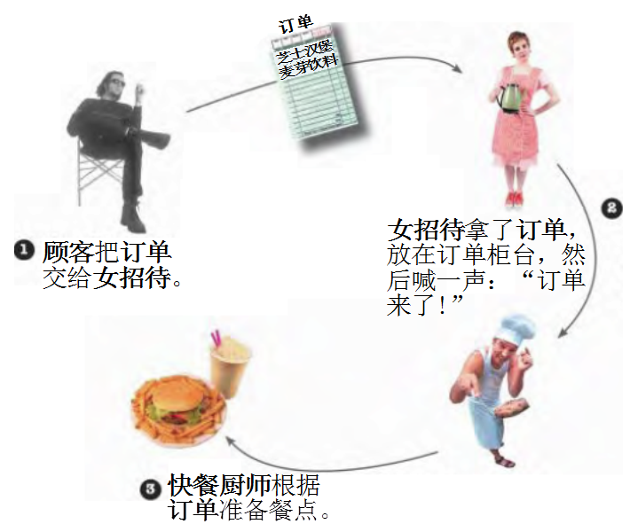

# 命令模式 (Command Pattern)

## 1 概述
- 日常生活中，我們出去吃飯都會遇到下面的場景。



- 定義：
 
- 將一個請求封裝為一個對象，使發出請求的責任和執行請求的責任分割開。這樣兩者之間通過命令對象進行溝通，這樣方便將命令對象進行存儲、傳遞、調用、增加與管理。


## 2 結構
- 命令模式包含以下主要角色：

  - 抽象命令類（Command）角色： 定義命令的接口，聲明執行的方法。
  - 具體命令（Concrete Command）角色：具體的命令，實現命令接口；通常會持有接收者，並調用接收者的功能來完成命令要執行的操作。
  - 實現者/接收者（Receiver）角色： 接收者，真正執行命令的對象。任何類都可能成為一個接收者，只要它能夠實現命令要求實現的相應功能。
  - 調用者/請求者（Invoker）角色： 要求命令對象執行請求，通常會持有命令對象，可以持有很多的命令對象。這個是客戶端真正觸發命令並要求命令執行相應操作的地方，也就是說相當於使用命令對象的入口。


## 3 案例實現
- 將上面的案例用代碼實現，那我們就需要分析命令模式的角色在該案例中由誰來充當。

  - 服務員： 就是調用者角色，由她來發起命令。(Waitor)

  - 資深大廚： 就是接收者角色，真正命令執行的對象。(SenioChef)

  - 訂單： 命令中包含訂單。(Order)

類圖如下：


```java
public  interface  Command {
    void  execute (); //只需要定義一個統一的執行方法
}
​
public  class  OrderCommand  implements  Command {
​
    //持有接受者對象
    private  SeniorChef  receiver ;
    private  Order  order ;
​
    public  OrderCommand ( SeniorChef  receiver , Order  order ){
        this . receiver  =  receiver ;
        this . order  =  order ;
    }
​
    public  void  execute () {
        System . out . println ( order . getDiningTable () +  "桌的訂單：" );
        Set < String >  keys  =  order . getFoodDic (). keySet ();
        for ( String  key : keys ) {
            receiver . makeFood ( order . getFoodDic (). get ( key ), key );
        }
​
        try {
            Thread . sleep ( 100 ); //停頓一下模擬做飯的過程
        } catch ( InterruptedException  e ) {
            e . printStackTrace ();
        }
​
​
        System . out . println ( order . getDiningTable () +  "桌的飯弄好了" );
    }
}
​
public  class  Order {
    // 餐桌號碼
    private  int  diningTable ;
​
    // 用來存儲餐名並記錄份數
    private  Map < String , Integer >  foodDic  =  new  HashMap < String , Integer > ();
​
    public  int  getDiningTable () {
        return  diningTable ;
    }
​
    public  void  setDiningTable ( int  diningTable ) {
        this . diningTable  =  diningTable ;
    }
​
    public  Map < String , Integer >  getFoodDic () {
        return  foodDic ;
    }
​
    public  void  setFoodDic ( String  name , int  num ) {
        foodDic . put ( name , num );
    }
}
​
// 資深大廚類是命令的Receiver
public  class  SeniorChef {
​
    public  void  makeFood ( int  num , String  foodName ) {
        System . out . println ( num  +  "份"  +  foodName );
    }
}
​
public  class  Waitor {
​
    private  ArrayList < Command >  commands ; //可以持有很多的命令對象
​
    public  Waitor () {
        commands  =  new  ArrayList ();
    }
    
    public  void  setCommand ( Command  cmd ){
        commands . add ( cmd );
    }
​
    // 發出命令喊訂單來了，廚師開始執行
    public  void  orderUp () {
        System . out . println ( "美女服務員：叮咚，大廚，新訂單來了......." );
        for ( int  i  =  0 ; i  <  commands . size (); i ++ ) {
            Command  cmd  =  commands . get ( i );
            if ( cmd  !=  null ) {
                cmd . execute ();
            }
        }
    }
}
​
public  class  Client {
    public  static  void  main ( String [] args ) {
        //創建2個order
        Order  order1  =  new  Order ();
        order1 . setDiningTable ( 1 );
        order1 . getFoodDic (). put ( "西紅柿雞蛋麵" , 1 );
        order1 . getFoodDic (). put ( "小杯可樂" , 2 );
​
        Order  order2  =  new  Order ();
        order2 . setDiningTable ( 3 );
        order2 . getFoodDic (). put ( "尖椒肉絲蓋飯" , 1 );
        order2 . getFoodDic (). put ( "小杯雪碧" , 1 );
​
        //創建接收者
        SeniorChef  receiver = new  SeniorChef ();
        //將訂單和接收者封裝成命令對象
        OrderCommand  cmd1  =  new  OrderCommand ( receiver , order1 );
        OrderCommand  cmd2  =  new  OrderCommand ( receiver , order2 );
        //創建調用者waitor
        Waitor  invoker  =  new  Waitor ();
        invoker . setCommand ( cmd1 );
        invoker . setCommand ( cmd2 );
​
        //將訂單帶到櫃檯並向廚師喊訂單來了
        invoker . orderUp ();
    }
}
```

## 4 優缺點
- 1，優點：

  - 降低系統的耦合度。命令模式能將調用操作的對象與實現該操作的對象解耦。
  - 增加或刪除命令非常方便。採用命令模式增加與刪除命令不會影響其他類，它滿足“開閉原則”，對擴展比較靈活。
  - 可以實現宏命令。命令模式可以與組合模式結合，將多個命令裝配成一個組合命令，即宏命令。
  - 方便實現Undo 和Redo 操作。命令模式可以與後面介紹的備忘錄模式結合，實現命令的撤銷與恢復。
- 2，缺點：

  - 使用命令模式可能會導致某些系統有過多的具體命令類。
  - 系統結構更加複雜。
 

## 5 使用場景
- 系統需要將請求調用者和請求接收者解耦，使得調用者和接收者不直接交互。
- 系統需要在不同的時間指定請求、將請求排隊和執行請求。
- 系統需要支持命令的撤銷(Undo)操作和恢復(Redo)操作。

## 6 JDK源碼解析
- Runable是一個典型命令模式，Runnable擔當命令的角色，Thread充當的是調用者，start方法就是其執行方法

```java

//命令接口(抽象命令角色)
public  interface  Runnable {
    public  abstract  void  run ();
}
​
//調用者
public  class  Thread  implements  Runnable {
    private  Runnable  target ;
    
    public  synchronized  void  start () {
        if ( threadStatus  !=  0 )
            throw  new  IllegalThreadStateException ();
​
        group . add ( this );
​
        boolean  started  =  false ;
        try {
            start0 ();
            started  =  true ;
        } finally {
            try {
                if ( ! started ) {
                    group . threadStartFailed ( this );
                }
            } catch ( Throwable  ignore ) {
            }
        }
    }
    
    private  native  void  start0 ();
}
```

- 會調用一個native方法start0(),調用系統方法，開啟一個線程。而接收者是對程序員開放的，可以自己定義接收者。

```java
/**
 * jdk Runnable 命令模式
 * TurnOffThread ： 屬於具體      
 */
public  class  TurnOffThread  implements  Runnable {
     private  Receiver  receiver ;
    
     public  TurnOffThread ( Receiver  receiver ) {
        this . receiver  =  receiver ;
     }
     public  void  run () {
        receiver . turnOFF ();
     }
}
```

```java
/**
 * 測試類
 */
public  class  Demo {
     public  static  void  main ( String [] args ) {
         Receiver  receiver  =  new  Receiver ();
         TurnOffThread  turnOffThread  =  new  TurnOffThread ( receiver );
         Thread  thread  =  new  Thread ( turnOffThread );
         thread . start ();
     }
}
```