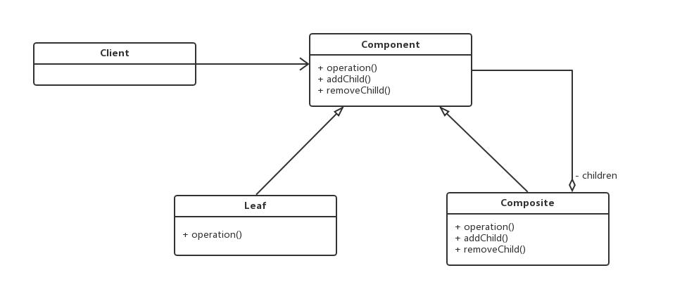

# 組合模式 (Composite Pattern)

## 1 概述

  

- 對於這個圖片肯定會非常熟悉，上圖我們可以看做是一個文件系統，對於這樣的結構我們稱之為樹形結構。在樹形結構中可以通過調用某個方法來遍歷整個樹，當我們找到某個葉子節點後，就可以對葉子節點進行相關的操作。可以將這顆樹理解成一個大的容器，容器裡麵包含很多的成員對象，這些成員對象即可是容器對像也可以是葉子對象。但是由於容器對象和葉子對像在功能上面的區別，使得我們在使用的過程中必須要區分容器對象和葉子對象，但是這樣就會給客戶帶來不必要的麻煩，作為客戶而已，它始終希望能夠一致的對待容器對象和葉子對象。

- 定義：

  - 又名部分整體模式，是用於把一組相似的對象當作一個單一的對象。組合模式依據樹形結構來組合對象，用來表示部分以及整體層次。這種類型的設計模式屬於結構型模式，它創建了對象組的樹形結構。

 ## 2 結構
- 組合模式主要包含三種角色：

  - 抽像根節點（Component）：定義系統各層次對象的共有方法和屬性，可以預先定義一些默認行為和屬性。
  - 樹枝節點（Composite）：定義樹枝節點的行為，存儲子節點，組合樹枝節點和葉子節點形成一個樹形結構。
  - 葉子節點（Leaf）：葉子節點對象，其下再無分支，是系統層次遍歷的最小單位。

 

## 3 案例實現
- 【例】軟件菜單

  - 如下圖，我們在訪問別的一些管理系統時，經常可以看到類似的菜單。一個菜單可以包含菜單項（菜單項是指不再包含其他內容的菜單條目），也可以包含帶有其他菜單項的菜單，因此使用組合模式描述菜單就很恰當，我們的需求是針對一個菜單，打印出其包含的所有菜單以及菜單項的名稱。

  

- 類圖：

  

- 不管是菜單還是菜單項，都應該繼承自統一的接口，這裡姑且將這個統一的接口稱為菜單組件。

```java
//菜單組件不管是菜單還是菜單項，都應該繼承該類
public  abstract  class  MenuComponent {
​
    protected  String  name ;
    protected  int  level ;
​
    //添加菜單
    public  void  add ( MenuComponent  menuComponent ){
        throw  new  UnsupportedOperationException ();
    }
​
    //移除菜單
    public  void  remove ( MenuComponent  menuComponent ){
        throw  new  UnsupportedOperationException ();
    }
​
    //獲取指定的子菜單
    public  MenuComponent  getChild ( int  i ){
        throw  new  UnsupportedOperationException ();
    }
​
    //獲取菜單名稱
    public  String  getName (){
        return  name ;
    }
​
    public  void  print (){
        throw  new  UnsupportedOperationException ();
    }
}
```

- 這裡的MenuComponent定義為抽像類，因為有一些共有的屬性和行為要在該類中實現，Menu和MenuItem類就可以只覆蓋自己感興趣的方法，而不用搭理不需要或者不感興趣的方法，舉例來說，Menu類可以包含子菜單，因此需要覆蓋add()、remove()、getChild()方法，但是MenuItem就不應該有這些方法。這裡給出的默認實現是拋出異常，你也可以根據自己的需要改寫默認實現。
  
```java
public  class  Menu  extends  MenuComponent {
​
    private  List < MenuComponent >  menuComponentList ;
​
    public  Menu ( String  name , int  level ){
        this . level  =  level ;
        this . name  =  name ;
        menuComponentList  =  new  ArrayList < MenuComponent > ();
    }
​
    @Override
    public  void  add ( MenuComponent  menuComponent ) {
        menuComponentList . add ( menuComponent );
    }
​
    @Override
    public  void  remove ( MenuComponent  menuComponent ) {
        menuComponentList . remove ( menuComponent );
    }
​
    @Override
    public  MenuComponent  getChild ( int  i ) {
        return  menuComponentList . get ( i );
    }
​
    @Override
    public  void  print () {
​
        for ( int  i  =  1 ; i  <  level ; i ++ ) {
            System . out . print ( "--" );
        }
        System . out . println ( name );
        for ( MenuComponent  menuComponent : menuComponentList ) {
            menuComponent . print ();
        }
    }
}
```

- Menu類已經實現了除了getName方法的其他所有方法，因為Menu類具有添加菜單，移除菜單和獲取子菜單的功能。

```java
public  class  MenuItem  extends  MenuComponent {
​
    public  MenuItem ( String  name , int  level ) {
        this . name  =  name ;
        this . level  =  level ;
    }
​
    @Override
    public  void  print () {
        for ( int  i  =  1 ; i  <  level ; i ++ ) {
            System . out . print ( "--" );
        }
        System . out . println ( name );
    }
}
```

- MenuItem是菜單項，不能再有子菜單，所以添加菜單，移除菜單和獲取子菜單的功能並不能實現。

## 4 組合模式的分類
- 在使用組合模式時，根據抽象構件類的定義形式，我們可將組合模式分為透明組合模式和安全組合模式兩種形式。

  - 透明組合模式

    - 透明組合模式中，抽像根節點角色中聲明了所有用於管理成員對象的方法，比如在示例中 MenuComponent 聲明了add、remove、getChild方法，這樣做的好處是確保所有的構件類都有相同的接口。透明組合模式也是組合模式的標準形式。

    -  透明組合模式的缺點是不夠安全，因為葉子對象和容器對像在本質上是有區別的，葉子對像不可能有下一個層次的對象，即不可能包含成員對象，因此為其提供add()、remove() 等方法是沒有意義的，這在編譯階段不會出錯，但在運行階段如果調用這些方法可能會出錯（如果沒有提供相應的錯誤處理代碼）

  - 安全組合模式

  - 在安全組合模式中，在抽象構件角色中沒有聲明任何用於管理成員對象的方法，而是在樹枝節點 Menu 類中聲明並實現這些方法。安全組合模式的缺點是不夠透明，因為葉子構件和容器構件具有不同的方法，且容器構件中那些用於管理成員對象的方法沒有在抽象構件類中定義，因此客戶端不能完全針對抽象編程，必須有區別地對待葉子構件和容器構件。


 

## 5 優點
- 組合模式可以清楚地定義分層次的複雜對象，表示對象的全部或部分層次，它讓客戶端忽略了層次的差異，方便對整個層次結構進行控制。
- 客戶端可以一致地使用一個組合結構或其中單個對象，不必關心處理的是單個對像還是整個組合結構，簡化了客戶端代碼。
- 在組合模式中增加新的樹枝節點和葉子節點都很方便，無須對現有類庫進行任何修改，符合“開閉原則”。
- 組合模式為樹形結構的面向對象實現提供了一種靈活的解決方案，通過葉子節點和樹枝節點的遞歸組合，可以形成複雜的樹形結構，但對樹形結構的控制卻非常簡單。

## 6 使用場景
- 組合模式正是應樹形結構而生，所以組合模式的使用場景就是出現樹形結構的地方。比如：文件目錄顯示，多級目錄呈現等樹形結構數據的操作。