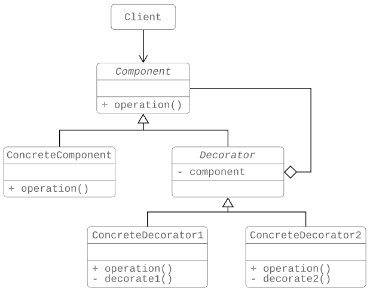
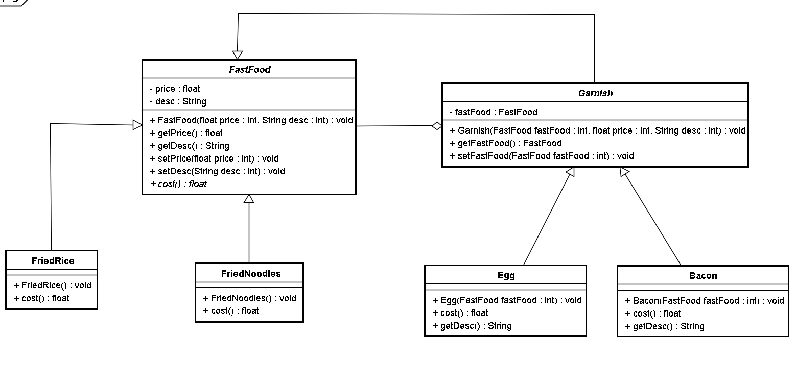

# 裝飾者模式

## 1 概述
- 我們先來看一個快餐店的例子。

  - 快餐店有炒麵、炒飯這些快餐，可以額外附加雞蛋、火腿、培根這些配菜，當然加配菜需要額外加錢，每個配菜的價錢通常不太一樣，那麼計算總價就會顯得比較麻煩。
  
  

- 使用繼承的方式存在的問題：

  - 擴展性不好

  - 如果要再加一種配料（火腿腸），我們就會發現需要給FriedRice和FriedNoodles分別定義一個子類。如果要新增一個快餐品類（炒河粉）的話，就需要定義更多的子類。

  - 產生過多的子類

- 裝飾者模式定義：

  - *** 指在不改變現有對象結構的情況下，動態地給該對象增加一些職責（即增加其額外功能）的模式。 ***
  
## 2 結構
- 裝飾（Decorator）模式中的角色：

  - 抽象構件（Component）角色：定義一個抽象接口以規範準備接收附加責任的對象。
  - 具體構件（ConcreteComponent）角色：實現抽象構件，通過裝飾角色為其添加一些職責。
  - 抽象裝飾（Decorator）角色： 繼承或實現抽象構件，並包含具體構件的實例，可以通過其子類擴展具體構件的功能。
  - 具體裝飾（ConcreteDecorator1、ConcreteDecorator1）角色：實現抽象裝飾的相關方法，並給具體構件對象添加附加的責任。

  

## 3 案例
- 我們使用裝飾者模式對快餐店案例進行改進，體會裝飾者模式的精髓。

- 類圖如下：
  
  
```java
//快餐接口
public  abstract  class  FastFood {
    private  float  price ;
    private  String  desc ;
​
    public  FastFood () {
    }
​
    public  FastFood ( float  price , String  desc ) {
        this . price  =  price ;
        this . desc  =  desc ;
    }
​
    public  void  setPrice ( float  price ) {
        this . price  =  price ;
    }
​
    public  float  getPrice () {
        return  price ;
    }
​
    public  String  getDesc () {
        return  desc ;
    }
​
    public  void  setDesc ( String  desc ) {
        this . desc  =  desc ;
    }
​
    public  abstract  float  cost ();   //獲取價格
}
​
//炒飯
public  class  FriedRice  extends  FastFood {
​
    public  FriedRice () {
        super ( 10 , "炒飯" );
    }
​
    public  float  cost () {
        return  getPrice ();
    }
}
​
//炒麵
public  class  FriedNoodles  extends  FastFood {
​
    public  FriedNoodles () {
        super ( 12 , "炒麵" );
    }
​
    public  float  cost () {
        return  getPrice ();
    }
}
​
//配料類
public  abstract  class  Garnish  extends  FastFood {
​
    private  FastFood  fastFood ;
​
    public  FastFood  getFastFood () {
        return  fastFood ;
    }
​
    public  void  setFastFood ( FastFood  fastFood ) {
        this . fastFood  =  fastFood ;
    }
​
    public  Garnish ( FastFood  fastFood , float  price , String  desc ) {
        super ( price , desc );
        this . fastFood  =  fastFood ;
    }
}
​
//雞蛋配料
public  class  Egg  extends  Garnish {
​
    public  Egg ( FastFood  fastFood ) {
        super ( fastFood , 1 , "雞蛋" );
    }
​
    public  float  cost () {
        return  getPrice () +  getFastFood (). getPrice ();
    }
​
    @Override
    public  String  getDesc () {
        return  super . getDesc () +  getFastFood (). getDesc ();
    }
}
​
//培根配料
public  class  Bacon  extends  Garnish {
​
    public  Bacon ( FastFood  fastFood ) {
​
        super ( fastFood , 2 , "培根" );
    }
​
    @Override
    public  float  cost () {
        return  getPrice () +  getFastFood (). getPrice ();
    }
​
    @Override
    public  String  getDesc () {
        return  super . getDesc () +  getFastFood (). getDesc ();
    }
}
​
//測試類
public  class  Client {
    public  static  void  main ( String [] args ) {
        //點一份炒飯
        FastFood  food  =  new  FriedRice ();
        //花費的價格
        System . out . println ( food . getDesc () +  " "  +  food . cost () +  "元" );
​
        System . out . println ( "========" );
        //點一份加雞蛋的炒飯
        FastFood  food1  =  new  FriedRice ();
​
        food1  =  new  Egg ( food1 );
        //花費的價格
        System . out . println ( food1 . getDesc () +  " "  +  food1 . cost () +  "元" );
​
        System . out . println ( "========" );
        //點一份加培根的炒麵
        FastFood  food2  =  new  FriedNoodles ();
        food2  =  new  Bacon ( food2 );
        //花費的價格
        System . out . println ( food2 . getDesc () +  " "  +  food2 . cost () +  "元" );
    }
}
```

- 好處：

  - 飾者模式可以帶來比繼承更加靈活性的擴展功能，使用更加方便，可以通過組合不同的裝飾者對象來獲取具有不同行為狀態的多樣化的結果。裝飾者模式比繼承更具良好的擴展性，完美的遵循開閉原則，繼承是靜態的附加責任，裝飾者則是動態的附加責任。
  - 裝飾類和被裝飾類可以獨立發展，不會相互耦合，裝飾模式是繼承的一個替代模式，裝飾模式可以動態擴展一個實現類的功能。

## 4 使用場景
- 當不能採用繼承的方式對系統進行擴充或者採用繼承不利於系統擴展和維護時。

- 不能採用繼承的情況主要有兩類：

  - 第一類是系統中存在大量獨立的擴展，為支持每一種組合將產生大量的子類，使得子類數目呈爆炸性增長；
  - 第二類是因為類定義不能繼承（如final類）
  在不影響其他對象的情況下，以動態、透明的方式給單個對象添加職責。

- 當對象的功能要求可以動態地添加，也可以再動態地撤銷時。

## 5 JDK源碼解析
- IO流中的包裝類使用到了裝飾者模式。BufferedInputStream，BufferedOutputStream，BufferedReader，BufferedWriter。

- 以BufferedWriter舉例來說明，先看看如何使用BufferedWriter

```java

public  class  Demo {
    public  static  void  main ( String [] args ) throws  Exception {
        //創建BufferedWriter對象
        //創建FileWriter對象
        FileWriter  fw  =  new  FileWriter ( "C:\\Users\\Think\\Desktop\\a.txt" );
        BufferedWriter  bw  =  new  BufferedWriter ( fw );
​
        //寫數據
        bw . write ( "hello Buffered" );
​
        bw . close ();
    }
}
```

它們的結構：

  

- BufferedWriter使用裝飾者模式對Writer子實現類進行了增強，添加了緩衝區，提高了寫數據的效率。


## 6 代理和裝飾者的區別
- 靜態代理和裝飾者模式的區別：

  - 相同點：

    - 都要實現與目標類相同的業務接口
    - 在兩個類中都要聲明目標對象
    - 都可以在不修改目標類的前提下增強目標方法
  - 不同點：

    - 目的不同 裝飾者是為了增強目標對象 靜態代理是為了保護和隱藏目標對象
    - 獲取目標對象構建的地方不同 裝飾者是由外界傳遞進來，可以通過構造方法傳遞 靜態代理是在代理類內部創建，以此來隱藏目標對象