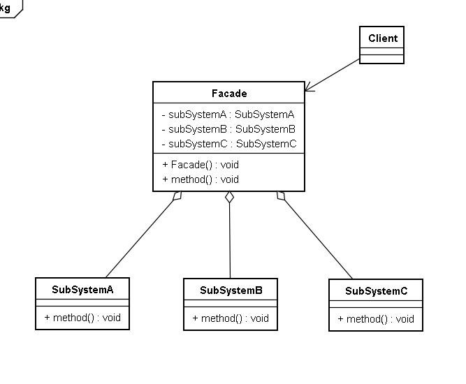

# Facade Pattern 門面模式(外觀模式)

## 1 概述
- 有些人可能炒過股票，但其實大部分人都不太懂，這種沒有足夠了解證券知識的情況下做股票是很容易虧錢的，剛開始炒股肯定都會想，如果有個懂行的幫幫手就好，其實基金就是個好幫手，支付寶裡就有許多的基金，它將投資者分散的資金集中起來，交由專業的經理人進行管理，投資於股票、債券、外匯等領域，而基金投資的收益歸持有者所有，管理機構收取一定比例的託管管理費用。

- 定義：

  - 又名門面模式，是一種通過為多個複雜的子系統提供一個一致的接口，而使這些子系統更加容易被訪問的模式。該模式對外有一個統一接口，外部應用程序不用關心內部子系統的具體的細節，這樣會大大降低應用程序的複雜度，提高了程序的可維護性。

- 外觀（Facade）模式是“迪米特法則”的典型應用

  

## 2 結構
- 外觀（Facade）模式包含以下主要角色：

  - 外觀（Facade）角色：為多個子系統對外提供一個共同的接口。
  - 子系統（Sub System）角色：實現系統的部分功能，客戶可以通過外觀角色訪問它。

  

## 3 案例
- 【例】智能家電控制

  - 小明的爺爺已經60歲了，一個人在家生活：每次都需要打開燈、打開電視、打開空調；睡覺時關閉燈、關閉電視、關閉空調；操作起來都比較麻煩。所以小明給爺爺買了智能音箱，可以通過語音直接控制這些智能家電的開啟和關閉。類圖如下：


  

```java
//燈類
public  class  Light {
    public  void  on () {
        System.out.println ( "打開了燈...." );
    }
​
    public  void  off () {
        System.out.println ( "關閉了燈...." );
    }
}
​
//電視類
public  class  TV {
    public  void  on () {
        System.out.println ( "打開了電視...." );
    }
​
    public  void  off () {
        System.out.println ( "關閉了電視...." );
    }
}
​
//控制類
public  class  AirCondition {
    public  void  on () {
        System.out.println ( "打開了空調...." );
    }
​
    public  void  off () {
        System.out.println ( "關閉了空調...." );
    }
}
​
//智能音箱
public  class  SmartAppliancesFacade {
​
    private  Light  light ;
    private  TV  tv ;
    private  AirCondition  airCondition ;
​
    public  SmartAppliancesFacade () {
        light  =  new  Light ();
        tv  =  new  TV ();
        airCondition  =  new  AirCondition ();
    }
​
    public  void  say ( String  message ) {
        if ( message.contains ( "打開" )) {
            on ();
        } else  if ( message.contains ( "關閉" )) {
            off ();
        } else {
            System.out.println ( "我還聽不懂你說的！！！" );
        }
    }
​
    //起床後一鍵開電器
    private  void  on () {
        System.out.println ( "起床了" );
        light.on ();
        tv.on ();
        airCondition.on ();
    }
​
    //睡覺一鍵關電器
    private  void  off () {
        System.out.println ( "睡覺了" );
        light.off ();
        tv.off ();
        airCondition.off ();
    }
}
​
//測試類
public  class  Client {
    public  static  void  main ( String [] args ) {
        //創建外觀對象
        SmartAppliancesFacade  facade  =  new  SmartAppliancesFacade ();
        //客戶端直接與外觀對象進行交互
        facade.say ( "打開家電" );
        facade.say ( "關閉家電" );
    }
}
```

- 好處：

  - 降低了子系統與客戶端之間的耦合度，使得子系統的變化不會影響調用它的客戶類。
  -  對客戶屏蔽了子系統組件，減少了客戶處理的對像數目，並使得子系統使用起來更加容易。
  
- 缺點：
  - 不符合開閉原則，修改很麻煩

## 4 使用場景
- 對分層結構系統構建時，使用外觀模式定義子系統中每層的入口點可以簡化子系統之間的依賴關係。
- 當一個複雜系統的子系統很多時，外觀模式可以為系統設計一個簡單的接口供外界訪問。
- 當客戶端與多個子系統之間存在很大的聯繫時，引入外觀模式可將它們分離，從而提高子系統的獨立性和可移植性。


