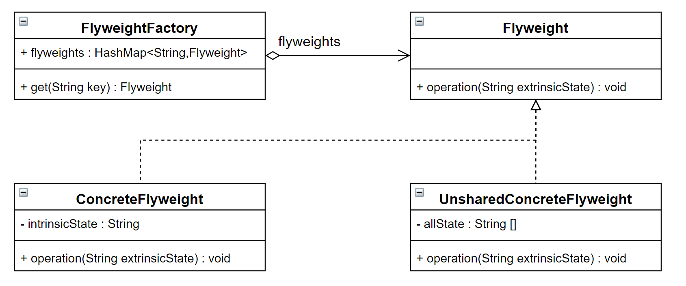
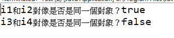

# 享元模式 (Flyweight Pattern)

## 1 概述
- 定義：

  - 運用共享技術來有效地支持大量細粒度對象的複用。它通過共享已經存在的對象來大幅度減少需要創建的對像數量、避免大量相似對象的開銷，從而提高系統資源的利用率。

## 2 結構
- 享元（Flyweight ）模式中存在以下兩種狀態：

  - 1.內部狀態(內部數據)，即不會隨著環境的改變而改變的可共享部分。
  - 2.外部狀態(外部數據，可經由方法參數傳進來)，指隨環境改變而改變的不可以共享的部分。享元模式的實現要領就是區分應用中的這兩種狀態，並將外部狀態外部化。

- 享元模式的主要有以下角色：

  - 抽象享元角色（Flyweight）：通常是一個接口或抽像類，在抽象享元類中聲明了具體享元類公共的方法，這些方法可以向外界提供享元對象的內部數據（內部狀態），同時也可以通過這些方法來設置外部數據（外部狀態）。
  - 具體享元（Concrete Flyweight）角色：它實現了抽象享元類，稱為享元對象；在具體享元類中為內部狀態提供了存儲空間。通常我們可以結合單例模式來設計具體享元類，為每一個具體享元類提供唯一的享元對象。
  - 非享元（Unsharable Flyweight)角色：外部數據，並不是所有的抽象享元類的子類都需要被共享，不能被共享的子類可設計為非共享具體享元類；當需要一個非共享具體享元類的對象時可以直接通過實例化創建。
  - 享元工廠（Flyweight Factory）角色：負責創建和管理享元角色。當客戶對象請求一個享元對象時，享元工廠檢査系統中是否存在符合要求的享元對象，如果存在則提供給客戶；如果不存在的話，則創建一個新的享元對象。
 


## 3 案例實現
- 【例】俄羅斯方塊
  - 下面的圖片是眾所周知的俄羅斯方塊中的一個個方塊，如果在俄羅斯方塊這個遊戲中，每個不同的方塊都是一個實例對象，這些對象就要佔用很多的內存空間，下面利用享元模式進行實現。



- 類圖：
  
- 俄羅斯方塊有不同的形狀，我們可以對這些形狀向上抽取出AbstractBox，用來定義共性的屬性和行為。

```java
public  abstract  class  AbstractBox {
    public  abstract  String  getShape ();
​
    public  void  display ( String  color ) {
        System . out . println ( "方塊形狀："  +  this . getShape () +  " 顏色："  +  color );
    }
}
```

- 接下來就是定義不同的形狀了，IBox類、LBox類、OBox類等。

```java
public  class  IBox  extends  AbstractBox {
​
    @Override
    public  String  getShape () {
        return  "I" ;
    }
}
​
public  class  LBox  extends  AbstractBox {
​
    @Override
    public  String  getShape () {
        return  "L" ;
    }
}
​
public  class  OBox  extends  AbstractBox {
​
    @Override
    public  String  getShape () {
        return  "O" ;
    }
}
```

- 提供了一個工廠類（BoxFactory），用來管理享元對象（也就是AbstractBox子類對象），該工廠類對像只需要一個，所以可以使用單例模式。並給工廠類提供一個獲取形狀的方法。

```java
public  class  BoxFactory {
​
    private  static  HashMap < String , AbstractBox >  map ;
​
    private  BoxFactory () {
        map  =  new  HashMap < String , AbstractBox > ();
        AbstractBox  iBox  =  new  IBox ();
        AbstractBox  lBox  =  new  LBox ();
        AbstractBox  oBox  =  new  OBox ();
        map . put ( "I" , iBox );
        map . put ( "L" , lBox );
        map . put ( "O" , oBox );
    }
​
    public  static  final  BoxFactory  getInstance () {
        return  SingletonHolder . INSTANCE ;
    }
​
    private  static  class  SingletonHolder {
        private  static  final  BoxFactory  INSTANCE  =  new  BoxFactory ();
    }
​
    public  AbstractBox  getBox ( String  key ) {
        return  map . get ( key );
    }
}
```

## 5 優缺點和使用場景
- 1，優點

  - 極大減少內存中相似或相同對像數量，節約系統資源，提供系統性能
  - 享元模式中的外部狀態相對獨立，且不影響內部狀態
- 2，缺點：

  - 為了使對象可以共享，需要將享元對象的部分狀態外部化，分離內部狀態和外部狀態，使程序邏輯複雜

- 3，使用場景：

  - 一個系統有大量相同或者相似的對象，造成內存的大量耗費。
  - 對象的大部分狀態都可以外部化，可以將這些外部狀態傳入對像中。
  - 在使用享元模式時需要維護一個存儲享元對象的享元池，而這需要耗費一定的系統資源，因此，應當在需要多次重複使用享元對象時才值得使用享元模式。

## 6 JDK源碼解析
- Integer類使用了享元模式。我們先看下面的例子：

```java
public  class  Demo {
    public  static  void  main ( String [] args ) {
        Integer  i1  =  127 ;
        Integer  i2  =  127 ;
​
        System . out . println ( "i1和i2對像是否是同一個對象？"  + ( i1  ==  i2 ));
​
        Integer  i3  =  128 ;
        Integer  i4  =  128 ;
​
        System . out . println ( "i3和i4對像是否是同一個對象？"  + ( i3  ==  i4 ));
    }
}
```


- 為什麼第一個輸出語句輸出的是true，第二個輸出語句輸出的是false？通過反編譯軟件進行反編譯，代碼如下：

```java

public  class  Demo {
    public  static  void  main ( String [] args ) {
        Integer  i1  =  Integer . valueOf (( int ) 127 );
        Integer  i2  Integer . valueOf (( int ) 127 );
        System . out . println (( String ) new  StringBuilder (). append (( String ) "i1\u548ci2\u5bf9\u8c61\u662f\u5426\u662f\u540c\u4e00\u4e2a\u5bf9\u8c61\uff1f" ). append (( boolean )( i1  ==  i2 )). toString ());
        Integer  i3  =  Integer . valueOf (( int ) 128 );
        Integer  i4  =  Integer . valueOf (( int ) 128 );
        System . out . println (( String ) new  StringBuilder (). append (( String ) "i3\u548ci4\u5bf9\u8c61\u662f\u5426\u662f\u540c\u4e00\u4e2a\u5bf9\u8c61\uff1f" ). append (( boolean )( i3  ==  i4 )). toString ());
    }
}
```
- 上面代碼可以看到，直接給Integer類型的變量賦值基本數據類型數據的操作底層使用的是valueOf()，所以只需要看該方法即可

```java
public  final  class  Integer  extends  Number  implements  Comparable < Integer > {
    
    public  static  Integer  valueOf ( int  i ) {
        if ( i  >=  IntegerCache . low  &&  i  <=  IntegerCache . high )
            return  IntegerCache . cache [ i  + ( - IntegerCache . low )];
        return  new  Integer ( i );
    }
    
    private  static  class  IntegerCache {
        static  final  int  low  =  - 128 ;
        static  final  int  high ;
        static  final  Integer  cache [];
​
        static {
            int  h  =  127 ;
            String  integerCacheHighPropValue  =
                sun . misc . VM . getSavedProperty ( "java.lang.Integer.IntegerCache.high" );
            if ( integerCacheHighPropValue  !=  null ) {
                try {
                    int  i  =  parseInt ( integerCacheHighPropValue );
                    i  =  Math . max ( i , 127 );
                    // Maximum array size is Integer.MAX_VALUE
                    h  =  Math . min ( i , Integer . MAX_VALUE  - ( - low ) - 1 );
                } catch ( NumberFormatException  nfe ) {
                }
            }
            high  =  h ;
            cache  =  new  Integer [( high  -  low ) +  1 ];
            int  j  =  low ;
            for ( int  k  =  0 ; k  <  cache . length ; k ++ )
                cache [ k ] =  new  Integer ( j ++ );
            // range [-128, 127] must be interned (JLS7 5.1.7)
            assert  IntegerCache . high  >=  127 ;
        }
​
        private  IntegerCache () {}
    }
}
```

- 可以看到 Integer 默認先創建並緩存 -128 ~ 127 之間數的 Integer 對象，當調用 valueOf 時如果參數在 -128 ~ 127 之間則計算下標並從緩存中返回，否則創建一個新的 Integer 對象。

