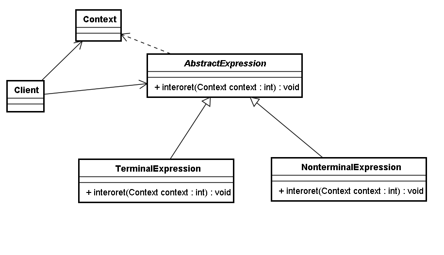

# 解譯器模式 (Interpreter Pattern)

## 1 概述


- 如上圖，設計一個軟件用來進行加減計算。我們第一想法就是使用工具類，提供對應的加法和減法的工具方法。

```java
//用於兩個整數相加
public  static  int  add ( int  a , int  b ){
    return  a  +  b ;
}
​
//用於兩個整數相加
public  static  int  add ( int  a , int  b , int  c ){
    return  a  +  b  +  c ;
}
​
//用於n個整數相加
public  static  int  add ( Integer ... arr ) {
    int  sum  =  0 ;
    for ( Integer  i : arr ) {
        sum  +=  i ;
    }
    return  sum ;
}
```

- 上面的形式比較單一、有限，如果形式變化非常多，這就不符合要求，因為加法和減法運算，兩個運算符與數值可以有無限種組合方式。比如1+2+3+4+5、1+2+3-4等等。

- 顯然，現在需要一種翻譯識別機器，能夠解析由數字以及+ - 符號構成的合法的運算序列。如果把運算符和數字都看作節點的話，能夠逐個節點的進行讀取解析運算，這就是解釋器模式的思維。

- 定義：

  - 給定一個語言，定義它的文法表示，並定義一個解釋器，這個解釋器使用該標識來解釋語言中的句子。

  - 在解釋器模式中，我們需要將待解決的問題，提取出規則，抽象為一種“語言”。比如加減法運算，規則為：由數值和+-符號組成的合法序列，“1+3-2” 就是這種語言的句子。

- 解釋器就是要解析出來語句的含義。但是如何描述規則呢？

- 文法（語法）規則：

  - 文法是用於描述語言的語法結構的形式規則。

```

expression ::= value | plus | minus
plus ::= expression '+' expression   
minus ::= expression '-' expression  
value ::= integer
```

- 注意： 這裡的符號“::=”表示“定義為”的意思，豎線| 表示或，左右的其中一個，引號內為字符本身，引號外為語法。


- 上面規則描述為：

  - 表達式可以是一個值，也可以是plus或者minus運算，而plus和minus又是由表達式結合運算符構成，值的類型為整型數。

- 抽象語法樹：

  - 在計算機科學中，抽象語法樹（AbstractSyntaxTree，AST），或簡稱語法樹（Syntax tree），是源代碼語法結構的一種抽象表示。它以樹狀的形式表現編程語言的語法結構，樹上的每個節點都表示源代碼中的一種結構。

  - 用樹形來表示符合文法規則的句子。


## 2 結構
- 解釋器模式包含以下主要角色。

  - 抽象表達式（Abstract Expression）角色：定義解釋器的接口，約定解釋器的解釋操作，主要包含解釋方法interpret()。
  - 終結符表達式（Terminal Expression）角色：是抽象表達式的子類，用來實現文法中與終結符相關的操作，文法中的每一個終結符都有一個具體終結表達式與之相對應。
  - 非終結符表達式（Nonterminal Expression）角色：也是抽象表達式的子類，用來實現文法中與非終結符相關的操作，文法中的每條規則都對應於一個非終結符表達式。
  - 環境（Context）角色：通常包含各個解釋器需要的數據或是公共的功能，一般用來傳遞被所有解釋器共享的數據，後面的解釋器可以從這裡獲取這些值。
  - 客戶端（Client）：主要任務是將需要分析的句子或表達式轉換成使用解釋器對象描述的抽象語法樹，然後調用解釋器的解釋方法，當然也可以通過環境角色間接訪問解釋器的解釋方法。



```java
//抽象角色AbstractExpression
public  abstract  class  AbstractExpression {
    public  abstract  int  interpret ( Context  context );
}
​
//終結符表達式角色
public  class  Value  extends  AbstractExpression {
    private  int  value ;
​
    public  Value ( int  value ) {
        this . value  =  value ;
    }
​
    @Override
    public  int  interpret ( Context  context ) {
        return  value ;
    }
​
    @Override
    public  String  toString () {
        return  new  Integer ( value ). toString ();
    }
}
​
//非終結符表達式角色加法表達式
public  class  Plus  extends  AbstractExpression {
    private  AbstractExpression  left ;
    private  AbstractExpression  right ;
​
    public  Plus ( AbstractExpression  left , AbstractExpression  right ) {
        this . left  =  left ;
        this . right  =  right ;
    }
​
    @Override
    public  int  interpret ( Context  context ) {
        return  left . interpret ( context ) +  right . interpret ( context );
    }
​
    @Override
    public  String  toString () {
        return  "("  +  left . toString () +  " + "  +  right . toString () +  ")" ;
    }
}
​
///非終結符表達式角色減法表達式
public  class  Minus  extends  AbstractExpression {
    private  AbstractExpression  left ;
    private  AbstractExpression  right ;
​
    public  Minus ( AbstractExpression  left , AbstractExpression  right ) {
        this . left  =  left ;
        this . right  =  right ;
    }
​
    @Override
    public  int  interpret ( Context  context ) {
        return  left . interpret ( context ) -  right . interpret ( context );
    }
​
    @Override
    public  String  toString () {
        return  "("  +  left . toString () +  " - "  +  right . toString () +  ")" ;
    }
}
​
//終結符表達式角色變量表達式
public  class  Variable  extends  AbstractExpression {
    private  String  name ;
​
    public  Variable ( String  name ) {
        this . name  =  name ;
    }
​
    @Override
    public  int  interpret ( Context  ctx ) {
        return  ctx . getValue ( this );
    }
​
    @Override
    public  String  toString () {
        return  name ;
    }
}
​
//環境類
public  class  Context {
    private  Map < Variable , Integer >  map  =  new  HashMap < Variable , Integer > ();
​
    public  void  assign ( Variable  var , Integer  value ) {
        map . put ( var , value );
    }
​
    public  int  getValue ( Variable  var ) {
        Integer  value  =  map . get ( var );
        return  value ;
    }
}
​
//測試類
public  class  Client {
    public  static  void  main ( String [] args ) {
        Context  context  =  new  Context ();
​
        Variable  a  =  new  Variable ( "a" );
        Variable  b  =  new  Variable ( "b" );
        Variable  c  =  new  Variable ( "c" );
        Variable  d  =  new  Variable ( "d" );
        Variable  e  =  new  Variable ( "e" );
        //Value v = new Value(1);
​
        context . assign ( a , 1 );
        context . assign ( b , 2 );
        context . assign ( c , 3 );
        context . assign ( d , 4 );
        context . assign ( e , 5 );
​
        AbstractExpression  expression  =  new  Minus ( new  Plus ( new  Plus ( new  Plus ( a , b ), c ), d ), e );
​
        System . out . println ( expression  +  "= "  +  expression . interpret ( context ));
    }
}
```

## 4 優缺點
- 1，優點：

  - 易於改變和擴展文法。

  - 由於在解釋器模式中使用類來表示語言的文法規則，因此可以通過繼承等機制來改變或擴展文法。每一條文法規則都可以表示為一個類，因此可以方便地實現一個簡單的語言。

  - 實現文法較為容易。

  - 在抽象語法樹中每一個表達式節點類的實現方式都是相似的，這些類的代碼編寫都不會特別複雜。

  - 增加新的解釋表達式較為方便。

  - 如果用戶需要增加新的解釋表達式只需要對應增加一個新的終結符表達式或非終結符表達式類，原有表達式類代碼無須修改，符合"開閉原則"。

- 2，缺點：

  - 對於復雜文法難以維護。

  - 在解釋器模式中，每一條規則至少需要定義一個類，因此如果一個語言包含太多文法規則，類的個數將會急劇增加，導致系統難以管理和維護。

  - 執行效率較低。

  - 由於在解釋器模式中使用了大量的循環和遞歸調用，因此在解釋較為複雜的句子時其速度很慢，而且代碼的調試過程也比較麻煩。

 

## 5 使用場景
- 當語言的文法較為簡單，且執行效率不是關鍵問題時。
- 當問題重複出現，且可以用一種簡單的語言來進行表達時。
- 當一個語言需要解釋執行，並且語言中的句子可以表示為一個抽象語法樹的時候。
 

 