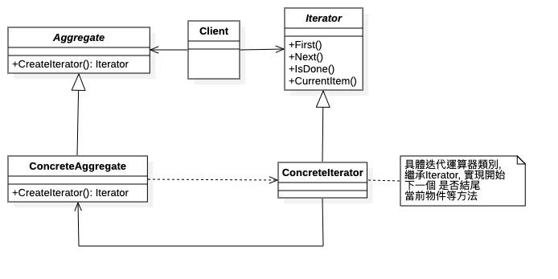

# 迭代器模式 (Iterator Pattern)

## 1 概述
- 定義：

  - 提供一個對象來順序訪問聚合對像中的一系列數據，而不暴露聚合對象的內部表示。

 

## 2 結構
- 迭代器模式主要包含以下角色：

  - 抽象聚合（Aggregate）角色：定義存儲、添加、刪除聚合元素以及創建迭代器對象的接口。
  - 具體聚合（ConcreteAggregate）角色：實現抽象聚合類，返回一個具體迭代器的實例。
  - 抽象迭代器（Iterator）角色：定義訪問和遍歷聚合元素的接口，通常包含hasNext()、next() 等方法。
  - 具體迭代器（Concretelterator）角色：實現抽象迭代器接口中所定義的方法，完成對聚合對象的遍歷，記錄遍歷的當前位置。
 
 

 ## 3 案例實現
- 【例】定義一個可以存儲學生對象的容器對象，將遍歷該容器的功能交由迭代器實現，涉及到的類如下：


定義迭代器接口，聲明hasNext、next方法

```java
public  interface  StudentIterator {
    boolean  hasNext ();
    Student  next ();
}
```

定義具體的迭代器類，重寫所有的抽象方法
```java

public  class  StudentIteratorImpl  implements  StudentIterator {
    private  List < Student >  list ;
    private  int  position  =  0 ;
​
    public  StudentIteratorImpl ( List < Student >  list ) {
        this.list  =  list ;
    }
​
    @Override
    public  boolean  hasNext () {
        return  position  <  list.size ();
    }
​
    @Override
    public  Student  next () {
        Student  currentStudent  =  list.get ( position );
        position  ++ ;
        return  currentStudent ;
    }
}
```

定義抽象容器類，包含添加元素，刪除元素，獲取迭代器對象的方法
```java
public  interface  StudentAggregate {
    void  addStudent ( Student  student );
​
    void  removeStudent ( Student  student );
​
    StudentIterator  getStudentIterator ();
}
```

定義具體的容器類，重寫所有的方法
```java
public  class  StudentAggregateImpl  implements  StudentAggregate {
​
    private  List < Student >  list  =  new  ArrayList < Student > ();   // 學生列表
​
    @Override
    public  void  addStudent ( Student  student ) {
        this.list.add ( student );
    }
​
    @Override
    public  void  removeStudent ( Student  student ) {
        this.list.remove ( student );
    }
​
    @Override
    public  StudentIterator  getStudentIterator () {
        return  new  StudentIteratorImpl ( list );
    }
}
```

## 4 優缺點
- 1，優點：

  - 它支持以不同的方式遍歷一個聚合對象，在同一個聚合對像上可以定義多種遍歷方式。在迭代器模式中只需要用一個不同的迭代器來替換原有迭代器即可改變遍曆算法，我們也可以自己定義迭代器的子類以支持新的遍歷方式。
  - 迭代器簡化了聚合類。由於引入了迭代器，在原有的聚合對像中不需要再自行提供數據遍歷等方法，這樣可以簡化聚合類的設計。
  - 在迭代器模式中，由於引入了抽象層，增加新的聚合類和迭代器類都很方便，無須修改原有代碼，滿足“開閉原則” 的要求。
- 2，缺點：

  - 增加了類的個數，這在一定程度上增加了系統的複雜性。

 

## 5 使用場景
- 當需要為聚合對象提供多種遍歷方式時。
- 當需要為遍歷不同的聚合結構提供一個統一的接口時。
- 當訪問一個聚合對象的內容而無須暴露其內部細節的表示時。


## 6 JDK源碼解析
- 迭代器模式在JAVA的很多集合類中被廣泛應用，接下來看看JAVA源碼中是如何使用迭代器模式的。

```java
List < String >  list  =  new  ArrayList <> ();
Iterator < String >  iterator  =  list.iterator (); //list.iterator()方法返回的肯定是Iterator接口的子實現類對象
while ( iterator.hasNext ()) {
    System.out.println ( iterator.next ());
}
```

- 看完這段代碼是不是很熟悉，與我們上面代碼基本類似。單列集合都使用到了迭代器，我們以ArrayList舉例來說明

  - List：抽象聚合類
  - ArrayList：具體的聚合類
  - Iterator：抽象迭代器
  - list.iterator()：返回的是實現了 Iterator 接口的具體迭代器對象

- 具體的來看看ArrayList的代碼實現

```java
public  class  ArrayList < E >  extends  AbstractList < E >
        implements  List < E > , RandomAccess , Cloneable , java.io.Serializable {
    
    public  Iterator < E >  iterator () {
        return  new  Itr ();
    }
    
    private  class  Itr  implements  Iterator < E > {
        int  cursor ;        // 下一個要返回元素的索引
        int  lastRet  =  - 1 ; // 上一個返回元素的索引
        int  expectedModCount  =  modCount ;
​
        Itr () {}
        
        //判斷是否還有元素
        public  boolean  hasNext () {
            return  cursor  !=  size ;
        }
​
        //獲取下一個元素
        public  E  next () {
            checkForComodification ();
            int  i  =  cursor ;
            if ( i  >=  size )
                throw  new  NoSuchElementException ();
            Object [] elementData  =  ArrayList.this.elementData ;
            if ( i  >=  elementData.length )
                throw  new  ConcurrentModificationException ();
            cursor  =  i  +  1 ;
            return ( E ) elementData [ lastRet  =  i ];
        }
        ...
}
```

- 這部分代碼還是比較簡單，大致就是在 iterator 方法中返回了一個實例化的 Iterator 對象。Itr是一個內部類，它實現了 Iterator 接口並重寫了其中的抽象方法。

- 注意：

  - 當我們在使用JAVA開發的時候，想使用迭代器模式的話，只要讓我們自己定義的容器類實現java.util.Iterable並實現其中的iterator()方法使其返回一個 java.util.Iterator 的實現類就可以了。

 