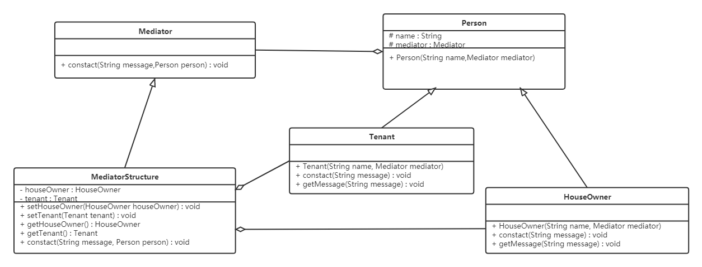

# 仲介者模式 (Mediator Pattern)

## 1 概述
- 一般來說，同事類之間的關係是比較複雜的，多個同事類之間互相關聯時，他們之間的關係會呈現為複雜的網狀結構，這是一種過度耦合的架構，即不利於類的複用，也不穩定。例如在下左圖中，有六個同事類對象，假如對象1發生變化，那麼將會有4個對象受到影響。如果對象2發生變化，那麼將會有5個對象受到影響。也就是說，同事類之間直接關聯的設計是不好的。

- 如果引入中介者模式，那麼同事類之間的關係將變為星型結構，從下右圖中可以看到，任何一個類的變動，只會影響的類本身，以及中介者，這樣就減小了系統的耦合。一個好的設計，必定不會把所有的對象關係處理邏輯封裝在本類中，而是使用一個專門的類來管理那些不屬於自己的行為。


- 定義：

  - 又叫調停模式，定義一個中介角色來封裝一系列對象之間的交互，使原有對象之間的耦合鬆散，且可以獨立地改變它們之間的交互。

## 2 結構
- 中介者模式包含以下主要角色：

  - 抽像中介者（Mediator）角色：它是中介者的接口，提供了同事對象註冊與轉發同事對象信息的抽象方法。
  - 具體中介者（ConcreteMediator）角色：實現中介者接口，定義一個List 來管理同事對象，協調各個同事角色之間的交互關係，因此它依賴於同事角色。
  - 抽象同事類（Colleague）角色：定義同事類的接口，保存中介者對象，提供同事對象交互的抽象方法，實現所有相互影響的同事類的公共功能。
  - 具體同事類（Concrete Colleague）角色：是抽象同事類的實現者，當需要與其他同事對象交互時，由中介者對象負責後續的交互。

 

## 3 案例實現
- 【例】租房

  - 現在租房基本都是通過房屋中介，房主將房屋託管給房屋中介，而租房者從房屋中介獲取房屋信息。房屋中介充當租房者與房屋所有者之間的中介者。



```java

//抽像中介者
public  abstract  class  Mediator {
    //申明一個聯絡方法
    public  abstract  void  constact ( String  message , Person  person );
}
​
//抽象同事類
public  abstract  class  Person {
    protected  String  name ;
    protected  Mediator  mediator ;
​
    public  Person ( String  name , Mediator  mediator ){
        this.name  =  name ;
        this.mediator  =  mediator ;
    }
}
​
//具體同事類房屋擁有者
public  class  HouseOwner  extends  Person {
​
    public  HouseOwner ( String  name , Mediator  mediator ) {
        super ( name , mediator );
    }
​
    //與中介者聯繫
    public  void  constact ( String  message ){
        mediator.constact ( message , this );
    }
​
    //獲取信息
    public  void  getMessage ( String  message ){
        System.out.println ( "房主"  +  name  + "獲取到的信息："  +  message );
    }
}
​
//具體同事類承租人
public  class  Tenant  extends  Person {
    public  Tenant ( String  name , Mediator  mediator ) {
        super ( name , mediator );
    }
​
    //與中介者聯繫
    public  void  constact ( String  message ){
        mediator.constact ( message , this );
    }
​
    //獲取信息
    public  void  getMessage ( String  message ){
        System.out.println ( "租房者"  +  name  + "獲取到的信息："  +  message );
    }
}
​
//中介機構
public  class  MediatorStructure  extends  Mediator {
    //首先中介結構必須知道所有房主和租房者的信息
    private  HouseOwner  houseOwner ;
    private  Tenant  tenant ;
​
    public  HouseOwner  getHouseOwner () {
        return  houseOwner ;
    }
​
    public  void  setHouseOwner ( HouseOwner  houseOwner ) {
        this.houseOwner  =  houseOwner ;
    }
​
    public  Tenant  getTenant () {
        return  tenant ;
    }
​
    public  void  setTenant ( Tenant  tenant ) {
        this.tenant  =  tenant ;
    }
​
    public  void  constact ( String  message , Person  person ) {
        if ( person  ==  houseOwner ) {           //如果是房主，則租房者獲得信息
            tenant.getMessage ( message );
        } else {        //反正則是房主獲得信息
            houseOwner.getMessage ( message );
        }
    }
}
​
//測試類
public  class  Client {
    public  static  void  main ( String [] args ) {
        //一個房主、一個租房者、一個中介機構
        MediatorStructure  mediator  =  new  MediatorStructure ();
​
        //房主和租房者只需要知道中介機構即可
        HouseOwner  houseOwner  =  new  HouseOwner ( "張三" , mediator );
        Tenant  tenant  =  new  Tenant ( "李四" , mediator );
​
        //中介結構要知道房主和租房者
        mediator.setHouseOwner ( houseOwner );
        mediator.setTenant ( tenant );
​
        tenant.constact ( "需要租三室的房子" );
        houseOwner.constact ( "我這有三室的房子，你需要租嗎？" );
    }
}
```

## 4 優缺點
- 1，優點：

  - 鬆散耦合

    - 中介者模式通過把多個同事對象之間的交互封裝到中介者對象裡面，從而使得同事對象之間鬆散耦合，基本上可以做到互補依賴。這樣一來，同事對象就可以獨立地變化和復用，而不再像以前那樣“牽一處而動全身”了。

  - 集中控制交互

    - 多個同事對象的交互，被封裝在中介者對象裡面集中管理，使得這些交互行為發生變化的時候，只需要修改中介者對象就可以了，當然如果是已經做好的系統，那麼就擴展中介者對象，而各個同事類不需要做修改。

  - 一對多關聯轉變為一對一的關聯

    - 沒有使用中介者模式的時候，同事對象之間的關係通常是一對多的，引入中介者對像以後，中介者對象和同事對象的關係通常變成雙向的一對一，這會讓對象的關係更容易理解和實現。

- 2，缺點：

  - 當同事類太多時，中介者的職責將很大，它會變得複雜而龐大，以至於系統難以維護。

 

## 5 使用場景
- 系統中對象之間存在復雜的引用關係，系統結構混亂且難以理解。
- 當想創建一個運行於多個類之間的對象，又不想生成新的子類時。


 


