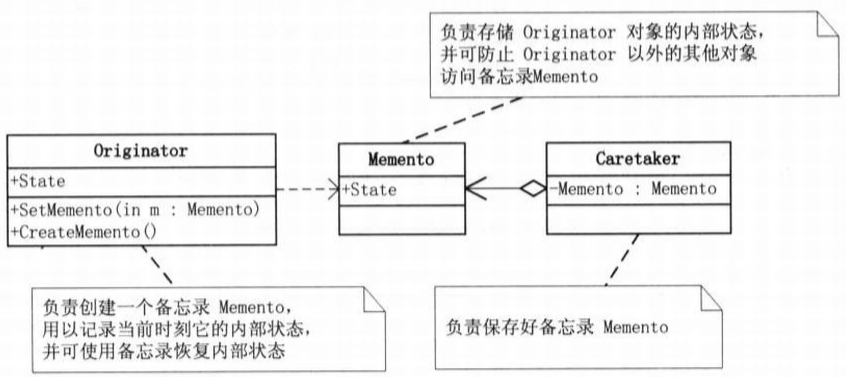

# 備忘錄模式 (Memoto Pattern)

## 1 概述
- 備忘錄模式提供了一種狀態恢復的實現機制，使得用戶可以方便地回到一個特定的歷史步驟，當新的狀態無效或者存在問題時，可以使用暫時存儲起來的備忘錄將狀態復原，很多軟件都提供了撤銷（Undo）操作，如Word、記事本、Photoshop、IDEA等軟件在編輯時按Ctrl+Z 組合鍵時能撤銷當前操作，使文檔恢復到之前的狀態；還有在瀏覽器中的後退鍵、數據庫事務管理中的回滾操作、玩遊戲時的中間結果存檔功能、數據庫與操作系統的備份操作、棋類游戲中的悔棋功能等都屬於這類。

- 定義：

  - 又叫快照模式，在不破壞封裝性的前提下，捕獲一個對象的內部狀態，並在該對象之外保存這個狀態，以便以後當需要時能將該對象恢復到原先保存的狀態。

## 2 結構
- 備忘錄模式的主要角色如下：

  - 發起人（Originator）角色：記錄當前時刻的內部狀態信息，提供創建備忘錄和恢復備忘錄數據的功能，實現其他業務功能，它可以訪問備忘錄裡的所有信息。
  - 備忘錄（Memento）角色：負責存儲發起人的內部狀態，在需要的時候提供這些內部狀態給發起人。
  - 管理者（Caretaker）角色：對備忘錄進行管理，提供保存與獲取備忘錄的功能，但其不能對備忘錄的內容進行訪問與修改。

- 備忘錄有兩個等效的接口：

  - 窄接口：管理者(Caretaker)對象（和其他發起人對象之外的任何對象）看到的是備忘錄的窄接口(narror Interface)，這個窄接口只允許他把備忘錄對像傳給其他的對象。
  - 寬接口：與管理者看到的窄接口相反，發起人對象可以看到一個寬接口(wide Interface)，這個寬接口允許它讀取所有的數據，以便根據這些數據恢復這個發起人對象的內部狀態。




## 3 案例實現
- 【例】遊戲挑戰BOSS

  - 遊戲中的某個場景，一遊戲角色有生命力、攻擊力、防禦力等數據，在打Boss前和後一定會不一樣的，我們允許玩家如果感覺與Boss決鬥的效果不理想可以讓遊戲恢復到決鬥之前的狀態。

  - 要實現上述案例，有兩種方式：

    - “白箱”備忘錄模式
    - “黑箱”備忘錄模式
 

### 1 “白箱”備忘錄模式
- 備忘錄角色對任何對像都提供一個接口，即寬接口，備忘錄角色的內部所存儲的狀態就對所有對象公開。類圖如下：


```java

 //遊戲角色類(屬於發起人腳角色)
public  class  GameRole {
    private  int  vit ;//生命力
    private  int  atk ;//攻擊力
    private  int  def ;//防禦力
​
    //初始化狀態
    public  void  initState () {
        this.vit  =  100 ;
        this.atk  =  100 ;
        this.def  =  100 ;
    }
​
    //戰鬥
    public  void  fight () {
        this.vit  =  0 ;
        this.atk  =  0 ;
        this.def  =  0 ;
    }
​
    //保存角色狀態
    public  RoleStateMemento  saveState () {
        return  new  RoleStateMemento ( vit , atk , def );
    }
​
    //回复角色狀態
    public  void  recoverState ( RoleStateMemento  roleStateMemento ) {
        this.vit  =  roleStateMemento.getVit ();
        this.atk  =  roleStateMemento.getAtk ();
        this.def  =  roleStateMemento.getDef ();
    }
​
    public  void  stateDisplay () {
        System.out.println ( "角色生命力："  +  vit );
        System.out.println ( "角色攻擊力："  +  atk );
        System.out.println ( "角色防禦力："  +  def );
    }
​
    public  int  getVit () {
        return  vit ;
    }
​
    public  void  setVit ( int  vit ) {
        this.vit  =  vit ;
    }
​
    public  int  getAtk () {
        return  atk ;
    }
​
    public  void  setAtk ( int  atk ) {
        this.atk  =  atk ;
    }
​
    public  int  getDef () {
        return  def ;
    }
​
    public  void  setDef ( int  def ) {
        this.def  =  def ;
    }
}
​
//遊戲狀態存儲類(備忘錄類)
public  class  RoleStateMemento {
    private  int  vit ;//生命力
    private  int  atk ;//攻擊力
    private  int  def ;//防禦力
​
    public  RoleStateMemento ( int  vit , int  atk , int  def ) {
        this.vit  =  vit ;
        this.atk  =  atk ;
        this.def  =  def ;
    }
​
    public  int  getVit () {
        return  vit ;
    }
​
    public  void  setVit ( int  vit ) {
        this.vit  =  vit ;
    }
​
    public  int  getAtk () {
        return  atk ;
    }
​
    public  void  setAtk ( int  atk ) {
        this.atk  =  atk ;
    }
​
    public  int  getDef () {
        return  def ;
    }
​
    public  void  setDef ( int  def ) {
        this.def  =  def ;
    }
}
​
//角色狀態管理者類
public  class  RoleStateCaretaker {
    private  RoleStateMemento  roleStateMemento ;
​
    public  RoleStateMemento  getRoleStateMemento () {
        return  roleStateMemento ;
    }
​
    public  void  setRoleStateMemento ( RoleStateMemento  roleStateMemento ) {
        this.roleStateMemento  =  roleStateMemento ;
    }
}
​
//測試類
public  class  Client {
    public  static  void  main ( String [] args ) {
        System.out.println ( "------------大戰Boss前------------" );
        //大戰Boss前
        GameRole  gameRole  =  new  GameRole ();
        gameRole.initState ();
        gameRole.stateDisplay ();
​
        //保存進度
        RoleStateCaretaker  roleStateCaretaker  =  new  RoleStateCaretaker ();
        roleStateCaretaker.setRoleStateMemento ( gameRole.saveState ());
​
        System.out.println ( "------------大戰Boss後------------" );
        //大戰Boss時，損耗嚴重
        gameRole.fight ();
        gameRole.stateDisplay ();
        System.out.println ( "------------恢復之前狀態------------" );
        //恢復之前狀態
        gameRole.recoverState ( roleStateCaretaker.getRoleStateMemento ());
        gameRole.stateDisplay ();
​
    }
}
```

- 分析：白箱備忘錄模式是破壞封裝性的。但是通過程序員自律，同樣可以在一定程度上實現模式的大部分用意。

### 2 “黑箱”備忘錄模式
- 備忘錄角色對發起人對象提供一個寬接口，而為其他對象提供一個窄接口。在Java語言中，實現雙重接口的辦法就是將備忘錄類設計成發起人類的內部成員類。

- 將 RoleStateMemento 設為 GameRole 的內部類，從而將 RoleStateMemento 對象封裝在 GameRole 裡面；在外面提供一個標識接口 Memento 給 RoleStateCaretaker 及其他對象使用。這樣 GameRole 類看到的是 RoleStateMemento 所有的接口，而RoleStateCaretaker 及其他對像看到的僅僅是標識接口 Memento 所暴露出來的接口，從而維護了封裝型。類圖如下：


窄接口Memento，這是一個標識接口，因此沒有定義出任何的方法
```java
public  interface  Memento {
}
```

定義發起人類GameRole，並在內部定義備忘錄內部類RoleStateMemento（該內部類設置為私有的）
```java
//遊戲角色類
public  class  GameRole {
    private  int  vit ; //生命力
    private  int  atk ; //攻擊力
    private  int  def ; //防禦力
​
    //初始化狀態
    public  void  initState () {
        this.vit  =  100 ;
        this.atk  =  100 ;
        this.def  =  100 ;
    }
​
    //戰鬥
    public  void  fight () {
        this.vit  =  0 ;
        this.atk  =  0 ;
        this.def  =  0 ;
    }
​
    //保存角色狀態
    public  Memento  saveState () {
        return  new  RoleStateMemento ( vit , atk , def );
    }
​
    //回复角色狀態
    public  void  recoverState ( Memento  memento ) {
        RoleStateMemento  roleStateMemento  = ( RoleStateMemento ) memento ;
        this.vit  =  roleStateMemento.getVit ();
        this.atk  =  roleStateMemento.getAtk ();
        this.def  =  roleStateMemento.getDef ();
    }
​
    public  void  stateDisplay () {
        System.out.println ( "角色生命力："  +  vit );
        System.out.println ( "角色攻擊力："  +  atk );
        System.out.println ( "角色防禦力："  +  def );
​
    }
​
    public  int  getVit () {
        return  vit ;
    }
​
    public  void  setVit ( int  vit ) {
        this.vit  =  vit ;
    }
​
    public  int  getAtk () {
        return  atk ;
    }
​
    public  void  setAtk ( int  atk ) {
        this.atk  =  atk ;
    }
​
    public  int  getDef () {
        return  def ;
    }
​
    public  void  setDef ( int  def ) {
        this.def  =  def ;
    }
​
    private  class  RoleStateMemento  implements  Memento {
        private  int  vit ;
        private  int  atk ;
        private  int  def ;
​
        public  RoleStateMemento ( int  vit , int  atk , int  def ) {
            this.vit  =  vit ;
            this.atk  =  atk ;
            this.def  =  def ;
        }
​
        public  int  getVit () {
            return  vit ;
        }
​
        public  void  setVit ( int  vit ) {
            this.vit  =  vit ;
        }
​
        public  int  getAtk () {
            return  atk ;
        }
​
        public  void  setAtk ( int  atk ) {
            this.atk  =  atk ;
        }
​
        public  int  getDef () {
            return  def ;
        }
​
        public  void  setDef ( int  def ) {
            this.def  =  def ;
        }
    }
}
```

負責人角色類 RoleStateCaretaker 能夠得到的備忘錄對像是以 Memento 為接口的，由於這個接口僅僅是一個標識接口，因此負責人角色不可能改變這個備忘錄對象的內容
```java
//角色狀態管理者類
public  class  RoleStateCaretaker {
    private  Memento  memento ;
​
    public  Memento  getMemento () {
        return  memento ;
    }
​
    public  void  setMemento ( Memento  memento ) {
        this.memento  =  memento ;
    }
}
```

客戶端測試類
```java
public  class  Client {
    public  static  void  main ( String [] args ) {
        System.out.println ( "------------大戰Boss前------------" );
        //大戰Boss前
        GameRole  gameRole  =  new  GameRole ();
        gameRole.initState ();
        gameRole.stateDisplay ();
​
        //保存進度
        RoleStateCaretaker  roleStateCaretaker  =  new  RoleStateCaretaker ();
        roleStateCaretaker.setMemento ( gameRole.saveState ());
        
        System.out.println ( "------------大戰Boss後------------" );
        //大戰Boss時，損耗嚴重
        gameRole.fight ();
        gameRole.stateDisplay ();
        System.out.println ( "------------恢復之前狀態------------" );
        //恢復之前狀態
        gameRole.recoverState ( roleStateCaretaker.getMemento ());
        gameRole.stateDisplay ();
    }
}
```

## 4 優缺點
- 1，優點：

  - 提供了一種可以恢復狀態的機制。當用戶需要時能夠比較方便地將數據恢復到某個歷史的狀態。
  - 實現了內部狀態的封裝。除了創建它的發起人之外，其他對像都不能夠訪問這些狀態信息。
  - 簡化了發起人類。發起人不需要管理和保存其內部狀態的各個備份，所有狀態信息都保存在備忘錄中，並由管理者進行管理，這符合單一職責原則。
- 2，缺點：

  - 資源消耗大。如果要保存的內部狀態信息過多或者特別頻繁，將會佔用比較大的內存資源。
 

## 5 使用場景
- 需要保存與恢復數據的場景，如玩遊戲時的中間結果的存檔功能。
- 需要提供一個可回滾操作的場景，如Word、記事本、Photoshop，idea等軟件在編輯時按Ctrl+Z 組合鍵，還有數據庫中事務操作。
 
