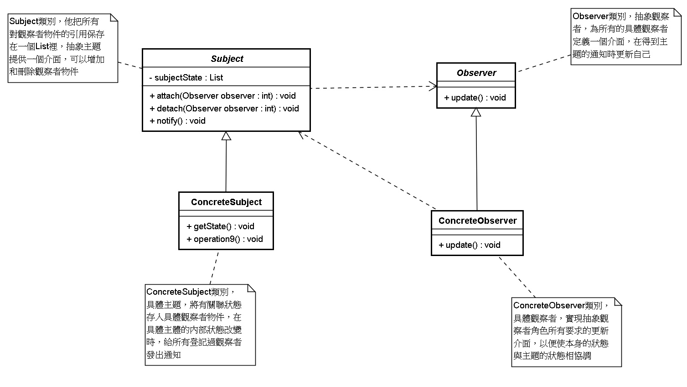

# 觀察者模式 (Observer Pattern)

## 1 概述
- 定義：

  - 又被稱為發布-訂閱（Publish/Subscribe）模式，它定義了一種一對多的依賴關係，讓多個觀察者對象同時監聽某一個主題對象。這個主題對像在狀態變化時，會通知所有的觀察者對象，使他們能夠自動更新自己。

## 2 結構
- 在觀察者模式中有如下角色：

  - Subject：抽象主題（抽像被觀察者），抽象主題角色把所有觀察者對象保存在一個集合裡，每個主題都可以有任意數量的觀察者，抽象主題提供一個接口，可以增加和刪除觀察者對象。
  - ConcreteSubject：具體主題（具體被觀察者），該角色將有關狀態存入具體觀察者對象，在具體主題的內部狀態發生改變時，給所有註冊過的觀察者發送通知。
  - Observer：抽象觀察者，是觀察者的抽像類，它定義了一個更新接口，使得在得到主題更改通知時更新自己。
  - ConcrereObserver：具體觀察者，實現抽象觀察者定義的更新接口，以便在得到主題更改通知時更新自身的狀態。



## 3 案例實現
- 【例】微信公眾號

- 在使用微信公眾號時，大家都會有這樣的體驗，當你關注的公眾號中有新內容更新的話，它就會推送給關注公眾號的微信用戶端。我們使用觀察者模式來模擬這樣的場景，微信用戶就是觀察者，微信公眾號是被觀察者，有多個的微信用戶關注了程序猿這個公眾號。


定義抽象觀察者類，裡面定義一個更新的方法

```java

public  interface  Observer {
    void  update ( String  message );
}
```

定義具體觀察者類，微信用戶是觀察者，裡面實現了更新的方法
```java

public  class  WeixinUser  implements  Observer {
    // 微信用戶名
    private  String  name ;
​
    public  WeixinUser ( String  name ) {
        this.name  =  name ;
    }
    @Override
    public  void  update ( String  message ) {
        System.out.println ( name  +  "-"  +  message );
    }
}
```

定義抽象主題類，提供了attach、detach、notify三個方法

```java
public  interface  Subject {
    //增加訂閱者
    public  void  attach ( Observer  observer );
​
    //刪除訂閱者
    public  void  detach ( Observer  observer );
    
    //通知訂閱者更新消息
    public  void  notify ( String  message );
}
```

微信公眾號是具體主題（具體被觀察者），裡面存儲了訂閱該公眾號的微信用戶，並實現了抽象主題中的方法

```java

public  class  SubscriptionSubject  implements  Subject {
    //儲存訂閱公眾號的微信用戶
    private  List < Observer >  weixinUserlist  =  new  ArrayList < Observer > ();
​
    @Override
    public  void  attach ( Observer  observer ) {
        weixinUserlist.add ( observer );
    }
​
    @Override
    public  void  detach ( Observer  observer ) {
        weixinUserlist.remove ( observer );
    }
​
    @Override
    public  void  notify ( String  message ) {
        for ( Observer  observer : weixinUserlist ) {
            observer.update ( message );
        }
    }
}
```

客戶端程序

```java
public  class  Client {
    public  static  void  main ( String [] args ) {
        SubscriptionSubject  mSubscriptionSubject = new  SubscriptionSubject ();
        //創建微信用戶
        WeixinUser  user1 = new  WeixinUser ( "孫悟空" );
        WeixinUser  user2 = new  WeixinUser ( "豬悟能" );
        WeixinUser  user3 = new  WeixinUser ( "沙悟淨" );
        //訂閱公眾號
        mSubscriptionSubject.attach ( user1 );
        mSubscriptionSubject.attach ( user2 );
        mSubscriptionSubject.attach ( user3 );
        //公眾號更新發出消息給訂閱的微信用戶
        mSubscriptionSubject.notify ( "傳智黑馬的專欄更新了" );
    }
}
```

## 4 優缺點
- 1，優點：

  - 降低了目標與觀察者之間的耦合關係，兩者之間是抽象耦合關係。
  - 被觀察者發送通知，所有註冊的觀察者都會收到信息【可以實現廣播機制】
- 2，缺點：

  - 如果觀察者非常多的話，那麼所有的觀察者收到被觀察者發送的通知會耗時
  - 如果被觀察者有循環依賴的話，那麼被觀察者發送通知會使觀察者循環調用，會導致系統崩潰
 

## 5 使用場景
  - 對象間存在一對多關係，一個對象的狀態發生改變會影響其他對象。
  - 當一個抽像模型有兩個方面，其中一個方面依賴於另一方面時。

## 6 JDK中提供的實現
- 在Java 中，通過java.util.Observable 類和java.util.Observer 接口定義了觀察者模式，只要實現它們的子類就可以編寫觀察者模式實例。

- 1，Observable類

  - Observable 類是抽象目標類（被觀察者），它有一個Vector 集合成員變量，用於保存所有要通知的觀察者對象，下面來介紹它最重要的3 個方法。

    - void addObserver(Observer o) 方法：用於將新的觀察者對象添加到集合中。
    - void notifyObservers(Object arg) 方法：調用集合中的所有觀察者對象的update方法，通知它們數據發生改變。通常越晚加入集合的觀察者越先得到通知。
    - void setChange() 方法：用來設置一個boolean 類型的內部標誌，註明目標對象發生了變化。當它為true時，notifyObservers() 才會通知觀察者。
- 2，Observer 接口

  - Observer 接口是抽象觀察者，它監視目標對象的變化，當目標對象發生變化時，觀察者得到通知，並調用update 方法，進行相應的工作。

-  【例】警察抓小偷

警察抓小偷也可以使用觀察者模式來實現，警察是觀察者，小偷是被觀察者。代碼如下：

小偷是一個被觀察者，所以需要繼承Observable類

```java
public  class  Thief  extends  Observable {
​
    private  String  name ;
​
    public  Thief ( String  name ) {
        this.name  =  name ;
    }
    
    public  void  setName ( String  name ) {
        this.name  =  name ;
    }
​
    public  String  getName () {
        return  name ;
    }
​
    public  void  steal () {
        System.out.println ( "小偷：我偷東西了，有沒有人來抓我！！！" );
        super.setChanged (); //changed = true
        super.notifyObservers ();
    }
}
​
```

警察是一個觀察者，所以需要讓其實現Observer接口

```java

public  class  Policemen  implements  Observer {
​
    private  String  name ;
​
    public  Policemen ( String  name ) {
        this.name  =  name ;
    }
    public  void  setName ( String  name ) {
        this.name  =  name ;
    }
​
    public  String  getName () {
        return  name ;
    }
​
    @Override
    public  void  update ( Observable  o , Object  arg ) {
        System.out.println ( "警察："  + (( Thief ) o ). getName () +  "，我已經盯你很久了，你可以保持沉默，但你所說的將成為呈堂證供！！！" );
    }
}
```
客戶端代碼
```java
public  class  Client {
    public  static  void  main ( String [] args ) {
        //創建小偷對象
        Thief  t  =  new  Thief ( "隔壁老王" );
        //創建警察對象
        Policemen  p  =  new  Policemen ( "小李" );
        //讓警察盯著小偷
        t.addObserver ( p );
        //小偷偷東西
        t.steal ();
    }
}
```