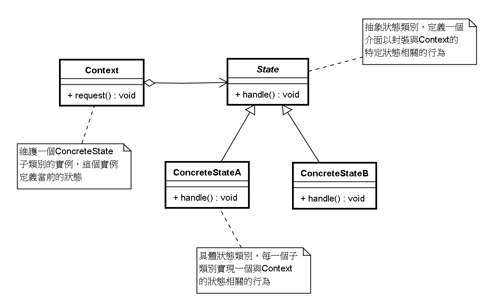

# 狀態模式 (State Pattern)

## 1 概述
- 【例】通過按鈕來控制一個電梯的狀態，一個電梯有開門狀態，關門狀態，停止狀態，運行狀態。每一種狀態改變，都有可能要根據其他狀態來更新處理。例如，如果電梯門現在處於運行時狀態，就不能進行開門操作，而如果電梯門是停止狀態，就可以執行開門操作。


```java
public  interface  ILift {
    //電梯的4個狀態
    //開門狀態
    public  final  static  int  OPENING_STATE  =  1 ;
    //關門狀態
    public  final  static  int  CLOSING_STATE  =  2 ;
    //運行狀態
    public  final  static  int  RUNNING_STATE  =  3 ;
    //停止狀態
    public  final  static  int  STOPPING_STATE  =  4 ;
​
    //設置電梯的狀態
    public  void  setState ( int  state );
​
    //電梯的動作
    public  void  open ();
    public  void  close ();
    public  void  run ();
    public  void  stop ();
}
​
public  class  Lift  implements  ILift {
    private  int  state ;
​
    @Override
    public  void  setState ( int  state ) {
        this . state  =  state ;
    }
​
    //執行關門動作
    @Override
    public  void  close () {
        switch ( this . state ) {
            case  OPENING_STATE :
                System . out . println ( "電梯關門了。。。" ); //只有開門狀態可以關閉電梯門，可以對應電梯狀態表來看
                this . setState ( CLOSING_STATE ); //關門之後電梯就是關閉狀態了
                break ;
            case  CLOSING_STATE :
                //do nothing //已經是關門狀態，不能關門
                break ;
            case  RUNNING_STATE :
                //do nothing //運行時電梯門是關著的，不能關門
                break ;
            case  STOPPING_STATE :
                //do nothing //停止時電梯也是關著的，不能關門
                break ;
        }
    }
​
    //執行開門動作
    @Override
    public  void  open () {
        switch ( this . state ) {
            case  OPENING_STATE : //門已經開了，不能再開門了
                //do nothing
                break ;
            case  CLOSING_STATE : //關門狀態，門打開:
                System . out . println ( "電梯門打開了。。。" );
                this . setState ( OPENING_STATE );
                break ;
            case  RUNNING_STATE :
                //do nothing 運行時電梯不能開門
                break ;
            case  STOPPING_STATE :
                System . out . println ( "電梯門開了。。。" ); //電梯停了，可以開門了
                this . setState ( OPENING_STATE );
                break ;
        }
    }
​
    //執行運行動作
    @Override
    public  void  run () {
        switch ( this . state ) {
            case  OPENING_STATE : //電梯不能開著門就走
                //do nothing
                break ;
            case  CLOSING_STATE : //門關了，可以運行了
                System . out . println ( "電梯開始運行了。。。" );
                this . setState ( RUNNING_STATE ); //現在是運行狀態
                break ;
            case  RUNNING_STATE :
                //do nothing 已經是運行狀態了
                break ;
            case  STOPPING_STATE :
                System . out . println ( "電梯開始運行了。。。" );
                this . setState ( RUNNING_STATE );
                break ;
        }
    }
​
    //執行停止動作
    @Override
    public  void  stop () {
        switch ( this . state ) {
            case  OPENING_STATE : //開門的電梯已經是是停止的了(正常情況下)
                //do nothing
                break ;
            case  CLOSING_STATE : //關門時才可以停止
                System . out . println ( "電梯停止了。。。" );
                this . setState ( STOPPING_STATE );
                break ;
            case  RUNNING_STATE : //運行時當然可以停止了
                System . out . println ( "電梯停止了。。。" );
                this . setState ( STOPPING_STATE );
                break ;
            case  STOPPING_STATE :
                //do nothing
                break ;
        }
    }
}
​
public  class  Client {
    public  static  void  main ( String [] args ) {
        Lift  lift  =  new  Lift ();
        lift . setState ( ILift . STOPPING_STATE ); //電梯是停止的
        lift . open (); //開門
        lift . close (); //關門
        lift . run (); //運行
        lift . stop (); //停止
    }
}
```

- 問題分析：

  - 使用了大量的switch…case這樣的判斷（if…else也是一樣)，使程序的可閱讀性變差。
  - 擴展性很差。如果新加了斷電的狀態，我們需要修改上面判斷邏輯
 

- 定義：

  - 對有狀態的對象，把複雜的“判斷邏輯”提取到不同的狀態對像中，允許狀態對像在其內部狀態發生改變時改變其行為。

## 2 結構
- 狀態模式包含以下主要角色。

  - 環境（Context）角色：也稱為上下文，它定義了客戶程序需要的接口，維護一個當前狀態，並將與狀態相關的操作委託給當前狀態對象來處理。
  - 抽象狀態（State）角色：定義一個接口，用以封裝環境對像中的特定狀態所對應的行為。
  - 具體狀態（Concrete State）角色：實現抽象狀態所對應的行為。



## 3 案例實現
- 對上述電梯的案例使用狀態模式進行改進。類圖如下：


```java
//抽象狀態類
public  abstract  class  LiftState {
    //定義一個環境角色，也就是封裝狀態的變化引起的功能變化
    protected  Context  context ;
​
    public  void  setContext ( Context  context ) {
        this . context  =  context ;
    }
​
    //電梯開門動作
    public  abstract  void  open ();
​
    //電梯關門動作
    public  abstract  void  close ();
​
    //電梯運行動作
    public  abstract  void  run ();
​
    //電梯停止動作
    public  abstract  void  stop ();
}
​
//開啟狀態
public  class  OpenningState  extends  LiftState {
​
    //開啟當然可以關閉了，我就想測試一下電梯門開關功能
    @Override
    public  void  open () {
        System . out . println ( "電梯門開啟..." );
    }
​
    @Override
    public  void  close () {
        //狀態修改
        super . context . setLiftState ( Context . closeingState );
        //動作委託為CloseState來執行，也就是委託給了ClosingState子類執行這個動作
        super . context . getLiftState (). close ();
    }
​
    //電梯門不能開著就跑，這裡什麼也不做
    @Override
    public  void  run () {
        //do nothing
    }
​
    //開門狀態已經是停止的了
    @Override
    public  void  stop () {
        //do nothing
    }
}
​
//運行狀態
public  class  RunningState  extends  LiftState {
​
    //運行的時候開電梯門？你瘋了！電梯不會給你開的
    @Override
    public  void  open () {
        //do nothing
    }
​
    //電梯門關閉？這是肯定了
    @Override
    public  void  close () { //雖然可以關門，但這個動作不歸我執行
        //do nothing
    }
​
    //這是在運行狀態下要實現的方法
    @Override
    public  void  run () {
        System . out . println ( "電梯正在運行..." );
    }
​
    //這個事絕對是合理的，光運行不停止還有誰敢做這個電梯？！估計只有上帝了
    @Override
    public  void  stop () {
        super . context . setLiftState ( Context . stoppingState );
        super . context . stop ();
    }
}
​
//停止狀態
public  class  StoppingState  extends  LiftState {
​
    //停止狀態，開門，那是要的！
    @Override
    public  void  open () {
        //狀態修改
        super . context . setLiftState ( Context . openningState );
        //動作委託為CloseState來執行，也就是委託給了ClosingState子類執行這個動作
        super . context . getLiftState (). open ();
    }
​
    @Override
    public  void  close () { //雖然可以關門，但這個動作不歸我執行
        //狀態修改
        super . context . setLiftState ( Context . closeingState );
        //動作委託為CloseState來執行，也就是委託給了ClosingState子類執行這個動作
        super . context . getLiftState (). close ();
    }
​
    //停止狀態再跑起來，正常的很
    @Override
    public  void  run () {
        //狀態修改
        super . context . setLiftState ( Context . runningState );
        //動作委託為CloseState來執行，也就是委託給了ClosingState子類執行這個動作
        super . context . getLiftState (). run ();
    }
​
    //停止狀態是怎麼發生的呢？當然是停止方法執行了
    @Override
    public  void  stop () {
        System . out . println ( "電梯停止了..." );
    }
}
​
//關閉狀態
public  class  ClosingState  extends  LiftState {
​
    @Override
    //電梯門關閉，這是關閉狀態要實現的動作
    public  void  close () {
        System . out . println ( "電梯門關閉..." );
    }
​
    //電梯門關了再打開，逗你玩呢，那這個允許呀
    @Override
    public  void  open () {
        super . context . setLiftState ( Context . openningState );
        super . context . open ();
    }
​
​
    //電梯門關了就跑，這是再正常不過了
    @Override
    public  void  run () {
        super . context . setLiftState ( Context . runningState );
        super . context . run ();
    }
​
    //電梯門關著，我就不按樓層
    @Override
    public  void  stop () {
        super . context . setLiftState ( Context . stoppingState );
        super . context . stop ();
    }
}
​
//環境角色
public  class  Context {
    //定義出所有的電梯狀態
    public  final  static  OpenningState  openningState  =  new  OpenningState (); //開門狀態，這時候電梯只能關閉
    public  final  static  ClosingState  closeingState  =  new  ClosingState (); //關閉狀態，這時候電梯可以運行、停止和開門
    public  final  static  RunningState  runningState  =  new  RunningState (); //運行狀態，這時候電梯只能停止
    public  final  static  StoppingState  stoppingState  =  new  StoppingState (); //停止狀態，這時候電梯可以開門、運行
​
​
    //定義一個當前電梯狀態
    private  LiftState  liftState ;
​
    public  LiftState  getLiftState () {
        return  this . liftState ;
    }
​
    public  void  setLiftState ( LiftState  liftState ) {
        //當前環境改變
        this . liftState  =  liftState ;
        //把當前的環境通知到各個實現類中
        this . liftState . setContext ( this );
    }
​
    public  void  open () {
        this . liftState . open ();
    }
​
    public  void  close () {
        this . liftState . close ();
    }
​
    public  void  run () {
        this . liftState . run ();
    }
​
    public  void  stop () {
        this . liftState . stop ();
    }
}
​
//測試類
public  class  Client {
    public  static  void  main ( String [] args ) {
        Context  context  =  new  Context ();
        context . setLiftState ( new  ClosingState ());
​
        context . open ();
        context . close ();
        context . run ();
        context . stop ();
    }
}
```


## 4 優缺點
- 1，優點：

  - 將所有與某個狀態有關的行為放到一個類中，並且可以方便地增加新的狀態，只需要改變對象狀態即可改變對象的行為。
  - 允許狀態轉換邏輯與狀態對象合成一體，而不是某一個巨大的條件語句塊。
- 2，缺點：

  - 狀態模式的使用必然會增加系統類和對象的個數。
  - 狀態模式的結構與實現都較為複雜，如果使用不當將導致程序結構和代碼的混亂。
  - 狀態模式對"開閉原則"的支持並不太好。
 

## 5 使用場景
- 當一個對象的行為取決於它的狀態，並且它必須在運行時根據狀態改變它的行為時，就可以考慮使用狀態模式。
- 一個操作中含有龐大的分支結構，並且這些分支決定於對象的狀態時。
 