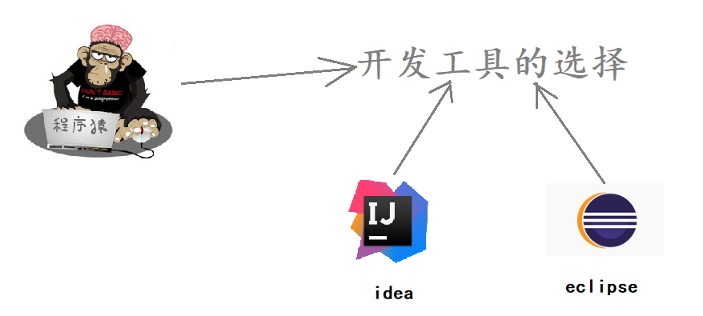

# 策略模式 (Strategy Pattern)

## 1 概述

先看下面的圖片，我們去旅遊選擇出行模式有很多種，可以騎自行車、可以坐汽車、可以坐火車、可以坐飛機。


作為一個程序猿，開發需要選擇一款開發工具，當然可以進行代碼開發的工具有很多，可以選擇Idea進行開發，也可以使用eclipse進行開發，也可以使用其他的一些開發工具。



- 定義：

  - 該模式定義了一系列算法，並將每個算法封裝起來，使它們可以相互替換，且算法的變化不會影響使用算法的客戶。策略模式屬於對象行為模式，它通過對算法進行封裝，把使用算法的責任和算法的實現分割開來，並委派給不同的對像對這些算法進行管理。


## 2 結構
- 策略模式的主要角色如下：

  - 抽象策略（Strategy）類：這是一個抽象角色，通常由一個接口或抽像類實現。此角色給出所有的具體策略類所需的接口。
  - 具體策略（Concrete Strategy）類：實現了抽象策略定義的接口，提供具體的算法實現或行為。
  - 環境（Context）類：持有一個策略類的引用，最終給客戶端調用。


## 3 案例實現
- 【例】促銷活動

  - 一家百貨公司在定年度的促銷活動。針對不同的節日（春節、中秋節、聖誕節）推出不同的促銷活動，由促銷員將促銷活動展示給客戶。類圖如下：


定義百貨公司所有促銷活動的共同接口:
```java
public  interface  Strategy {
    void  show ();
}
```

定義具體策略角色（Concrete Strategy）：每個節日具體的促銷活動
```java
//為春節準備的促銷活動A
public  class  StrategyA  implements  Strategy {
​
    public  void  show () {
        System . out . println ( "買一送一" );
    }
}
​
//為中秋準備的促銷活動B
public  class  StrategyB  implements  Strategy {
​
    public  void  show () {
        System . out . println ( "滿200元減50元" );
    }
}
​
//為聖誕準備的促銷活動C
public  class  StrategyC  implements  Strategy {
​
    public  void  show () {
        System . out . println ( "滿1000元加一元換購任意200元以下商品" );
    }
}
```

定義環境角色（Context）：用於連接上下文，即把促銷活動推銷給客戶，這裡可以理解為銷售員
```java
public  class  SalesMan {                        
    //持有抽象策略角色的引用                              
    private  Strategy  strategy ;                 
                                               
    public  SalesMan ( Strategy  strategy ) {       
        this . strategy  =  strategy ;              
    }                                          
                                               
    //向客戶展示促銷活動                                
    public  void  salesManShow (){                
        strategy . show ();                       
    }                                          
}         
```


## 4 優缺點
- 1，優點：

  - 策略類之間可以自由切換

  - 由於策略類都實現同一個接口，所以使它們之間可以自由切換。

  - 易於擴展

    - 增加一個新的策略只需要添加一個具體的策略類即可，基本不需要改變原有的代碼，符合“開閉原則“

  - 避免使用多重條件選擇語句（if else），充分體現面向對象設計思想。

- 2，缺點：

  - 客戶端必須知道所有的策略類，並自行決定使用哪一個策略類。
  - 策略模式將造成產生很多策略類，可以通過使用享元模式在一定程度上減少對象的數量。
 

## 5 使用場景
- 一個系統需要動態地在幾種算法中選擇一種時，可將每個算法封裝到策略類中。
- 一個類定義了多種行為，並且這些行為在這個類的操作中以多個條件語句的形式出現，可將每個條件分支移入它們各自的策略類中以代替這些條件語句。
- 系統中各算法彼此完全獨立，且要求對客戶隱藏具體算法的實現細節時。
- 系統要求使用算法的客戶不應該知道其操作的數據時，可使用策略模式來隱藏與算法相關的數據結構。
- 多個類只區別在表現行為不同，可以使用策略模式，在運行時動態選擇具體要執行的行為。

## 6 JDK源碼解析
- Comparator中的策略模式。在Arrays類中有一個 sort() 方法，如下：

```java
public  class  Arrays {
    public  static  < T >  void  sort ( T [] a , Comparator <?  super  T >  c ) {
        if ( c  ==  null ) {
            sort ( a );
        } else {
            if ( LegacyMergeSort . userRequested )
                legacyMergeSort ( a , c );
            else
                TimSort . sort ( a , 0 , a . length , c , null , 0 , 0 );
        }
    }
}
```
- Arrays就是一個環境角色類，這個sort方法可以傳一個新策略讓Arrays根據這個策略來進行排序。就比如下面的測試類。

```java

public  class  demo {
    public  static  void  main ( String [] args ) {
​
        Integer [] data  = { 12 , 2 , 3 , 2 , 4 , 5 , 1 };
        // 實現降序排序
        Arrays . sort ( data , new  Comparator < Integer > () {
            public  int  compare ( Integer  o1 , Integer  o2 ) {
                return  o2  -  o1 ;
            }
        });
        System . out . println ( Arrays . toString ( data )); //[12, 5, 4, 3, 2, 2, 1]
    }
}
```

- 這裡我們在調用Arrays的sort方法時，第二個參數傳遞的是Comparator接口的子實現類對象。所以Comparator充當的是抽象策略角色，而具體的子實現類充當的是具體策略角色。環境角色類（Arrays）應該持有抽象策略的引用來調用。那麼，Arrays類的sort方法到底有沒有使用Comparator子實現類中的 compare() 方法嗎？讓我們繼續查看TimSort類的 sort() 方法，代碼如下：

```java
class  TimSort < T > {
    static  < T >  void  sort ( T [] a , int  lo , int  hi , Comparator <?  super  T >  c ,
                         T [] work , int  workBase , int  workLen ) {
        assert  c  !=  null  &&  a  !=  null  &&  lo  >=  0  &&  lo  <=  hi  &&  hi  <=  a . length ;
​
        int  nRemaining   =  hi  -  lo ;
        if ( nRemaining  <  2 )
            return ;   // Arrays of size 0 and 1 are always sorted
​
        // If array is small, do a "mini-TimSort" with no merges
        if ( nRemaining  <  MIN_MERGE ) {
            int  initRunLen  =  countRunAndMakeAscending ( a , lo , hi , c );
            binarySort ( a , lo , hi , lo  +  initRunLen , c );
            return ;
        }
        ...
    }   
        
    private  static  < T >  int  countRunAndMakeAscending ( T [] a , int  lo , int  hi , Comparator <?  super  T >  c ) {
        assert  lo  <  hi ;
        int  runHi  =  lo  +  1 ;
        if ( runHi  ==  hi )
            return  1 ;
​
        // Find end of run, and reverse range if descending
        if ( c . compare ( a [ runHi ++ ], a [ lo ]) <  0 ) { // Descending
            while ( runHi  <  hi  &&  c . compare ( a [ runHi ], a [ runHi  -  1 ]) <  0 )
                runHi ++ ;
            reverseRange ( a , lo , runHi );
        } else {                               // Ascending
            while ( runHi  <  hi  &&  c . compare ( a [ runHi ], a [ runHi  -  1 ]) >=  0 )
                runHi ++ ;
        }
​
        return  runHi  -  lo ;
    }
}
```

- 上面的代碼中最終會跑到 countRunAndMakeAscending() 這個方法中。我們可以看見，只用了compare方法，所以在調用Arrays.sort方法只傳具體compare重寫方法的類對象就行，這也是Comparator接口中必須要子類實現的一個方法。
