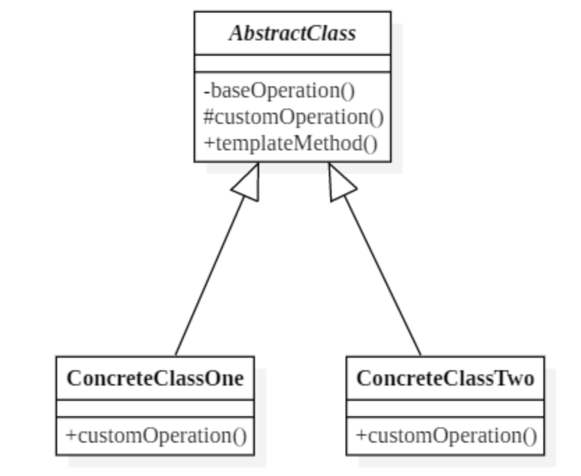
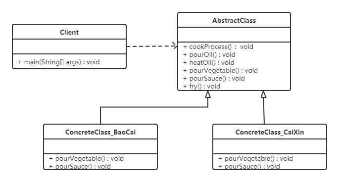

# 模板方法模式 (Template Method Pattern)

## 1 概述
- 在面向對象程序設計過程中，程序員常常會遇到這種情況：設計一個系統時知道了算法所需的關鍵步驟，而且確定了這些步驟的執行順序，但某些步驟的具體實現還未知，或者說某些步驟的實現與具體的環境相關。

  - 例如，去銀行辦理業務一般要經過以下4個流程：取號、排隊、辦理具體業務、對銀行工作人員進行評分等，其中取號、排隊和對銀行工作人員進行評分的業務對每個客戶是一樣的，可以在父類中實現，但是辦理具體業務卻因人而異，它可能是存款、取款或者轉賬等，可以延遲到子類中實現。

- 定義：

  - 定義一個操作中的算法骨架，而將算法的一些步驟延遲到子類中，使得子類可以不改變該算法結構的情況下重定義該算法的某些特定步驟。

## 2 結構
- 模板方法（Template Method）模式包含以下主要角色：

  - 抽像類（Abstract Class）：負責給出一個算法的輪廓和骨架。它由一個模板方法和若干個基本方法構成。

    - 模板方法：定義了算法的骨架，按某種順序調用其包含的基本方法。

    - 基本方法：是實現算法各個步驟的方法，是模板方法的組成部分。基本方法又可以分為三種：

      - 抽象方法(Abstract Method) ：一個抽象方法由抽像類聲明、由其具體子類實現。

      - 具體方法(Concrete Method) ：一個具體方法由一個抽像類或具體類聲明並實現，其子類可以進行覆蓋也可以直接繼承。

      - 鉤子方法(Hook Method) ：在抽像類中已經實現，包括用於判斷的邏輯方法和需要子類重寫的空方法兩種。一般鉤子方法是用於判斷的邏輯方法，這類方法名一般為isXxx，返回值類型為boolean類型。

  - 具體子類（Concrete Class）：實現抽像類中所定義的抽象方法和鉤子方法，它們是一個頂級邏輯的組成步驟。



## 3 案例實現
- 【例】炒菜

  - 炒菜的步驟是固定的，分為倒油、熱油、倒蔬菜、倒調料品、翻炒等步驟。現通過模板方法模式來用代碼模擬。類圖如下：



```java
public  abstract  class  AbstractClass {
    
    public  final  void  cookProcess () {
        //第一步：倒油
        this.pourOil ();
        //第二步：熱油
        this.heatOil ();
        //第三步：倒蔬菜
        this.pourVegetable ();
        //第四步：倒調味料
        this.pourSauce ();
        //第五步：翻炒
        this.fry ();
    }
​
    public  void  pourOil () {
        System.out.println ( "倒油" );
    }
​
    //第二步：熱油是一樣的，所以直接實現
    public  void  heatOil () {
        System.out.println ( "熱油" );
    }
​
    //第三步：倒蔬菜是不一樣的（一個下包菜，一個是下菜心）
    public  abstract  void  pourVegetable ();
​
    //第四步：倒調味料是不一樣
    public  abstract  void  pourSauce ();
​
​
    //第五步：翻炒是一樣的，所以直接實現
    public  void  fry (){
        System.out.println ( "炒啊炒啊炒到熟啊" );
    }
}
​
public  class  ConcreteClass_BaoCai  extends  AbstractClass {
​
    @Override
    public  void  pourVegetable () {
        System.out.println ( "下鍋的蔬菜是包菜" );
    }
​
    @Override
    public  void  pourSauce () {
        System.out.println ( "下鍋的醬料是辣椒" );
    }
}
​
public  class  ConcreteClass_CaiXin  extends  AbstractClass {
    @Override
    public  void  pourVegetable () {
        System.out.println ( "下鍋的蔬菜是菜心" );
    }
​
    @Override
    public  void  pourSauce () {
        System.out.println ( "下鍋的醬料是蒜蓉" );
    }
}
​
public  class  Client {
    public  static  void  main ( String [] args ) {
        //炒手撕包菜
        ConcreteClass_BaoCai  baoCai  =  new  ConcreteClass_BaoCai ();
        baoCai.cookProcess ();
​
        //炒蒜蓉菜心
        ConcreteClass_CaiXin  caiXin  =  new  ConcreteClass_CaiXin ();
        caiXin.cookProcess ();
    }
}
```

- 注意：為防止惡意操作，一般模板方法都加上final 關鍵詞。

## 3 優缺點
- 優點：

  - 提高代碼復用性

    - 將相同部分的代碼放在抽象的父類中，而將不同的代碼放入不同的子類中。

  - 實現了反向控制

    - 通過一個父類調用其子類的操作，通過對子類的具體實現擴展不同的行為，實現了反向控制，並符合“開閉原則”。

- 缺點：

  - 對每個不同的實現都需要定義一個子類，這會導致類的個數增加，系統更加龐大，設計也更加抽象。
  - 父類中的抽象方法由子類實現，子類執行的結果會影響父類的結果，這導致一種反向的控制結構，它提高了代碼閱讀的難度。
 

## 4 適用場景
- 算法的整體步驟很固定，但其中個別部分易變時，這時候可以使用模板方法模式，將容易變的部分抽像出來，供子類實現。
- 需要通過子類來決定父類算法中某個步驟是否執行(鉤子方法)，實現子類對父類的反向控制。

## 5 JDK源碼解析
- InputStream類就使用了模板方法模式。在InputStream類中定義了多個 read() 方法，如下：

```java
public  abstract  class  InputStream  implements  Closeable {
    //抽象方法，要求子類必須重寫
    public  abstract  int  read () throws  IOException ;
​
    public  int  read ( byte  b []) throws  IOException {
        return  read ( b , 0 , b.length );
    }
​
    public  int  read ( byte  b [], int  off , int  len ) throws  IOException {
        if ( b  ==  null ) {
            throw  new  NullPointerException ();
        } else  if ( off  <  0  ||  len  <  0  ||  len  >  b.length  -  off ) {
            throw  new  IndexOutOfBoundsException ();
        } else  if ( len  ==  0 ) {
            return  0 ;
        }
​
        int  c  =  read (); //調用了無參的read方法，該方法是每次讀取一個字節數據
        if ( c  ==  - 1 ) {
            return  - 1 ;
        }
        b [ off ] = ( byte ) c ;
​
        int  i  =  1 ;
        try {
            for (; i  <  len ; i ++ ) {
                c  =  read ();
                if ( c  ==  - 1 ) {
                    break ;
                }
                b [ off  +  i ] = ( byte ) c ;
            }
        } catch ( IOException  ee ) {
        }
        return  i ;
    }
}
```

- 從上面代碼可以看到，無參的 read() 方法是抽象方法，要求子類必須實現。而 read(byte b[]) 方法調用了 read(byte b[], int off, int len) 方法，所以在此處重點看的方法是帶三個參數的方法。

- 在該方法中第18行、27行，可以看到調用了無參的抽象的 read() 方法。

- 總結如下： 在InputStream父類中已經定義好了讀取一個字節數組數據的方法是每次讀取一個字節，並將其存儲到數組的第一個索引位置，讀取len個字節數據。具體如何讀取一個字節數據呢？由子類實現。