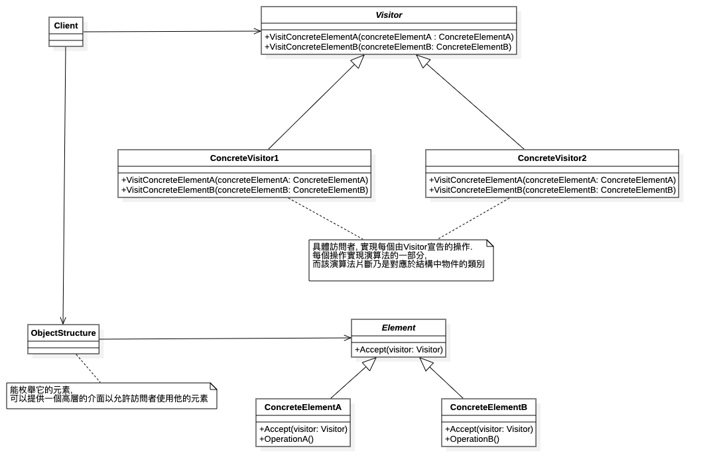

# 訪問者模式 (Visitor Pattern)


## 1 概述
- 定義：

  - 封裝一些作用於某種數據結構中的各元素的操作，它可以在不改變這個數據結構的前提下定義作用於這些元素的新的操作。

 

## 2 結構
- 訪問者模式包含以下主要角色:

  - 抽象訪問者（Visitor）角色：定義了對每一個元素（Element）訪問的行為，它的參數就是可以訪問的元素，它的方法個數理論上來講與元素類個數（Element的實現類個數）是一樣的，從這點不難看出，訪問者模式要求元素類的個數不能改變。
  - 具體訪問者（ConcreteVisitor）角色：給出對每一個元素類訪問時所產生的具體行為。
  - 抽像元素（Element）角色：定義了一個接受訪問者的方法（accept），其意義是指，每一個元素都要可以被訪問者訪問。
  - 具體元素（ConcreteElement）角色： 提供接受訪問方法的具體實現，而這個具體的實現，通常情況下是使用訪問者提供的訪問該元素類的方法。
  - 對象結構（Object Structure）角色：定義當中所提到的對象結構，對象結構是一個抽象表述，具體點可以理解為一個具有容器性質或者復合對象特性的類，它會含有一組元素（Element），並且可以迭代這些元素，供訪問者訪問。
 
 

## 3 案例實現
- 【例】給寵物餵食

  - 現在養寵物的人特別多，我們就以這個為例，當然寵物還分為狗，貓等，要給寵物餵食的話，主人可以餵，其他人也可以餵食。

    - 訪問者角色：給寵物餵食的人
    - 具體訪問者角色：主人、其他人
    - 抽像元素角色：動物抽像類
    - 具體元素角色：寵物狗、寵物貓
    - 結構對象角色：主人家


創建抽象訪問者接口
```java
public  interface  Person {
    void  feed ( Cat  cat );
​
    void  feed ( Dog  dog );
}
```

創建不同的具體訪問者角色（主人和其他人），都需要實現 Person接口
```java
public  class  Owner  implements  Person {
​
    @Override
    public  void  feed ( Cat  cat ) {
        System.out.println ( "主人餵食貓" );
    }
​
    @Override
    public  void  feed ( Dog  dog ) {
        System.out.println ( "主人餵食狗" );
    }
}
​
public  class  Someone  implements  Person {
    @Override
    public  void  feed ( Cat  cat ) {
        System.out.println ( "其他人餵食貓" );
    }
​
    @Override
    public  void  feed ( Dog  dog ) {
        System.out.println ( "其他人餵食狗" );
    }
}
```

定義抽象節點-- 寵物
```java

public  interface  Animal {
    void  accept ( Person  person );
}
```

定義實現Animal接口的具體節點（元素）
```java
public  class  Dog  implements  Animal {
​
    @Override
    public  void  accept ( Person  person ) {
        person.feed ( this );
        System.out.println ( "好好吃，汪汪汪！！！" );
    }
}
​
public  class  Cat  implements  Animal {
​
    @Override
    public  void  accept ( Person  person ) {
        person.feed ( this );
        System.out.println ( "好好吃，喵喵喵！！！" );
    }
}
```

定義對象結構，此案例中就是主人的家
```java

public  class  Home {
    private  List < Animal >  nodeList  =  new  ArrayList < Animal > ();
​
    public  void  action ( Person  person ) {
        for ( Animal  node : nodeList ) {
            node.accept ( person );
        }
    }
​
    //添加操作
    public  void  add ( Animal  animal ) {
        nodeList.add ( animal );
    }
}
​
```

測試類

```java
public  class  Client {
    public  static  void  main ( String [] args ) {
        Home  home  =  new  Home ();
        home.add ( new  Dog ());
        home.add ( new  Cat ());
​
        Owner  owner  =  new  Owner ();
        home.action ( owner );
​
        Someone  someone  =  new  Someone ();
        home.action ( someone );
    }
}
```

## 4 優缺點
- 1，優點：

  - 擴展性好

    - 在不修改對象結構中的元素的情況下，為對象結構中的元素添加新的功能。

  - 復用性好

    - 通過訪問者來定義整個對象結構通用的功能，從而提高複用程度。

  - 分離無關行為

    - 通過訪問者來分離無關的行為，把相關的行為封裝在一起，構成一個訪問者，這樣每一個訪問者的功能都比較單一。

 - 2，缺點：

    - 對象結構變化很困難

    - 在訪問者模式中，每增加一個新的元素類，都要在每一個具體訪問者類中增加相應的具體操作，這違背了“開閉原則”。

    - 違反了依賴倒置原則

    - 訪問者模式依賴了具體類，而沒有依賴抽像類。

 

## 5 使用場景
  - 對象結構相對穩定，但其操作算法經常變化的程序。

  - 對象結構中的對象需要提供多種不同且不相關的操作，而且要避免讓這些操作的變化影響對象的結構。

## 6 擴展
  - 訪問者模式用到了一種雙分派的技術。

- 1，分派：

  - 變量被聲明時的類型叫做變量的靜態類型，有些人又把靜態類型叫做明顯類型；而變量所引用的對象的真實類型又叫做變量的實際類型。比如Map map = new HashMap()，map變量的靜態類型是Map，實際類型是HashMap。根據對象的類型而對方法進行的選擇，就是分派(Dispatch)，分派(Dispatch)又分為兩種，即靜態分派和動態分派。

  -  靜態分派(Static Dispatch)發生在編譯時期，分派根據靜態類型信息發生。靜態分派對於我們來說並不陌生，方法重載就是靜態分派。

  - 動態分派(Dynamic Dispatch)發生在運行時期，動態分派動態地置換掉某個方法。Java通過方法的重寫支持動態分派。

- 2，動態分派：

  - 通過方法的重寫支持動態分派。

```java
public  class  Animal {
    public  void  execute () {
        System.out.println ( "Animal" );
    }
}
​
public  class  Dog  extends  Animal {
    @Override
    public  void  execute () {
        System.out.println ( "dog" );
    }
}
​
public  class  Cat  extends  Animal {
     @Override
    public  void  execute () {
        System.out.println ( "cat" );
    }
}
​
public  class  Client {
    public  static  void  main ( String [] args ) {
        Animal  a  =  new  Dog ();
        a.execute ();
        
        Animal  a1  =  new  Cat ();
        a1.execute ();
    }
}
```
- 
  - 上面代碼的結果大家應該直接可以說出來，這不就是多態嗎！運行執行的是子類中的方法。

  - Java編譯器在編譯時期並不總是知道哪些代碼會被執行，因為編譯器僅僅知道對象的靜態類型，而不知道對象的真實類型；而方法的調用則是根據對象的真實類型，而不是靜態類型。

- 3，靜態分派：

  - 通過方法重載支持靜態分派。

```java
public  class  Animal {
}
​
public  class  Dog  extends  Animal {
}
​
public  class  Cat  extends  Animal {
}
​
public  class  Execute {
    public  void  execute ( Animal  a ) {
        System.out.println ( "Animal" );
    }
​
    public  void  execute ( Dog  d ) {
        System.out.println ( "dog" );
    }
​
    public  void  execute ( Cat  c ) {
        System.out.println ( "cat" );
    }
}
​
public  class  Client {
    public  static  void  main ( String [] args ) {
        Animal  a  =  new  Animal ();
        Animal  a1  =  new  Dog ();
        Animal  a2  =  new  Cat ();
​
        Execute  exe  =  new  Execute ();
        exe.execute ( a );
        exe.execute ( a1 );
        exe.execute ( a2 );
    }
```

運行結果：


- 這個結果可能出乎一些人的意料了，為什麼呢？

  - 重載方法的分派是根據靜態類型進行的，這個分派過程在編譯時期就完成了。


- 4，雙分派：

  - 所謂雙分派技術就是在選擇一個方法的時候，不僅僅要根據消息接收者（receiver）的運行時區別，還要根據參數的運行時區別。

```java
public  class  Animal {
    public  void  accept ( Execute  exe ) {
        exe.execute ( this );
    }
}
​
public  class  Dog  extends  Animal {
    public  void  accept ( Execute  exe ) {
        exe.execute ( this );
    }
}
​
public  class  Cat  extends  Animal {
    public  void  accept ( Execute  exe ) {
        exe.execute ( this );
    }
}
​
public  class  Execute {
    public  void  execute ( Animal  a ) {
        System.out.println ( "animal" );
    }
​
    public  void  execute ( Dog  d ) {
        System.out.println ( "dog" );
    }
​
    public  void  execute ( Cat  c ) {
        System.out.println ( "cat" );
    }
}
​
public  class  Client {
    public  static  void  main ( String [] args ) {
        Animal  a  =  new  Animal ();
        Animal  d  =  new  Dog ();
        Animal  c  =  new  Cat ();
​
        Execute  exe  =  new  Execute ();
        a.accept ( exe );
        d.accept ( exe );
        c.accept ( exe );
    }
}
```

- 在上面代碼中，客戶端將Execute對像做為參數傳遞給Animal類型的變量調用的方法，這裡完成第一次分派，這裡是方法重寫，所以是動態分派，也就是執行實際類型中的方法，同時也将自己this作为参数传递进去，这里就完成了第二次分派，這裡的Execute類中有多個重載的方法，而傳遞進行的是this，就是具體的實際類型的對象。

- 說到這裡，我們已經明白雙分派是怎麼回事了，但是它有什麼效果呢？就是可以實現方法的動態綁定，我們可以對上面的程序進行修改。

運行結果如下：


- 雙分派實現動態綁定的本質，就是在重載方法委派的前面加上了繼承體系中覆蓋的環節，由於覆蓋是動態的，所以重載就是動態的了。
