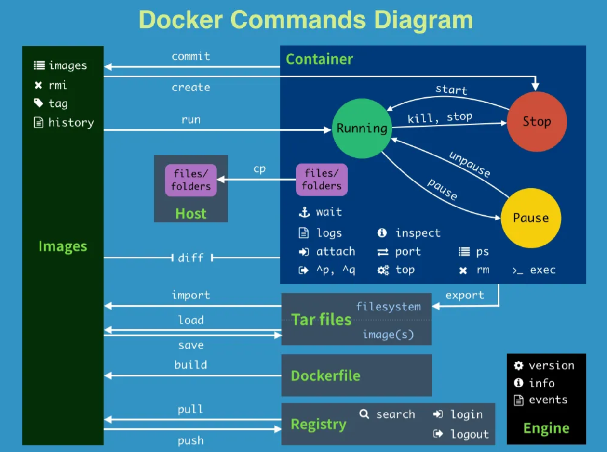

# Docker常用指令


## 幫助啟動類指令

啟動docker： systemctl start docker
停止docker： systemctl stop docker
重啟docker： systemctl restart docker
查看docker狀態： systemctl status docker
開機啟動： systemctl enable docker
查看docker概要資訊： docker info
查看docker總體說明文件： docker --help
查看docker指令說明文件： docker 具體指令 --help

## 鏡像命令

### docker images

**docker images [OPTIONS] [REPOSITORY[:TAG]]**

同一個倉庫來源可以有多個tag版本，代表這個倉庫來源的不同的版本，我們使用 ***REPOSITORY:TAG***來定義不同的鏡像。如果你不指定一個鏡像的版本標籤，例如你只使用 ubuntu，docker將預設使用 ubuntu:latest 鏡像。

```
REPOSITORY：表示鏡像的倉庫來源
TAG：鏡像的標籤
IMAGE ID：鏡像ID
CREATED：鏡像建立時間
SIZE：鏡像大小
```

OPTIONS說明：

- -a：列出本地所有的鏡像（含歷史鏡像圖層）
- -q：；只顯示鏡像ID


### docker search

**docker search 鏡像名**

docker search 鏡像名：預設是從 hub.docker.com 檢索鏡像列表，一般選第一個官方認證過的，比較可靠

OPTIONS說明：

- --limit：只列出N個鏡像，預設25個，例如docker search 

- --limit 5 redis

### docker pull 

**docker pull 鏡像名**

docker pull 鏡像名：下載鏡像，docker pull 鏡像名字[:TAG]，沒有tag就下載最新版

### docker system df

docker system df：查看鏡像/容器/資料卷所佔的空間

### docker rmi

docker rmi [-f] 鏡像名/鏡像ID：[強制]刪除鏡像

- 刪除多個鏡像：docker rmi -f id1 name2:tag2
- 刪除全部鏡像：docker rmi -f $(docker images -qa)


## 容器命令

有鏡像才能建立容器，這是根本前提

### docker run

**docker run [OPTIONS] IMAGE [COMMAND] [ARG...]**

- docker run 鏡像名稱：新建+啟動容器，啟動互動式容器（前台命令列）

- --name=名字：容器新名字，為容器指定名稱
  - -d：後台運行容器並返回容器ID，啟動守護式容器（後台運行）
  - -i：以互動模式運行容器，通常與 -t 同時使用
  - -t：為容器重新分配一個偽輸入中斷，通常與 -i 同時使用，也稱交互式容器（前台有偽終端，等待交互）常用：docker run - -it ubuntu /bin/bash（以交互模式啟動一個容器，在容器內執行 /bin/bash 命令，退出：exit）
  - -P：隨機連接埠映射，大P
  - -p：指定連接埠映射，小p。例：-p 6379:6379是指外面存取docker的6379服務（宿主機）被對應到容器內的6379服務（docker ）

### docker ps

**docker run [OPTIONS] IMAGE [COMMAND] [ARG...]**

- docker ps：列出目前所有正在執行的容器

  - -a：列出目前所有正在運行的容器+歷史上運行過的
  - -l：顯示最近建立的容器
  - -n：顯示最近n個建立的容器
  - -q：靜默模式，只顯示容器編號
- 容器的退出

  - exit：run進去的容器，exit退出，容器停止（docker ps就沒啦）
  - ctrl+p+q：run進去的容器，ctrl+p+q，容器不停止

### docker start

docker start 容器id/容器名稱：啟動已經停止運作的容器

### docker restart

docker restart 容器id/容器名稱：重啟容器

### docker stop

docker stop 容器id/容器名稱：停止容器

### docker kill

docker kill 容器id/容器名稱：強制停止容器

### docker rm

docker rm [-f] 容器id/容器名稱：[強制]刪除容器

- 一次刪除多個實例：

  - docker rm -f $(docker ps -a -q)
  - docker ps -a -q | xargs docker rm


### 啟動守護式容器（後台伺服器）

在大部分得場景下，我們希望docker的服務是在背景運行的，，我們可以透過 -d 指定容器的背景運行模式

- docker run -d 容器名

- 問題：直接用 docker run 容器名稱 啟動後用docker ps -a進行查看發現容器已經退出了，需要注意很重要的一點是，Docker容器後台運行，就必須有一個前台進程。容器運行的命令如果不是那些一直掛起的命令（例如運行top，tail），就是會自動退出的。

- 這是docker的機制問題，最佳的解決方案是：**將你要運行的程式以前台進程的形式運行，常見就是命令列模式 -it **，表示我還有交互操作，別中斷。

- 以redis為例，用前台互動的啟動肯定不行：docker run -it redis；所以要用後台守護式啟動：docker run -d redis

### docker log

docker log 容器id：查看容器日誌

### docker top

docker top 容器id：查看容器內執行的進程

### docker inspect

docker inspect 鏡像名稱/容器id：查看鏡像配置/檢視容器內部細節


### 進入正在運行的容器，並以命令列交互

- docker exec -it 容器id bashShell
  - exec是在容器中開啟新的終端，並且可以啟動新的進程，用exit退出，不會導致容器的停止
- docker attach 容器id
  - attach直接進入容器啟動指令的終端，不會啟動新的進程，用exit退出，會導致容器的停止
  

### 從容器內拷貝文件到主機上

**docker cp 容器id:容器內路徑 目的主機路徑**


### 導入導出容器

- export 導出容器的內容留給作為一個tar歸檔檔[對應import指令]
- import 從tar包中的內容創建一個新的檔案系統再導入為鏡像[對應export]

- EX:

  - docker export 容器id > 檔名.tar
  - cat 檔名.tar | docker import - 鏡像用戶/鏡像名:鏡像版本號，例如：cat abcd.tar | docker import - atguigu/- ubuntu:3.7


- docker save保存的是鏡像（image），docker export保存的是容器（container）；
- docker load用來載入鏡像包，docker import用來載入容器包，但兩者都會恢復為鏡像；
- docker load不能對載入的鏡像重新命名，而docker import可以為鏡像指定新名稱。

