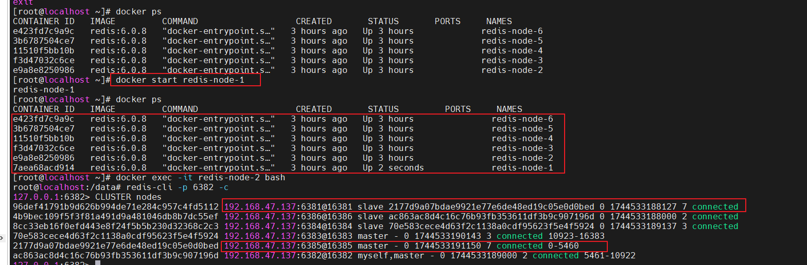
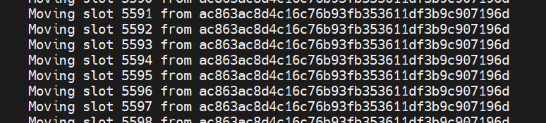

# Docker

## 原理


Docker是一個Client-Server結構的系統，Docker守護程序運行在主機上， 然後透過Socket連接從客戶端訪問，守護程序從客戶端接受命令並管理運行在主機上的容器。 容器，是一個運行時環境，就是我們前面說到的貨櫃。


- Docker 是一個 C/S 模式的架構，後端是一個松耦合架構，眾多模組各司其職。

Docker運行的基本流程為：

- 使用者是使用Docker Client與Docker Daemon建立通信，並發送請求給後者。
- Docker Daemon作為Docker架構中的主體部分，首先提供Docker Server的功能使其可以接受Docker Client的請求。
- Docker Engine執行Docker內部的一系列工作，每一項工作都是以一個Job的形式的存在。
- 在Job的運作過程中，當需要容器鏡像時，則從Docker Registry下載鏡像，並透過鏡像管理驅動Graph driver將下載鏡像以Graph的形式儲存。
- 當需要為Docker建立網路環境時，透過網路管理驅動Network driver建立並配置Docker容器網路環境。
- 當需要限制Docker容器運行資源或執行使用者指令等操作時，則透過Exec driver來完成。
- Libcontainer是一項獨立的容器管理包，Network driver以及Exec driver都是透過Libcontainer來實現具體對容器進行的操作。


## [Docker安裝](install.md) 

## [Docker指令](command.md) 


## Docker鏡像

- 是什麼：鏡像是一種輕量級、可執行的獨立軟體包，它包含運行某個軟體所需的所有內容，我們把應用程式和配置依賴打包好形成一個可交付的運行環境(包括程式碼、運行時需要的庫、環境變量和配置文件等)，這個打包好的運行環境就是image鏡像檔。

- 分層的鏡像：UnionFS（聯合檔案系統），Union檔案系統（UnionFS）是一種分層、輕量級且高效能的檔案系統，它支援對檔案系統的修改作為一次提交來一層層的疊加，同時可以將不同目錄掛載到同一個虛擬檔案系統下（unite several directories into a single virttosystemsingle）。 Union 檔案系統是 Docker鏡像的基礎。鏡像可以透過分層來進行繼承，基於基研鏡像（沒有父鏡像），可以製作各和具體的應用鏡像。

- 特性：一次同時載入多個檔案系統，但從外面看起來，只能看到一個檔案系統，聯合載入會把各層檔案系統疊加起來，這樣最終的檔案系統會包含所有底層的檔案和目錄

- Docker鏡像載入原理：docker的鏡像其實是由一層一層的檔案系統所組成，這種層級的檔案系統UnionFS。

- bootfs(boot file system)主要包含bootloader和kernel, bootloader主要是引導載入kernel，Linux剛啟動時會載入bootfs檔案系統，在Docker鏡像的最底層是引導檔案系統bootfs。這一層與我們典型的Linux/unix系統是一樣的，包含boot載入器和核心。當boot載入完成之後整個內核就都在記憶體中了，此時記憶體的使用權已由bootfs轉交給內核，此時系統也會卸載bootfs。

- rootfs (root file system)，在bootfs之上，包含的就是典型 Linux 系統中的/dev，/proc，/bin，/etc等標準目錄和檔案。 rootfs就是各種不同的作業系統發行版，像是Ubuntu，Centos。


- 對於一個精簡的OS，rootfs可以很小，只需要包含最基本的指令、工具和程式庫就可以了，因為底層直接用Host和Kernel，自己只需要提供rootfs就行了。由此可見對於不同的linux發行版，bootfs基本上是一致的，rootfs會有差別，因此不同的發行版可以公用bootfs。

- ❓ 為什麼Docker鏡像要採用分層結構？

  - 鏡像分層最大的一個好處就是共享資源，方便複製遷移，就是為了重複使用。

  - 比方說有多個鏡像都從相同的 base 鏡像建置而來，那麼 Docker Host 只需在磁碟上保存一份 base 鏡像；同時記憶體中也只需載入一份 base 鏡像，就可以為所有容器服務了。而且鏡像的每一層都可以被分享。


- Docker鏡像層都是唯讀的，容器層是可寫入的
- 當容器啟動時，一個新的可寫入層被載入到鏡像的頂部。這一層通常被稱為“容器層"，“容器層"之下的都叫“鏡像層”

- Docker中的鏡像分層，支援透過擴充現有鏡像，建立新的鏡像。類似Java繼承於一個Base基礎類，自己再按需擴展。新鏡像是從 base 鏡像一層一層疊加產生的。每安裝一個軟體，就在現有鏡像的基礎上增加一層。


### 製作Docker鏡像

**docker commit -m="提交的描述資訊" -a="作者" 容器ID 要建立的目標鏡像名稱[:標籤名]**

  - docker commit 提交容器副本，使其成為一個新的鏡像
  
- Docker鏡像commit作業案例


## 提交遠端流程


## 安裝軟體實例

### 安裝Tomcat

### 安裝mysql 5.7

```
docker run -d -p 3306:3306 --privileged=true -v 'G:\docker\mysql\log':/var/log/mysql -v 'G:\docker\mysql\data':/var/lib/mysql -v 'G:\docker\mysql\conf':/etc/mysql/conf.d -e MYSQL_ROOT_PASSWORD=123456  --name mysql mysql:5.7
```

### 安裝redis 6.0.8

```
docker run  -p 6379:6379 --name myr3 --privileged=true -v 'G:\docker\redis\redis.conf':/etc/redis/redis.conf -v 'G:\docker\redis\data':/data -d redis:6.0.8 redis-server /etc/redis/redis.conf
```

### 安裝redis 集群 3主3從

```
docker run -d --name redis-node-1 --net host --privileged=true -v /data/redis/share/redis-node-1:/data redis:6.0.8 --cluster-enabled yes --appendonly yes --port 6381
 
docker run -d --name redis-node-2 --net host --privileged=true -v /data/redis/share/redis-node-2:/data redis:6.0.8 --cluster-enabled yes --appendonly yes --port 6382
 
docker run -d --name redis-node-3 --net host --privileged=true -v /data/redis/share/redis-node-3:/data redis:6.0.8 --cluster-enabled yes --appendonly yes --port 6383
 
docker run -d --name redis-node-4 --net host --privileged=true -v /data/redis/share/redis-node-4:/data redis:6.0.8 --cluster-enabled yes --appendonly yes --port 6384
 
docker run -d --name redis-node-5 --net host --privileged=true -v /data/redis/share/redis-node-5:/data redis:6.0.8 --cluster-enabled yes --appendonly yes --port 6385
 
docker run -d --name redis-node-6 --net host --privileged=true -v /data/redis/share/redis-node-6:/data redis:6.0.8 --cluster-enabled yes --appendonly yes --port 6386
```

- 設置主從配置
```
docker exec -it redis-node-1 bash
```

```
redis-cli --cluster create 192.168.47.137:6381 192.168.47.137:6382 192.168.47.137:6383 192.168.47.137:6384 192.168.47.137:6385 192.168.47.137:6386 --cluster-replicas 1

```

### 查看集群狀態

```
redis-cli --cluster check 192.168.47.137:6381
```


### 集群Redis讀寫

#### 錯誤方式
- 錯誤進入方式
```
redis-cli -p 6381
```
- 設置集群後，使用單機版命令進入Rredis新增KV，會有時成功有時失敗，這是因為集群有個哈希槽（Hash Slot），在座分區，當key使用crc16 算法算出來的值超過分區的位子，就無法新增


- 正確進入方式，要+ -c

```
redis-cli -p 6381 -c
```


### 集群redis容錯切換

- 模擬readis-node-1故障，把readis-node-1 stop
- 會發現原本readis-node-1 的slave(readis-node-5) 自動變成master


- readis-node-1故障排除重新啟動，會自動變成readis-node-5的slave


- 如果要恢復原來配置，需要把變成master的readis-node-5，停掉，讓readis-node-1再變成master，再啟動readis-node-5


### 集群redis 擴容

- 新建6387、6388兩個節點+新建後啟動+查看是否8節點

```
docker run -d --name redis-node-7 --net host --privileged=true -v /data/redis/share/redis-node-7:/data redis:6.0.8 --cluster-enabled yes --appendonly yes --port 6387

docker run -d --name redis-node-8 --net host --privileged=true -v /data/redis/share/redis-node-8:/data redis:6.0.8 --cluster-enabled yes --appendonly yes --port 6388

docker ps
```

- 進入6387容器實例內部

```
docker exec -it redis-node-7 /bin/bash
```


- 將新增的6387節點(空槽號)作為master節點加入原集群

  - redis-cli --cluster add-node 自己實際IP位址:6387 自己實際IP位址:6381
  - 6387 就是將要作為master新增節點
  - 6381 就是原來集群節點裡面的領路人，相當於6387拜拜6381的碼頭從而找到組織加入集群


```
redis-cli --cluster add-node 192.168.47.137:6387 192.168.47.137:6381
```


- 檢查集群情況第1次
  - redis-cli --cluster check 真实ip地址:6381
```
redis-cli --cluster check 192.168.47.137:6381
```


- 重新分派槽號
  - 指令:redis-cli --cluster reshard IP位址:埠號
```
redis-cli --cluster reshard 192.168.47.137:6381
```





- 檢查集群情況第2次

```
 redis-cli --cluster check 192.168.47.137:6381
```

- 
  - 為什麼6387是3個新的區間，以前的還是連續？
    - 重新分配成本太高，所以前3家各自勻出來一部分，從6381/6382/6383三個舊節點分別勻出1364個坑位給新節點6387

- 為主節點6387分配從節點6388

  - 指令：redis-cli --cluster add-node ip:新slave連接埠 ip:新master連接埠 --cluster-slave --cluster-master-id 新主機節點ID

  - redis-cli --cluster add-node 192.168.111.147:6388 192.168.111.147:6387 --cluster-slave --cluster-master-id e4781f644d4a4e4d4b4d107157b9ba8144631451-------這個是6387的編號，依照自己實際狀況


```
redis-cli --cluster add-node 192.168.47.137:6388 192.168.47.137:6387 --cluster-slave --cluster-master-id 2261546c510ba8d22a819d71da0dfad88ef20968
```


- 檢查集群情況第3次

```
redis-cli --cluster check 192.168.47.137:6382
```


### 集群redis 縮容

- 目的：6387和6388下線


- 檢查集群情況1獲得6388的節點ID

```
redis-cli --cluster check 192.168.47.137:6382
```


- 將6388刪除，從叢集中將4號從節點6388刪除
- 指令：redis-cli --cluster del-node ip:從機埠 從機6388節點ID


```
redis-cli --cluster del-node 192.168.47.137:6388 2c583681720b1038569c08fcdf242114df761fde
```


- 檢查是否刪除，剩7個節點
```
redis-cli --cluster check 192.168.47.137:6382
```


- 將6387的槽號清空，重新分配，本例將清出來的槽號都給6381

```
redis-cli --cluster reshard 192.168.47.137:6381
```


- 檢查集群情況第二次

```
redis-cli --cluster check 192.168.47.137:6382
```


- 將6387刪除

  - 指令：redis-cli --cluster del-node ip:連接埠 6387節點ID

```
redis-cli --cluster del-node 192.168.47.137:6387 2261546c510ba8d22a819d71da0dfad88ef20968
```


- 檢查集群情況第三次

```
redis-cli --cluster check 192.168.47.137:6382
```


