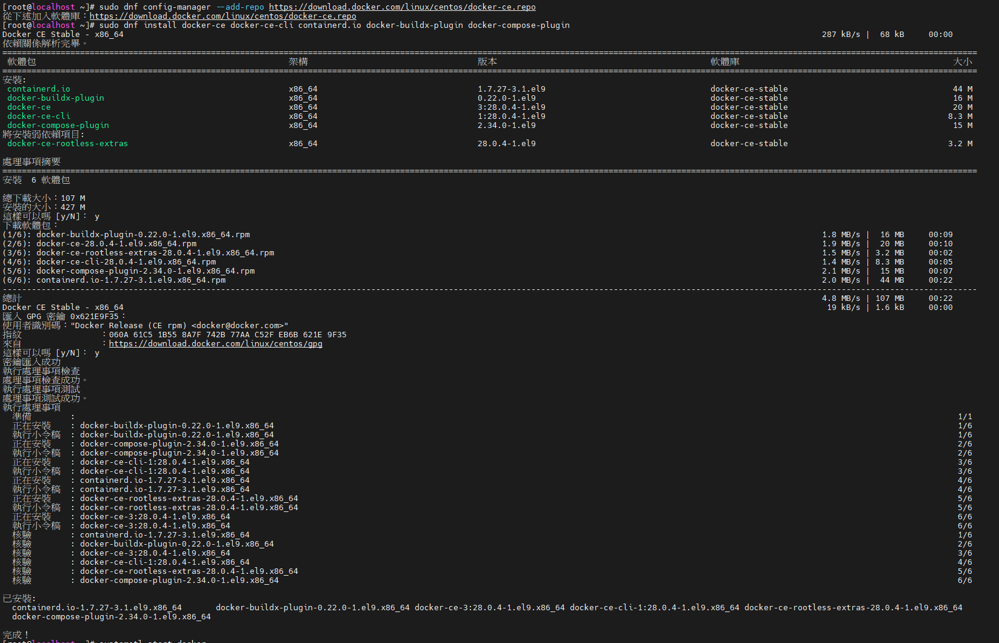
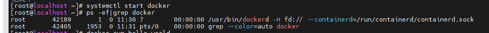
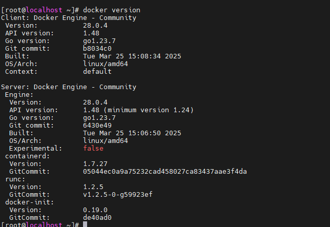
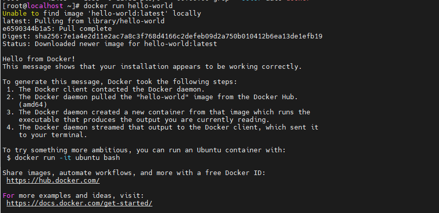

# Docker安裝

## 官網

- https://docs.docker.com/engine/install/centos/

## 安裝指令

```
yum -y install gcc
yum -y install gcc-c++
```

### Set up the repository
```
 sudo dnf -y install dnf-plugins-core
 sudo dnf config-manager --add-repo https://download.docker.com/linux/centos/docker-ce.repo
```

### Install Docker Engine

- 1.Install the Docker packages.

```
sudo dnf install docker-ce docker-ce-cli containerd.io docker-buildx-plugin docker-compose-plugin
```



- 2.Start Docker Engine.

```
systemctl enable --now docker
```


- check docker version
```
docker version
```



- 4.Verify that the installation is successful by running the hello-world image:
```
```

```
docker run hello-world
```

