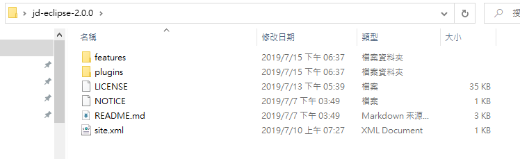
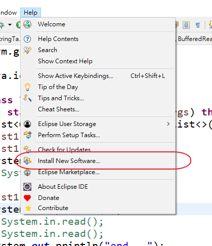
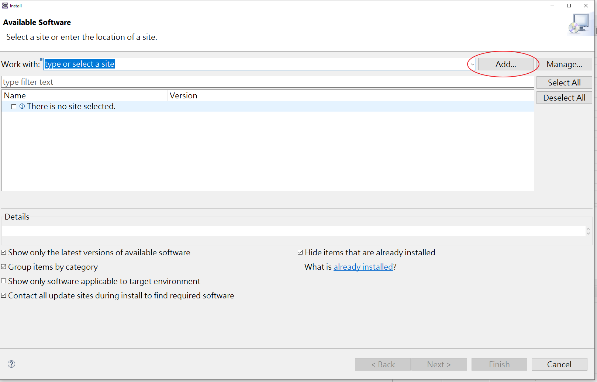
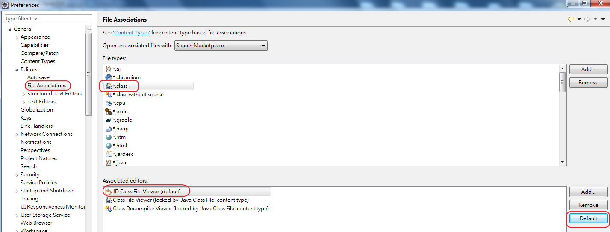
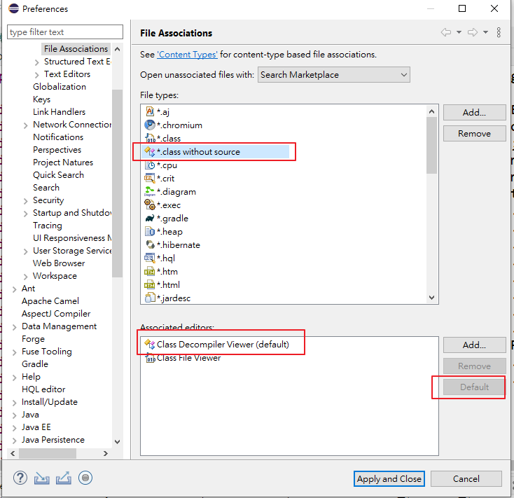
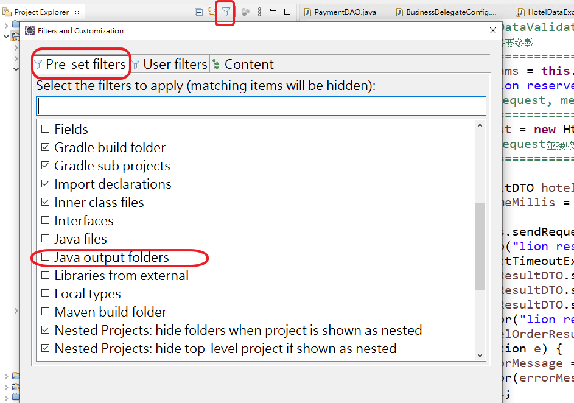
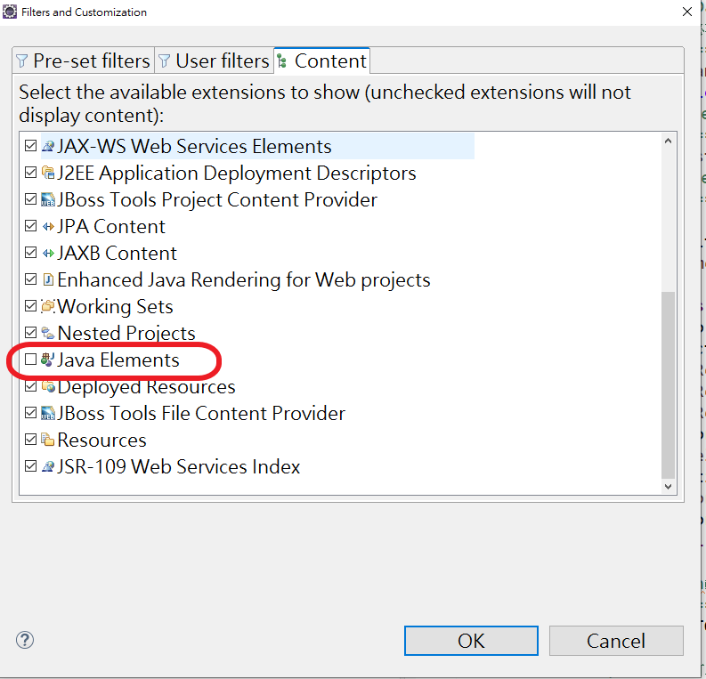

# 1.更改自動decompile地方

## 安裝JD compile

- 去官網下載https://github.com/java-decompiler/jd-eclipse/releases/tag/v2.0.0  zip 檔案
- 解壓縮檔案，去eclipse安裝此元件






## 設定




# 2.2023版以後沒有 navigator替代方案

- 使用project exploere視圖可以顯示類似navigator視圖

  - 1.顯示project exploere視圖

    - window---->show view --->project exploere

  - 2.project exploere視圖轉換為類似navigator視圖

    - 第一步：點擊視圖右上角三個點或者倒三角，點擊fiters and customirzation  會彈出一個窗口， filters  取消java output folders


    - 第二步：點擊content  取消 java elements




# 3. lombok 添加

- 1.在eclipse專案路徑下放入lombok.jar
- 2.在eclipse.ini 中加入如下內容

```
-javaagent:lombok.jar
-Xbootclasspath/a:lombok.jar
```

# 4.202109版以後 lombok 的getter setter 不能用問題

- 解決的辦法是在 eclipse.ini 中加入如下內容，因為這是 Java Module 引起的。

```
--add-exports=java.base/sun.nio.ch=ALL-UNNAMED 
--add-opens=java.base/java.lang=ALL-UNNAMED 
--add-opens=java.base/java.lang.reflect=ALL-UNNAMED 
--add-opens=java.base/java.io=ALL-UNNAMED 
--add-exports=jdk.unsupported/sun.misc=ALL-UNNAMED

```