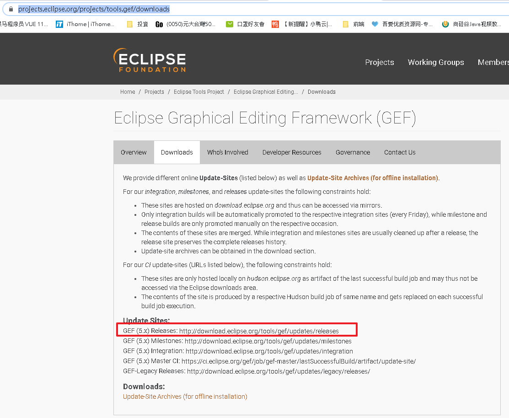

# 安裝 AmaterasUML

## 依序安裝以下連結

 一、安裝GEF插件

 尋找連結

https://projects.eclipse.org/projects/tools.gef/downloads

安裝以下連結
http://download.eclipse.org/tools/gef/updates/releases

二、安裝AmaterasUML插件（安裝以下連結）

https://takezoe.github.io/amateras-update-site/ 