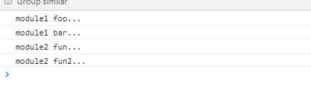
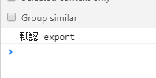
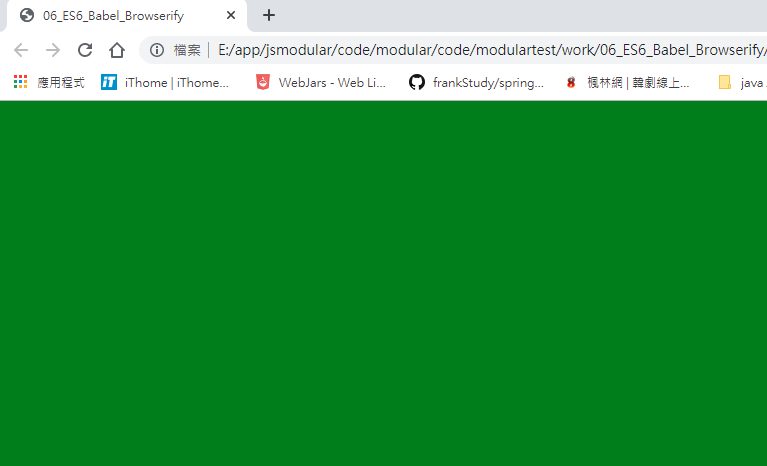

# 1.let

a.宣告

1.作用：
   * 與var類似，用於聲明一個變量
2.特點：
   * 在塊作用域內有效
   * 不能重複聲明
   * 不會預，不存在提升
3.應用：
   * 循環遍歷加監聽
   * 使用let取代var是趨勢

```javascript
    //console.log(age);// age is not defined
    let age = 13;
    //let age = 13;不能重複宣告
    console.log(age);
    let btns = document.getElementsByTagName('button');
    for(let i = 0;i<btns.length;i++){
            btns[i].onclick = function () {
               alert(i);
            }
    }
```

b.變數的賦值

1.理解：
  * 從對像或數組中提取數據，並賦值給變量（多個）
2.對象的解構賦值
    let {n，a} = {n：'tom'，a：12}
3.陣列的解構賦值
    let [a，b] = [1，'atguigu'];
4.用途
  * 給多個形參賦值

```javascript
   let obj = {name : 'frank', age : 39};
//    let name = obj.name;
//    let age = obj.age;
//    console.log(name, age);
    //物件解構賦值
    let {age} = obj;
    console.log(age);
//    let {name, age} = {name : 'frank', age : 39};
//    console.log(name, age);

    //3. 陣列的解構賦值  不常使用
    let arr = ['abc', 23, true];
    let [a, b, c, d] = arr;
    console.log(a, b, c, d);
    //console.log(e);
    function person(p) {//不用解構賦值
        console.log(p.name, p.age);
    }
    person(obj);

    function person1({name, age}) {
     console.log(name, age);
    }
    person1(obj);
```


# 2.const


1.作用：<br/>
   * 定義一個常量<br/>
2.特點：<br/>
   * 不能修改<br/>
   * 其他特點同let<br/>
3.應用：<br/>
   * 保存不用改變的數據<br/>

# 3.模板字串

1.模板字符串：簡化字符串的拼接<br/>
   * 模板字符串必須用``包含<br/>
   * 變化的部分使用$ {xxx}定義<br/>

```javascript
    let obj = {
        name : 'frank',
        age : 44
    };
    console.log('我叫:' + obj.name + ', 我的年齡是：' + obj.age);

    console.log(`我叫:${obj.name}, 我的年齡是：${obj.age}`);
```

# 4.物件寫法簡化

簡化的物件寫法<br/>
* 省略同名的屬性值<br/>
* 省略方法的功能<br/>
* 例如：<br/>
   let x = 1;<br/>
   let y = 2;<br/>
   let obj= {<br/>
     x，<br/>
     y，<br/>
     setX（x）{this.x = x}<br/>
   };<br/>

```javascript
    let x = 3;
    let y = 5;
    //es5 寫法
//    let obj = {
//        x : x,
//        y : y,
//        getPoint : function () {
//            return this.x + this.y
//        }
//    };
    //es6 簡化寫法
    let obj = {
        x,
        y,
        getPoint(){
            return this.x
        }
    };
    console.log(obj, obj.getPoint());
```

# 5.箭頭函數

* 作用：定義匿名函數

* 基本語法：<br/>
   *沒有參數：（）=> console.log（'xxxx'）<br/>
   *一個參數：i => i + 2<br/>
   *大於一個參數：（i，j）=> i + j<br/>
   *函數體不用大括號：默認返回結果<br/>
   *函數體如果有多個語句，需要用{}包圍，若有需要返回的內容，需要手動返回<br/>
* 使用場景：多用於定義局部函數

* 箭頭函數的特點：<br/>
     1，簡潔<br/>
     2，箭頭函數沒有自己的這個，箭頭函數的這個不是調用的時候決定的，而是在定義的時候處在的對象就是它的這個<br/>
    3，箭頭函數的這個看外層的是否有函數，
         如果有，外層函數的這個就是內部箭頭函數的這個，
         如果沒有，則這是窗口。<br/>

```javascript
let fun = function () {
       console.log('fun()');
   };
   fun();
   //沒有參數，並且函數體只有一條語句
   let fun1 = () => console.log('fun1()');
    fun1();
   console.log(fun1());
    //一個參數，並且函數體只有一條語句
    let fun2 = x => x;
    console.log(fun2(5));
    //參數是一個以上
    let fun3 = (x, y) => x + y;
    console.log(fun3(25, 39));//64

    //函數體有多條語句
    let fun4 = (x, y) => {
        console.log(x, y);
        return x + y;
    };
    console.log(fun4(34, 48));//82

    setTimeout(() => {
        console.log(this);
    },1000)

   let btn = document.getElementById('btn');
   //沒有箭頭函數
   btn.onclick = function () {
       console.log(this);//btn
   };
   //箭頭函數
   let btn2 = document.getElementById('btn2');

    let obj = {
        name : 'kobe',
        age : 39,
        getName : () => {
            btn2.onclick = () => {
                console.log(this);//obj
            };
        }
    };
    obj.getName();


 function Person() {
     this.obj = {
         showThis : () => {
             console.log(this);
         }
     }
 }
    let fun5 = new Person();
    fun5.obj.showThis();
```

# 6.點點點運算符

*用途<br/>
* 1.休息<br/>
     *已取代取代參數，但比例取代參數靈活，只能是最後部分形參參數<br/>
    function add(...values) {<br/>
        let sum = 0;<br/>
        for(value of values) {<br/>
        sum += value;<br/>
        }<br/>
        return sum;<br/>
    }
* 2.擴展運算符<br/>
    let arr1 = [1,3,5];<br/>
    let arr2 = [2,...arr1,6];<br/>
    arr2.push(...arr1);<br/>

```javascript
    function fun(...values) {
        console.log(arguments);
//        arguments.forEach(function (item, index) {
//            console.log(item, index);
//        });
        console.log(values);
        values.forEach(function (item, index) {
            console.log(item, index);
        })
    }
    fun(1,2,3);

    let arr = [2,3,4,5,6];
    let arr1 = ['abc',...arr, 'fg'];
    console.log(arr1);

```


# 7.Promise

1.理解：<br/>
  * Promise物件：代表了未來某個將要發生的事件（通常是一個異步操作）
    *有了promise物件，可以將異步操作以同步的流程表達出來，避免了層層層疊的替換函數（俗稱'放置地獄'）<br/>
  * ES6的Promise是一個構造函數，用於生成promise實例<br/>
2.使用promise基本步驟（2步）：<br/>
    *創建承諾物件<br/>
    let promise=new promise（（resolve，reject）=> {
        //初始化promise狀態為待定
      //執行異步操作
      if（異步操作成功）{
        resolve（value）; //修改promise的狀態為fullfilled
      }其他{
        reject（errMsg）; //修改promise的狀態為已拒絕
      }
    }）
    *調用promise的then（）
    promise.then（function（
      結果=> console.log（result），
      errorMsg =>警報（errorMsg）
    ））
3. promise物件的3個狀態<br/>
    *待定：初始化狀態<br/>
    *完整：成功狀態<br/>
    *被拒絕：失敗狀態<br/>
4.應用：<br/>
    *使用Promise實現超時處理<br/>

  *使用promise封裝處理ajax請求<br/>
    let request = new XMLHttpRequest（）;<br/>
    request.onreadystatechange = function（）{<br/>
    }<br/><
    request.responseType ='json';<br/>
    request.open（“ GET”，url）;<br/>
    request.send（）;<br/>

```javascript
    //創建一個promise實例物件
    let promise = new Promise((resolve, reject) => {
        //初始化promise的狀態為pending---->初始化狀態
        console.log('1111');//同步執行
        //啟動異步任務
        setTimeout(function () {
            console.log('3333');
            //resolve('atguigu.com');//修改promise的狀態pending---->fullfilled（成功狀態）
            reject('xxxx');//修改promise的狀態pending----->rejected(失敗狀態)
        },1000)
    });
    promise.then((data) => {
        console.log('成功了。。。' + data);
    }, (error) => {
        console.log('失敗了' + error);
    });
    console.log('2222');
```

```html
<!DOCTYPE html>
<html>
	<head>
		<meta charset="utf-8">
		<title></title>
	</head>
	<body>
		<div id="showDetail"></div>
	</body>
	<script>
        //定義一個請求URL的方法
		function getUrlResponse(url){
            //創建一個promise物件
			let promise = new Promise((resolve, reject) => {
                //初始化promise狀態為pending
                //啟動異部任務
				let request = new XMLHttpRequest();
				request.onreadystatechange = function(){
					if(request.readyState == 4){
						if(request.status == 200){
							resolve(request.response);
						}else{
							reject("連接錯誤.....");
						}
					}
				}
				request.responseType="json";//設置返回的數據類型
				request.open("GET",url);//規定請求的方法，創建連接
				request.send();//發送
			});
			return promise;
		}

		let weatherUrl="https://ptx.transportdata.tw/MOTC/v2/Bus/RealTimeByFrequency/City/Taipei?$top=30&$format=JSON";
		getUrlResponse(weatherUrl)
			.then((res) => {
				document.getElementById("showDetail").innerText=JSON.stringify(res);
			},(errors) => {
				document.getElementById("showDetail").innerText=errors;
			});


	</script>
</html>

```


# 8.Symbol

前言：ES5中物件的屬性名都是字串，容易造成重名，污染環境<br/>
Symbol：<br/>
    * 概念：ES6中的添加了一種原始數據類型symbol(已有的原始數據類型：String, Number, boolean, null, undefined, 物件)<br/>
      特點：<br/>
        1、Symbol屬性對應的值是唯一的，解決命名衝突問題<br/>
        2、Symbol值不能與其他數據進行計算，包括同字串拼串<br/>
        3、for in, for of遍歷時不會遍歷symbol屬性。<br/>
      使用：<br/>
        1、調用Symbol函數得到symbol值<br/>
          let symbol = Symbol();<br/>
          let obj = {};<br/>
          obj[symbol] = 'hello';<br/>
        2、傳參標識<br/>
          let symbol = Symbol('one');<br/>
          let symbol2 = Symbol('two');<br/>
          console.log(symbol);// Symbol('one')<br/>
          console.log(symbol2);// Symbol('two')<br/>
        3、內置Symbol值<br/>
          * 除了定義自己使用的Symbol值以外，ES6還提供了11個內置的Symbol值，指向語言內部使用的方法。<br/>
          - Symbol.iterator<br/>
           * 物件的Symbol.iterator屬性，指向該物件的默認遍歷器方法(後邊講)<br/>

```javascript
    window.onload = function () {
      let symbol = Symbol();
      console.log(typeof symbol);
      console.log(symbol);

      // 用作物件的屬性(唯一)
      let obj = {username: 'kobe', age: 39};
      obj[symbol] = 'hello';
      obj[symbol] = 'symbol';
      console.log(obj);
      for(let i in obj){
        console.log(i);
      }
    }
```

# 9.Iterator

概念： iterator是一種接口機制，為各種不同的數據結構提供統一的訪問機制<br/>
    * 作用：<br/>
      1、為各種數據結構，提供一個統一的、簡便的訪問接口；<br/>
      2、使得數據結構的成員能夠按某種次序排列<br/>
      3、ES6創造了一種新的遍歷命令for...of循環，Iterator接口主要供for...of消費。<br/>
    * 工作原理：<br/>
      - 創建一個指針物件，指向數據結構的起始位置。<br/>
      - 第一次調用next方法，指針自動指向數據結構的第一個成員<br/>
      - 接下來不斷調用next方法，指針會一直往後移動，直到指向最後一個成員<br/>
      - 每調用next方法返回的是一個包含value和done的物件，{value: 當前成員的值,done: 布爾值}<br/>
        * value表示當前成員的值，done對應的布爾值表示當前的數據的結構是否遍歷結束。<br/>
        * 當遍歷結束的時候返回的value值是undefined，done值為false<br/>
    原生具備iterator接口的數據(可用for of遍歷)<br/>
     * 1、Array<br/>
      2、arguments<br/>
      3、set容器<br/>
      4、map容器<br/>
      5、String<br/>
      。 。 。<br/>


```javascript
  // 自定義iterator生成指針物件
    function myIterator(arr){
      let index = 0;
      return {
        next(){
          return index < arr.length ? ({value:arr[index++],done:false}) : ({value:undefined,done:true});
        }
      };
    }

    let arr = [1,2,3,"abc"];
    let obj=myIterator(arr);
    console.log(obj.next());
    console.log(obj.next());
    console.log(obj.next());
    console.log(obj.next());
    console.log(obj.next());
    //使用解構賦值以及...三點運算符時會調用iterator接口
    let b=[2,3,4,5];
    let c=[1,...b,6];
    console.log(c);
    let [r,t]=c;
    console.log(r,t);

    // 原生測試 陣列
    let arr3 = [1, 2, 'kobe', true];
    for(let i of arr3){
      console.log(i);
    }
    // 字串  string
    let str = 'abcdefg';
    for(let item of str){
      console.log(item);
    }

    //等同於在指定的數據內結構上部屬了iterator接口
    //當使用for of去歷遍某一個數據結構的時候，首先去找Symbol.iterator，找到則歷遍，找不到則拋出錯誤:obj is not iterable
    let targetData={
      [Symbol.iterator](){
        let index = 0;
        return {
          next(){
            return index < arr.length ? ({value:arr[index++],done:false}) : ({value:undefined,done:true});
          }
        };
      }
    }
```

# 10.Generator

概念：<br/>
      1、ES6提供的解決異步編程的方案之一<br/>
      2、Generator函數是一個狀態機，內部封裝了不同狀態的數據，<br/>
      3、用來生成遍歷器對象<br/>
      4、可暫停函數(惰性求值), yield可暫停，next方法可啟動。每次返回的是yield後的表達式結果<br/>
特點：<br/>
      1、function 與函數名之間有一個星號<br/>
      2、內部用yield表達式來定義不同的狀態<br/>
      例如：<br/>
        function* generatorExample(){<br/>
          let result = yield 'hello'; // 狀態值為hello<br/>
          yield 'generator'; // 狀態值為generator<br/>
        }<br/>
      3、generator函數返回的是指針對象(iterator)，而不會執行函數內部邏輯<br/>
      4、調用next方法函數內部邏輯開始執行，遇到yield表達式停止，返回{value: yield後的表達式結果/undefined, done: false/true}<br/>
      5、再次調用next方法會從上一次停止時的yield處開始，直到最後<br/>
      6、yield語句返回結果通常為undefined， 當調用next方法時傳參內容會作為啟動時yield語句的返回值。<br/>

```javascript
  function* myGenerator(){
    console.log("開始執行");
    let res= yield "11111";
    console.log(res); //bbbbbb
    console.log("暫停中...");
    yield "22222";
    console.log("執行完畢");
    return "END";
  }

  let MG = myGenerator();
  console.log(MG.next("aaaaaa"));
  console.log(MG.next("bbbbbb"));
  console.log(MG.next());


  //物件的symbol.iterator屬性指向遍歷器物件
  let obj ={name:"frank",age:31};
  obj[Symbol.iterator]=function* myObjGenerator(){
    yield 1;
    yield 2;
    yield 3;
  }
  for(let i of obj){
    console.log(i);//1 2 3
  }


```


# 11.Class

基本上與JAVA差不多

1. 通過class定義類/實現類的繼承
2. 在類中通過constructor定義構造方法
3. 通過new來創建類的實例
4. 通過extends來實現類的繼承
5. 通過super調用父類的構造方法
6. Override從父類中繼承的一般方法

```javascript
  class Person {
    constructor(name,age){
      this.name=name;
      this.age=age;
    }
    showName(){
      console.log(this.name,this.age);
    }
  }

  let person=new Person("frank",31);
  console.log(person);

  //繼承
  class StarPerson extends Person{
    constructor(name,age,salary){
      super(name,age);//一定要寫，呼叫父類建構式
      this.salary=salary;
    }

    //Override
    showName(){
      console.log(this.name,this.age,this.salary);
    }
  }

  new StarPerson("apple",31,100000).showName(); //apple 31 100000
```
# 12.Set and Map

1. Set容器 : 無序不可重複的多個value的集合體<br/>
  * Set()<br/>
  * Set(array)<br/>
  * add(value)<br/>
  * delete(value)<br/>
  * has(value)<br/>
  * clear()<br/>
  * size<br/>
2. Map容器​​ : 無序的 key不重複的多個key-value的集合體<br/>
  * Map()<br/>
  * Map(array)<br/>
  * set(key, value)//添加<br/>
  * get(key)<br/>
  * delete(key)<br/>
  * has(key)<br/>
  * clear()<br/>
  * size<br/>

```javascript
  //實現陣列去掉重複的實例
  let arr = [1,2,2,2,3,3,3,4,5,6];
  let arr1=arr;
  arr=[];
  let set =new Set(arr1);
  for(let i of set){
    arr.push(i);
  }
  console.log(arr);

  let map= new Map([["name","frank"],["age",31]]);
  console.log(map);
```

# 13.ES6其他方法

1. includes(str) : 判斷是否包含指定的字符串
2. startsWith(str) : 判斷是否以指定字符串開頭
3. endsWith(str) : 判斷是否以指定字符串結尾
4. repeat(count) : 當前的字串重複指定次數輸出

```javascript
  let str="amy is girl";
  console.log(str.includes("is")); //true
  console.log(str.startsWith("amy")); //true
  console.log(str.endsWith("girl")); //true
  console.log(str.repeat(4)); //amy is girlamy is girlamy is girlamy is girl
```

5. 二進制與八進制數值表示法: 二進制用0b, 八進制用0o
6. Number.isFinite(i) : 判斷是否是有限大的數
7. Number.isNaN(i) : 判斷是否是NaN
8. Number.isInteger(i) : 判斷是否是整數
9. Number.parseInt(str) : 將字符串轉換為對應的數值
10. Math.trunc(i) : 直接去除小數部分

```javascript
    console.log(0b1010);//10
    console.log(0o56);//46
    console.log(Number.isFinite(Infinity));//判斷是否是有限大的數，Infinit代表無窮大
    console.log(Number.isFinite(NaN));//false
    console.log(Number.isFinite(5));//true
    //Number.isNaN(i) : 判斷是否是NaN
    console.log(Number.isNaN(NaN));//true
    console.log(Number.isNaN(5));//falsse

    //Number.isInteger(i) : 判斷是否是整數
    console.log(Number.isInteger(5.23));//false
    console.log(Number.isInteger(5.0));//true
    console.log(Number.isInteger(5));//true

    //Number.parseInt(str) : 將字串轉換為對應的數值
    console.log(Number.parseInt('123abc'));//123
    console.log(Number.parseInt('a123abc'));//NaN

    // Math.trunc(i) : 直接去除小數部分
    console.log(Math.trunc(13.123));//13
```

11. Array.from(v) : 將偽數組對像或可遍歷對象轉換為真數組
12. Array.of(v1, v2, v3) : 將一系列值轉換成數組
13. find(function(value, index, arr){return true}) : 找出第一個滿足條件返回true的元素
14. findIndex(function(value, index, arr){return true}) : 找出第一個滿足條件返回true的元素下標

```javascript
    //Array.from(v) : 將偽陣列對像或可遍歷對象轉換為真陣列
    let btns = document.getElementsByTagName('button');
    console.log(btns.length);//3
    Array.from(btns).forEach(function (item, index) {
        console.log(item, index);
    });
    //Array.of(v1, v2, v3) : 將一系列值轉換成陣列
    let arr = Array.of(1, 'abc', true);
    console.log(arr);
    //find(function(value, index, arr){return true}) : 找出第一個滿足條件返回true的元素
    let arr1 = [1,3,5,2,6,7,3];
    let result = arr1.find(function (item, index) {
        return item >3
    });
    console.log(result);//5
    //findIndex(function(value, index, arr){return true}) : 找出第一個滿足條件返回true的元素下標
    let result1 = arr1.findIndex(function (item, index) {
        return item >3
    });
    console.log(result1);//2
```

# 14.ES6 module

- 1.ES6模塊不是物件，是通過export命令顯示指定輸出的代碼，在通過import指令輸入

## export

- 1.export命令用於規定模塊的對外接口
- 2.export可以輸出 變數、函數、class
- 3.與CommonJS 規範不同，CommonJS 模塊輸出的直是緩存的，不存在動態更新，而ES6可以透過接口取得模塊內部實時的值

### 寫在變數前
```javascript
export var firstName ='Michael';
export var lastName ='Jackson';
export var year =1958;
export function multiply(x, y){
  return x * y;
  };
```

### 寫在最後，統一輸出
```javascript
var firstName ='Michael';
var lastName ='Jackson';
var year =1958;
function multiply(x, y){
  return x * y;
};
export{firstName, lastName, year, multiply};
```
### 錯誤寫法
```javascript
// 報錯
export 1;
// 報錯
var m =1;
export m;

```

## import

- 1.import命令用於輸入其他模塊提供的功能
- 2.

## 瀏覽器打包
需先安裝以下模組:<br/>

  * babel-cli, babel-preset-es2015和browserify<br/><br/>

    command:<br/>
        * npm install babel-cli browserify -g <br/>
	      * npm install babel-preset-es2015 --save-dev <br/>
	      * (preset 為預設將es6轉換成es5的所有插件打包)<br/>

定義 .babelrc 文件: <br/>
  	```
    {
      "presets": ["es2015"]
    }
	  ```

編寫以下測試程式:

### **單獨export:**

js/src/module1.js:
```javascript
export function foo(){
    console.log("module1 foo...");
}
export function bar(){
    console.log("module1 bar...");
}
```
js/src/module2.js:
```javascript
function fun1(){
    console.log("module2 fun...")
}
function fun2(){
    console.log("module2 fun2...")
}

export {fun1,fun2};
```
js/src/main.js
```javascript

import {foo,bar} from "./module1";
import {fun1,fun2} from "./module2";

foo();
bar();
fun1();
fun2();
```
需先將ES6轉化為ES5
```
babel .\js\src -d .\js\build
```
再將此檔案用browserify打包成瀏覽器可讀的JS
```
browserify .\js\build\main.js -o .\js\dist\app.js
```

編寫index.html時，引用打包好的app.js

```html
<!DOCTYPE html>
<html lang="en">
<head>
    <meta charset="UTF-8">
    <title>ES6_Babel_Browserify</title>
</head>
<body>
<script type='text/javascript' src='./js/dist/app.js'></script>
</body>
</html>
```

執行結果:



### **默認export:**

js/src/module3.js:
```javascript
export default {
    msg:"默認 export",
    foo(){
        console.log(this.msg);
    }
}
```

js/src/main.js
```javascript

import module3 from "./module3";

module3.foo();
```
重新執行:
```
babel .\js\src -d .\js\build
browserify .\js\build\main.js -o .\js\dist\app.js
```

執行結果:



### **引入第3方API(以jquery 1.X版為例)**

1.使用npm安裝jquery

@後面可以指定版本，預設下載最新版
```
npm install jquery@1
```
2.
編寫程式:
js/src/main.js
```javascript

import $ from "jquery";

$("body").css("background","green");
```
重新執行:
```
babel .\js\src -d .\js\build
browserify .\js\build\main.js -o .\js\dist\app.js
```


執行結果:



# 15.聲明式與命令式區別

* 1.命令式：命令程序執行的時候每一步都是按照自己的指令，更注重執行的過程，也就是程式執行過程需自己實現所有邏輯

* 2.聲明式：更注重執行的結果，也就是說使用的局部封裝的工具函式來達成目的，不需所有邏輯都自己實現

```html
<!DOCTYPE html>
<html>
<head lang="en">
  <meta charset="UTF-8">
  <title></title>
</head>

<body ng-app="">

<script type="text/javascript">
    //命令式
    var arr = [1,2,3,4,5];
    var newArr = [];
    for(var i=0;i<arr.length;i++){
      var num = arr[i]*2;
      newArr.push(num);
    }
    console.log(newArr);

    //聲明式
    var newArr2 = arr.map(function (item) {
      return item*2;
    });
    console.log(newArr2);
  }
</script>
</body>
</html>
```

