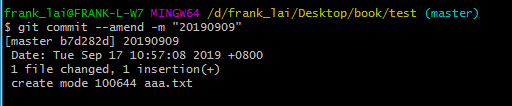
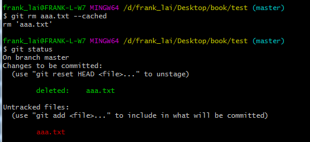

# 1.查詢環境所有指令

### **git config --list**

Git可以在三個地方設定環境變數，
	1. –system: 系統，git config –system –list。
	2. –global: 全域，git config –global –list。
	3. –local: repository專案，git config –local –list。

# 2.更改提交帳密指令

### **git config --global user.name "frank lai"**

### **git config --global user.email "frank@test.com.tw"**

# 3.取消設置的環境面數

### **git config --local --unset user.name**


# 4.設定檔的位置

不管是透過終端機指令或是圖形介面工具做的設定，所有 Git 相關的設定，預設會在自己帳號下的 `.gitconfig` 這個檔案裡，所以使用一般的文字編輯器，直接手動修改這個檔案也會有一樣的效果：

檔案：`~/.gitconfig`

```console
[user]
  	name = frank_lai
	email = frank_lai@gmail.com
[core]
	excludesfile = /Users/frank/.gitignore_global
 
```


# 5.初次設定

```console
$ git config --global user.name "Frank Lai"
$ git config --global user.email jianhanlai@gmail.com
```

# 6.建立或刪除遠端branch

建立遠端branch跟關聯
git push --set-upstream origin branchName

刪除遠端分支
git push origin :branchName

git branch -a #查看所有分支(包含遠端)
git branch -r #查看遠端分支 
git branch -vv #查看本地分支所關聯的遠端分支

git branch -m old_branch new_branch #修改分支名子


# 7.查看某行最後是誰修改的

​    a.整個檔案

```console
$ git blame index.html
6783cc21 (Eddie Kao 2019-05-28 16:00:35 +0800  1) <!DOCTYPE html>
6783cc21 (Eddie Kao 2019-05-28 16:00:35 +0800  2) <html>
6783cc21 (Eddie Kao 2019-05-28 16:00:35 +0800  3)   <head>
6783cc21 (Eddie Kao 2019-05-28 16:00:35 +0800  4)     <meta charset="utf-8">
6783cc21 (Eddie Kao 2019-05-28 16:00:35 +0800  5)     <title>首頁</title>
6783cc21 (Eddie Kao 2019-05-28 16:00:35 +0800  6)   </head>
6783cc21 (Eddie Kao 2019-05-28 16:00:35 +0800  7)   <body>
7dc9302e (Eddie Kao 2019-05-28 16:00:49 +0800  8)     <div class="container">
7dc9302e (Eddie Kao 2019-05-28 16:00:49 +0800  9)     </div>
6783cc21 (Eddie Kao 2019-05-28 16:00:35 +0800 10)   </body>
6783cc21 (Eddie Kao 2019-05-28 16:00:35 +0800 11) </html>
```

​    b.檔案中的某幾行

```console
$ git blame -L 5,10 index.html
6783cc21 (Eddie Kao 2019-05-28 16:00:35 +0800  5)     <title>首頁</title>
6783cc21 (Eddie Kao 2019-05-28 16:00:35 +0800  6)   </head>
6783cc21 (Eddie Kao 2019-05-28 16:00:35 +0800  7)   <body>
7dc9302e (Eddie Kao 2019-05-28 16:00:49 +0800  8)     <div class="container">
7dc9302e (Eddie Kao 2019-05-28 16:00:49 +0800  9)     </div>
6783cc21 (Eddie Kao 2019-05-28 16:00:35 +0800 10)   </body>
```

# 8.修改 commit Description

git commit --amend -m "20190909"



# 9.把系統的管控紀錄移除

### 加上 –cached 參數

不管是系統的 `rm` 或是 `git rm` 指令，都會真的把這個檔案從工作目錄裡刪掉，但如果只是「我不是真的想把這個檔案刪掉，只是不想讓這個檔案再被 Git 控管了」的話，可以加上 `--cached` 參數

git rm aaa.txt --cached



# 10.如果看不到別人新建的遠端分支

用已下指令取回所有遠端分支

git fetch