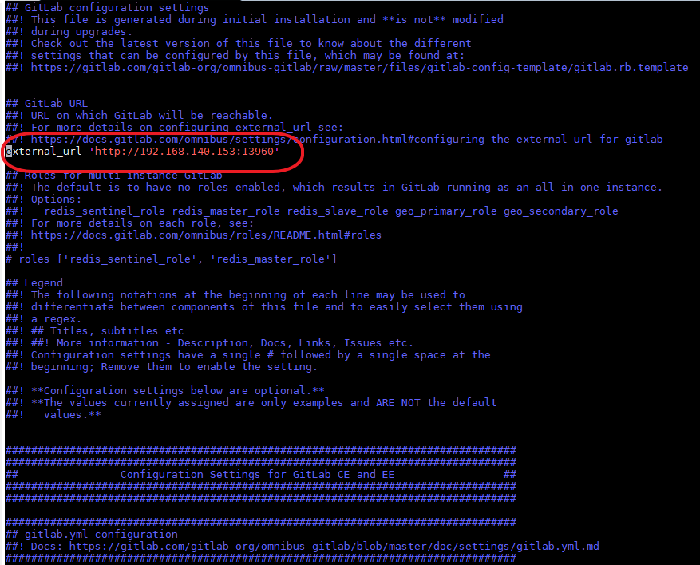
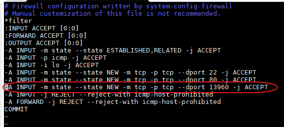
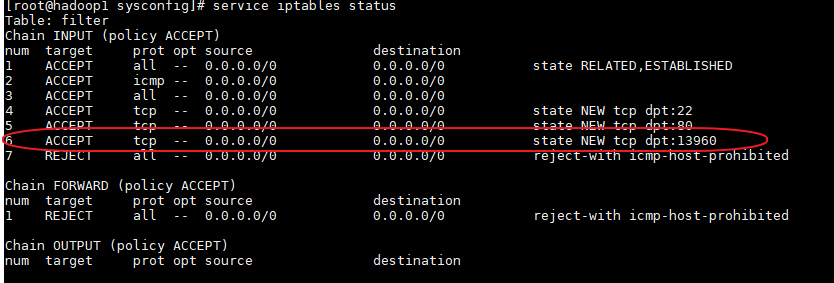

# 1.GitLab Server安裝

## **1.按照官網上的步驟安裝 https://about.gitlab.com/install/#centos-6**

#### 1. Install and configure the necessary dependencies


On CentOS 6 (and RedHat/Oracle/Scientific Linux 6), the commands below will also open HTTP and SSH access in the system firewall.

```
sudo yum install -y curl policycoreutils-python openssh-server cronie
sudo lokkit -s http -s ssh
```

Next, install Postfix to send notification emails. If you want to use another solution to send emails please skip this step and [configure an external SMTP server](https://docs.gitlab.com/omnibus/settings/smtp.html) after GitLab has been installed.(**此步驟為安裝mail server，如無需要可不安裝**)

```
sudo yum install postfix
sudo service postfix start
sudo chkconfig postfix on
```

During Postfix installation a configuration screen may appear. Select 'Internet Site' and press enter. Use your server's external DNS for 'mail name' and press enter. If additional screens appear, continue to press enter to accept the defaults.

#### 2. Add the GitLab package repository and install the package

Add the GitLab package repository.

```
curl https://packages.gitlab.com/install/repositories/gitlab/gitlab-ee/script.rpm.sh | sudo bash
```


Next, install the GitLab package. Change `https://gitlab.example.com` to the URL at which you want to access your GitLab instance. Installation will automatically configure and start GitLab at that URL.

For `https://` URLs GitLab will automatically [request a certificate with Let's Encrypt](https://docs.gitlab.com/omnibus/settings/ssl.html#lets-encrypthttpsletsencryptorg-integration), which requires inbound HTTP access and a valid hostname. You can also [use your own certificate](https://docs.gitlab.com/omnibus/settings/nginx.html#manually-configuring-https) or just use http://.

```
sudo EXTERNAL_URL="https://gitlab.example.com" yum -y install gitlab-ee
```

#### 3. Browse to the hostname and login

On your first visit, you'll be redirected to a password reset screen. Provide the password for the initial administrator account and you will be redirected back to the login screen. Use the default account's username `root` to login.

See our [documentation for detailed instructions on installing and configuration](https://docs.gitlab.com/omnibus/README.html#installation-and-configuration-using-omnibus-package).

#### 4. Set up your communication preferences

Visit our [email subscription preference center](https://about.gitlab.com/company/preference-center/) to let us know when to communicate with you. We have an explicit email opt-in policy so you have complete control over what and how often we send you emails.

Twice a month, we send out the GitLab news you need to know, including new features, integrations, docs, and behind the scenes stories from our dev teams. For critical security updates related to bugs and system performance, sign up for our dedicated security newsletter.


## 2.修改設定檔 

​	a.vim /etc/gitlab/gitlab.rb

將此參數**external_url**的URL設定成此主機IP及PORT號



​	b.更新設定

​		gitlab-ctl reconfigure

​	c.重啟 gitlab

​		gitlab-ctl restart

​	d:打開PORT號

​		vim /etc/sysconfig/iptables

​		

​	e. 重啟 service iptables restart

​	f.查看port是否開啟

​		service iptables status

​		

## 3.gitlab常用指令

#gitlab 啟動、停止、重啟   gitlab-ctl start/stop/restart 

#查看所有日誌 gitlab-ctl tail 

#查看nginx 訪問日誌 gitlab-ctl tail nginx/gitlab_acces.log 

#查看 postgresql 日誌 gitlab-ctl tail postgresql 

#查看狀態 gitlab-ctl status

## 4.登入網址

http://IP:port/gitlab 預設為root等入，第一次會要你改密碼

