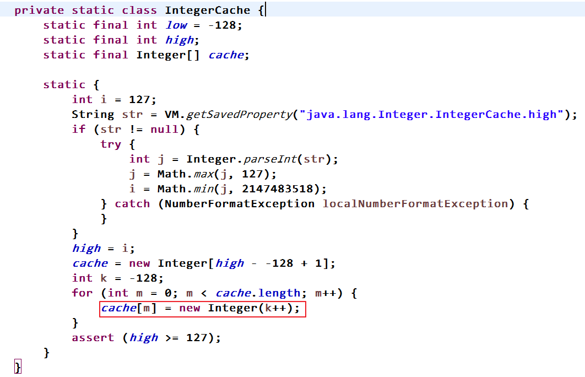

# 1.JAVA物件導向3大特性

1. 封裝(Encapsulation):將物件的狀態信息隱藏隱藏在物件內不，也就是成員屬性設成private，再提供public 的getter setter方法讓外界存取

2. 繼承:實現程式重複使用的手段

3. 多型:上層型別宣各的變數，參考到下層實體類別建立的物件

4. 方法override時，要都是類方法，或都是靜態方法，不能一個是類方法一個是靜態方法


# 2.Static Initialization Block and  Initialization Block:


1. ## Static Initialization Block and  Initialization Block:

   **普通初始化區塊負責對物建進行初始化**

   **靜態初始化區塊負責對類加載時對類進行初始化**

   **靜態初始化區塊只能對靜態成員進行處理**

   **靜態初始化區塊屬於靜態成員，所以遵循其規則(不能訪問非static 的變數或方法)**

   **當類被創建時，會先執行類的屬性根跟初始化區塊，期規則依程式寫的順序執行**

   **實際上初始化區塊是個假象，當編譯完成後，其初始化區快會被填進每個建構式中的最前面**

   

   1. 執行順序:

      Static Initialization Block --> Initialization Block --> constructor

   2. 當有父類時:

      ​      **父** Static Initialization Block 

      -->**子** Static Initialization Block 

      -->**父** Initialization Block 

      -->**父** constructor 

      -->**子** Initialization Block 

      -->**子** constructor

      

   3. 區別

      - static block前有static關鍵字，但non-static block沒有。
      - static block不論建構了多少實例，只會在第一次建構前執行一次，non-static block則是每次建構都被執行。
      - static block的順序先於non-static block。
      - static block是在JVM的class loader載入該類別時被執行，non-static block是在建構實例時被執行。
      - static block僅能存取靜態成員變數及方法，無法存取非靜態成員變數及方法，non-static block可以存取靜態及非靜態的成員變數及方法。

   4. 

   5. 

   6. 


# 3.基本型別包裝類:


1.因IntegerJDK預設會把127~-128的值放進cach裡，故直接用==式參考到同一個cach裡的值，但超過此範圍就無法用==比較，會建立新的物建在記憶體裡，其參考位子不同



2.JDK1.7後提供compare(value1,value2)來進行比較兩數相不相等

```java
        Integer i = 128;
        Integer j = 129;
        System.out.println(Integer.compare(i, j)); //-1
        i = 128;
        j = 128;
        System.out.println(Integer.compare(i, j)); //0
        i = 129;
        j = 128;
        System.out.println(Integer.compare(i, j)); //1
```

