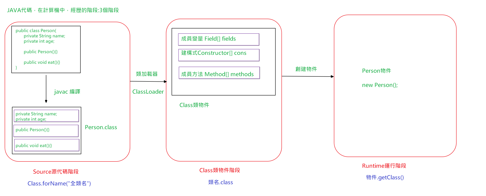

# JAVA 反射

* 框架：半成品軟體。可以在框架的基礎上進行軟體開發，簡化編碼
* 反射：將類別的各個組成部分封裝為其他對象，這就是反射機制
  * 好處：
    1. 可以在程式運行過程中，操作這些物件。
    2. 可以解耦，提高程式的可擴展性。





* 取得Class物件的方式：
  1. Class.forName("全類名")：將字節碼檔案載入進內存，返回Class對象
     * 多用於設定文件，將類別名稱定義在設定檔中。讀取文件，載入類
  2. 類別名稱.class：透過類別名稱的屬性class取得
     * 多用於參數的傳遞
  3. 物件.getClass()：getClass()方法在Object類別中定義著。
     * 多用於物件的取得字節碼的方式

  * 結論：
  同一個字節碼檔案(*.class)在一次程式運作過程中，只會被載入一次，不論透過哪一種方式取得的Class物件都是同一個。


* Class物件功能：
  * 取得功能：
    1. 取得成員變數們
       * Field[] getFields() ：取得所有public修飾的成員變數
       * Field getField(String name) 取得指定名稱的 public修飾的成員變數

       * Field[] getDeclaredFields() 取得所有的成員變量，不考慮修飾符
       * Field getDeclaredField(String name)
    2. 獲取構造方法們
       * Constructor<?>[] getConstructors()
       * Constructor<T> getConstructor(類別<?>... parameterTypes)

       * Constructor<T> getDeclaredConstructor(類別<?>... parameterTypes)
       * Constructor<?>[] getDeclaredConstructors()
    3. 獲取成員方法們：
       * Method[] getMethods()
       * Method getMethod(String name, 類別<?>... parameterTypes)

       * Method[] getDeclaredMethods()
       * Method getDeclaredMethod(String name, 類別<?>... parameterTypes)

    4. 取得全類名
       * String getName()


Person類
```java
public class Person {
    private String name;
    private int age;

    public String a;
    protected String b;
    String c;
    private String d;


    public Person() {
    }

    public Person(String name, int age) {

        this.name = name;
        this.age = age;
    }

    public String getName() {
        return name;
    }

    public void setName(String name) {
        this.name = name;
    }

    public int getAge() {
        return age;
    }

    public void setAge(int age) {
        this.age = age;
    }

    @Override
    public String toString() {
        return "Person{" +
                "name='" + name + '\'' +
                ", age=" + age +
                ", a='" + a + '\'' +
                ", b='" + b + '\'' +
                ", c='" + c + '\'' +
                ", d='" + d + '\'' +
                '}';
    }


    public void eat(){
        System.out.println("eat...");
    }

    public void eat(String food){
        System.out.println("eat..."+food);
    }
}

```

* Field：成員變數
  * 操作：
    1. 設定值
       * void set(Object obj, Object value)
    2. 獲取值
       * get(Object obj)

    3. 忽略存取權限修飾符的安全性檢查
       * setAccessible(true):暴力反射

```java
    public static void main(String[] args) throws Exception {

        //0.取得Person的Class對象
        Class personClass = Person.class;
        /*
             1. 取得成員變數們
                 * Field[] getFields()
                 * Field getField(String name)

                 * Field[] getDeclaredFields()
                 * Field getDeclaredField(String name)

         */
        //1.Field[] getFields()取得所有public修飾的成員變數
        Field[] fields = personClass.getFields();
        for (Field field : fields) {
            System.out.println(field);
        }

        System.out.println("------------");
        //2.Field getField(String name)
        Field a = personClass.getField("a");
        //取得成員變數a 的值
        Person p = new Person();
        Object value = a.get(p);
        System.out.println(value);
        //設定a的值
        a.set(p,"Frank");
        System.out.println(p);

        System.out.println("===================");

        //Field[] getDeclaredFields()：取得所有的成員變量，不考慮修飾符
        Field[] declaredFields = personClass.getDeclaredFields();
        for (Field declaredField : declaredFields) {
            System.out.println(declaredField);
        }
        //Field getDeclaredField(String name)
        Field d = personClass.getDeclaredField("d");
        //忽略存取權限修飾符的安全性檢查
        d.setAccessible(true);//暴力反射
        Object value2 = d.get(p);
        System.out.println(value2);

    }
```

* Constructor:構造方法
  * 建立物件：
    * T newInstance(Object... initargs)
    * 
```java
Class personClass = Person.class;
Constructor constructor = personClass.getConstructor(String.class, int.class);
Object person = constructor.newInstance("Frank", 23);
System.out.println(person);
```

  * 如果使用空參數建構方法建立對象，操作可以簡化：Class對象的newInstance方法
  
```java
        Class personClass = Person.class;
        Object o = personClass.newInstance();
        System.out.println(o);
```

* Method：方法對象
  * 執行方法：
    * Object invoke(Object obj, Object... args)

  * 取得方法名稱：
    * String getName:取得方法名


```java
	public static void main(String[] args) throws Exception {

		// 0.取得Person的Class對象
		Class personClass = Person.class;
		/*
		 * 3. 獲取成員方法們： Method[] getMethods() Method getMethod(String name, 類別<?>...
		 * parameterTypes)
		 * 
		 * Method[] getDeclaredMethods() Method getDeclaredMethod(String name, 類別<?>...
		 * parameterTypes)
		 */
		// 取得指定名稱的方法
		Method eat_method = personClass.getMethod("eat");
		Person p = new Person();
		// 執行方法
		eat_method.invoke(p);

		Method eat_method2 = personClass.getMethod("eat", String.class);
		// 執行方法
		eat_method2.invoke(p, "飯");

		System.out.println("-----------------");

		// 取得所有public修飾的方法
		Method[] methods = personClass.getMethods();
		for (Method method : methods) {
			System.out.println(method);
			String name = method.getName();
			System.out.println(name);
			// method.setAccessible(true);
		}

		// 取得類別名稱
		String className = personClass.getName();
		System.out.println(className);// cn.itcast.domain.Person

	}
```

* 案例：
  * 需求：寫一個"框架"，不能改變該類別的任何程式碼的前提下，可以幫我們創建任意類別的對象，並且執行其中任意方法
    * 實現：
      1. 設定檔
      2. 反射
    * 步驟：
      1. 將需要建立的物件的全類名和需要執行的方法定義在設定檔中
      2. 在程式中載入讀取設定檔
      3. 使用反射技術來載入類別檔案進內存
      4. 建立對象
      5. 執行方法