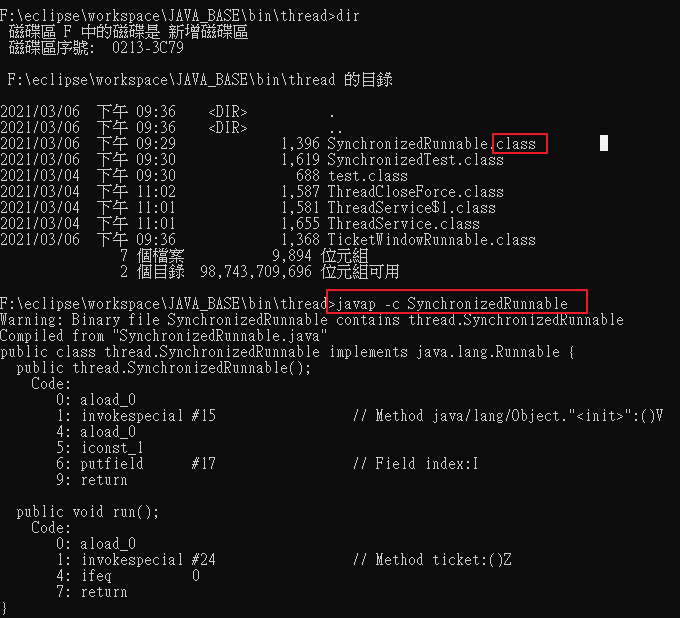

# javap——檢視class檔案的方法

java -c ClassName




# 開啟debug mode

在eclipse VM 參數裡面加

```
-Djavax.net.debug=all
-Djavax.net.ssl.trustStore=D:\projects\eclipse\workspaces\gitlab\java\jar\module\HotelDataExchange4\sslkeystore.jks
```

# 交整個資料夾打包成War

```
​jar cvf  solr.war ./*
```
