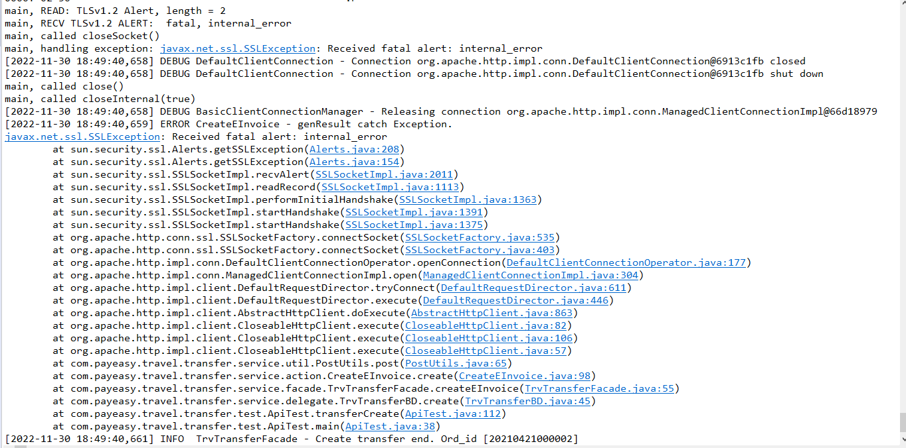

# 1.遇到以下錯誤:


**代表JAR打包的JDK版本與執行環境的版本不同，以上是以1.8打包，在1.7上執行時時出的錯誤訊息**

# 2. 憑證不合法


代表憑證不合法，處理方式如下:

1.匯入憑證至 ${JAVA_HOME}\jre\lib\security\cacerts

如是windows 與JDK同一層的JRE也需要匯入憑證

2.忽略SSL驗證

```java
public static void byPassSSL() {
		try {
			// 因為https走SSL需要會憑證，因這為測試，故直接bypass
			// HttpsURLConnection.setDefaultHostnameVerifier((hostname, session) ->
			// hostname.equals("10.10.90.204"));
			// Create a trust manager that does not validate certificate chains
			TrustManager[] trustAllCerts = new TrustManager[] { new X509TrustManager() {
				public java.security.cert.X509Certificate[] getAcceptedIssuers() {
					return null;
				}

				public void checkClientTrusted(X509Certificate[] certs, String authType) {
				}

				public void checkServerTrusted(X509Certificate[] certs, String authType) {
				}
			} };

			// Install the all-trusting trust manager
			SSLContext sc = SSLContext.getInstance("SSL");
			sc.init(null, trustAllCerts, new java.security.SecureRandom());
			HttpsURLConnection.setDefaultSSLSocketFactory(sc.getSocketFactory());

			// Create all-trusting host name verifier
			HostnameVerifier allHostsValid = new HostnameVerifier() {
				public boolean verify(String hostname, SSLSession session) {
					return true;
				}
			};

			// Install the all-trusting host verifier
			HttpsURLConnection.setDefaultHostnameVerifier(allHostsValid);
		} catch (Exception e) {
			e.printStackTrace();
		}
	}
```

# 3.call 別人API出不去問題

## 遇到以下問題



* 直接升級JDK

* 或者處理方式如下

```java
import org.apache.http.HttpEntity;
import org.apache.http.HttpHost;
import org.apache.http.HttpResponse;
import org.apache.http.HttpStatus;
import org.apache.http.client.ClientProtocolException;
import org.apache.http.client.HttpClient;
import org.apache.http.client.methods.HttpPost;
import org.apache.http.conn.ClientConnectionManager;
import org.apache.http.conn.ConnectTimeoutException;
import org.apache.http.conn.scheme.Scheme;
import org.apache.http.conn.scheme.SchemeRegistry;
import org.apache.http.conn.ssl.SSLContexts;
import org.apache.http.conn.ssl.SSLSocketFactory;
import org.apache.http.entity.StringEntity;
import org.apache.http.impl.client.DefaultHttpClient;
import org.apache.http.impl.client.HttpClients;

    private HttpClient createHttpClient() {
        SSLContext sslcontext = SSLContexts.createSystemDefault();
        SSLSocketFactory sslsf = new SSLSocketFactory(sslcontext) {

            @Override
            public Socket connectSocket(
                    int connectTimeout,
                    Socket socket,
                    HttpHost host,
                    InetSocketAddress remoteAddress,
                    InetSocketAddress localAddress,
                    HttpContext context) throws IOException, ConnectTimeoutException {
                if (socket instanceof SSLSocket) {
                    try {
                        PropertyUtils.setProperty(socket, "host", host.getHostName());
                    } catch (NoSuchMethodException ex) {} catch (IllegalAccessException ex) {} catch (InvocationTargetException ex) {}
                }
                return super.connectSocket(connectTimeout, socket, host, remoteAddress,
                        localAddress, context);
            }

        };

        return HttpClients.custom()
                .setSSLSocketFactory(sslsf)
                .build();
    }
```

