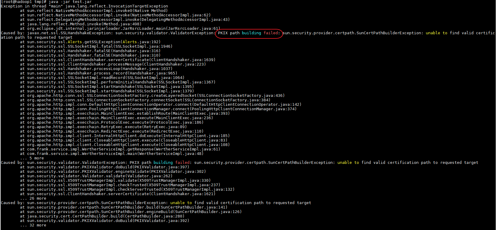

1.遇到以下錯誤:


**代表JAR打包的JDK版本與執行環境的版本不同，以上是以1.8打包，在1.7上執行時時出的錯誤訊息**

2.



代表憑證不合法，處理方式如下:

1.匯入憑證至 ${JAVA_HOME}\jre\lib\security\cacerts

如是windows 與JDK同一層的JRE也需要匯入憑證

2.忽略SSL驗證

```java
public static void byPassSSL() {
		try {
			// 因為https走SSL需要會憑證，因這為測試，故直接bypass
			// HttpsURLConnection.setDefaultHostnameVerifier((hostname, session) ->
			// hostname.equals("10.10.90.204"));
			// Create a trust manager that does not validate certificate chains
			TrustManager[] trustAllCerts = new TrustManager[] { new X509TrustManager() {
				public java.security.cert.X509Certificate[] getAcceptedIssuers() {
					return null;
				}

				public void checkClientTrusted(X509Certificate[] certs, String authType) {
				}

				public void checkServerTrusted(X509Certificate[] certs, String authType) {
				}
			} };

			// Install the all-trusting trust manager
			SSLContext sc = SSLContext.getInstance("SSL");
			sc.init(null, trustAllCerts, new java.security.SecureRandom());
			HttpsURLConnection.setDefaultSSLSocketFactory(sc.getSocketFactory());

			// Create all-trusting host name verifier
			HostnameVerifier allHostsValid = new HostnameVerifier() {
				public boolean verify(String hostname, SSLSession session) {
					return true;
				}
			};

			// Install the all-trusting host verifier
			HttpsURLConnection.setDefaultHostnameVerifier(allHostsValid);
		} catch (Exception e) {
			e.printStackTrace();
		}
	}
```

