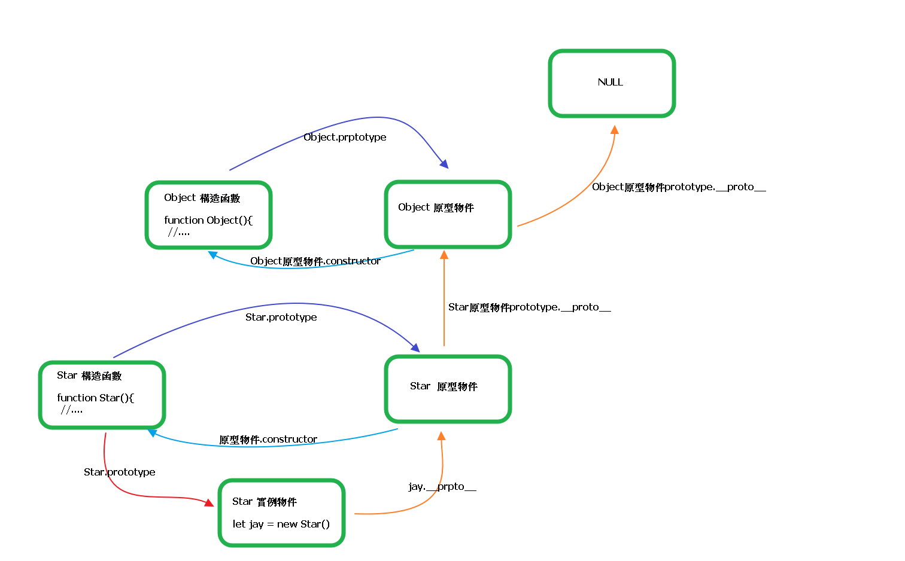

# Class

* 1.通過Class 關鍵字創建類，類名我們還是習慣性首字母大寫
* 2.類裡面有個constructor函數，可以接收傳遞過來來的參數，同時返回實例物件
* 3.constructor函數 只要 new 生成實例時，就會自動調用這個函數，如果我們不寫這個函數，類也會自動生成這個函數
* 4.生成實例new不能省略
* 5.創建類 類名後面不要加小括號，生成實例類名後面需要加小括號，構造函數不需要加function

## 創建Class 語法

```
    class 類名 {
        constructor ( 參數1 , 參數2 ) {
            this.屬性1 = 參數1
            this.屬性2 = 參數2
        }
    }
```

```javascript
    //1.創建Class 創建一個貓類
    class Cat {
        constructor ( name , age ) {
            this.name = name
            this.age = age
        }

    }

    //2.利用類創建物件
    let cat1 = new Cat('peggy',2)
    let cat2 = new Cat('Tom',3)

    console.log(cat1);
    console.log(cat2);
```

## 添加方法

* 1.我們類裡面所有的函數都不需要加function
* 2.多個函數方法之間不需要添加逗號分隔

```javascript
    //1.創建Class 創建一個貓類
    class Cat {
        constructor ( name , age ) {
            this.name = name
            this.age = age
        }
        //添加方法
        say () {
            console.log('喵喵喵~~');
        }
    }

    //2.利用類創建物件
    let cat1 = new Cat('peggy',2)
    let cat2 = new Cat('Tom',3)

    console.log(cat1);
    console.log(cat2);
```

# prototype 原型物件

* 1.每個構造函數都有prototype 指向構造函數的原型物件
* 2.每個原型物件都有constructor指向構造函數
* 3.每個物件都有__proto__指向原型物件

## 原型鏈


## 原型鏈查找機制

* 1.當訪問一個物件屬性時，首先查找該物件有沒有這個屬性
* 2.如果沒有就查找它的原型(也就是__proto__指向的prototype原型物件)
* 3.如果還沒有就查找原型物件的原型(Object原型物件)
* 4.依此類推一直查找到Object為止(NULL)
* 5.__proto__物件原型的意義就在於為物件成員查找機制提供一個方向，或者是說提供一條路線

# Function.prototype.call()方法

- 1.函數實力的call方法，可以指定函數內部this的的指向(及函數執行時所在的作用域)。在所指定的作用域中，調用該函數
- 2.`如果第一個參數沒設null 或 underfined，則等同於指定全局物件`

- 3.特性
    * 1.可以執行函數
    * 2.可以改變this指向的物件
    * 3.參數為個別參數

## 語法:

```
func.call(thisValue, arg1, arg2, ...)
```

 - 1.第一個參數是this所要指向的那個物件
 - 2.第二個參數是函數調用時所需的參數

example:

```javascript
// call 方法
        function fn(x, y) {
            console.log('我想喝手磨咖啡');
            console.log(this);
            console.log(x + y);


        }
        var o = {
            name: 'andy'
        };
        // fn();
        // 1. call() 可以調用函數
        // fn.call();
        // 2. call() 可以改變這個函數的this指向 此時這個函數的this 就指向了o這個物件
        fn.call(o, 1, 2);
```

```javascript

    var obj = {}

    var f = function () {
    return this
    }

    f() === window // true
    f.call(obj) === obj // true

```

# Function.prototype.apply()方法

- 1.apply方法的作用與call方法類似，也是改變this指向，然後再調用函數
- 2.唯一的區別是，它接收一個陣列作為函數執行時的參數
- 3.`如果第一個參數沒設null 或 underfined，則等同於指定全局物件`
- 4.特性

    * 1.可以執行函數
    * 2.可以改變this指向的物件
    * 3.參數為陣列

## 語法

```
func.apply(thisValue, [arg1, arg2, ...])
```

## 應用

 - 1.找出陣列中最大的元素

```javascript
var a = [10, 2, 4, 15, 9];
Math.max.apply(null, a) // 15，null大代表指定全局物件
```
 - 2.將陣列的空元素變成undefined

```javascript
Array.apply(null, ['a', ,'b'])
// [ 'a', undefined, 'b' ]
```
`空元素與undefined的區別在於，陣列的forEach方法會跳過空元素，但是不會跳過undefined，因此遍歷內部元素會得到不同的結果`


```javascript
    var a = ['a', , 'b'];
    function print(i) {
    console.log(i);
    }
    a.forEach(print)
    // a
    // b
    Array.apply(null, a).forEach(print)
    // a
    // undefined
    // b
```

 - 3.轉換偽陣列

 ```javascript
    Array.prototype.slice.apply({0: 1, length: 1}) // [1]
    Array.prototype.slice.apply({0: 1}) // []
    Array.prototype.slice.apply({0: 1, length: 2}) // [1, undefined]
    Array.prototype.slice.apply({length: 1}) // [undefined]
 ```

 - 4.綁定回掉函數的物件

 ```javascript
    var o = new Object();
    o.f = function () {
    console.log(this === o);
    }
    var f = function (){
    o.f.apply(o);
    // 或者 o.f.call(o);
    };
    // jQuery 的寫法
    $('#button').on('click', f);
 ```


```javascript
// call 方法
        function fn(x, y) {
            console.log('我想喝手磨咖啡');
            console.log(this);
            console.log(x + y);


        }
        var o = {
            name: 'andy'
        };
        // fn();
        // 1. apply() 可以調用函數
        // fn.apply();
        // 2. apply() 可以改變這個函數的this指向 此時這個函數的this 就指向了o這個物件
        fn.apply(o, [1, 2]);
```
# Function.prototype.bind()方法

 - 1.bind()方法用於函數體內的this綁定到某個物件，然後返回一個新函數
 - 2.bind()可以接受多個參數，將這些參數綁定到原函數的參數

- 3.特性
    * 1.可以改變this指向的物件
    * 2.參數為個別參數

```javascript
    var counter = {
    count: 0,
    inc: function () {
        this.count++;
    }
    };
    var func = counter.inc.bind(counter);
    func();
    counter.count // 1
```

`上面代碼中，counter.inc()方法被賦值給變量func。這時必須用bind()方法將inc()內部的this，綁定到counter，否則就會出錯。`

this綁定到其他物件也是可以的。

```javascript
    var counter = {
    count: 0,
    inc: function () {
        this.count++;
    }
    };
    var obj = {
    count: 100
    };
    var func = counter.inc.bind(obj);
    func();
    obj.count // 101
```

`綁定參數例子`

```javascript
var add = function (x, y) {
  return x * this.m + y * this.n;
}
var obj = {
  m: 2,
  n: 2
};
var newAdd = add.bind(obj, 5);
newAdd(5) // 20

```
上面代碼中，bind()方法除了綁定this物件，還將add()函數的第一個參數x綁定成5，然後返回一個新函數newAdd()，這個函數只要再接受一個參數y就能運行了。

## bind方法注意事項

- 1.每一次返回一個新函數

bind()方法每運行一次，就返回一個新函數，這會產生一些問題。比如，監聽事件的時候，不能寫成下面這樣。

```javascript
    element.addEventListener('click', o.m.bind(o));
```
上面代碼中，click事件綁定bind()方法生成的一個匿名函數。這樣會導致無法取消綁定，所以下面的代碼是無效的。

```javascript
    element.removeEventListener('click', o.m.bind(o));  
```

正確的方法是寫成下面這樣：

```javascript
    var listener = o.m.bind(o);
    element.addEventListener('click', listener);
    //  ...
    element.removeEventListener('click', listener);
```

- 2.結合回調函數使用

回調函數是 JavaScript 最常用的模式之一，但是一個常見的錯誤是，將包含this的方法直接當作回調函數。解決方法就是使用bind()方法，將counter.inc()綁定counter。

```javascript
var counter = {
  count: 0,
  inc: function () {
    'use strict';
    this.count++;
  }
};
function callIt(callback) {
  callback();
}
callIt(counter.inc.bind(counter));
counter.count // 1
```
上面代碼中，callIt()方法會調用回調函數。這時如果直接把counter.inc傳入，調用時counter.inc()內部的this就會指向全局對象。使用bind()方法將counter.inc綁定counter以後，就不會有這個問題，this總是指向counter。

# call、apply、bind 區別

## 1.call、apply 區別在於參數型態不同，call為一般參數，apply為陣列參數

- 1.原函數的參數，在call方法中必需一個一個添加，在apply必需以陣列的方式添加

```javascript
    function f(x, y){
    console.log(x + y);
    }
    f.call(null, 1, 1) // 2
    f.apply(null, [1, 1]) // 2
```

## 2.bind與call、apply最大的不同在於他不會立即執行函數

- 1.call、apply會立即執行，bind不會

# 閉包

* 1.一個作用域可以訪問另一個函數的局部變數
* 2.閉包的作用:延伸變數的作用範圍

# 淺拷貝

## Object.assign es6新增的方法 

```
Object.assign(target, ...sources)   
```

```javascript
// 淺拷貝只是拷貝一層, 更深層次對象級別的只拷貝引用.
        var obj = {
            id: 1,
            name: 'andy',
            msg: {
                age: 18
            }
        };
        var o = {};
        // for (var k in obj) {
        //     // k 是屬性名   obj[k] 屬性值
        //     o[k] = obj[k];
        // }
        // console.log(o);
        // o.msg.age = 20;
        // console.log(obj);

        console.log('--------------');
        Object.assign(o, obj);
        console.log(o);
        o.msg.age = 20;
        console.log(obj);
```

# 深拷貝

```javascript
// 深拷貝拷貝多層, 每一級別的數據都會拷貝.
        var obj = {
            id: 1,
            name: 'andy',
            msg: {
                age: 18
            },
            color: ['pink', 'red']
        };
        var o = {};
        // 封裝函數 
        function deepCopy(newobj, oldobj) {
            for (var k in oldobj) {
                // 判斷我們的屬性值屬於那種數據類型
                // 1. 獲取屬性值  oldobj[k]
                var item = oldobj[k];
                // 2. 判斷這個值是否是陣列
                if (item instanceof Array) {
                    newobj[k] = [];
                    deepCopy(newobj[k], item)
                } else if (item instanceof Object) {
                    // 3. 判斷這個值是否是物件
                    newobj[k] = {};
                    deepCopy(newobj[k], item)
                } else {
                    // 4. 屬於簡單數據類型
                    newobj[k] = item;
                }

            }
        }
        deepCopy(o, obj);
        console.log(o);

        var arr = [];
        console.log(arr instanceof Object);
        o.msg.age = 20;
        console.log(obj);
```

# let 

* 1.只在塊級作用域中執行({}中執行)
* 2.不存在變數提升效果

# const

* 1.用來定義常數
* 2.一定要給初始值
* 3.一般常數使用大寫字母命名
* 4.常數值不能修改
* 5.只在塊級作用域中執行({}中執行)
* 6.對於陣列與物件的元素修改，不算對常數的修改，因為變數裡存的是陣列或物件的參考位子

# 變數解構賦值

```javascript
//ES6 允許按照一定模式從數組和對像中提取值，對變量進行賦值，
        //這被稱為解構賦值。
        //1. 數組的結構
        // const F4 = ['小瀋陽','劉能','趙四','宋小寶'];
        // let [xiao, liu, zhao, song] = F4;
        // console.log(xiao);
        // console.log(liu);
        // console.log(zhao);
        // console.log(song);

        //2. 對象的解構
        // const zhao = {
        //     name: '趙本山',
        //     age: '不詳',
        //     xiaopin: function(){
        //         console.log("我可以演小品");
        //     }
        // };

        // let {name, age, xiaopin} = zhao;
        // console.log(name);
        // console.log(age);
        // console.log(xiaopin);
        // xiaopin();

        let {xiaopin} = zhao;
        xiaopin();
```

# 模板字串 (``)

* 1.可以用${}拼接變數值
* 2.可以使用換行符

```javascript
    //可以輸入換行符
    let message = `大家好!!
                    我叫FRANK
                    `
    console.log(message);
    
    
    let name = "frank"
    let age = 33
    //字串拼接，使用${}拼接變數值
    let str = `我的名子叫${name}年齡為${age}`
    console.log(str);
```

# 物件的簡化寫法

```javascript
        let name = 'FRANK';
        let change = function(){
            console.log('大家好!!');
        }

        //原始ES5寫法
        const school1 = {
            name: name,
            change: change,
            improve: function () {
                console.log("我是改善...");
            }
        }

        //簡化後寫法
        const school2 = {
            name,
            change,
            improve(){
                console.log("我是改善...");
            }
        }

        console.log(school1);
        console.log(school2);
```

# `ES6 模塊`

## import

### `模塊加載規則`
- 1.如果腳本文件省略了後綴名，比如`import './foo'`，Node 會依次嘗試四個後綴名：`./foo.mjs`、`./foo.js`、`./foo.json`、.`/foo.node`。如果這些腳本文件都不存在，Node 就會去加載`./foo/package.json`的`main`字段指定的腳本。如果./foo/package.json不存在或者沒有main字段，那麼就會依次加載`./foo/index.mjs`、`./foo/index.js`、`./foo/index.json`、`./foo/index.node`。如果以上四個文件還是都不存在，就會拋出錯誤。
