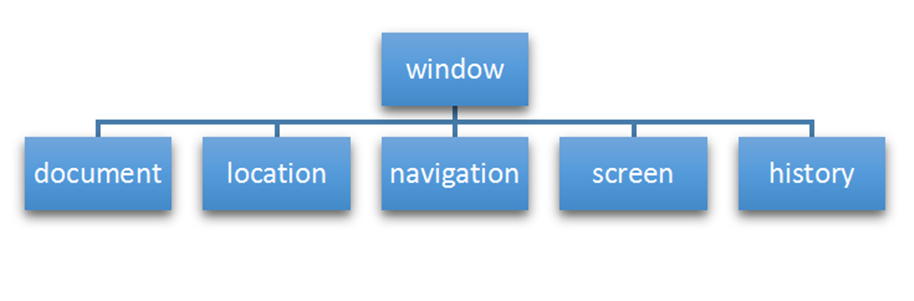

# BOM (Browser Object Model) 瀏覽器物件模型

* 1.BOM（Browser Object Model）即瀏覽器物件模型，它提供了獨立於內容而與瀏覽器窗口進行交互的對象，其核心物件是 window。
* 2.BOM 由一系列相關的對象構成，並且每個物件都提供了很多方法與屬性。
* 3.BOM 缺乏標準，JavaScript 語法的標準化組織是 ECMA，DOM 的標準化組織是 W3C，BOM 最初是Netscape 瀏覽器標準的一部分。


# BOM 比 DOM更大，它包含DOM




# BOM 事件

## 窗口加載事件 

* 1.window.onload 是等待頁面內容全部加載完畢後，再去執行處理函數
* 2.window.onload 只能寫一次，寫多個只會執行最後一個，addEventListener方式可以寫多個

### 語法

```
window.onload = function(){}
 
window.addEventListener("load",function(){});

document.addEventListener('DOMContentLoaded',function(){})

```

* 3.DOMContentLoaded 事件觸發時，僅當DOM加載完成，不包括樣式表，圖片，flash等等。
* 4.Ie9以上才支持DOMContentLoaded 
* 5.如果頁面的圖片很多的話, 從用戶訪問到onload觸發可能需要較長的時間, 交互效果就不能實現，必然影響用戶的體驗，此時用 DOMContentLoaded 事件比較合適

## 調整窗口大小事件

* 1.只要窗口大小發生像速變化，就會觸發這個事件
* 2.經常利用這個事件完成響應是布局，window.innerWidth為當前屏幕的寬度

### 語法

```
window.onresize = function(){}

window.addEventListener("resize",function(){});


```


## 定時器

* 1.setTimeout() :只會執行一次

* 2.setInterval()  :會持續執行

### setTimeout 定時器

#### 語法
```
window.setTimeout(回調函數), [延遲的毫秒數]);

//停止定時器
window.clearTimeout(timeoutID)

```
### 定時器例子

```html
<!DOCTYPE html>
<html lang="en">

<head>
    <meta charset="UTF-8">
    <meta name="viewport" content="width=device-width, initial-scale=1.0">
    <meta http-equiv="X-UA-Compatible" content="ie=edge">
    <title>Document</title>
</head>

<body>
    <script>
        // 1. setTimeout 
        // 語法規範：  window.setTimeout(調用函數, 延時時間);
        // 1. 這個window在調用的時候可以省略
        // 2. 這個延時時間單位是毫秒 但是可以省略，如果省略默認的是0
        // 3. 這個調用函數可以直接寫函數 還可以寫 函數名 還有一個寫法 '函數名()'
        // 4. 頁面中可能有很多的定時器，我們經常給定時器加標識符 （名字)
        // setTimeout(function() {
        //     console.log('時間到了');

        // }, 2000);
        function callback() {
            console.log('爆炸了');

        }
        var timer1 = setTimeout(callback, 3000);
        var timer2 = setTimeout(callback, 5000);
        // setTimeout('callback()', 3000); // 不提倡這個寫法
    </script>
</body>

</html>
```
### 停止定時器例子

```html
<!DOCTYPE html>
<html lang="en">

<head>
    <meta charset="UTF-8">
    <meta name="viewport" content="width=device-width, initial-scale=1.0">
    <meta http-equiv="X-UA-Compatible" content="ie=edge">
    <title>Document</title>
</head>

<body>
    <button>點擊停止定時器</button>
    <script>
        var btn = document.querySelector('button');
        var timer = setTimeout(function() {
            console.log('爆炸了');

        }, 5000);
        btn.addEventListener('click', function() {
            clearTimeout(timer);
        })
    </script>
</body>

</html>
```

### setInterval 定時器

#### 語法

```
window.setInterval(回調函數), [延遲的毫秒數]);

//停止定時器
window.clearInterval(intervalID)
```

### 頁面倒數計時器
```html
<!DOCTYPE html>
<html lang="en">

<head>
    <meta charset="UTF-8">
    <meta name="viewport" content="width=device-width, initial-scale=1.0">
    <meta http-equiv="X-UA-Compatible" content="ie=edge">
    <title>Document</title>
    <style>
        div {
            margin: 200px;
        }
        
        span {
            display: inline-block;
            width: 40px;
            height: 40px;
            background-color: #333;
            font-size: 20px;
            color: #fff;
            text-align: center;
            line-height: 40px;
        }
    </style>
</head>

<body>
    <div>
        <span class="hour">1</span>
        <span class="minute">2</span>
        <span class="second">3</span>
    </div>
    <script>
        // 1. 獲取元素 
        var hour = document.querySelector('.hour'); // 小時的黑色盒子
        var minute = document.querySelector('.minute'); // 分鐘的黑色盒子
        var second = document.querySelector('.second'); // 秒數的黑色盒子
        var inputTime = +new Date('2019-5-1 18:00:00'); // 返回的是用戶輸入時間總的毫秒數
        countDown(); // 我們先調用一次這個函數，防止第一次刷新頁面有空白 
        // 2. 開啟定時器
        setInterval(countDown, 1000);

        function countDown() {
            var nowTime = +new Date(); // 返回的是當前時間總的毫秒數
            var times = (inputTime - nowTime) / 1000; // times是剩餘時間總的秒數 
            var h = parseInt(times / 60 / 60 % 24); //時
            h = h < 10 ? '0' + h : h;
            hour.innerHTML = h; // 把剩餘的小時給 小時黑色盒子
            var m = parseInt(times / 60 % 60); // 分
            m = m < 10 ? '0' + m : m;
            minute.innerHTML = m;
            var s = parseInt(times % 60); // 當前的秒
            s = s < 10 ? '0' + s : s;
            second.innerHTML = s;
        }
    </script>
</body>

</html
```
### 停止定時器例子

```html
<!DOCTYPE html>
<html lang="en">

<head>
    <meta charset="UTF-8">
    <meta name="viewport" content="width=device-width, initial-scale=1.0">
    <meta http-equiv="X-UA-Compatible" content="ie=edge">
    <title>Document</title>
</head>

<body>
    <button class="begin">開啟定時器</button>
    <button class="stop">停止定時器</button>
    <script>
        var begin = document.querySelector('.begin');
        var stop = document.querySelector('.stop');
        var timer = null; // 全局變量  null是一個空對象
        begin.addEventListener('click', function() {
            timer = setInterval(function() {
                console.log('ni hao ma');

            }, 1000);
        })
        stop.addEventListener('click', function() {
            clearInterval(timer);
        })
    </script>
</body>

</html>
```

## this 指向誰?

* 1.方法調用中誰調用this指向誰
* 2.全局作用域或者普通函數中this指向全局對象window（ 注意定時器裡面的this指向window）
* 3.構造函數中this指向構造函數的實例

```html
<!DOCTYPE html>
<html lang="en">

<head>
    <meta charset="UTF-8">
    <meta name="viewport" content="width=device-width, initial-scale=1.0">
    <meta http-equiv="X-UA-Compatible" content="ie=edge">
    <title>Document</title>
</head>

<body>
    <button>點擊</button>
    <script>
        // this 指向問題 一般情況下this的最終指向的是那個調用它的對象

        // 1. 全局作用域或者普通函數中this指向全局對象window（ 注意定時器裡面的this指向window）
        console.log(this);

        function fn() {
            console.log(this);

        }
        window.fn();
        window.setTimeout(function() {
            console.log(this);

        }, 1000);
        // 2. 方法調用中誰調用this指向誰
        var o = {
            sayHi: function() {
                console.log(this); // this指向的是 o 這個對象

            }
        }
        o.sayHi();
        var btn = document.querySelector('button');
        // btn.onclick = function() {
        //     console.log(this); // this指向的是btn這個按鈕對象

        // }
        btn.addEventListener('click', function() {
                console.log(this); // this指向的是btn這個按鈕對象

            })
            // 3. 構造函數中this指向構造函數的實例
        function Fun() {
            console.log(this); // this 指向的是fun 實例對象

        }
        var fun = new Fun();
    </script>
</body>

</html>
```


