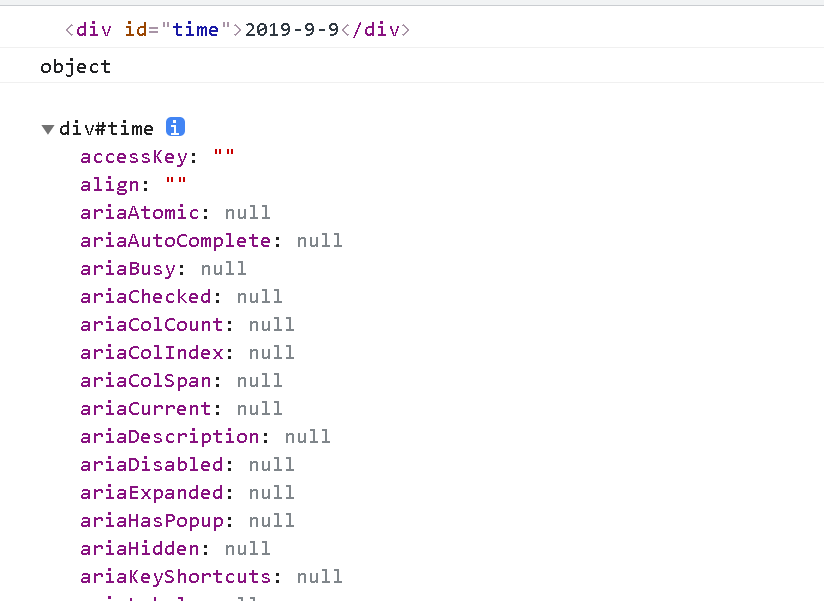
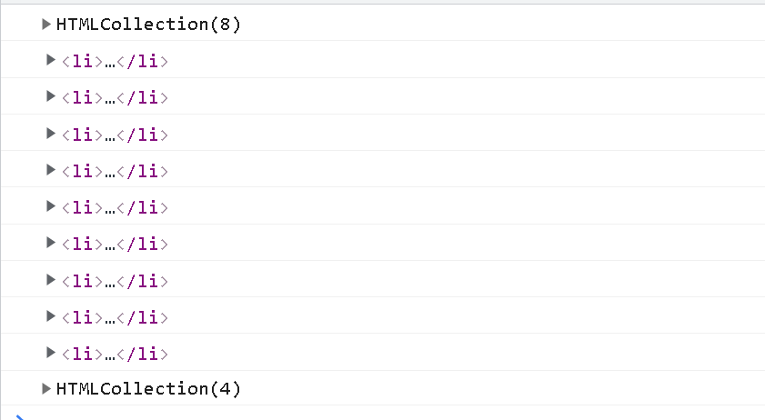
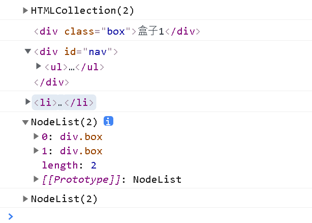
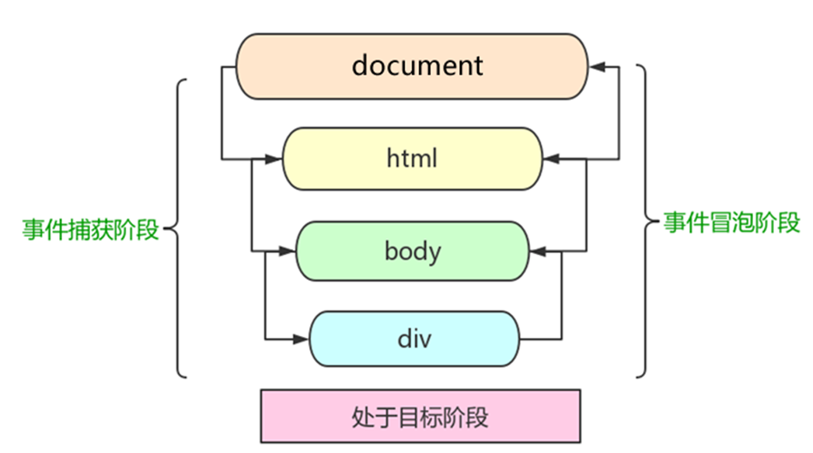
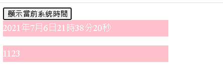

# 一、DOM

# 獲取頁面元素方法

## document.getElementById

```html
<!DOCTYPE html>
<html lang="en">

<head>
    <meta charset="UTF-8">
    <meta name="viewport" content="width=device-width, initial-scale=1.0">
    <meta http-equiv="X-UA-Compatible" content="ie=edge">
    <title>Document</title>
</head>

<body>
    <div id="time">2019-9-9</div>
    <script>
        var timer = document.getElementById('time');
        console.log(timer);
        console.log(typeof timer);
        // 5. console.dir 打印我們返回的元素物件，更好的查看裡面的屬性或方法
        console.dir(timer);
    </script>
</body>

</html>
```
result:


## document.getElementsByTagName

```html
<!DOCTYPE html>
<html lang="en">

<head>
    <meta charset="UTF-8">
    <meta name="viewport" content="width=device-width, initial-scale=1.0">
    <meta http-equiv="X-UA-Compatible" content="ie=edge">
    <title>Document</title>
</head>

<body>
    <ul>
        <li>知否知否，應是等你好久11</li>
        <li>知否知否，應是等你好久11</li>
        <li>知否知否，應是等你好久11</li>
        <li>知否知否，應是等你好久11</li>

    </ul>
    <ol id="ol">
        <li>生僻字</li>
        <li>生僻字</li>
        <li>生僻字</li>
        <li>生僻字</li>

    </ol>

    <script>
        // 1.返回的是 獲取過來元素對象的集合 以偽數組的形式存儲的
        var lis = document.getElementsByTagName('li');
        console.log(lis);
        console.log(lis[0]);
        // 2. 我們想要依次打印裡面的元素對像我們可以採取遍歷的方式
        for (var i = 0; i < lis.length; i++) {
            console.log(lis[i]);

        }
        // 3. 如果頁面中只有一個li 返回的還是偽數組的形式 
        // 4. 如果頁面中沒有這個元素 返回的是空的偽數組的形式
        // 5. element.getElementsByTagName('標籤名'); 父元素必須是指定的單個元素
        // var ol = document.getElementsByTagName('ol'); // [ol]
        // console.log(ol[0].getElementsByTagName('li'));
        var ol = document.getElementById('ol');
        console.log(ol.getElementsByTagName('li'));
    </script>
</body>

</html> 
```
result:




## H5 新增的方式(IE可能不適用)

* 1.document.getElementsByClassName :根據類名獲得某些元素集合
* 2.document.querySelector:返回指定選擇器的第一個元素物件  切記 裡面的選擇器需要加符號 .box(class)  #nav(id)
* 3.document.querySelectorAll:返回指定選擇器的所有元素物件集合

```html
<!DOCTYPE html>
<html lang="en">

<head>
    <meta charset="UTF-8">
    <meta name="viewport" content="width=device-width, initial-scale=1.0">
    <meta http-equiv="X-UA-Compatible" content="ie=edge">
    <title>Document</title>
</head>

<body>
    <div class="box">盒子1</div>
    <div class="box">盒子2</div>
    <div id="nav">
        <ul>
            <li>首頁</li>
            <li>產品</li>
        </ul>
    </div>
    <script>
        // 1. getElementsByClassName 根據類名獲得某些元素集合
        var boxs = document.getElementsByClassName('box');
        console.log(boxs);
        // 2. querySelector 返回指定選擇器的第一個元素對象  切記 裡面的選擇器需要加符號 .box  #nav
        var firstBox = document.querySelector('.box');
        console.log(firstBox);
        var nav = document.querySelector('#nav');
        console.log(nav);
        var li = document.querySelector('li');
        console.log(li);
        // 3. querySelectorAll()返回指定選擇器的所有元素對象集合
        var allBox = document.querySelectorAll('.box');
        console.log(allBox);
        var lis = document.querySelectorAll('li');
        console.log(lis);
    </script>
</body>

</html>
```
result:


# 獲取body 與 html 標籤

* 1.document.body:獲取body 標籤
* 2.document.documentElement : 獲取html 標籤

# 操作元素屬性

## 操作CSS

### 1.使用element.style.[CSS屬姓名(改成駝峰式命名法)]

```html
<!DOCTYPE html>
<html lang="en">

<head>
    <meta charset="UTF-8">
    <meta name="viewport" content="width=device-width, initial-scale=1.0">
    <meta http-equiv="X-UA-Compatible" content="ie=edge">
    <title>Document</title>
    <style>
        div {
            width: 200px;
            height: 200px;
            background-color: pink;
        }
    </style>
</head>

<body>
    <div></div>
    <script>
        // 1. 獲取元素
        var div = document.querySelector('div');
        // 2. 註冊事件
        div.onclick = function() {
            // div.style裡面的屬性 採取駝峰式命名法 
            this.style.backgroundColor = 'purple';
            this.style.width = '250px';
        }
    </script>
</body>

</html>
```

### 使用element.className 去修改，直接加上類名

```html
<!DOCTYPE html>
<html lang="en">

<head>
    <meta charset="UTF-8">
    <meta name="viewport" content="width=device-width, initial-scale=1.0">
    <meta http-equiv="X-UA-Compatible" content="ie=edge">
    <title>Document</title>
    <style>
        div {
            width: 100px;
            height: 100px;
            background-color: pink;
        }
        
        .change {
            background-color: purple;
            color: #fff;
            font-size: 25px;
            margin-top: 100px;
        }
    </style>
</head>


<body>
    <div class="first">文本</div>
    <script>
        // 1. 使用 element.style 獲得修改元素樣式  如果樣式比較少 或者 功能簡單的情況下使用
        var test = document.querySelector('div');
        test.onclick = function() {
            // this.style.backgroundColor = 'purple';
            // this.style.color = '#fff';
            // this.style.fontSize = '25px';
            // this.style.marginTop = '100px';
            // 讓我們當前元素的類名改為了 change

            // 2. 我們可以通過 修改元素的className更改元素的樣式 適合於樣式較多或者功能複雜的情況
            // 3. 如果想要保留原先的類名，我們可以這麼做 多類名選擇器
            // this.className = 'change';
            this.className = 'first change';
        }
    </script>
</body>

</html>
```

# 標籤的自定義屬性

## 使用 setAttribute(屬性名,屬性值) 增加自定義屬性 (H5 有定義規範以 data- 開頭)

### 語法

```
element.setAttribute(name, value);
```

## 使用 getAttribute(屬性名) 獲取自定義屬性

### 語法

```
let attribute = element.getAttribute(attributeName);
```

## 使用 removeAttribute移除屬性 

### 語法

```
element.removeAttribute(attrName)
```

## H5 新增的獲取自訂義屬性的方法 dataset[屬性名] OR dataset.屬性名
* 1.dataset 是一個集合裡面存放了所有以 data- 開頭的自訂義屬性
* 2.如果自訂義屬性裡有多個-連接的單詞，我們獲取的時候採取駝峰式命名法 (data-list-name ===> listName)


```html
<!DOCTYPE html>
<html lang="en">

<head>
    <meta charset="UTF-8">
    <meta name="viewport" content="width=device-width, initial-scale=1.0">
    <meta http-equiv="X-UA-Compatible" content="ie=edge">
    <title>Document</title>
    <style>
        * {
            margin: 0;
            padding: 0;
        }
        
        li {
            list-style-type: none;
        }
        
        .tab {
            width: 978px;
            margin: 100px auto;
        }
        
        .tab_list {
            height: 39px;
            border: 1px solid #ccc;
            background-color: #f1f1f1;
        }
        
        .tab_list li {
            float: left;
            height: 39px;
            line-height: 39px;
            padding: 0 20px;
            text-align: center;
            cursor: pointer;
        }
        
        .tab_list .current {
            background-color: #c81623;
            color: #fff;
        }
        
        .item_info {
            padding: 20px 0 0 20px;
        }
        
        .item {
            display: none;
        }
    </style>
</head>

<body>
    <div class="tab">
        <div class="tab_list">
            <ul>
                <li class="current">商品介紹</li>
                <li>規格與包裝</li>
                <li>售後保障</li>
                <li>商品評價（50000）</li>
                <li>手機社區</li>
            </ul>
        </div>
        <div class="tab_con">
            <div class="item" style="display: block;">
                商品介紹模塊內容
            </div>
            <div class="item">
                規格與包裝模塊內容
            </div>
            <div class="item">
                售後保障模塊內容
            </div>
            <div class="item">
                商品評價（50000）模塊內容
            </div>
            <div class="item">
                手機社區模塊內容
            </div>

        </div>
    </div>
    <script>
        // 獲取元素
        var tab_list = document.querySelector('.tab_list');
        var lis = tab_list.querySelectorAll('li');
        var items = document.querySelectorAll('.item');
        // for循環綁定點擊事件
        for (var i = 0; i < lis.length; i++) {
            // 開始給5個小li 設置索引號 
            lis[i].setAttribute('data-index', i);
            lis[i].onclick = function() {
                // 1. 上的模塊選項卡，點擊某一個，當前這一個底色會是紅色，其餘不變 修改類名的方式

                // 先清除所有 其餘的li清除 class 這個類
                for (var i = 0; i < lis.length; i++) {
                    lis[i].className = '';
                }
                // 留下我自己 
                this.className = 'current';
                // 2. 下面的顯示內容模塊
                var index = this.getAttribute('data-index');
                console.log(index);
                // 先清除所有 讓其餘的item 這些div 隱藏
                for (var i = 0; i < items.length; i++) {
                    items[i].style.display = 'none';
                }
                // 留下我自己 讓對應的item 顯示出來
                items[index].style.display = 'block';
            }
        }
    </script>
</body>
```

# 節點操作

### 一般節點至少擁有 nodeType、nodeName、nodeValue 這3個基本屬性

* 1.元素節點 nodeType 為1
* 1.屬性節點 nodeType 為2
* 1.文本捷點 nodeType 為3(包含文字、空格、換行等)

## 父節點

* 1.parentNode :獲取父節點，得到的是最近的父節點，找不到就返回null

```HTML
<!DOCTYPE html>
<html lang="en">

<head>
    <meta charset="UTF-8">
    <meta name="viewport" content="width=device-width, initial-scale=1.0">
    <meta http-equiv="X-UA-Compatible" content="ie=edge">
    <title>Document</title>
</head>

<body>
    <div>我是div</div>
    <span>我是span</span>
    <ul>
        <li>我是li</li>
        <li>我是li</li>
        <li>我是li</li>
        <li>我是li</li>
    </ul>
    <div class="demo">
        <div class="box">
            <span class="erweima">×</span>
        </div>
    </div>

    <script>
        var erweima = document.querySelector('.erweima');
        console.log(erweima.parentNode);
    </script>
</body>

</html>
```

## 子節點

* 1.childNodes 獲取所有的子節點 包含 元入節點 文本節點等等
* 2.children 獲取所有的子元素節點(最常使用 幾乎所有瀏覽器都支援) 

```html
<!DOCTYPE html>
<html lang="en">

<head>
    <meta charset="UTF-8">
    <meta name="viewport" content="width=device-width, initial-scale=1.0">
    <meta http-equiv="X-UA-Compatible" content="ie=edge">
    <title>Document</title>
</head>

<body>
    <!-- 节点的优点 -->
    <div>我是div</div>
    <span>我是span</span>
    <ul>
        <li>我是li</li>
        <li>我是li</li>
        <li>我是li</li>
        <li>我是li</li>

    </ul>
    <ol>
        <li>我是li</li>
        <li>我是li</li>
        <li>我是li</li>
        <li>我是li</li>
    </ol>

    <div class="demo">
        <div class="box">
            <span class="erweima">×</span>
        </div>
    </div>

    <script>
        // DOM 提供的方法（API）获取
        var ul = document.querySelector('ul');
        var lis = ul.querySelectorAll('li');
        // 1. 子节点  childNodes 所有的子节点 包含 元素节点 文本节点等等
        console.log(ul.childNodes);
        console.log(ul.childNodes[0].nodeType);
        console.log(ul.childNodes[1].nodeType);
        // 2. children 获取所有的子元素节点 也是我们实际开发常用的
        console.log(ul.children);
    </script>
</body>

</html>
```


* 3.firstChild lastChild 獲取第一個或最後一個子節點，不管是文本節點還是元素節點
* 4.firstElementChild 返回第一個子元素節點，ie9才支持

```html
<!DOCTYPE html>
<html lang="en">

<head>
    <meta charset="UTF-8">
    <meta name="viewport" content="width=device-width, initial-scale=1.0">
    <meta http-equiv="X-UA-Compatible" content="ie=edge">
    <title>Document</title>
</head>

<body>
    <ol>
        <li>我是li1</li>
        <li>我是li2</li>
        <li>我是li3</li>
        <li>我是li4</li>
        <li>我是li5</li>
    </ol>
    <script>
        var ol = document.querySelector('ol');
        // 1. firstChild 第一個子節點 不管是文本節點還是元素節點
        console.log(ol.firstChild);
        console.log(ol.lastChild);
        // 2. firstElementChild 返回第一個子元素節點 ie9才支持
        console.log(ol.firstElementChild);
        console.log(ol.lastElementChild);
        // 3. 實際開發的寫法  既沒有兼容性問題又返回第一個子元素
        console.log(ol.children[0]);
        console.log(ol.children[ol.children.length - 1]);
    </script>
</body>

</html>
```

* 5.nextSibling 獲取下一個兄弟節點，包含元素節點或者 文本節點等等
* 6.nextElementSibling 得到下一個兄弟元素節點， ie9才支持

```html
<!DOCTYPE html>
<html lang="en">

<head>
    <meta charset="UTF-8">
    <meta name="viewport" content="width=device-width, initial-scale=1.0">
    <meta http-equiv="X-UA-Compatible" content="ie=edge">
    <title>Document</title>
</head>

<body>
    <div>我是div</div>
    <span>我是span</span>
    <script>
        var div = document.querySelector('div');
        // 1.nextSibling 下一個兄弟節點 包含元素節點或者 文本節點等等
        console.log(div.nextSibling);
        console.log(div.previousSibling);
        // 2. nextElementSibling 得到下一個兄弟元素節點
        console.log(div.nextElementSibling);
        console.log(div.previousElementSibling);
    </script>
</body>

</html>
```

* 7.可以封裝一個數來獲取兄弟節點(考慮IE時，使用方案)
```javascript
    function getNextElementSibling(element) {
        var el = element;
        while (el = el.nextSibling) {
        if (el.nodeType === 1) {
            return el;
        }
        }
        return null;
    }  

```

## 創建節點

* 1.document.createElement('tagName')

## 增加節點
* 1.node.appendChild(child)
* 2.node.insertBefore(child, 指定元素) 

```html
<!DOCTYPE html>
<html lang="en">

<head>
    <meta charset="UTF-8">
    <meta name="viewport" content="width=device-width, initial-scale=1.0">
    <meta http-equiv="X-UA-Compatible" content="ie=edge">
    <title>Document</title>
</head>

<body>
    <ul>
        <li>123</li>
    </ul>
    <script>
        // 1. 創建節點元素節點
        var li = document.createElement('li');
        // 2. 添加節點 node.appendChild(child)  node 父級  child 是子級 後面追加元素  類似於數組中的push
        var ul = document.querySelector('ul');
        ul.appendChild(li);
        // 3. 添加節點 node.insertBefore(child, 指定元素);
        var lili = document.createElement('li');
        ul.insertBefore(lili, ul.children[0]);
        // 4. 我們想要頁面添加一個新的元素 ： 1. 創建元素 2. 添加元素
    </script>
</body>

</html>
```

## 刪除節點

* 1.node.removeChild(child)  刪除指定節點


```html
<!DOCTYPE html>
<html lang="en">

<head>
    <meta charset="UTF-8">
    <meta name="viewport" content="width=device-width, initial-scale=1.0">
    <meta http-equiv="X-UA-Compatible" content="ie=edge">
    <title>Document</title>
</head>

<body>
    <button>刪除</button>
    <ul>
        <li>熊大</li>
        <li>熊二</li>
        <li>光頭強</li>
    </ul>
    <script>
        // 1.獲取元素
        var ul = document.querySelector('ul');
        var btn = document.querySelector('button');
        // 2. 刪除元素  node.removeChild(child)
        // ul.removeChild(ul.children[0]);
        // 3. 點擊按鈕依次刪除裡面的孩子
        btn.onclick = function() {
            if (ul.children.length == 0) {
                this.disabled = true;
            } else {
                ul.removeChild(ul.children[0]);
            }
        }
    </script>
</body>

</html>
```

## 複製節點

* 1.node.cloneNode()

    * 1. 如果括號參數為空或者為 false ，則是淺拷貝，即只克隆複製節點本身，不克隆裡面的子節點
    * 2. 如果括號參數為 true ，則是深度拷貝，會復制節點本身以及里面所有的子節點。
 
```HTML
<!DOCTYPE html>
<html lang="en">

<head>
    <meta charset="UTF-8">
    <meta name="viewport" content="width=device-width, initial-scale=1.0">
    <meta http-equiv="X-UA-Compatible" content="ie=edge">
    <title>Document</title>
</head>

<body>
    <ul>
        <li>1111</li>
        <li>2</li>
        <li>3</li>
    </ul>
    <script>
        var ul = document.querySelector('ul');
        var lili = ul.children[0].cloneNode(true);
        ul.appendChild(lili);
    </script>
</body>

</html>
```


# 事件

### 執行事件的步驟

* 1.獲取事件源(tag)
* 2.註冊事件(綁定事件)
* 3.添加事件處理程序(採函數賦值方式)

語法:

```javascript
element.on事件名 = function(){
    //事件執行...
}
```

Ex:
```javascript
let btn = document.getElementById('btn')
btn.onClick = function(){
    //事件執行...
}
```


## 註冊事件方式

* 1.傳統方式:利用 on 開頭的事件 例如:onclick 

    * 1.特點:只能註冊一個事件，第2個註冊的事件會蓋掉上次註冊的事件

* 2.方法監聽註冊方式

    * 1.使用addEventListener() ，IE9以下不適用
    * 2.使用attachEvent() ，IE9以下支援
    * 3.特點:可同時註冊多個事件

### addEventListener()

語法:

```
    eventTarget.addEventListener(type, listener[, useCapture])
```

參數:
```
    type：事件類型字符串，比如 click 、mouseover ，注意這裡不要帶 on
    listener：事件處理函數，事件發生時，會調用該監聽函數
    useCapture：可選參數，是一個布爾值，默認是 false。

```

```html
<!DOCTYPE html>
<html lang="en">

<head>
    <meta charset="UTF-8">
    <meta name="viewport" content="width=device-width, initial-scale=1.0">
    <meta http-equiv="X-UA-Compatible" content="ie=edge">
    <title>Document</title>
</head>

<body>
    <button>傳統註冊事件</button>
    <button>方法監聽註冊事件</button>
    <button>ie9 attachEvent</button>
    <script>
        var btns = document.querySelectorAll('button');
        // 1. 傳統方式註冊事件
        btns[0].onclick = function() {
            alert('hi');
        }
        btns[0].onclick = function() {
                alert('hao a u');
            }
            // 2. 事件偵聽註冊事件 addEventListener 
            // (1) 裡面的事件類型是字符串 必定加引號 而且不帶on
            // (2) 同一個元素 同一個事件可以添加多個偵聽器（事件處理程序）
        btns[1].addEventListener('click', function() {
            alert(22);
        })
        btns[1].addEventListener('click', function() {
                alert(33);
            })
            // 3. attachEvent ie9以前的版本支持
        btns[2].attachEvent('onclick', function() {
            alert(11);
        })
    </script>
</body>

</html>
```

### 註冊事件(兼容性作法)

```javascript
 function addEventListener(element, eventName, fn) {
      // 辦別當前瀏覽器是否支持 addEventListener 方法
      if (element.addEventListener) {
        element.addEventListener(eventName, fn);  // 第三個參數 默認是false
      } else if (element.attachEvent) {
        element.attachEvent('on' + eventName, fn);
      } else {
        // 相當於 element.onclick = fn;
        element['on' + eventName] = fn;
 }
```

## 刪除事件

### 傳統方式

* 1.eventTarget.onclick = null

### 方法監聽註冊方式

* 1.eventTarget.removeEventListener(type, listener[, useCapture])
* 2.eventTarget.detachEvent(eventNameWithOn, callback);

```html
<!DOCTYPE html>
<html lang="en">

<head>
    <meta charset="UTF-8">
    <meta name="viewport" content="width=device-width, initial-scale=1.0">
    <meta http-equiv="X-UA-Compatible" content="ie=edge">
    <title>Document</title>
    <style>
        div {
            width: 100px;
            height: 100px;
            background-color: pink;
        }
    </style>
</head>

<body>
    <div>1</div>
    <div>2</div>
    <div>3</div>
    <script>
        var divs = document.querySelectorAll('div');
        divs[0].onclick = function() {
                alert(11);
                // 1. 傳統方式刪除事件
                divs[0].onclick = null;
            }
            // 2. removeEventListener 刪除事件
        divs[1].addEventListener('click', fn) // 裡面的fn 不需要調用加小括號

        function fn() {
            alert(22);
            divs[1].removeEventListener('click', fn);
        }
        // 3. detachEvent
        divs[2].attachEvent('onclick', fn1);

        function fn1() {
            alert(33);
            divs[2].detachEvent('onclick', fn1);
        }
    </script>
</body>

</html>
```


### 兼容性方案

```javascript
    function removeEventListener(element, eventName, fn) {
        // 判斷當前瀏覽器是否支持 removeEventListener 方法
        if (element.removeEventListener) {
            element.removeEventListener(eventName, fn);  // 第三個參數 默認是false
        } else if (element.detachEvent) {
            element.detachEvent('on' + eventName, fn);
        } else {
            element['on' + eventName] = null;
    }
```


## 事件捕獲與冒泡

* 1.事件冒泡 : IE最早提出，事件開始由最具體的元素接收，然後逐級像上傳播到DOM最頂層節點的過程
* 2.事件捕獲 : 網景最早提出，由DOM最頂層節點開始，然後逐級向下傳播到具體的元素接收過程



### 1.JS代碼中只能執行捕獲階段或者冒泡階段其中的一種階段
### 2.onclick 和 attachEvent 只能得到冒泡階段
### 3.addEventListener(type,listener[, useCaoture]) 的第三個參數如果是true表示在事件捕獲階段調用事件處理程序，如果是false(不寫默認就是false)，表示在事件冒泡階段調用事件處理程序
### 4.大部分情況都是用冒泡階段
### 5.有些事件事沒有冒泡的，例如:onblur、onfocus、onmouseenter、onmouseleave


## 事件物件

### 什麼是事件物件

 * 1.官方解釋：event 物件代表事件的狀態，比如鍵盤按鍵的狀態、鼠標的位置、鼠標按鈕的狀態。
 * 2.簡單理解：事件發生後，跟事件相關的一系列信息數據的集合都放到這個物件裡面，這個物件就是事件物件 event，它有很多屬性和方法。
 * 3.IE6~8中沒有event，需用window.event 獲取

```javascript
  eventTarget.onclick = function(event) {} 
  eventTarget.addEventListener('click', function(event) {}）
  //這個 event 就是事件物件，我們還喜歡的寫成 e 或者 evt

  //兼容方案
  e = e || window.event

```

### e.target 和 this 的區別

* 1.this 是事件綁定的元素， 這個函數的調用者（綁定這個事件的元素）
* 2.e.target 是事件觸發的元素

```html
<!DOCTYPE html>
<html lang="en">

<head>
    <meta charset="UTF-8">
    <meta name="viewport" content="width=device-width, initial-scale=1.0">
    <meta http-equiv="X-UA-Compatible" content="ie=edge">
    <title>Document</title>
    <style>
        div {
            width: 100px;
            height: 100px;
            background-color: pink;
        }
    </style>
</head>

<body>
    <div>123</div>
    <ul>
        <li>abc</li>
        <li>abc</li>
        <li>abc</li>
    </ul>
    <script>
        // 常見事件對象的屬性和方法
        // 1. e.target 返回的是觸發事件的對象（元素）  this 返回的是綁定事件的對象（元素）
        // 區別 ： e.target 點擊了那個元素，就返回那個元素 this 那個元素綁定了這個點擊事件，那麼就返回誰
        var div = document.querySelector('div');
        div.addEventListener('click', function(e) {
            console.log(e.target);
            console.log(this);

        })
        var ul = document.querySelector('ul');
        ul.addEventListener('click', function(e) {
                // 我們給ul 綁定了事件  那麼this 就指向ul  
                console.log(this);
                console.log(e.currentTarget);

                // e.target 指向我們點擊的那個對象 誰觸發了這個事件 我們點擊的是li e.target 指向的就是li
                console.log(e.target);

            })
            // 了解兼容性
            // div.onclick = function(e) {
            //     e = e || window.event;
            //     var target = e.target || e.srcElement;
            //     console.log(target);

        // }
        // 2. 了解 跟 this 有個非常相似的屬性 currentTarget  ie678不認識
    </script>
</body>

</html>
```

## 返回事件的類型 e.type

```html
<!DOCTYPE html>
<html lang="en">

<head>
    <meta charset="UTF-8">
    <meta name="viewport" content="width=device-width, initial-scale=1.0">
    <meta http-equiv="X-UA-Compatible" content="ie=edge">
    <title>Document</title>
    <style>

    </style>
</head>

<body>
    <div>123</div>
    <script>
        // 常見事件對象的屬性和方法
        // 1. 返回事件類型
        var div = document.querySelector('div');
        div.addEventListener('click', fn);
        div.addEventListener('mouseover', fn);
        div.addEventListener('mouseout', fn);

        function fn(e) {
            console.log(e.type);

        }
    </script>
</body>

</html>
```

## 阻止事件冒泡

* 1.e.stopPropagation() (標準寫法)
* 2.e.cancelBubble=true (非標準 IE 6-8 用)

```html
<!DOCTYPE html>
<html lang="en">

<head>
    <meta charset="UTF-8">
    <meta name="viewport" content="width=device-width, initial-scale=1.0">
    <meta http-equiv="X-UA-Compatible" content="ie=edge">
    <title>Document</title>
    <style>
        .father {
            overflow: hidden;
            width: 300px;
            height: 300px;
            margin: 100px auto;
            background-color: pink;
            text-align: center;
        }
        
        .son {
            width: 200px;
            height: 200px;
            margin: 50px;
            background-color: purple;
            line-height: 200px;
            color: #fff;
        }
    </style>
</head>

<body>
    <div class="father">
        <div class="son">son兒子</div>
    </div>
    <script>
        // 常見事件對象的屬性和方法
        // 阻止冒泡  dom 推薦的標準 stopPropagation() 
        var son = document.querySelector('.son');
        son.addEventListener('click', function(e) {
            alert('son');
            e.stopPropagation(); // stop 停止  Propagation 傳播
            e.cancelBubble = true; // 非標準 cancel 取消 bubble 泡泡
        }, false);

        var father = document.querySelector('.father');
        father.addEventListener('click', function() {
            alert('father');
        }, false);
        document.addEventListener('click', function() {
            alert('document');
        })
    </script>
</body>

</html>
```

* 3.兼容方案

```javascript
  if(e && e.stopPropagation){
      e.stopPropagation();
  }else{
      window.event.cancelBubble = true;
  }

```

## 阻止默認事件

* 1.e.preventDefault()
* 2.e.returnValue
* 3.也可以利用return false

```html
<!DOCTYPE html>
<html lang="en">

<head>
    <meta charset="UTF-8">
    <meta name="viewport" content="width=device-width, initial-scale=1.0">
    <meta http-equiv="X-UA-Compatible" content="ie=edge">
    <title>Document</title>
    <style>

    </style>
</head>

<body>
    <a href="http://www.baidu.com">百度</a>
    <form action="http://www.baidu.com">
        <input type="submit" value="提交" name="sub">
    </form>
    <script>
        // 2. 阻止默認行為（事件） 讓鏈接不跳轉 或者讓提交按鈕不提交
        var a = document.querySelector('a');
        a.addEventListener('click', function(e) {
                e.preventDefault(); //  dom 標準寫法
            })
            // 3. 傳統的註冊方式
        a.onclick = function(e) {
            // 普通瀏覽器 e.preventDefault();  方法
            // e.preventDefault();
            // 低版本瀏覽器 ie678  returnValue  屬性
            // e.returnValue;
            // 我們可以利用return false 也能阻止默認行為 沒有兼容性問題 特點： return 後面的代碼不執行了， 而且只限於傳統的註冊方式
            return false;
            alert(11);
        }
    </script>
</body>

</html>
```

## 事件委託(代理、委派)

* 1.原理:不是每個子節點單獨設置事件監聽器，而是事件監聽器設置在其父節點上，然後利用冒泡原理再父節點上處理子節點需要做的事情
* 2.優點:指操作了一次DOM，提高效能

```html
<!DOCTYPE html>
<html lang="en">

<head>
    <meta charset="UTF-8">
    <meta name="viewport" content="width=device-width, initial-scale=1.0">
    <meta http-equiv="X-UA-Compatible" content="ie=edge">
    <title>Document</title>
</head>

<body>
    <ul>
        <li>知否知否，點我應有彈框在手！ </li>
        <li>知否知否，點我應有彈框在手！ </li>
        <li>知否知否，點我應有彈框在手！ </li>
        <li>知否知否，點我應有彈框在手！ </li>
        <li>知否知否，點我應有彈框在手！ </li>
    </ul>
    <script>
        // 事件委託的核心原理：給父節點添加偵聽器， 利用事件冒泡影響每一個子節點
        var ul = document.querySelector('ul');
        ul.addEventListener('click', function(e) {
            // alert('知否知否，點我應有彈框在手！');
            // e.target 這個可以得到我們點擊的對象
            // 再父節點上操作子節點該做的事情
            e.target.style.backgroundColor = 'pink';


        })
    </script>
</body>

</html>
```

## 禁止複製方式
* 1.不讓使用者開啟右鍵菜單 contextmenu
* 2.不讓使用者選擇文字 selectstart

```javascript
        // 1. contextmenu 我們可以禁用右鍵菜單
    document.addEventListener('contextmenu', function(e) {
            e.preventDefault();
        })
        // 2. 禁止選中文字 selectstart
    document.addEventListener('selectstart', function(e) {
        e.preventDefault();

    })
```

## 點擊事件 onclick

```html
<!DOCTYPE html>
<html lang="en">

<head>
    <meta charset="UTF-8">
    <meta name="viewport" content="width=device-width, initial-scale=1.0">
    <meta http-equiv="X-UA-Compatible" content="ie=edge">
    <title>Document</title>
    <style>
        div,
        p {
            width: 300px;
            height: 30px;
            line-height: 30px;
            color: #fff;
            background-color: pink;
        }
    </style>
</head>

<body>
    <button>顯示當前系統時間</button>
    <div>某個時間</div>
    <p>1123</p>
    <script>
        //1.獲取元素
        let btn = document.querySelector('button')
        let div = document.querySelector('div')
        //2.綁定點擊事件
        btn.onclick = function(){
            div.innerText = getDateTime()
        }

        function getDateTime() {
            let date = new Date()
            let year = date.getFullYear()
            let month = date.getMonth() + 1
            let day = date.getDay()
            let hour = date.getHours()
            let minutes = date.getMinutes()
            let seconds = date.getSeconds()
            let now = year + '年' + month + '月' + day + '日' + hour + '時' + minutes + '分' + seconds + '秒'
            return now
        }
    </script>
</body>

</html>
```
result:




```html
```

```html
```

