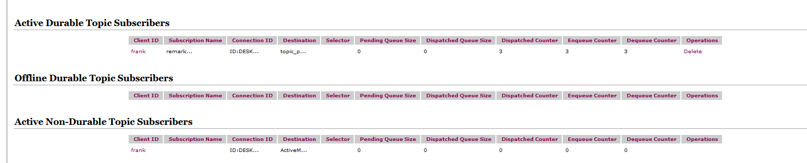
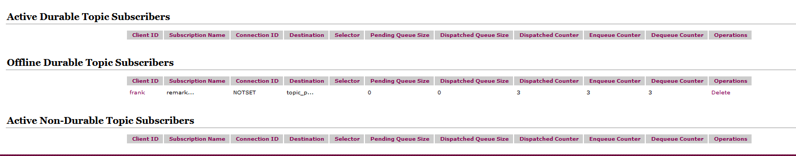
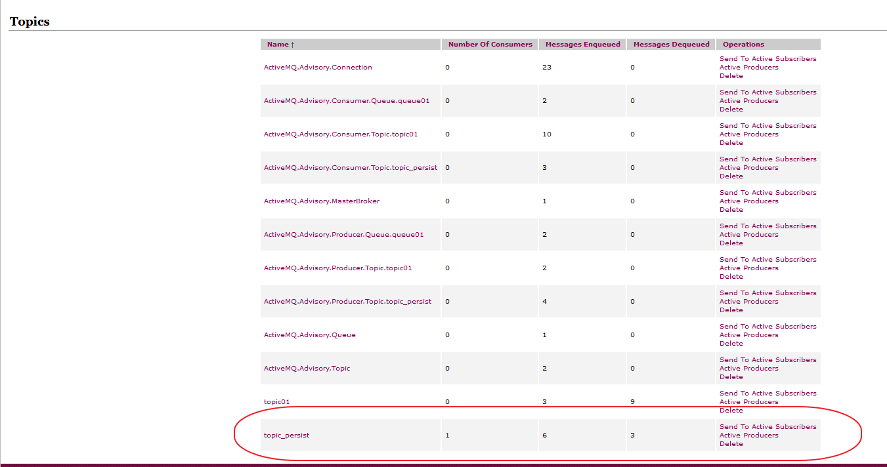
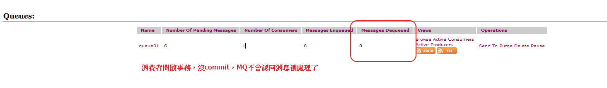
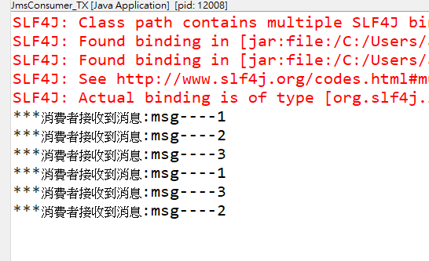

# JMS (Java Message Service)

- Java消息服務是JavaEE中的一個技術

## 什麼是Java消息服務

- Java消息服務指的是兩個應用程序之間進行異步通信的API，它為標準協議和消息服務提供了一組通用接口，包括創建、發送、讀取消息等，用於支持Java應用程序開發。在JavaEE中，當兩個應用程序使用JMS進行通信時，它們之間不是直接相連的，而是通過一個共同的消息收發服務組件關聯起來以達到解耦/異步削峰的效果。

## JMS的組成結構和特點

### JMS Provider

- 實現JMS接口和規範的消息中間件，也就是我們說的MQ服務器
  

### JMS Producer

- 消息生產者，創建和發送JMS消息的客戶端應用

### JMS Consumer

- 消息消費者，接收和處理JMS消息的客戶端應用

### JSM Message

### 消息頭

#### JMSDestination

- 消息發送的目的地，主要是指Queue和Topic
#### JMSDeliveryMode

- 持久模式和非持久模式。

  - 一條持久性的消息：應該被傳送“一次僅僅一次”，這就意味著如果JMS提供者出現故障，該消息並不會丟失，它會在服務器恢復之後再次傳遞。

  - 一條非持久的消息：最多會傳遞一次，這意味著服務器出現故障，該消息將會永遠丟失。

#### JMSExpiration

- 可以設置消息在一定時間後過期，默認是永不過期

- 消息過期時間，等於Destination的send方法中的timeToLive值加上發送時刻的GMT時間值。

- 如果timeToLive值等於0，則JMSExpiration被設為0，表示該消息永不過期。

- 如果發送後，在消息過期時間之後還沒有被發送到目的地，則該消息被清除。

#### JMSPriority

- 消息優先級，從0-9十個級別，0-4是普通消息5-9是加急消息。
 
- JMS不要求MQ嚴格按照這十個優先級發送消息但必須保證加急消息要先於普通消息到達。默認是4級。也就是說5~9一定會比0~4修先發送，但發送順序不一定按照順序大小

#### JMSMessageID

- 唯一標識每個消息的標識由MQ產生。

### 消息體

- 封裝具體的消息數據

- 有5種消息格式
  - TextMessage
    - 普通字符串消息，包含一個String   
  - MapMessage
    - 一個Map類型的消息，key為Strng類型，而值為Java基本類型
  - BytesMessage
    - 二進制數組消息，包含一個byte[]
  - StreamMessage
    - Java數據流消息，用標準流操作來順序填充和讀取
  - ObjectMessage
    - 對象消息，包含一個可序列化的Java對象

### 消息屬性

- 如果需要除消息字段以外的值，那麼可以使用消息屬性
- 識別/去重/重點標註等操作非常有用的方法
- 以activemq來說消息設置方法 setxxxxProperty舊式設置消息屬性

```java
			MapMessage mapMessage = session.createMapMessage();
			mapMessage.setString("type", "VIP");
			mapMessage.setStringProperty("attribute", "test");//設置消息屬性
			messageProducer.send(mapMessage);
```

## JMS的可靠性

### 持久性 Persistent

- 1.參數設置說明
  - a.非持久
    - messageProducer.setDeliveryMode(DeliveryMode.NON_PERSISTENT)
    - 非持久化：當服務器掛掉，消息不存在。
  - b.持久
    - messageProducer.setDeliveryMode(DeliveryMode.PERSISTENT)
    - 持久化：當服務器掛掉，消息依然存在。
  - Queue默認是持久的
- 2.持久的Queue
  - 持久化消息
    - 這是隊列的默認傳遞模式，此模式保證這些消息只被傳送一次和成功使用一次。對於這些消息，可靠性是優先考慮的因素。

    - 可靠性的另一個重要方面是確保持久性消息傳送至目標後，消息服務在向消費者傳送它們之前不會丟失這些消息。
  ```java
  MessageProducer messageProducer = session.createProducer(queue);
    //設置通過session創建出來的生產者生產的Queue消息為持久性
    messageProducer.setDeliveryMode(DeliveryMode.PERSISTENT);
  ```
- 3.持久的Topic
  - 先啟動訂閱消費者再啟動訂閱生產者

訂閱者在線

訂閱者不在線



生產者
```java
package com.frank.activemq.topic;

import javax.jms.Connection;
import javax.jms.DeliveryMode;
import javax.jms.Destination;
import javax.jms.JMSException;
import javax.jms.MessageProducer;
import javax.jms.Queue;
import javax.jms.Session;
import javax.jms.TextMessage;
import javax.jms.Topic;

import org.apache.activemq.ActiveMQConnectionFactory;

public class JmsProduce_topic_persist {
	
	public static final String ACTIVEMQ_URL = "tcp://192.168.47.129:61616";
	public static final String TOPIC_NAME = "topic_persist";
	
	public static void main(String[] args) throws JMSException {
		//1.創建連接工廠，按照給定的URL地址，採用默認用戶名和密碼
		ActiveMQConnectionFactory actuActiveMQConnectionFactory = new ActiveMQConnectionFactory(ACTIVEMQ_URL);
		
		//2.通過連接工廠，獲得連接connection並開啟訪問
		Connection connection = actuActiveMQConnectionFactory.createConnection();
		
		//3.創建session
		//兩個參數，第一個叫事務/第二個叫簽收
		Session session = connection.createSession(false, Session.AUTO_ACKNOWLEDGE);
		
		
		//4.創建目的地(具體是對列還是主題topic)
//		Destination destination = session.createQueue(QUEUE_NAME);
		Topic topic = session.createTopic(TOPIC_NAME);
		
		//5.創建消息的生產者
		MessageProducer messageProducer = session.createProducer(topic);
		messageProducer.setDeliveryMode(DeliveryMode.PERSISTENT);
		
		connection.start();
		
		//6.通過使用 MessageProducer 生產3條消息發送到MQ隊列裡面
		for(int i = 1 ;i<=3;i++) {
			
			//7.創建消息
			TextMessage textMessage = session.createTextMessage("msg----"+i);//理解為一個字串
			
			//8.通過MessageProducer發送給MQ
			messageProducer.send(textMessage);
		}
		
		//9.關閉資源
		messageProducer.close();
		session.close();
		connection.close();
		
		System.out.println("消息發布完成");
	}
}

```

消費者
```java
package com.frank.activemq.topic;

import java.io.IOException;

import javax.jms.Connection;
import javax.jms.JMSException;
import javax.jms.Message;
import javax.jms.MessageConsumer;
import javax.jms.MessageListener;
import javax.jms.Queue;
import javax.jms.Session;
import javax.jms.TextMessage;
import javax.jms.Topic;
import javax.jms.TopicSubscriber;

import org.apache.activemq.ActiveMQConnectionFactory;

public class JmsConsumer_topic_persist {
	
	public static final String ACTIVEMQ_URL = "tcp://192.168.47.129:61616";
	public static final String TOPIC_NAME = "topic_persist";

	public static void main(String[] args) throws JMSException, IOException {
		System.out.println("frank...........");
		//1.創建連接工廠，按照給定的URL地址，採用默認用戶名和密碼
		ActiveMQConnectionFactory actuActiveMQConnectionFactory = new ActiveMQConnectionFactory(ACTIVEMQ_URL);
		
		//2.通過連接工廠，獲得連接connection並開啟訪問
		Connection connection = actuActiveMQConnectionFactory.createConnection();
		connection.setClientID("frank");//誰訂閱了
		
		//3.創建session
		//兩個參數，第一個叫事務/第二個叫簽收
		Session session = connection.createSession(false, Session.AUTO_ACKNOWLEDGE);
		
		
		
		//4.創建目的地(具體是對列還是主題topic)
//		Destination destination = session.createQueue(QUEUE_NAME);
		Topic topic = session.createTopic(TOPIC_NAME);
		
		//創建持久化的訂閱主題
		TopicSubscriber topicSubscriber = session.createDurableSubscriber(topic, "remark...");

		connection.start();
							
		
		Message message = topicSubscriber.receive();
		
		while(null != message) {
			TextMessage textMessage = (TextMessage)message;
			System.out.println("*****收到的持久化topic:"+textMessage.getText());
			message = topicSubscriber.receive(5000);
		}
		
		
		
		session.close();
		connection.close();
		
		/*
		 * 1.一定要先運行一次消費者，等於向MQ註冊，類似我訂閱了這個主題
		 * 2.然後在運行生產者發送信息
		 * 3.此時無論消費者是否在線，都會接收到，不在線的話，下次連接的時候，會把沒有收過的消息都接收下來
		 * 
		 * */
	}
}

```

### 事務 Transaction

- producer提交時的事務
  - 關閉事務
    - 將建立session時第一個參數設成false
    -  connection.createSession(false, Session.AUTO_ACKNOWLEDGE);
    -  只要執行send，就進入到隊列中
    -  關閉事務，那第2個簽收參數的設置需要有效
  - 開啟事務
    - 將建立session時第一個參數設成true
    -  connection.createSession(true, Session.AUTO_ACKNOWLEDGE);
    -  先執行send再執行commit，消息才被真正提交到隊列中
    -  消息需要需要批量提交，需要緩衝處理


    * 一次發送多的消息，其中一個出錯回滾，全部不發
    ```java
    		try {
    			//OK
    			session.commit();
    		}catch (Exception e) {
    			// fail
    			session.rollback();
    		}finally {
    			if(session != null) {
    				session.close();
    			}
    		}
    ```
    ```java
    package com.frank.activemq.queue;

import javax.jms.Connection;
import javax.jms.Destination;
import javax.jms.JMSException;
import javax.jms.MapMessage;
import javax.jms.MessageProducer;
import javax.jms.Queue;
import javax.jms.Session;
import javax.jms.TextMessage;

import org.apache.activemq.ActiveMQConnectionFactory;

public class JmsProduce_TX {
	
	public static final String ACTIVEMQ_URL = "tcp://192.168.47.129:61616";
	public static final String QUEUE_NAME = "queue01";
	
	public static void main(String[] args) throws JMSException {
		//1.創建連接工廠，按照給定的URL地址，採用默認用戶名和密碼
		ActiveMQConnectionFactory actuActiveMQConnectionFactory = new ActiveMQConnectionFactory(ACTIVEMQ_URL);
		
		//2.通過連接工廠，獲得連接connection並開啟訪問
		Connection connection = actuActiveMQConnectionFactory.createConnection();
		connection.start();
		
		//3.創建session
		//兩個參數，第一個叫事務/第二個叫簽收
		Session session = connection.createSession(true, Session.AUTO_ACKNOWLEDGE);
		
		
		//4.創建目的地(具體是對列還是主題topic)
//		Destination destination = session.createQueue(QUEUE_NAME);
		Queue queue = session.createQueue(QUEUE_NAME);
		
		//5.創建消息的生產者
		MessageProducer messageProducer = session.createProducer(queue);
		
		//6.通過使用 MessageProducer 生產3條消息發送到MQ隊列裡面
		for(int i = 1 ;i<=3;i++) {
			
			//7.創建消息
			TextMessage textMessage = session.createTextMessage("msg----"+i);//理解為一個字串
			
			//設置消息屬性
			textMessage.setStringProperty("attribute", "test");
			
			//8.通過MessageProducer發送給MQ
			messageProducer.send(textMessage);
			
			//設置mapMessage
			MapMessage mapMessage = session.createMapMessage();
			mapMessage.setString("type", "VIP");
			mapMessage.setStringProperty("attribute", "test");//設置消息屬性
			messageProducer.send(mapMessage);
		}
		
		//提交事務
		session.commit();
		//9.關閉資源
		messageProducer.close();
		session.close();
		connection.close();
		
		System.out.println("消息發布完成");
		
	}
}

    ```
- Consumer提交時的事務
  - 跟生產者一樣在創建session時選擇要不要開起事務
  - 一但開啟事務，一定要確保能commit，否則會發生重複消費的異常狀況
  - 例如:
    - 開啟事務沒有commit，會發現消費者可以執行很多次，但消息卻沒有完成結束，消費者可以一直讀取
    - 


消費者可以多次讀取


### 簽收 Acknowledge

#### 非事物

- 自動簽收(默認):Session.AUTO_ACKNOWLEDGE
- 手動簽收:Session.CLIENT_ACKNOWLEDGE
  - 客戶端跳用acknowledge方法手動簽收
- 允許重複消息

#### 事物

- 生產事務開啟，只有commit後才能將全部消息變為已消費
- 事物的優先級，比簽收的大，所以只要開啟事務，就已有沒有commit為準

## JMS的點對點總結

- 點對點模型是基於隊列的，生產者發送消息到隊列，消費者從隊列接收消息，隊列的存在使得消息的異步傳輸成為可能。和我們平時給朋友發送短信類似。

  - 1：如果在Session關閉時有部分消息被收到但還沒有被簽收（acknowledge），那當消費者下次連接到相同的隊列時，這些消息還會被再次接收

  - 2：隊列可以長久的保存消息直到消費者收到消息。消費者不需要因為擔心消息會丟失而時刻和隊列保持激活的鏈接狀態，充分體現了異步傳輸模式的優勢

## JMS的發布訂閱總結

- JMS Pub/Sub 模型定義瞭如何向一個內容節點發布和訂閱消息，這些節點被稱作topic
- 主題可以被認為是消息的傳輸中介，發布者（publisher）發布消息到主題，訂閱者（subscribe）從主題訂閱消息。
- 主題使得消息訂閱者和消息發布者保持互相獨立不需要解除即可保證消息的傳送

### 非持久訂閱
- 非持久訂閱只有當客戶端處於激活狀態，也就是和MQ保持連接狀態才能收發到某個主題的消息。

- 如果消費者處於離線狀態，生產者發送的主題消息將會丟失作廢，消費者永遠不會收到。

- 一句話：先訂閱註冊才能接受到發布，只給訂閱者發布消息。
### 持久訂閱

- 客戶端首先向MQ註冊一個自己的身份ID識別號，當這個客戶端處於離線時，生產者會為這個ID保存所有發送到主題的消息，當客戶再次連接到MQ的時候，會根據消費者的ID得到所有當自己處於離線時發送到主題的消息

- 當持久訂閱狀態下，不能恢復或重新派送一個未簽收的消息。

- 持久訂閱才能恢復或重新派送一個未簽收的消息。

### 用哪個?

- 當所有的消息必需被接收，則用持久訂閱。當消息丟失能夠被容忍，則用非持久訂閱
