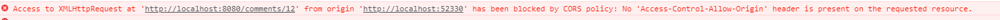

# 1.遇到掛遇問題

a.瀏覽器出現以下錯誤，代表請求遇到跨域問題


b.處理方式，在server端的response 加入以下header，即可

```java
    @ModelAttribute
    public void setResponseHeader(HttpServletResponse response) {
       response.setHeader("Access-Control-Allow-Origin","http://localhost:52330");//加入請求端的域名
//       response.setHeader("Access-Control-Allow-Origin","*");//不管域名
    }
```

c.Android處理方式

Android的WebView處理跨域問題很簡單，只要將AllowUniversalAccessFromFileURLs設置為True就行了

```java
WebSettings webSetting = mWebView.getSettings();
webSetting.setAllowUniversalAccessFromFileURLs(true);
```