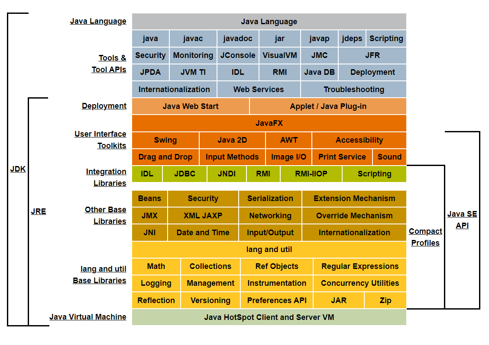
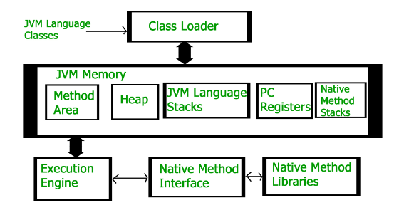
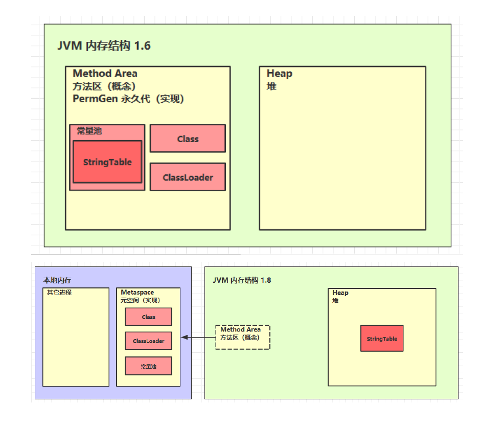
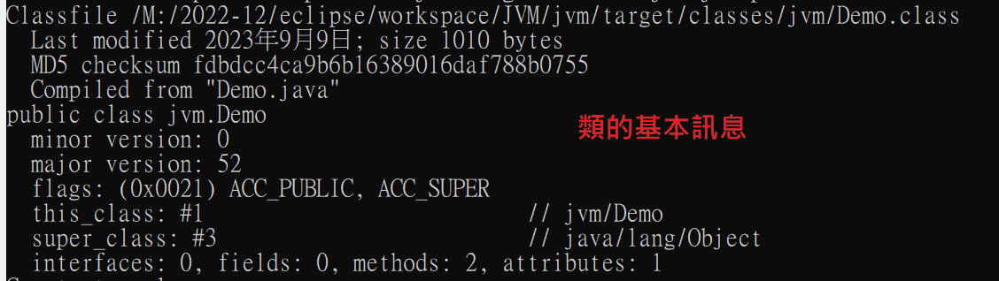
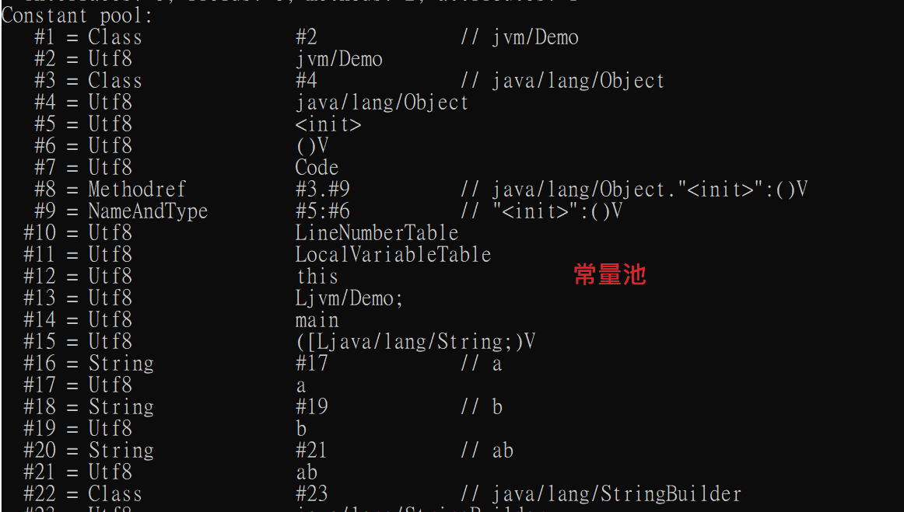
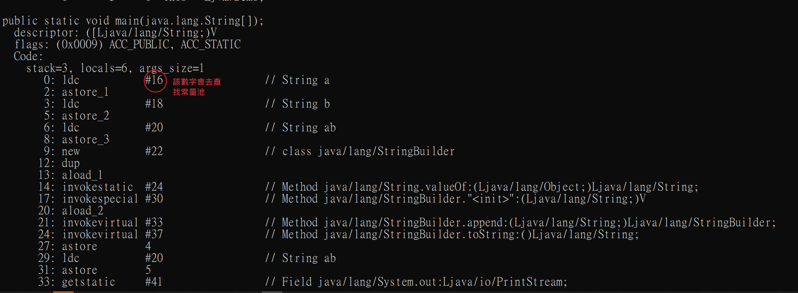
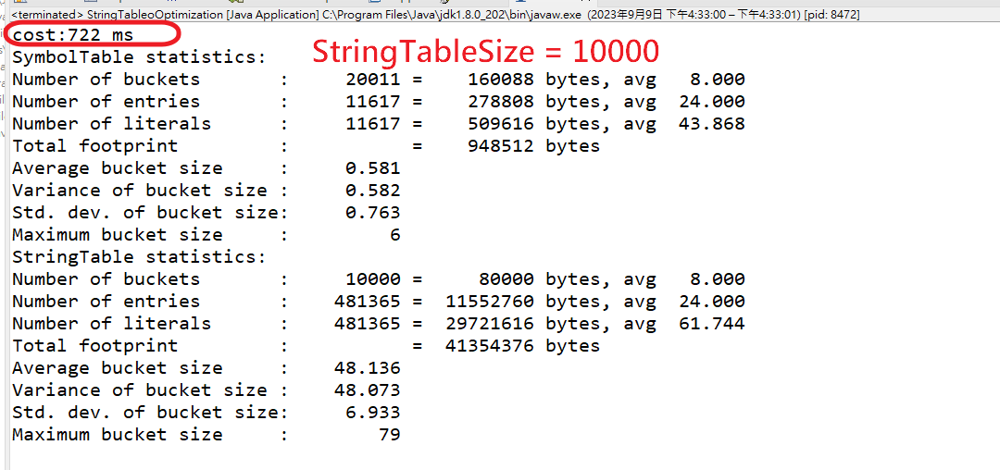
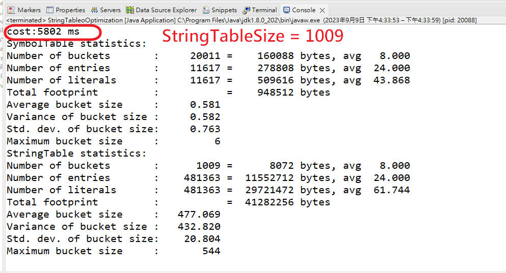

# 1.JVM、JRE、JDK



- JVM:JAVA運行環境
- JRE:JAVA運行環境+函數庫
- JDK:JAVA運行環境+函數庫+編譯開發包

# 2.JVM內存結構



# 1. 程序計數器

- Program Counter Register 程序計數器（寄存器）
- 作用，是記住下一條jvm指令的執行地址
- 特點
  - 是執行緒私有的，每個執行緒都使自己的程序計數器
  - 不會存在內存溢出


# 2.虛擬機棧

- 每個執行緒運行時所需要的內存，稱為虛擬機棧
- 每個棧由多個棧幀（Frame）組成，對應著每次方法調用時所佔用的內存
- 每個執行緒只能有一個活動棧幀，對應著當前正在執行的那個方法
- 問題辨析
  - 1. 垃圾回收是否涉及棧內存？ 不用，因為方法執行完棧幀就釋放掉了
  - 2. 棧內存分配越大越好嗎？ 因為實體內存是有限的，所以越大能執行的執行緒越少
  - 3. 方法內的局部變量是否線程安全？
      - 如果方法內局部變量沒有逃離方法的作用訪問，它是線程安全的
      - 如果是局部變量引用了物件，並逃離方法的作用範圍，需要考慮線程安全

## 棧內存溢出

- 棧幀過多導致棧內存溢出
- 棧幀過大導致棧內存溢出

## 運行時診斷

- 案例1： cpu 佔用過多
  - 定位
    - 用top定位哪個進程對cpu的佔用過高
    - ps H -eo pid,tid,%cpu | grep 進程id （用ps命令進一步定位是哪個線程引起的cpu佔用過高）
    - jstack 進程id
    - 可以根據線程id 找到有問題的線程，進一步定位到問題代碼的源碼行號
- 案例2：程序運行很長時間沒有結果


# Native Method Stacks 本地方法棧

- 1.使用作業系統提供的方法執行，會用native修飾
- 2.此方法並非JVM實作，由各個作業系統自己實作

# Heap 堆

## 定義

- 通過 new 關鍵字，創建對像都會使用堆內存
- 特點
  - 它是線程共享的，堆中對像都需要考慮線程安全的問題
  - 有垃圾回收機制

## 堆內存溢出

```java
/**
 * 演示堆內存
 */
public class Demo1_4 {

    public static void main(String[] args) throws InterruptedException {
        System.out.println("1...");
        Thread.sleep(30000);
        byte[] array = new byte[1024 * 1024 * 10]; // 10 Mb
        System.out.println("2...");
        Thread.sleep(20000);
        array = null;
        System.gc();
        System.out.println("3...");
        Thread.sleep(1000000L);
    }
}
```

## 堆內存診斷工具
- 1. jps 工具
  - 查看當前系統中有哪些 java 進程
- 2. jmap 工具
  - 查看堆內存佔用情況 jmap - heap 進程id
- 3. jconsole 工具
  - 圖形界面的，多功能的監測工具，可以連續監測


# Method Area

- 所有JAVA虛擬基執行緒共享的區域
- 裡面存了跟類的結構相關信息
  - field
  - method data
  - 成員方法代碼
  - 建構式方法代碼
  - 特殊方法(類的建構式)
  - 運行時常數值
- 在虛擬機啟動時被創建
- 方法區如果內存不足的話也會拋出OutOfMemoryError

## 組成



## 1.6 永久代用的是堆內存
* 演示永久代內存溢出 java.lang.OutOfMemoryError: PermGen space
* -XX:MaxPermSize=8m
* * StringTable 放在運行時常量池裡

## 1.8 元空間用的是本地內存(系統內存)
* 演示元空間內存溢出 java.lang.OutOfMemoryError: Metaspace
* -XX:MaxMetaspaceSize=8m
* StringTable 放在Heap堆裡

```jvm
/**
 * 演示元空間內存溢出:java.lang.OutOfMemoryError: Metaspace
 * -XX:MaxMetaspaceSize=8m
 */
public class main1 extends ClassLoader {//可以用來加載類的二進製字節碼

    public static void main(String[] args) {
        int j = 0;
        try {
            main1 test = new main1();
            for (int i = 0; i < 10000; i++,j++) {
                //ClassWriter 作用是生產類的二進製字節碼
                ClassWriter cw = new ClassWriter(0);
                //版本號，public，類名
                cw.visit(Opcodes.V1_8, Opcodes.ACC_PUBLIC, "Class" + i, null, "java/lang/Object", null);
                //返回 byte[]
                byte[] code = cw.toByteArray();
                //執行類的加載
                test.defineClass("Class" + i, code, 0, code.length);
            }
        } finally {
            System.out.println(j);
        }
    }
}
```

```console
Exception in thread "main" java.lang.OutOfMemoryError: Metaspace
	at java.lang.ClassLoader.defineClass1(Native Method)
	at java.lang.ClassLoader.defineClass(ClassLoader.java:763)
	at java.lang.ClassLoader.defineClass(ClassLoader.java:642)
	at com.itcast.itheima.xpp.main1.main(main1.java:26)
4865

Process finished with exit code 1

```

# 運行時常量池

- 常量池，就是一張表，虛擬機指令根據這張常量表找到要執行的類名、方法名、參數類型、字面量
等信息
- 運行時常量池，常量池是 *.class 文件中的，當該類被加載，它的常量池信息就會放入運行時常量
池，並把裡面的符號地址變為真實地址

# 通過反編譯查看類的訊息

```
#反編譯
javap -v [.class的路徑]
```

- 類的基本信息


- 常量池

- 虛擬機中執行編譯的方法（框內的是真正編譯執行的內容，#號的內容需要在常量池中查找）




# 常量池與串池StringTable的關係
## StringTable 特性

- 常量池中的字串僅是符號，只有在被用到時才會轉化為物件
- 利用串池的機制，來避免重複創建字串物件
- 字串變量拼接的原理是StringBuilder
- 字串常量拼接的原理是編譯器優化
- 可以使用intern方法，主動將串池中還沒有的字串物件放入串池中
- 1.8 將這個字串物件嘗試放入串池，如果有則並不會放入，如果沒有則放入串池，會把串池中的物件返回
- 1.6 將這個字串物件嘗試放入串池，如果有則並不會放入，如果沒有會把此物件***複製***一份，放入串池，會把串池中的物件返回

### 案例一

```java
public class StringTableStudy {
	public static void main(String[] args) {
		String a = "a"; 
		String b = "b";
		String ab = "ab";
	}
}
```
- 常量池中的信息，都會被加載到運行時常量池中，但這是a b ab 僅是常量池中的符號，還沒有成為java字串
```
0: ldc           #2                  // String a
2: astore_1
3: ldc           #3                  // String b
5: astore_2
6: ldc           #4                  // String ab
8: astore_3
9: return

```

- 當執行到 ldc #2 時，會把符號 a 變為 “a” 字串物件，並放入串池中（hashtable結構 不可擴容）

- 當執行到 ldc #3 時，會把符號 b 變為 “b” 字串物件，並放入串池中

- 當執行到 ldc #4 時，會把符號 ab 變為 “ab” 字串物件，並放入串池中

- 最終StringTable [“a”, “b”, “ab”]

- 注意：字串物件的創建都是懶惰的，只有當運行到那一行字串且在串池中不存在的時候（如ldc #2）時，該字串才會被創建並放入串池中。

### 案例2

- 使用拼接字串變量物件創建字串的過程

```java
public class HelloWorld {
    public static void main(String[] args) {
        String s1 = "a";
        String s2 = "b";
        String s3 = "ab";
        String s4=s1+s2;//new StringBuilder().append("a").append("2").toString()  new String("ab")
        System.out.println(s3==s4);//false
//結果為false,因為s3是存在於串池之中，s4是由StringBuffer的toString方法所返回的一個物件，存在於堆內存之中
    }
}
```

```
	 Code:
      stack=2, locals=5, args_size=1
         0: ldc           #2                  // String a
         2: astore_1
         3: ldc           #3                  // String b
         5: astore_2
         6: ldc           #4                  // String ab
         8: astore_3
         9: new           #5                  // class java/lang/StringBuilder
        12: dup
        13: invokespecial #6                  // Method java/lang/StringBuilder."<init>":()V
        16: aload_1
        17: invokevirtual #7                  // Method java/lang/StringBuilder.append:(Ljava/lang/String
;)Ljava/lang/StringBuilder;
        20: aload_2
        21: invokevirtual #7                  // Method java/lang/StringBuilder.append:(Ljava/lang/String
;)Ljava/lang/StringBuilder;
        24: invokevirtual #8                  // Method java/lang/StringBuilder.toString:()Ljava/lang/Str
ing;
        27: astore        4
        29: return

```
- 通過拼接的方式來創建字串的過程是：StringBuilder().append(“a”).append(“b”).toString()
- 最後的toString方法的返回值是一個新的字串，但字串的值和拼接的字串一致，但是兩個不同的字串，一個存在於串池之中，一個存在於堆內存之中

### 案例3

- 使用拼接字串常量物件的方法創建字串

```java
public class HelloWorld {
    public static void main(String[] args) {
        String s1 = "a";
        String s2 = "b";
        String s3 = "ab";
        String s4=s1+s2;//new StringBuilder().a|ppend("a").append("2").toString()  new String("ab")
        String s5="a"+"b";
        System.out.println(s5==s3);//true
   
```

```
	  Code:
      stack=2, locals=6, args_size=1
         0: ldc           #2                  // String a
         2: astore_1
         3: ldc           #3                  // String b
         5: astore_2
         6: ldc           #4                  // String ab
         8: astore_3
         9: new           #5                  // class java/lang/StringBuilder
        12: dup
        13: invokespecial #6                  // Method java/lang/StringBuilder."<init>":()V
        16: aload_1
        17: invokevirtual #7                  // Method java/lang/StringBuilder.append:(Ljava/lang/String
;)Ljava/lang/StringBuilder;
        20: aload_2
        21: invokevirtual #7                  // Method java/lang/StringBuilder.append:(Ljava/lang/String
;)Ljava/lang/StringBuilder;
        24: invokevirtual #8                  // Method java/lang/StringBuilder.toString:()Ljava/lang/Str
ing;
        27: astore        4
        //ab3初始化时直接从串池中获取字串
        29: ldc           #4                  // String ab
        31: astore        5
        33: return

```

- 使用拼接字串常量的方法來創建新的字串時，因為內容是常量，javac在編譯期會進行優化，結果已在編譯期確定為ab，而創建ab的時候已經在串池中放入了“ab”，所以s5直接從串池中獲取值，所以進行的操作和s3= “ab” 一致。
- 使用拼接字串變量的方法來創建新的字串時，因為內容是變量，只能在運行期確定它的值，所以底層使用StringBuilder來創建

### intern()

### 1.8版本

- 動作:
  - 調用字串物件的intern方法，會將該字串物件嘗試放入到串池中
  - 如果串池中沒有該字串物件，則放入成功
  - 如果有該字串物件，則放入失敗
  無論放入是否成功，都會返回串池中的字串物件

```java
public class HelloWorld {

    public static void main(String[] args) {
        String x = "ab";
        String s = new String("a") + new String("b");

        String s2 = s.intern();//將這個字符串物件象嘗試放入串池，如果有則並不會放入，如果沒有則放入串池，這兩種情況都會把串池中的物件返回
        System.out.println(s2 == x);//true
        System.out.println(s == x);//false
    }
}
```

#### 1.6版本

- 跟1.8版本的差別在於，如果串池中沒有字串，就會複製一個新的字串加入串池，而不是用原本的那個在堆內存的字串放入串池

## StringTable 垃圾回收

### 參數說明

|||
|---|---|
|參數|說明|
|-Xmx10m|推空間大小|
|-XX+PrintStringTableStatistics|打印串池統計信息|
|-XX:+PrintGCDetails|打印GC日志詳情|
|-verbose:gc|打印GC日志|

- 設置VM參數

```
-Xmx10m -XX:+PrintStringTableStatistics -XX:+PrintGCDetails -verbose:gc
```

```java
package jvm;

public class TestStringTableGC {
    public static void main(String[] args) throws InterruptedException {
        int i = 0;
        try {
            for (int j = 0; j < 100000; j++) { // j=100, j=10000
                String.valueOf(j).intern();
                i++;
            }
        } catch (Throwable e) {
            e.printStackTrace();
        } finally {
            System.out.println(i);
        }

    }
}

```

```
[GC (Allocation Failure) [PSYoungGen: 2048K->496K(2560K)] 2048K->573K(9728K), 0.0014327 secs] [Times: user=0.00 sys=0.00, real=0.00 secs] 
[GC (Allocation Failure) [PSYoungGen: 2544K->496K(2560K)] 2621K->605K(9728K), 0.0014114 secs] [Times: user=0.00 sys=0.00, real=0.00 secs] 
[GC (Allocation Failure) [PSYoungGen: 2544K->480K(2560K)] 2653K->657K(9728K), 0.0011397 secs] [Times: user=0.00 sys=0.00, real=0.00 secs] 
100000
Heap
 PSYoungGen      total 2560K, used 562K [0x00000000ffd00000, 0x0000000100000000, 0x0000000100000000)
  eden space 2048K, 4% used [0x00000000ffd00000,0x00000000ffd14928,0x00000000fff00000)
  from space 512K, 93% used [0x00000000fff00000,0x00000000fff78020,0x00000000fff80000)
  to   space 512K, 0% used [0x00000000fff80000,0x00000000fff80000,0x0000000100000000)
 ParOldGen       total 7168K, used 177K [0x00000000ff600000, 0x00000000ffd00000, 0x00000000ffd00000)
  object space 7168K, 2% used [0x00000000ff600000,0x00000000ff62c620,0x00000000ffd00000)
 Metaspace       used 2649K, capacity 4486K, committed 4864K, reserved 1056768K
  class space    used 282K, capacity 386K, committed 512K, reserved 1048576K
SymbolTable statistics:
Number of buckets       :     20011 =    160088 bytes, avg   8.000
Number of entries       :     11611 =    278664 bytes, avg  24.000
Number of literals      :     11611 =    509264 bytes, avg  43.860
Total footprint         :           =    948016 bytes
Average bucket size     :     0.580
Variance of bucket size :     0.583
Std. dev. of bucket size:     0.763
Maximum bucket size     :         6
StringTable statistics:
Number of buckets       :     60013 =    480104 bytes, avg   8.000
Number of entries       :      1980 =     47520 bytes, avg  24.000
Number of literals      :      1980 =    168608 bytes, avg  85.156
Total footprint         :           =    696232 bytes
Average bucket size     :     0.033
Variance of bucket size :     0.033
Std. dev. of bucket size:     0.181
Maximum bucket size     :         2

```

- 看到程序輸出了堆信息，以及串池統計信息，需要了解的是我們的串池實現其實是類似Map的存儲結構，裡面的存儲結構是數組的方式，每一個bucket就是一個數組結構。

```
Number of buckets       :     20011 =    160088 bytes, avg   8.000
Number of entries       :     11611 =    278664 bytes, avg  24.000
Number of literals      :     11611 =    509264 bytes, avg  43.860
```

- 發現日誌顯示發生了三次PSYoungGen gc，Number of entries 是1980，沒有達到10萬，說明了我們的串池是會發生GC的。

```
[GC (Allocation Failure) [PSYoungGen: 2048K->496K(2560K)] 2048K->573K(9728K), 0.0014327 secs] [Times: user=0.00 sys=0.00, real=0.00 secs] 
[GC (Allocation Failure) [PSYoungGen: 2544K->496K(2560K)] 2621K->605K(9728K), 0.0014114 secs] [Times: user=0.00 sys=0.00, real=0.00 secs] 
[GC (Allocation Failure) [PSYoungGen: 2544K->480K(2560K)] 2653K->657K(9728K), 0.0011397 secs] [Times: user=0.00 sys=0.00, real=0.00 secs] 
100000
```

## StringTable 性能調優.

- 設置VM參數

```
-Xms500m -Xmx500m -XX:+PrintStringTableStatistics -XX:StringTableSize=1009
```

```java
package jvm;

import java.io.BufferedReader;
import java.io.FileInputStream;
import java.io.IOException;
import java.io.InputStreamReader;

/**
 * 演示串池大小對性能的影響
 * -Xms500m -Xmx500m -XX:+PrintStringTableStatistics -XX:StringTableSize=1009
 */
public class StringTableoOptimization {
    public static void main(String[] args) throws IOException {
        try (BufferedReader reader = new BufferedReader(new InputStreamReader(new FileInputStream("M:\\2022-12\\eclipse\\workspace\\JVM\\jvm\\src\\main\\resources\\linux.words"), "utf-8"))) {
            String line = null;
            long start = System.nanoTime();
            while (true) {
                line = reader.readLine();
                if (line == null) {
                    break;
                }
                line.intern();
            }
            System.out.println("cost:" + (System.nanoTime() - start) / 1000000+" ms");
        }


    }
}


```





- 經一測試會發現StringTableSize值大小會影響效能

# 直接內存 Direct Memory

- 不屬於JVM的內存，是操作系統的內存
- 常見於 NIO 操作時，用於數據緩衝區
- 分配回收成本較高，但讀寫性能高
- 不受 JVM 內存回收管理

## 測試傳統IO 及NIO

```java
package jvm;

import java.io.FileInputStream;
import java.io.FileOutputStream;
import java.io.IOException;
import java.nio.ByteBuffer;
import java.nio.channels.FileChannel;

public class ByteBufferVsTraditionIo {
	
	//找一個大一點的文件做比較
	static final String FROM = "I:\\XXX\\XXX.mp4";//案例以一個219M的檔案測試
    static final String TO = "E:\\a.mp4";
    static final int _1Mb = 1024 * 1024;

    public static void main(String[] args) {
        io(); // io time: 1535.586957 1766.963399 1359.240226
        directBuffer(); // directBuffer time: 479.295165 702.291454 562.56592
    }

    private static void directBuffer() {
        long start = System.nanoTime();
        try (FileChannel from = new FileInputStream(FROM).getChannel();
             FileChannel to = new FileOutputStream(TO).getChannel();
        ) {
            ByteBuffer bb = ByteBuffer.allocateDirect(_1Mb);
            while (true) {
                int len = from.read(bb);
                if (len == -1) {
                    break;
                }
                bb.flip();
                to.write(bb);
                bb.clear();
            }
        } catch (IOException e) {
            e.printStackTrace();
        }
        long end = System.nanoTime();
        System.out.println("directBuffer usage: " + (end - start) / 1000_000.0);
    }

    private static void io() {
        long start = System.nanoTime();
        try (FileInputStream from = new FileInputStream(FROM);
             FileOutputStream to = new FileOutputStream(TO);
        ) {
            byte[] buf = new byte[_1Mb];
            while (true) {
                int len = from.read(buf);
                if (len == -1) {
                    break;
                }
                to.write(buf, 0, len);
            }
        } catch (IOException e) {
            e.printStackTrace();
        }
        long end = System.nanoTime();
        System.out.println("io time: " + (end - start) / 1000_000.0);
    }
}

```
結果

```
io time: 326.0744 ms
directBuffer usage: 128.0161 ms
```


- 使用了 Unsafe 對象完成直接內存的分配回收，並且回收需要主動調用 freeMemory 方法
- ByteBuffer 的實現類內部，使用了 Cleaner （虛引用）來監測 ByteBuffer 對象，一旦
ByteBuffer 對像被垃圾回收，那麼就會由 ReferenceHandler 線程通過 Cleaner 的 clean 方法調
用 freeMemory 來釋放直接內存


### -XX:+DisableExplicitGC 禁用顯示的調用GC回收


# 垃圾回收GC

[GC](jvm/GC.md )

# 類文件結構

[class](jvm/classStructure.md )