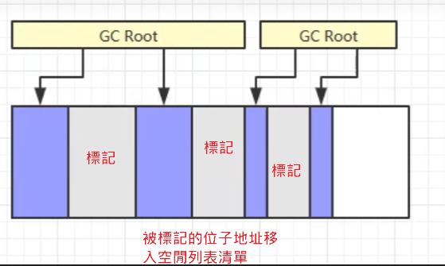
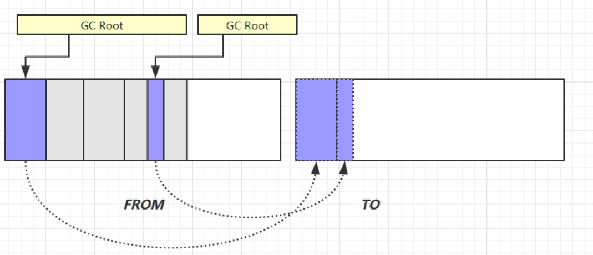

# GC 垃圾回收

## 1.如何判斷物件可以回收

### 1.引用記數法(早期python使用此法)

- 1.只要一個物件被引用一次就加1，取消引用就減1
- 2.當計數規0就可以回收
- 3.存在弊端，如果兩個物件相互引用，計數都是1，將都無法被回收

### 2.可達性分析算法(JVM採用的方式)

- 首先要確定一系列的根物件，也就是那些一定不能被GC回收的物件
- 在GC回收之前，會對堆內存中的物件進行一次掃描，看看物件是否被剛剛個根物件引用或間接引用，如果是這個物件就不可以被回收，反之如果一個物件沒有被根物件直接或間接地引用，這個物件就可以被回收

- Java 虛擬機中的垃圾回收器採用可達性分析來探索所有存活的對象
- 掃描堆中的對象，看是否能夠沿著 GC Root對象 為起點的引用鏈找到該對象，找不到，表示可以
回收
- 哪些對象可以作為 GC Root ?

  - 虛擬機棧（棧幀中的本地變量表）中引用的對象

  - 本地方法棧中 JNI（即一般說的 Native 方法）引用的對象

  - 方法區中類靜態屬性引用的對象

  - 方法區中常量引用的對象

### 3. 4種引用

- 1. 強引用
  - 只有所有 GC Roots 對像都不通過【強引用】引用該對象，該對象才能被垃圾回收
- 2. 軟引用（SoftReference）
  - 僅有軟引用引用該對象時，在垃圾回收後，內存仍不足時會再次出發垃圾回收，回收軟引用
對象
  - 可以配合引用隊列來釋放軟引用自身
- 3. 弱引用（WeakReference）
  - 僅有弱引用引用該對象時，在垃圾回收時，無論內存是否充足，都會回收弱引用對象
  - 可以配合引用隊列來釋放弱引用自身
- 4. 虛引用（PhantomReference）
  - 必須配合引用隊列使用，主要配合 ByteBuffer 使用，被引用對象回收時，會將虛引用入隊，
由 Reference Handler 線程調用虛引用相關方法釋放直接內存
- 5. 終結器引用（FinalReference）
  - 無需手動編碼，但其內部配合引用隊列使用，在垃圾回收時，終結器引用入隊（被引用對象
暫時沒有被回收），再由 Finalizer 線程通過終結器引用找到被引用對象並調用它的 finalize
方法，第二次 GC 時才能回收被引用對象

## 垃圾回收算法


### 1.標記清除


#### 標記

- 標記沒有被GC ROOT 


#### 清除



- 把拉基物件所占用的空間釋放，把標記起的位子地址放入空閒清單，下次可以再放其他值，而不是直接清除裡面的值

#### 優缺點

- 優點

  - 清除速度快，只需要把標記拉基物件的起始和結束位子放入空閒清單清單即可，不必做過多的操作

- 缺點

  - 容易產生內存碎片(空間不連續，無法存入陣列等需要連續空間的物件)


### 2.標記整理


#### 標記拉基物件

#### 處理拉基物件，及整理原來的非拉基物件，使其不產生內存碎片

#### 優缺點

- 優點

  - 沒有內存碎片

- 缺點

  - 由於整理牽扯到物件的移動，原有物件的引用地址都要改變，所以效率較低

### 3.複製



- 先把內存分會from 跟 to
- 再從from區標記拉基物件
- 把分拉基物件往to區塊移動
- 把from整塊清除
- 使用to區塊取代原來from區塊

#### 優缺點

- 優點

  - 沒有內存碎片

- 缺點

  - 需要雙倍的內存空間


## 分代垃圾回收


- 將常用需要場時間使用的物件放在老年代，將使用完就可以丟的物件放在新生代
- 新生代拉基回收次數多，老年代久久回收一次

- 對象首先分配在伊甸園區域
- 新生代空間不足時，觸發 minor gc，伊甸園和 from 存活的對象使用 copy 複製到 to 中，存活的對象年齡加 1，並且交換 from to
- minor gc 會引發 stop the world，暫停其它用戶的線程，等垃圾回收結束，用戶線程才恢復運行
- 當對象壽命超過閾值時，會晉升至老年代，最大壽命是15（4bit），這只是最大值，如果內存真的不足，也會直升到老年代
- 當老年代空間不足，會先嘗試觸發 minor gc，如果之後空間仍不足，那麼觸發 full gc，STW(stop the world)的時
間更長

### 相關VM參數

|||
|--|--|
|堆初始大小|-Xms|
|堆最大大小|-Xmx 或 -XX:MaxHeapSize=size|
|新生代大小|-Xmn 或 (-XX:NewSize=size + -XX:MaxNewSize=size )|
|倖存區比例（動態） |-XX:InitialSurvivorRatio=ratio 和 -XX:+UseAdaptiveSizePolicy|
|倖存區比例|-XX:SurvivorRatio=ratio|
|晉升閾值|-XX:MaxTenuringThreshold=threshold|
|晉升詳情|-XX:+PrintTenuringDistribution|
|GC詳情|-XX:+PrintGCDetails -verbose:gc|
|FullGC 前 MinorGC| -XX:+ScavengeBeforeFullGC|

## GC 分析

```java
package jvm.gc;

import java.util.ArrayList;

public class GCTest {
	private static final int _512KB = 512 * 1024;
	private static final int _1MB = 1024 * 1024;
	private static final int _6MB = 6 * 1024 * 1024;
	private static final int _7MB = 7 * 1024 * 1024;
	private static final int _8MB = 8 * 1024 * 1024;

	// -Xms20M -Xmx20M -Xmn10M -XX:+UseSerialGC -XX:+PrintGCDetails -verbose:gc
	// -XX:-ScavengeBeforeFullGC
	public static void main(String[] args) throws InterruptedException {
    }
}

```


```java
package jvm.gc;

import java.util.ArrayList;

public class GCTest {
	private static final int _512KB = 512 * 1024;
	private static final int _1MB = 1024 * 1024;
	private static final int _6MB = 6 * 1024 * 1024;
	private static final int _7MB = 7 * 1024 * 1060;
	private static final int _8MB = 9 * 1024 * 1024;

	// -Xms20M -Xmx20M -Xmn10M -XX:+UseSerialGC -XX:+PrintGCDetails -verbose:gc
	// -XX:-ScavengeBeforeFullGC
	public static void main(String[] args) throws InterruptedException {
		ArrayList<byte[]> list = new ArrayList<>();
		list.add(new byte[_7MB]);
	}
}

```


- 如果放入一個大物件，新生代位子不夠，GC也沒辦法處理，就會直接晉升到老年代裡放

```
package jvm.gc;

import java.util.ArrayList;

public class GCTest {
	private static final int _512KB = 512 * 1024;
	private static final int _1MB = 1024 * 1024;
	private static final int _6MB = 6 * 1024 * 1024;
	private static final int _7MB = 7 * 1024 * 1060;
	private static final int _8MB = 8 * 1024 * 1024;

	// -Xms20M -Xmx20M -Xmn10M -XX:+UseSerialGC -XX:+PrintGCDetails -verbose:gc
	// -XX:-ScavengeBeforeFullGC
	public static void main(String[] args) throws InterruptedException {
		ArrayList<byte[]> list = new ArrayList<>();
		list.add(new byte[_8MB]);
	}
}
```


- 如果都新生代跟老年代都不夠用，就會拋出OutOfMemoryError

```java
package jvm.gc;

import java.util.ArrayList;

public class GCTest {
	private static final int _512KB = 512 * 1024;
	private static final int _1MB = 1024 * 1024;
	private static final int _6MB = 6 * 1024 * 1024;
	private static final int _7MB = 7 * 1024 * 1060;
	private static final int _8MB = 8 * 1024 * 1024;

	// -Xms20M -Xmx20M -Xmn10M -XX:+UseSerialGC -XX:+PrintGCDetails -verbose:gc
	// -XX:-ScavengeBeforeFullGC
	public static void main(String[] args) throws InterruptedException {
		ArrayList<byte[]> list = new ArrayList<>();
		list.add(new byte[_8MB]);
		list.add(new byte[_8MB]);
	}
}

```


- 一個Thread的OutOfMemoryError，並不會導致整個main thread結束
  
```java
package jvm.gc;

import java.util.ArrayList;

public class GCTest {
	private static final int _512KB = 512 * 1024;
	private static final int _1MB = 1024 * 1024;
	private static final int _6MB = 6 * 1024 * 1024;
	private static final int _7MB = 7 * 1024 * 1060;
	private static final int _8MB = 8 * 1024 * 1024;

	// -Xms20M -Xmx20M -Xmn10M -XX:+UseSerialGC -XX:+PrintGCDetails -verbose:gc
	// -XX:-ScavengeBeforeFullGC
	public static void main(String[] args) throws InterruptedException {
        new Thread(() -> {
            ArrayList<byte[]> list = new ArrayList<>();
            list.add(new byte[_8MB]);
            list.add(new byte[_8MB]);
        }).start();

        System.out.println("sleep....");
        Thread.sleep(1000000L);
	}
}

```


# 垃圾回收器

- 1. 串行
  - 單線程
  - 堆內存較小，適合個人電腦
- 2. 吞吐量優先
  - 多線程
  - 堆內存較大，多核 cpu
  讓單位時間內，STW 的時間最短 0.2 0.2 = 0.4，垃圾回收時間佔比最低，這樣就稱吞吐量高
- 3. 響應時間優先
  - 多線程
  - 堆內存較大，多核 cpu
  盡可能讓單次 STW 的時間最短 0.1 0.1 0.1 0.1 0.1 = 0.5

## 1.串行 拉基回收器

- 參數
```
#Serial:新生代採用複製算法
#SerialOld:老年代採用標記+整理算法
-XX:+UseSerialGC = Serial + SerialOld
```


- 讓每個Thread運行到安全點，再啟動GC
- GC啟動時所有Thread阻塞站提工作，等待GC Thread執行完後，再恢復運行

## 2.吞吐量優先 拉基回收器

- 1.8裡默認是開啟的GC UseParallelGC UseParallelOldGC
```
# UseParallelGC:工作在新生代，複製算法
# UseParallelOldGC:工作在老連代，標記+整理
# 只要開啟其中一個另外一個也會議起開起
-XX:+UseParallelGC ~ -XX:+UseParallelOldGC

# UseAdaptiveSizePolicy:採用一個自適應的大小(整個堆的大小都會調整)調整策略
-XX:+UseAdaptiveSizePolicy
-XX:GCTimeRatio=ratio
-XX:MaxGCPauseMillis=ms
-XX:ParallelGCThreads=n
```
- UseParallelGC:工作在新生代，複製算法
- UseParallelOldGC:工作在老連代，標記+整理
  - UseParallelGC和UseParallelOldGC，只要開啟其中一個另外一個也會議起開起
- UseAdaptiveSizePolicy:採用一個自適應的大小(整個堆的大小都會調整)調整策略
- GCTimeRatio:調整吞吐量的目標，調整拉基回收時間跟總時間的占比 
  - 公式:1/1+ratio
  - 如果設置99代表 0.01，代表100分鐘內只能執行1分鐘的GC，如果達不到，就會嘗試去調整堆的大小，默認ratio值是99
- MaxGCPauseMillis:最大暫停毫秒數，默認值200毫秒
- ParallelGCThreads:控制GC運行時的thread數目


- 讓每個Thread運行到安全點，再啟動GC
- GC會開啟多個Thread進行回收，通常會開跟CPU核數相同的數目
- 在GC時CPU會占用100%
- 

## 3.響應時間優先CMS 拉基回收器

```
-XX:+UseConcMarkSweepGC ~ -XX:+UseParNewGC ~ SerialOld
-XX:ParallelGCThreads=n ~ -XX:ConcGCThreads=threads
-XX:CMSInitiatingOccupancyFraction=percent
-XX:+CMSScavengeBeforeRemark
```

- Parallelism
  - 並行:多個CPU處理多個thread   
  - 同時進行處理
  - 能夠使用多核
  - 執行順序可以預期
- Concurrency
  - - 並發:一個CPU處理多個thread，輪流切換
  - 輪流進行處理
  - 只能使用單核
  - 執行順序無法預期 (Race Condition)


- 一款基於標記清除算返的回收器
- UseConcMarkSweepGC他是併發效果，意思就是GC在工作的同時，用戶thread也可以一起工作，但只是在某幾個階段可以不用STW
- ParallelGCThreads:並行的GC thread數，一般班是跟CPU核數是一樣的
- ConcGCThreads:併發的GC thread數，一般設置成ParallelGCThreads的4分之一

- CMSInitiatingOccupancyFraction:控制何時執行CMS執行的內存占比，例如設置80，代表只要老年代的內存占比到80，就執行GC，早期默認值是65%
- CMSScavengeBeforeRemark:做重新標記之前，對新生代做一次拉基回收，減輕重新標記時搜尋的壓力，因為新生代可能會有一些拉基，拖慢搜尋時間


- 多個CPU並行執行，現在發生的老年代內存不足 
- 讓每個Thread運行到安全點，停下來了
- GC執行初始標記(需要STW)：標記GC Roots能直接到的對象。速度很快，存在Stop The World
- 並發標記：進行GC Roots Tracing 的過程，找出存活對象且用戶線程可並發執行
- 重新標記(需要STW)：為了修正並發標記期間，因用戶thread繼續運行而導致可能有未標記到的誤差或干擾，所以需要重新標記。存在Stop The World
- 並發清理：對標記的對象進行清除回收
- CMS收集器：

  - 定義：Concurrent Mark Sweep（並發，標記，清除）
  - 特點：基於標記-清除算法的垃圾回收器。是並發的。工作在老年代。
- ParNew 收集器：

  - 定義：ParNew收集器其實就是Serial收集器的多線程版本
  - 特點：工作在新生代，基於復制算法的垃圾回收器。

- CMS 內存碎片多，可能會造成併發失敗，此時拉基回收器會退化成單線程的並行的拉基回收SerialOld，做一次GC，代碎片減少了再繼續工作，一旦發生這種避發失敗問題，拉基回收時間就會一下子飆上去

# G1

##  1.G1 垃圾回收階段


## 2) Young Collection

- 會STW


- G1會將堆內存劃分成一個一個大小相等的區域，每個區域都可以成為獨立的伊甸園、倖存區、老年代
- 剛開始白色的部分代表空閒區域
- 當開始有物件就會放到每個區域的伊甸園，也就是綠色的部分

  


- 當伊甸園逐漸被占滿後，就會觸發新生代的拉基回收
- 新生代拉基回收就會把倖存的物件以複製的算法放進倖存區


-在工作一段時間，當倖存區的物件多了，或者物件年齡達到一定程度，就會進升到老年(紅色箭頭)
- 而原本倖存區還倖存的物件還不夠年齡的，就會複製到新的倖存區
- 其他在伊甸園地倖存物件，也會被複製到這個新的倖存區

## 3) Young Collection + CM 拉基回收+標記階段

- 在 Young GC 時會進行 GC Root 的初始標記
- 老年代佔用堆空間比例達到閾值時，進行並發標記（不會 STW），由下面的 JVM 參數決定
 -XX:InitiatingHeapOccupancyPercent=percent （默認45%）:整個老年到站這個推空間的45%，就會觸發併發標記


E:伊甸園
S:倖存區
O:老年代

## 4) Mixed Collection 混和收集
- 會對 E、S、O 進行全面垃圾回收
  - 最終標記（Remark）會 STW :因為用戶同時在工作，所以會執行一次最終標記
  - 拷貝存活（Evacuation）會 STW
- -XX::MaxGCPauseMillis=ms


- 伊甸園倖存物件複製到新的倖存區(黑色箭頭)E =>S
- 倖存區符合年齡的晉升到老年區(紅色箭頭)S =>O
- 倖存區不符合年齡的複製到新的倖存區(黑色箭頭)S =>S
- 老年代的還有有物件複製到新的老年區，此時不會所有的老年代都整理，因為要符合用戶設置的GC暫停時間，所以只會選最有價值可以釋放最多空間的老年代進行處理，主要目的就是為了要達到暫停時間短的目標


## 5) Full GC
- SerialGC
  - 新生代內存不足發生的垃圾收集 - minor gc
  - 老年代內存不足發生的垃圾收集 - full gc
- ParallelGC
  - 新生代內存不足發生的垃圾收集 - minor gc
  - 老年代內存不足發生的垃圾收集 - full gc
- CMS
  - 新生代內存不足發生的垃圾收集 - minor gc
  - 老年代內存不足
- G1
  - 新生代內存不足發生的垃圾收集 - minor gc
  - 老年代內存不足
    - 觸發併發標記及混和收集
    - 如果回收速度 > 用戶產生拉基的速度，是不會觸發full gc，還是處理併發拉基收集的階段
    - 如果回收速度 < 用戶產生拉基的速度，此時併發收集失敗了，會觸發full gc，就會更長的時間 STW

## 6) Young Collection 跨代引用
- 新生代回收的跨代引用（老年代引用新生代）問題


- 新生代拉基回收的過程
  - 首先找到根物件
  - 根物件可達性分析再找到存活物件
  - 存活物件進行複製到倖存區

- 卡表與 Remembered Set
- 在引用變更時通過 post-write barrier + dirty card queue
- concurrent refinement threads 更新 Remembered Set

 

## 7) Remark(併發標記階段、重新標記階段)
- pre-write barrier + satb_mark_queue


- 這張圖表示併發階段是物件的處理狀態
