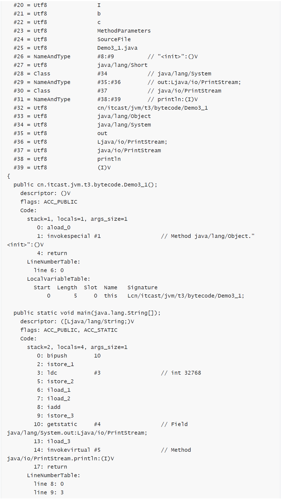

# 類文件結構

- JVM只關心字解碼文件的執行，跟語言無關，任何語言只要能編譯成JVM規範的.class舅舅可以在虛擬機上運行


- 一個簡單的HelloWorld.java

```java
package cn.itcast.jvm.t5;
// HelloWorld 示例
public class HelloWorld {
public static void main(String[] args) {
System.out.println("hello world");
}
}

```
- 執行 javac -parameters -d . HellowWorld.java
- 編譯為 HelloWorld.class 後是這個樣子的：

```
[root@localhost ~]# od -t xC HelloWorld.class
0000000 ca fe ba be 00 00 00 34 00 23 0a 00 06 00 15 09
0000020 00 16 00 17 08 00 18 0a 00 19 00 1a 07 00 1b 07
0000040 00 1c 01 00 06 3c 69 6e 69 74 3e 01 00 03 28 29
0000060 56 01 00 04 43 6f 64 65 01 00 0f 4c 69 6e 65 4e
0000100 75 6d 62 65 72 54 61 62 6c 65 01 00 12 4c 6f 63
0000120 61 6c 56 61 72 69 61 62 6c 65 54 61 62 6c 65 01
0000140 00 04 74 68 69 73 01 00 1d 4c 63 6e 2f 69 74 63
0000160 61 73 74 2f 6a 76 6d 2f 74 35 2f 48 65 6c 6c 6f
0000200 57 6f 72 6c 64 3b 01 00 04 6d 61 69 6e 01 00 16
0000220 28 5b 4c 6a 61 76 61 2f 6c 61 6e 67 2f 53 74 72
0000240 69 6e 67 3b 29 56 01 00 04 61 72 67 73 01 00 13
0000260 5b 4c 6a 61 76 61 2f 6c 61 6e 67 2f 53 74 72 69
0000300 6e 67 3b 01 00 10 4d 65 74 68 6f 64 50 61 72 61
0000320 6d 65 74 65 72 73 01 00 0a 53 6f 75 72 63 65 46
0000340 69 6c 65 01 00 0f 48 65 6c 6c 6f 57 6f 72 6c 64
0000360 2e 6a 61 76 61 0c 00 07 00 08 07 00 1d 0c 00 1e
0000400 00 1f 01 00 0b 68 65 6c 6c 6f 20 77 6f 72 6c 64
0000420 07 00 20 0c 00 21 00 22 01 00 1b 63 6e 2f 69 74
0000440 63 61 73 74 2f 6a 76 6d 2f 74 35 2f 48 65 6c 6c
0000460 6f 57 6f 72 6c 64 01 00 10 6a 61 76 61 2f 6c 61
0000500 6e 67 2f 4f 62 6a 65 63 74 01 00 10 6a 61 76 61
0000520 2f 6c 61 6e 67 2f 53 79 73 74 65 6d 01 00 03 6f
0000540 75 74 01 00 15 4c 6a 61 76 61 2f 69 6f 2f 50 72
0000560 69 6e 74 53 74 72 65 61 6d 3b 01 00 13 6a 61 76
0000600 61 2f 69 6f 2f 50 72 69 6e 74 53 74 72 65 61 6d
0000620 01 00 07 70 72 69 6e 74 6c 6e 01 00 15 28 4c 6a
0000640 61 76 61 2f 6c 61 6e 67 2f 53 74 72 69 6e 67 3b
0000660 29 56 00 21 00 05 00 06 00 00 00 00 00 02 00 01
0000700 00 07 00 08 00 01 00 09 00 00 00 2f 00 01 00 01
0000720 00 00 00 05 2a b7 00 01 b1 00 00 00 02 00 0a 00
0000740 00 00 06 00 01 00 00 00 04 00 0b 00 00 00 0c 00
0000760 01 00 00 00 05 00 0c 00 0d 00 00 00 09 00 0e 00
0001000 0f 00 02 00 09 00 00 00 37 00 02 00 01 00 00 00
0001020 09 b2 00 02 12 03 b6 00 04 b1 00 00 00 02 00 0a
0001040 00 00 00 0a 00 02 00 00 00 06 00 08 00 07 00 0b
0001060 00 00 00 0c 00 01 00 00 00 09 00 10 00 11 00 00
0001100 00 12 00 00 00 05 01 00 10 00 00 00 01 00 13 00
0001120 00 00 02 00 14
```

## JVM規範，類文件結構如下

- u4 => 4代表4個字節


- 每個.class文件，嚴格遵守以下排列方式
- 前面沒有u開頭的代表很多，其數目為前面count表示幾個

```
ClassFile {
    u4 magic; 魔術
    u2 minor_version; 小版本號
    u2 major_version; 主版本號
    u2 constant_pool_count; 常量池信息
    cp_info constant_pool[constant_pool_count-1]; 常量池信息，前面count會說有幾個，就會占用一段區塊
    u2 access_flags; 訪問修飾符(public、private...)
    u2 this_class; 包名、類名信息
    u2 super_class; 父類
    u2 interfaces_count; 接口信息
    u2 interfaces[interfaces_count]; 接口信息
    u2 fields_count; 類中的變數(成員變數、靜態變數) 信息
    field_info fields[fields_count]; 類中的變數(成員變數、靜態變數) 信息
    u2 methods_count; 方法信息(成員方法、靜態方法...等等)
    method_info methods[methods_count]; 方法信息
    u2 attributes_count; 類的附加屬性信息
    attribute_info attributes[attributes_count]; 類的附加屬性信息
}

```

## 1.1魔術

- 所有文件都是自己的特定類型，用來標示文件是什麼類型
  

- 0~3 字節，表示它是否是【class】類型的文件
  
0000000 **ca fe ba be** 00 00 00 34 00 23 0a 00 06 00 15 09


## 1.2 版本
- 4~7 字節，表示類的版本 00 34（52） 表示是 Java 8

0000000 ca fe ba be **00 00 00 34** 00 23 0a 00 06 00 15 09


## 1.3 常量池

- 常量池主要有以下兩大類
  - 1.字面量(Literal):如文本字串、被聲明為final的常量值等
  - 2.符號引用(Symbolic References):屬於編譯原理方面的概念，主要包括下面幾個常量
    - 1.被模塊導出或者開放的包（Package）
    - 2.類和接口的全限定名（Fully Qualified Name）
    - 3.字段的名稱和描述符（Descriptor）
    - 4.方法的名稱和描述符
    - 5.方法句柄和方法類型（Method Handle、Method Type、Invoke Dynamic）
    - 6.動態調用點和動態常量（Dynamically-Computed Call Site、Dynamically-Computed Constant）


||||
|--|--|---|
|Constant Type| DEC Value|Hex Value|
|CONSTANT_Class |7|7|
|CONSTANT_Fieldref |9|9|
|CONSTANT_Methodref |10|A|
|CONSTANT_InterfaceMethodref |11|B|
|CONSTANT_String |8|8|
|CONSTANT_Integer |3|3|
|CONSTANT_Float |4|4|
|CONSTANT_Long |5|5|
|CONSTANT_Double |6|6|
|CONSTANT_NameAndType |12|C|
|CONSTANT_Utf8 |1|1|
|CONSTANT_MethodHandle |15|F|
|CONSTANT_MethodType| 16|10|
|CONSTANT_InvokeDynamic |18|12|

- 因為常量池是不固定的，所以版本號後，會用U2 兩個字節，表示常量池的數目
- 8~9 字節，表示常量池長度，00 23 （35） 表示常量池有 #1~#34項，注意 #0 項不計入，也沒有值

0000000 ca fe ba be 00 00 00 34 **00 23** 0a 00 06 00 15 09

- 常量池中每一個常量都是一張表(如下圖)，表的第一個字節是一個u1類型的標示位，代表著當前常量屬於哪種常量類型


- 知道常量類型後，就可以查以下表，知道其表後面的數據占用幾個字節，及其所代表的涵義


- 第#1項 0a(表示一個類型，需要常上面的表才知道是什麼) 表示一個 Method 信息(從數據類型結構總表得知以下4個字節為該方法的說明)，00 06 和 00 15（21） 表示它引用了常量池中 #6 和 #21 項來獲得
這個方法的【所屬類】和【方法名】

0000000 ca fe ba be 00 00 00 34 00 23 **0a 00 06 00 15** 09

- 第#2項 09 表示一個 Field 信息，00 16（22）和 00 17（23） 表示它引用了常量池中 #22 和 # 23 項
來獲得這個成員變量的【所屬類】和【成員變量名】

0000000 ca fe ba be 00 00 00 34 00 23 0a 00 06 00 15 **09**

0000020 **00 16 00 17** 08 00 18 0a 00 19 00 1a 07 00 1b 07

- 第#3項 08 表示一個字符串常量名稱，00 18（24）表示它引用了常量池中 #24 項

0000020 00 16 00 17 **08 00 18** 0a 00 19 00 1a 07 00 1b 07


- 第#4項 0a 表示一個 Method 信息，00 19（25） 和 00 1a（26） 表示它引用了常量池中 #25 和 #26
項來獲得這個方法的【所屬類】和【方法名】

0000020 00 16 00 17 08 00 18 **0a 00 19 00 1a** 07 00 1b 07


- 第#5項 07 表示一個 Class 信息，00 1b（27） 表示它引用了常量池中 #27 項

0000020 00 16 00 17 08 00 18 0a 00 19 00 1a **07 00 1b** 07

- 第#6項 07 表示一個 Class 信息，00 1c（28） 表示它引用了常量池中 #28 項

0000020 00 16 00 17 08 00 18 0a 00 19 00 1a 07 00 1b **07**

0000040 **00 1c** 01 00 06 3c 69 6e 69 74 3e 01 00 03 28 29

- 第#7項 01 表示一個 utf8 串，00 06 表示長度，3c 69 6e 69 74 3e 是【<init> 】(建構式方法)
- 
0000040 00 1c **01 00 06 3c 69 6e 69 74 3e** 01 00 03 28 29

- 第#8項 01 表示一個 utf8 串，00 03 表示長度，28 29 56 是【()V】其實就是()表示無參、V代表無返回值

0000040 00 1c 01 00 06 3c 69 6e 69 74 3e **01 00 03 28 29**

0000060 **56** 01 00 04 43 6f 64 65 01 00 0f 4c 69 6e 65 4e

- 第#9項 01 表示一個 utf8 串，00 04 表示長度，43 6f 64 65 是【Code】(方法的屬性)

0000060 56 **01 00 04 43 6f 64 65** 01 00 0f 4c 69 6e 65 4e

- 第#10項 01 表示一個 utf8 串，00 0f（15） 表示長度，4c 69 6e 65 4e 75 6d 62 65 72 54 61 62 6c 65
是【LineNumberTable】(方法的屬性)

0000060 56 01 00 04 43 6f 64 65 **01 00 0f 4c 69 6e 65 4e**

0000100 **75 6d 62 65 72 54 61 62 6c 65** 01 00 12 4c 6f 63

- 第#11項 01 表示一個 utf8 串，00 12（18） 表示長度，4c 6f 63 61 6c 56 61 72 69 61 62 6c 65 54 61
62 6c 65是【LocalVariableTable】(方法的屬性)

0000100 75 6d 62 65 72 54 61 62 6c 65 **01 00 12 4c 6f 63**

0000120 **61 6c 56 61 72 69 61 62 6c 65 54 61 62 6c 65** 01

- 第#12項 01 表示一個 utf8 串，00 04 表示長度，74 68 69 73 是【this】

0000120 61 6c 56 61 72 69 61 62 6c 65 54 61 62 6c 65 **01**

0000140 **00 04 74 68 69 73** 01 00 1d 4c 63 6e 2f 69 74 63

- 第#13項 01 表示一個 utf8 串，00 1d（29） 表示長度，是【Lcn/itcast/jvm/t5/HelloWorld;】

0000140 00 04 74 68 69 73 **01 00 1d 4c 63 6e 2f 69 74 63**

0000160 **61 73 74 2f 6a 76 6d 2f 74 35 2f 48 65 6c 6c 6f**

0000200 **57 6f 72 6c 64 3b** 01 00 04 6d 61 69 6e 01 00 16

- 第#14項 01 表示一個 utf8 串，00 04 表示長度，74 68 69 73 是【main】

0000200 57 6f 72 6c 64 3b **01 00 04 6d 61 69 6e** 01 00 16

- 第#15項 01 表示一個 utf8 串，00 16（22） 表示長度，是【([Ljava/lang/String;)V】其實就是參數為
字符串數組，無返回值

0000200 57 6f 72 6c 64 3b 01 00 04 6d 61 69 6e **01 00 16**

0000220 **28 5b 4c 6a 61 76 61 2f 6c 61 6e 67 2f 53 74 72**

0000240 **69 6e 67 3b 29 56** 01 00 04 61 72 67 73 01 00 13

- 第#16項 01 表示一個 utf8 串，00 04 表示長度，是【args】

0000240 69 6e 67 3b 29 56 **01 00 04 61 72 67 73** 01 00 13

- 第#17項 01 表示一個 utf8 串，00 13（19） 表示長度，是【[Ljava/lang/String;】

0000240 69 6e 67 3b 29 56 01 00 04 61 72 67 73 **01 00 13**

0000260 **5b 4c 6a 61 76 61 2f 6c 61 6e 67 2f 53 74 72 69**

0000300 **6e 67 3b** 01 00 10 4d 65 74 68 6f 64 50 61 72 61

- 第#18項 01 表示一個 utf8 串，00 10（16） 表示長度，是【MethodParameters】

0000300 6e 67 3b **01 00 10 4d 65 74 68 6f 64 50 61 72 61**

0000320 **6d 65 74 65 72 73** 01 00 0a 53 6f 75 72 63 65 46

- 第#19項 01 表示一個 utf8 串，00 0a（10） 表示長度，是【SourceFile】

0000320 6d 65 74 65 72 73 **01 00 0a 53 6f 75 72 63 65 46**

0000340 **69 6c 65** 01 00 0f 48 65 6c 6c 6f 57 6f 72 6c 64

- 第#20項 01 表示一個 utf8 串，00 0f（15） 表示長度，是【HelloWorld.java】

0000340 69 6c 65 **01 00 0f 48 65 6c 6c 6f 57 6f 72 6c 64**

0000360 **2e 6a 61 76 61** 0c 00 07 00 08 07 00 1d 0c 00 1e

- 第#21項 0c 表示一個 【名+類型】，00 07 00 08 引用了常量池中 #7 #8 兩項

0000360 2e 6a 61 76 61 **0c 00 07 00 08** 07 00 1d 0c 00 1e

- 第#22項 07 表示一個 Class 信息，00 1d（29） 引用了常量池中 #29 項

0000360 2e 6a 61 76 61 0c 00 07 00 08 **07 00 1d** 0c 00 1e


- 第#23項 0c 表示一個 【名+類型】，00 1e（30） 00 1f （31）引用了常量池中 #30 #31 兩項

0000360 2e 6a 61 76 61 0c 00 07 00 08 07 00 1d **0c 00 1e**

0000400 **00 1f** 01 00 0b 68 65 6c 6c 6f 20 77 6f 72 6c 64

- 第#24項 01 表示一個 utf8 串，00 0f（15） 表示長度，是【hello world】

0000400 00 1f **01 00 0b 68 65 6c 6c 6f 20 77 6f 72 6c 64**

- 第#25項 07 表示一個 Class 信息，00 20（32） 引用了常量池中 #32 項

0000420 **07 00 20** 0c 00 21 00 22 01 00 1b 63 6e 2f 69 74

- 第#26項 0c 表示一個 【名+類型】，00 21（33） 00 22（34）引用了常量池中 #33 #34 兩項

0000420 07 00 20 **0c 00 21 00 22** 01 00 1b 63 6e 2f 69 74

- 第#27項 01 表示一個 utf8 串，00 1b（27） 表示長度，是【cn/itcast/jvm/t5/HelloWorld】

0000420 07 00 20 0c 00 21 00 22 **01 00 1b 63 6e 2f 69 74**

0000440 **63 61 73 74 2f 6a 76 6d 2f 74 35 2f 48 65 6c 6c**

0000460 **6f 57 6f 72 6c 64** 01 00 10 6a 61 76 61 2f 6c 61

- 第#28項 01 表示一個 utf8 串，00 10（16） 表示長度，是【java/lang/Object】

0000460 6f 57 6f 72 6c 64 **01 00 10 6a 61 76 61 2f 6c 61**

0000500 **6e 67 2f 4f 62 6a 65 63 74** 01 00 10 6a 61 76 61

- 第#29項 01 表示一個 utf8 串，00 10（16） 表示長度，是【java/lang/System】

0000500 6e 67 2f 4f 62 6a 65 63 74 **01 00 10 6a 61 76 61**

0000520 **2f 6c 61 6e 67 2f 53 79 73 74 65 6d** 01 00 03 6f

- 第#30項 01 表示一個 utf8 串，00 03 表示長度，是【out】

0000520 2f 6c 61 6e 67 2f 53 79 73 74 65 6d **01 00 03 6f**

0000540 **75 74** 01 00 15 4c 6a 61 76 61 2f 69 6f 2f 50 72

- 第#31項 01 表示一個 utf8 串，00 15（21） 表示長度，是【Ljava/io/PrintStream;】

0000540 75 74 **01 00 15 4c 6a 61 76 61 2f 69 6f 2f 50 72**

0000560 **69 6e 74 53 74 72 65 61 6d 3b** 01 00 13 6a 61 76


- 第#32項 01 表示一個 utf8 串，00 13（19） 表示長度，是【java/io/PrintStream】

0000560 69 6e 74 53 74 72 65 61 6d 3b **01 00 13 6a 61 76**

0000600 **61 2f 69 6f 2f 50 72 69 6e 74 53 74 72 65 61 6d**

- 第#33項 01 表示一個 utf8 串，00 07 表示長度，是【println】

0000620 **01 00 07 70 72 69 6e 74 6c 6e** 01 00 15 28 4c 6a

- 第#34項 01 表示一個 utf8 串，00 15（21） 表示長度，是【(Ljava/lang/String;)V】

0000620 01 00 07 70 72 69 6e 74 6c 6e **01 00 15 28 4c 6a**

0000640 **61 76 61 2f 6c 61 6e 67 2f 53 74 72 69 6e 67 3b**

0000660 **29 56** 00 21 00 05 00 06 00 00 00 00 00 02 00 01

## 1.4 訪問標識與繼承信息 

### access_flags

- 21 表示該 class 是一個類，公共的

- 由下表可知 public + super => 0X0001 + 0X0020 = 0X0021

0000660 29 56 **00 21** 00 05 00 06 00 00 00 00 00 02 00 01


### this_class，u2表示常量值索引

- u2表示常量值索引
- 05 表示根據常量池中 #5 找到本類全限定名

0000660 29 56 00 21 **00 05** 00 06 00 00 00 00 00 02 00 01

### super_class

- u2表示常量值索引
- 06 表示根據常量池中 #6 找到父類全限定名

0000660 29 56 00 21 00 05 **00 06** 00 00 00 00 00 02 00 01

### interfaces_count

- u2表示常量值索引
- 表示接口的數量，本類為 0

0000660 29 56 00 21 00 05 00 06 **00 00** 00 00 00 02 00 01

## 1.5 Field 信息

- 表示成員變量數量，本類為 0
0000660 29 56 00 21 00 05 00 06 00 00 **00 00** 00 02 00 01


## 1.6 Method 信息

- 表示方法數量，本類為 2

0000660 29 56 00 21 00 05 00 06 00 00 00 00 **00 02** 00 01

- 一個方法由 訪問修飾符，名稱，參數描述，方法屬性數量，方法屬性組成
  - 紅色代表訪問修飾符（本類中是 public）
  - 藍色代表引用了常量池 #07 項作為方法名稱
  - 綠色代表引用了常量池 #08 項作為方法參數描述
  - 黃色代表方法屬性數量，本方法是 1
  - 紅色代表方法屬性
    - 00 09 表示引用了常量池 #09 項，發現是【Code】屬性
    - 00 00 00 2f 表示此屬性的長度是 47
    - 00 01 表示【操作數棧】最大深度
    - 00 01 表示【局部變量表】最大槽（slot）數
    - 00 00 00 05 表示字節碼長度，本例是 5
    - 2a b7 00 01 b1 是字節碼指令
    - 00 00 00 02 表示方法細節屬性數量，本例是 2
    - 00 0a 表示引用了常量池 #10 項，發現是【LineNumberTable】屬性
      - 00 00 00 06 表示此屬性的總長度，本例是 6
      - 00 01 表示【LineNumberTable】長度
      - 00 00 表示【字節碼】行號 00 04 表示【java 源碼】行號
    - 00 0b 表示引用了常量池 #11 項，發現是【LocalVariableTable】屬性
      - 00 00 00 0c 表示此屬性的總長度，本例是 12
      - 00 01 表示【LocalVariableTable】長度
      - 00 00 表示局部變量生命週期開始，相對於字節碼的偏移量
      - 00 05 表示局部變量覆蓋的範圍長度
      - 00 0c 表示局部變量名稱，本例引用了常量池 #12 項，是【this】
      - 00 0d 表示局部變量的類型，本例引用了常量池 #13 項，是
      【Lcn/itcast/jvm/t5/HelloWorld;】
      - 00 00 表示局部變量佔有的槽位（slot）編號，本例是 0


- 紅色代表訪問修飾符（本類中是 public static）
- 藍色代表引用了常量池 #14 項作為方法名稱
- 綠色代表引用了常量池 #15 項作為方法參數描述
- 黃色代表方法屬性數量，本方法是 2
- 紅色代表方法屬性（屬性1）

  - 00 09 表示引用了常量池 #09 項，發現是【Code】屬性
  - 00 00 00 37 表示此屬性的長度是 55
  - 00 02 表示【操作數棧】最大深度
  - 00 01 表示【局部變量表】最大槽（slot）數
  - 00 00 00 05 表示字節碼長度，本例是 9
  - b2 00 02 12 03 b6 00 04 b1 是字節碼指令
  - 00 00 00 02 表示方法細節屬性數量，本例是 2
  - 00 0a 表示引用了常量池 #10 項，發現是【LineNumberTable】屬性

    - 00 00 00 0a 表示此屬性的總長度，本例是 10
    - 00 02 表示【LineNumberTable】長度
    - 00 00 表示【字節碼】行號 00 06 表示【java 源碼】行號
    - 00 08 表示【字節碼】行號 00 07 表示【java 源碼】行號

  - 00 0b 表示引用了常量池 #11 項，發現是【LocalVariableTable】屬性
    - 00 00 00 0c 表示此屬性的總長度，本例是 12
    - 00 01 表示【LocalVariableTable】長度
    - 00 00 表示局部變量生命週期開始，相對於字節碼的偏移量
    - 00 09 表示局部變量覆蓋的範圍長度
    - 00 10 表示局部變量名稱，本例引用了常量池 #16 項，是【args】
    - 00 11 表示局部變量的類型，本例引用了常量池 #17 項，是【[Ljava/lang/String;】
    - 00 00 表示局部變量佔有的槽位（slot）編號，本例是 0


  - 紅色代表方法屬性（屬性2）
    - 00 12 表示引用了常量池 #18 項，發現是【MethodParameters】屬性
      - 00 00 00 05 表示此屬性的總長度，本例是 5
      - 01 參數數量
      - 00 10 表示引用了常量池 #16 項，是【args】
      - 00 00 訪問修飾符


## 1.7 附加屬性
  - 00 01 表示附加屬性數量
  - 00 13 表示引用了常量池 #19 項，即【SourceFile】
  - 00 00 00 02 表示此屬性的長度
  - 00 14 表示引用了常量池 #20 項，即【HelloWorld.java】

0001100 00 12 00 00 00 05 01 00 10 00 00 **00 01 00 13 00**

0001120 **00 00 02 00 14**

- 詳細文檔

https://docs.oracle.com/javase/specs/jvms/se8/html/jvms-4.html


# 2. 字節碼指令

## 2.1 入門
- 接著上一節，研究一下兩組字節碼指令，一個是
  - public cn.itcast.jvm.t5.HelloWorld(); 構造方法的字節碼指令

2a b7 00 01 b1

- 
  - 1.2a => aload_0 加載 slot 0 的局部變量，即 this，做為下面的 invokespecial 構造方法調用的參數
  - 2.b7 => invokespecial 預備調用構造方法，哪個方法呢？
  - 3.00 01 引用常量池中 #1 項，即【Method java/lang/Object."<init>":()V 】
  - 4.b1 表示返回

- 另一個是 public static void main(java.lang.String[]); 主方法的字節碼指令

b2 00 02 12 03 b6 00 04 b1

- 1. b2 => getstatic 用來加載靜態變量，哪個靜態變量呢？
- 2. 00 02 引用常量池中 #2 項，即【Field java/lang/System.out:Ljava/io/PrintStream;】
- 3. 12 => ldc 加載參數，哪個參數呢？
- 4. 03 引用常量池中 #3 項，即 【String hello world】
- 5. b6 => invokevirtual 預備調用成員方法，哪個方法呢？
- 6. 00 04 引用常量池中 #4 項，即【Method java/io/PrintStream.println:(Ljava/lang/String;)V】
- 7. b1 表示返回

- 參考網站
https://docs.oracle.com/javase/specs/jvms/se8/html/jvms-6.html#jvms-6.5


## 2.2 javap 工具

- 自己分析類文件結構太麻煩了，Oracle 提供了 javap 工具來反編譯 class 文件

- 語法
```
javap -v [class文件]
```
- -v:代表顯示詳細訊息


## 圖解方法執行流程

### 原始java代碼

```java
package cn.itcast.jvm.t3.bytecode;
/**
* 演示 字节码指令 和 操作数栈、常量池的关系
*/
public class Demo3_1 {
    public static void main(String[] args) {
        int a = 10;
        int b = Short.MAX_VALUE + 1;
        int c = a + b;
        System.out.println(c);
    }
}
```

### 編譯後字解碼文件





### 常量池載入運行時常量池


### 方法字節碼載入方法區

- 當運行到main時，會由類加載氣把main方法所在的類加載到內存中，
- 類加載實際上就是把.class裡的字節讀到內存中
- 其中常量池的數據會被放進運行時常量池裡
- 32768也被放進到常量池裡，小於32767(short範圍內)的數字是跟方法字結指令存在一起的


### 5）main 線程開始運行，分配棧幀內存
（stack=2(棧的最大深度)，locals=4(局部變量表的長度)）這兩項決定棧幀內存的大小


- 左邊綠色的區域代表局部變量表
- 藍色的部分代表操作樹棧

### 6）執行引擎開始執行字節碼


- bipush 將一個 byte 壓入操作數棧（其長度會補齊 4 個字節），類似的指令還有
- sipush 將一個 short 壓入操作數棧（其長度會補齊 4 個字節）
- ldc 將一個 int 壓入操作數棧
- ldc2_w 將一個 long 壓入操作數棧（分兩次壓入，因為 long 是 8 個字節）
- 這裡小的數字都是和字節碼指令存在一起，超過 short 範圍的數字存入了常量池

下圖顯示 bipush 10的操作


- istore_1

- 將操作數棧頂數據彈出，存入局部變量表的 slot 1，1代表要存到哪個位子

下圖顯示 bipush 10的操作

將10彈出放進1位子


結果:


- ldc #3

  - 從常量池加載 #3 數據到操作數棧
  - 注意 Short.MAX_VALUE 是 32767，所以 32768 = Short.MAX_VALUE + 1 實際是在編譯期間計算
好的


- istore_2


- iload_1


- 接下來要執行a+b，這個運算動作，需要在操作樹中執行，局部變量表中不能執行a+b操作，所以需要再讀出來
  
- iload_2
  


- iadd


- istore_3


- getstatic #4
  


- iload_3


- invokevirtual #5

  - 找到常量池 #5 項
  - 定位到方法區 java/io/PrintStream.println:(I)V 方法
  - 生成新的棧幀（分配 locals、stack等）
  - 傳遞參數，執行新棧幀中的字節碼
  - 


- 執行完畢，彈出棧幀
- 清除 main 操作數棧內容


- return
  - 完成 main 方法調用，彈出 main 棧幀
  - 程序結束


## 2.4分析 i++

- a++ + ++a + a--

- 遇到變數 => 從局部變量兩表讀出數據到操作樹棧中
- 遇到++ 或 -- => 直接在局部變量表中操作+1或-1 
- 先把變數讀出來，在做運算符 + 和 - 操做

```java
package jvm;

public class Demo3_2 {
	public static void main(String[] args) {
		int a = 10;
		int b = a++ + ++a + a--;
		System.out.println(a);
		System.out.println(b);
	}
}

```

字節碼:

```
$ javap -v Demo3_2.class 
Classfile /M:/2022-12/eclipse/workspace/JVM/jvm/target/classes/jvm/Demo3_2.class
  Last modified 2023年9月16日; size 566 bytes
  SHA-256 checksum 0fde5512674015391d16c4ed2c3bdfb270e10f10b26cb1f5459f35988bbf72ad
  Compiled from "Demo3_2.java"
public class jvm.Demo3_2
  minor version: 0
  major version: 52
  flags: (0x0021) ACC_PUBLIC, ACC_SUPER
  this_class: #1                          // jvm/Demo3_2
  super_class: #3                         // java/lang/Object
  interfaces: 0, fields: 0, methods: 2, attributes: 1
Constant pool:
   #1 = Class              #2             // jvm/Demo3_2
   #2 = Utf8               jvm/Demo3_2
   #3 = Class              #4             // java/lang/Object
   #4 = Utf8               java/lang/Object
   #5 = Utf8               <init>
   #6 = Utf8               ()V
   #7 = Utf8               Code
   #8 = Methodref          #3.#9          // java/lang/Object."<init>":()V
   #9 = NameAndType        #5:#6          // "<init>":()V
  #10 = Utf8               LineNumberTable
  #11 = Utf8               LocalVariableTable
  #12 = Utf8               this
  #13 = Utf8               Ljvm/Demo3_2;
  #14 = Utf8               main
  #15 = Utf8               ([Ljava/lang/String;)V
  #16 = Fieldref           #17.#19        // java/lang/System.out:Ljava/io/PrintStream;
  #17 = Class              #18            // java/lang/System
  #18 = Utf8               java/lang/System
  #19 = NameAndType        #20:#21        // out:Ljava/io/PrintStream;
  #20 = Utf8               out
  #21 = Utf8               Ljava/io/PrintStream;
  #22 = Methodref          #23.#25        // java/io/PrintStream.println:(I)V
  #23 = Class              #24            // java/io/PrintStream
  #24 = Utf8               java/io/PrintStream
  #25 = NameAndType        #26:#27        // println:(I)V
  #26 = Utf8               println
  #27 = Utf8               (I)V
  #28 = Utf8               args
  #29 = Utf8               [Ljava/lang/String;
  #30 = Utf8               a
  #31 = Utf8               I
  #32 = Utf8               b
  #33 = Utf8               SourceFile
  #34 = Utf8               Demo3_2.java
{
  public jvm.Demo3_2();
    descriptor: ()V
    flags: (0x0001) ACC_PUBLIC
    Code:
      stack=1, locals=1, args_size=1
         0: aload_0
         1: invokespecial #8                  // Method java/lang/Object."<init>":()V
         4: return
      LineNumberTable:
        line 3: 0
      LocalVariableTable:
        Start  Length  Slot  Name   Signature
            0       5     0  this   Ljvm/Demo3_2;

  public static void main(java.lang.String[]);
    descriptor: ([Ljava/lang/String;)V
    flags: (0x0009) ACC_PUBLIC, ACC_STATIC
    Code:
      stack=2, locals=3, args_size=1
         0: bipush        10
         2: istore_1
         3: iload_1
         4: iinc          1, 1
         7: iinc          1, 1
        10: iload_1
        11: iadd
        12: iload_1
        13: iinc          1, -1
        16: iadd
        17: istore_2
        18: getstatic     #16                 // Field java/lang/System.out:Ljava/io/PrintStream;
        21: iload_1
        22: invokevirtual #22                 // Method java/io/PrintStream.println:(I)V
        25: getstatic     #16                 // Field java/lang/System.out:Ljava/io/PrintStream;
        28: iload_2
        29: invokevirtual #22                 // Method java/io/PrintStream.println:(I)V
        32: return
      LineNumberTable:
        line 5: 0
        line 6: 3
        line 7: 18
        line 8: 25
        line 9: 32
      LocalVariableTable:
        Start  Length  Slot  Name   Signature
            0      33     0  args   [Ljava/lang/String;
            3      30     1     a   I
           18      15     2     b   I
}
SourceFile: "Demo3_2.java"
```

- 分析：
  - 注意 iinc 指令是直接在局部變量 slot 上進行運算
  - a++ 和 ++a 的區別是先執行 iload 還是 先執行 iinc


## 2.5 條件判斷指令

||||
|--|--|--|
|指令|助記符|含義|
|0x99| ifeq |判斷是否 == 0 |
|0x9a| ifne |判斷是否 != 0 |
|0x9b| iflt |判斷是否 < 0  |
|0x9c| ifge |判斷是否 >= 0 |
|0x9d| ifgt |判斷是否 > 0  |
|0x9e| ifle |判斷是否 <= 0 |
|0x9f| if_icmpeq |兩個int是否 ==|
|0xa0| if_icmpne |兩個int是否 !=|
|0xa1| if_icmplt |兩個int是否 <|
|0xa2| if_icmpge |兩個int是否 >=|
|0xa3| if_icmpgt |兩個int是否 >|
|0xa4| if_icmple |兩個int是否 <=|
|0xa5| if_acmpeq |兩個引用是否 ==|
|0xa6| if_acmpne |兩個引用是否 !=|
|0xc6| ifnull |判斷是否 == null|
|0xc7| ifnonnull |判斷是否 != null|

- 幾點說明：
  - byte，short，char 都會按 int 比較，因為操作數棧都是 4 字節
  - goto 用來進行跳轉到指定行號的字節碼


```java
package jvm;

public class Demo3_3 {
	public static void main(String[] args) {
		int a = 0;
		if (a == 0) {
			a = 10;
		} else {
			a = 20;
		}
	}
}

```

```
    0: iconst_0
    1: istore_1
    2: iload_1
    3: ifne          12
    6: bipush        10
    8: istore_1
    9: goto          15
    12: bipush        20
    14: istore_1
    15: return
```

- 以上比較指令中沒有 long，float，double 的比較，可以

參考 https://docs.oracle.com/javase/specs/jvms/se7/html/jvms-6.html#jvms-6.5.lcmp

## 2.6 循環控制指令
- 其實循環控制還是前面介紹的那些指令，例如 while 循環：

```java
public class Demo3_4 {
    public static void main(String[] args) {
        int a = 0;
        while (a < 10) {
        a++;
        }
    }
}
```

```
0: iconst_0
1: istore_1
2: iload_1
3: bipush 10
5: if_icmpge 14
8: iinc 1, 1
11: goto 2
14: return
```

- 再比如 do while 循環：

```java
public class Demo3_5 {
    public static void main(String[] args) {
        int a = 0;
        do {
            a++;    
        } while (a < 10);
    }
}
```
```
0: iconst_0
1: istore_1
2: iinc 1, 1
5: iload_1
6: bipush 10
8: if_icmplt 2
11: return
```
- for循環

```java
public class Demo3_6 {
    public static void main(String[] args) {
        for (int i = 0; i < 10; i++) {
        }
    }
}
```
```
0: iconst_0
1: istore_1
2: iload_1
3: bipush 10
5: if_icmpge 14
8: iinc 1, 1
11: goto 2
14: return
```

- 注意
  - 比較 while 和 for 的字節碼，你發現它們是一模一樣的，殊途也能同歸

## 2.7 練習 - 判斷結果
- 請從字節碼角度分析，下列代碼運行的結果：

```java
```

```
```

## 2.8 構造方法

### < cinit >()V 類的構造方法

```java
public class Demo3_8_1 {
    static int i = 10;
    static {
        i = 20;
    }
    static {
        i = 30;
    }
}
```

- 編譯器會按從上至下的順序，收集所有 static 靜態代碼塊和靜態成員賦值的代碼，合併為一個特殊的方
法 < cinit >()V ：

```
0: bipush 10
2: putstatic #2 // Field i:I
5: bipush 20
7: putstatic #2 // Field i:I
10: bipush 30
12: putstatic #2 // Field i:I
15: return
```
- < cinit >()V 方法會在類加載的初始化階段被調用

###  < init >()V 實例的構造方法

```java
package jvm;

public class Demo3_8_2 {
	private String a = "s1";
	{
		b = 20;
	}
	private int b = 10;
	{
		a = "s2";
	}

	public Demo3_8_2(String a, int b) {
		this.a = a;
		this.b = b;
	}

	public static void main(String[] args) {
		Demo3_8_2 d = new Demo3_8_2("s3", 30);
		System.out.println(d.a);
		System.out.println(d.b);
	}
}


```
 - 編譯器會按從上至下的順序，收集所有 {} 代碼塊和成員變量賦值的代碼，形成新的構造方法，但原始構
造方法內的代碼總是在最後

```java
Classfile /M:/2022-12/eclipse/workspace/JVM/jvm/target/classes/jvm/Demo3_8_2.class
  Last modified 2023年9月16日; size 794 bytes
  SHA-256 checksum e8c392adb4bd57d41dfe876eea1541f739112a150b7aed7791f02ae6b3ddd60a
  Compiled from "Demo3_8_2.java"
public class jvm.Demo3_8_2
  minor version: 0
  major version: 52
  flags: (0x0021) ACC_PUBLIC, ACC_SUPER
  this_class: #1                          // jvm/Demo3_8_2
  super_class: #3                         // java/lang/Object
  interfaces: 0, fields: 2, methods: 2, attributes: 1
Constant pool:
   #1 = Class              #2             // jvm/Demo3_8_2
   #2 = Utf8               jvm/Demo3_8_2
   #3 = Class              #4             // java/lang/Object
   #4 = Utf8               java/lang/Object
   #5 = Utf8               a
   #6 = Utf8               Ljava/lang/String;
   #7 = Utf8               b
   #8 = Utf8               I
   #9 = Utf8               <init>
  #10 = Utf8               (Ljava/lang/String;I)V
  #11 = Utf8               Code
  #12 = Methodref          #3.#13         // java/lang/Object."<init>":()V
  #13 = NameAndType        #9:#14         // "<init>":()V
  #14 = Utf8               ()V
  #15 = String             #16            // s1
  #16 = Utf8               s1
  #17 = Fieldref           #1.#18         // jvm/Demo3_8_2.a:Ljava/lang/String;
  #18 = NameAndType        #5:#6          // a:Ljava/lang/String;
  #19 = Fieldref           #1.#20         // jvm/Demo3_8_2.b:I
  #20 = NameAndType        #7:#8          // b:I
  #21 = String             #22            // s2
  #22 = Utf8               s2
  #23 = Utf8               LineNumberTable
  #24 = Utf8               LocalVariableTable
  #25 = Utf8               this
  #26 = Utf8               Ljvm/Demo3_8_2;
  #27 = Utf8               main
  #28 = Utf8               ([Ljava/lang/String;)V
  #29 = String             #30            // s3
  #30 = Utf8               s3
  #31 = Methodref          #1.#32         // jvm/Demo3_8_2."<init>":(Ljava/lang/String;I)V
  #32 = NameAndType        #9:#10         // "<init>":(Ljava/lang/String;I)V
  #33 = Fieldref           #34.#36        // java/lang/System.out:Ljava/io/PrintStream;
  #34 = Class              #35            // java/lang/System
  #35 = Utf8               java/lang/System
  #36 = NameAndType        #37:#38        // out:Ljava/io/PrintStream;
  #37 = Utf8               out
  #38 = Utf8               Ljava/io/PrintStream;
  #39 = Methodref          #40.#42        // java/io/PrintStream.println:(Ljava/lang/String;)V
  #40 = Class              #41            // java/io/PrintStream
  #41 = Utf8               java/io/PrintStream
  #42 = NameAndType        #43:#44        // println:(Ljava/lang/String;)V
  #43 = Utf8               println
  #44 = Utf8               (Ljava/lang/String;)V
  #45 = Methodref          #40.#46        // java/io/PrintStream.println:(I)V
  #46 = NameAndType        #43:#47        // println:(I)V
  #47 = Utf8               (I)V
  #48 = Utf8               args
  #49 = Utf8               [Ljava/lang/String;
  #50 = Utf8               d
  #51 = Utf8               SourceFile
  #52 = Utf8               Demo3_8_2.java
{
  public jvm.Demo3_8_2(java.lang.String, int);
    descriptor: (Ljava/lang/String;I)V
    flags: (0x0001) ACC_PUBLIC
    Code:
      stack=2, locals=3, args_size=3
         0: aload_0
         1: invokespecial #12                 // Method java/lang/Object."<init>":()V
         4: aload_0
         5: ldc           #15                 // String s1
         7: putfield      #17                 // Field a:Ljava/lang/String;
        10: aload_0
        11: bipush        20
        13: putfield      #19                 // Field b:I
        16: aload_0
        17: bipush        10
        19: putfield      #19                 // Field b:I
        22: aload_0
        23: ldc           #21                 // String s2
        25: putfield      #17                 // Field a:Ljava/lang/String;
        28: aload_0
        29: aload_1
        30: putfield      #17                 // Field a:Ljava/lang/String;
        33: aload_0
        34: iload_2
        35: putfield      #19                 // Field b:I
        38: return
      LineNumberTable:
        line 13: 0
        line 4: 4
        line 6: 10
        line 8: 16
        line 10: 22
        line 14: 28
        line 15: 33
        line 16: 38
      LocalVariableTable:
        Start  Length  Slot  Name   Signature
            0      39     0  this   Ljvm/Demo3_8_2;
            0      39     1     a   Ljava/lang/String;
            0      39     2     b   I

  public static void main(java.lang.String[]);
    descriptor: ([Ljava/lang/String;)V
    flags: (0x0009) ACC_PUBLIC, ACC_STATIC
    Code:
      stack=4, locals=2, args_size=1
         0: new           #1                  // class jvm/Demo3_8_2
         3: dup
         4: ldc           #29                 // String s3
      LineNumberTable:
        line 19: 0
        line 20: 12
        line 21: 22
        line 22: 32
      LocalVariableTable:
        Start  Length  Slot  Name   Signature
            0      33     0  args   [Ljava/lang/String;
           12      21     1     d   Ljvm/Demo3_8_2;
}
SourceFile: "Demo3_8_2.java"
```

## 2.9 方法調用

- 看一下幾種不同的方法調用對應的字節碼指令

```java
```

```java
$ javap -v Demo3_9.class 
Classfile /M:/2022-12/eclipse/workspace/JVM/jvm/target/classes/jvm/Demo3_9.class
  Last modified 2023年9月16日; size 735 bytes
  SHA-256 checksum 721f4f043c372a1cab688c20518170baac403f7c4da7f483adf7c50f3edbe50d
  Compiled from "Demo3_9.java"
public class jvm.Demo3_9
  minor version: 0
  major version: 52
  flags: (0x0021) ACC_PUBLIC, ACC_SUPER
  this_class: #1                          // jvm/Demo3_9
  super_class: #3                         // java/lang/Object
  interfaces: 0, fields: 0, methods: 6, attributes: 1
Constant pool:
   #1 = Class              #2             // jvm/Demo3_9
   #2 = Utf8               jvm/Demo3_9
   #3 = Class              #4             // java/lang/Object
   #4 = Utf8               java/lang/Object
   #5 = Utf8               <init>
   #6 = Utf8               ()V
   #7 = Utf8               Code
   #8 = Methodref          #3.#9          // java/lang/Object."<init>":()V
   #9 = NameAndType        #5:#6          // "<init>":()V
  #10 = Utf8               LineNumberTable
  #11 = Utf8               LocalVariableTable
  #12 = Utf8               this
  #13 = Utf8               Ljvm/Demo3_9;
  #14 = Utf8               test1
  #15 = Utf8               test2
  #16 = Utf8               test3
  #17 = Utf8               test4
  #18 = Utf8               main
  #19 = Utf8               ([Ljava/lang/String;)V
  #20 = Methodref          #1.#9          // jvm/Demo3_9."<init>":()V
  #21 = Methodref          #1.#22         // jvm/Demo3_9.test1:()V
  #22 = NameAndType        #14:#6         // test1:()V
  #23 = Methodref          #1.#24         // jvm/Demo3_9.test2:()V
  #24 = NameAndType        #15:#6         // test2:()V
  #25 = Methodref          #1.#26         // jvm/Demo3_9.test3:()V
  #26 = NameAndType        #16:#6         // test3:()V
  #27 = Methodref          #1.#28         // jvm/Demo3_9.test4:()V
  #28 = NameAndType        #17:#6         // test4:()V
  #29 = Utf8               args
  #30 = Utf8               [Ljava/lang/String;
  #31 = Utf8               d
  #32 = Utf8               SourceFile
  #33 = Utf8               Demo3_9.java
{
  public jvm.Demo3_9();
    descriptor: ()V
    flags: (0x0001) ACC_PUBLIC
    Code:
      stack=1, locals=1, args_size=1
         0: aload_0
         1: invokespecial #8                  // Method java/lang/Object."<init>":()V
         4: return
      LineNumberTable:
        line 4: 0
        line 5: 4
      LocalVariableTable:
        Start  Length  Slot  Name   Signature
            0       5     0  this   Ljvm/Demo3_9;

  public void test3();
    descriptor: ()V
    flags: (0x0001) ACC_PUBLIC
    Code:
      stack=0, locals=1, args_size=1
         0: return
      LineNumberTable:
        line 14: 0
      LocalVariableTable:
        Start  Length  Slot  Name   Signature
            0       1     0  this   Ljvm/Demo3_9;

  public static void test4();
    descriptor: ()V
    flags: (0x0009) ACC_PUBLIC, ACC_STATIC
    Code:
      stack=0, locals=0, args_size=0
         0: return
      LineNumberTable:
        line 17: 0
      LocalVariableTable:
        Start  Length  Slot  Name   Signature

  public static void main(java.lang.String[]);
    descriptor: ([Ljava/lang/String;)V
    flags: (0x0009) ACC_PUBLIC, ACC_STATIC
    Code:
      stack=2, locals=2, args_size=1
         0: new           #1                  // class jvm/Demo3_9
         3: dup
         4: invokespecial #20                 // Method "<init>":()V
         7: astore_1
         8: aload_1
         9: invokespecial #21                 // Method test1:()V
        12: aload_1
        13: invokespecial #23                 // Method test2:()V
        16: aload_1
        17: invokevirtual #25                 // Method test3:()V
        20: invokestatic  #27                 // Method test4:()V
        23: invokestatic  #27                 // Method test4:()V
        26: return
      LineNumberTable:
        line 20: 0
        line 21: 8
        line 22: 12
        line 23: 16
        line 24: 20
        line 25: 23
        line 26: 26
      LocalVariableTable:
        Start  Length  Slot  Name   Signature
            0      27     0  args   [Ljava/lang/String;
            8      19     1     d   Ljvm/Demo3_9;
}
SourceFile: "Demo3_9.java"
```

- new 是創建【對象】，給對象分配堆內存，執行成功會將【對象引用】壓入操作數棧
- dup 是賦值操作數棧棧頂的內容，本例即為【對象引用】，為什麼需要兩份引用呢，一個是要配
合 invokespecial 調用該對象的構造方法 "<init>":()V （會消耗掉棧頂一個引用），另一個要
配合 astore_1 賦值給局部變量
- 最終方法（final），私有方法（private），構造方法都是由 invokespecial 指令來調用，屬於靜
態綁定
- 普通成員方法是由 invokevirtual 調用，屬於動態綁定，即支持多態
- 成員方法與靜態方法調用的另一個區別是，執行方法前是否需要【對象引用】
- 比較有意思的是 d.test4(); 是通過【對象引用】調用一個靜態方法，可以看到在調用
invokestatic 之前執行了 pop 指令，把【對象引用】從操作數棧彈掉了😂
- 還有一個執行 invokespecial 的情況是通過 super 調用父類方法

### 結論

- 靜態方法(invokestatic)跟private方法(invokespecial)，及final方法(invokespecial)，在類加載時就知道實際的調用方式
- 而一般類的方法(invokevirtual)，因為有可能被重寫，所以要運行時期多次查找才知道實際調用哪個方法，所以效能比較差

## 2.10 多態的原理

```java
package jvm;

/**
 * 演示多態原理，注意加上下面的 JVM 參數，禁用指針壓縮 -XX:-UseCompressedOops
 * -XX:-UseCompressedClassPointers
 */
public class Demo3_10 {
	public static void test(Animal animal) {
		animal.eat();
		System.out.println(animal.toString());
	}

	public static void main(String[] args) throws IOException {
		test(new Cat());
		test(new Dog());
		System.in.read();
	}
}

abstract class Animal {
	public abstract void eat();

	@Override
	public String toString() {
		return "我是" + this.getClass().getSimpleName();
	}
}

class Dog extends Animal {
	@Override
	public void eat() {
		System.out.println("啃骨头");
	}
}

class Cat extends Animal {
	@Override
	public void eat() {
		System.out.println("吃鱼");
	}
}
```

- 1）運行代碼
  - 停在 System.in.read() 方法上，這時運行 jps 獲取進程 id
- 2）運行 HSDB 工具
  - 進入 JDK 安裝目錄，執行

```
java -cp ./lib/sa-jdi.jar sun.jvm.hotspot.HSDB
```


- s 進入圖形界面 attach 進程 id(使用jps指令獲得)


- 如果遇到以下錯誤:只接去把jdk底下jre資料夾的sawindbg.dll，複製到外層jre的bin目錄即可
- 


- 3）查找某個對象
  - 打開 Tools -> Find Object By Query
  - 輸入 select d from jvm.Dog d 點擊 Execute 執行


-  4）查看對象內存結構
  - 點擊超鏈接可以看到對象的內存結構，此對像沒有任何屬性，因此只有對像頭的 16 字節，前 8 字節是MarkWord，後 8 字節就是對象的 Class 指針
  - 但目前看不到它的實際地址


- 5）查看對象 Class 的內存地址
  - 可以通過 Windows -> Console 進入命令行模式，執行

```
mem 0x00000001d48e25b0 2
```

- mem 有兩個參數，參數 1 是對像地址，參數 2 是查看 2 行（即 16 字節）
結果中第二行 0x0000000025db1508 即為 Class 的內存地址


- 6）查看類的 vtable
  - 方法1：Alt+R 進入 Inspector 工具，輸入剛才的 Class 內存地址，看到如下界面
  
  - 方法2：或者 Tools -> Class Browser 輸入 Dog 查找，可以得到相同的結果
   


   - 無論通過哪種方法，都可以找到 Dog Class 的 vtable 長度為 6，意思就是 Dog 類有 6 個虛方法（多態相關的，final，static 不會列入）
  - 那麼這 6 個方法都是誰呢？從 Class 的起始地址開始算，偏移 0x1b8 就是 vtable 的起始地址，進行計算得到：

```
0x0000000025db1508
               1b8 +
---------------------
0x0000000025db16C0
```

  - 通過 Windows -> Console 進入命令行模式，執行

```
mem 0x0000000025db16C0 6
0x0000000025db16c0: 0x00000000259b1b10 
0x0000000025db16c8: 0x00000000259b15e8 
0x0000000025db16d0: 0x0000000025db0a98 
0x0000000025db16d8: 0x00000000259b1540 
0x0000000025db16e0: 0x00000000259b1678 
0x0000000025db16e8: 0x0000000025db14b0 

hsdb> 
```
就得到了 6 個虛方法的入口地址

- 7）驗證方法地址
  - 通過 Tools -> Class Browser 查看每個類的方法定義，比較可知


- 對號入座，發現
  - eat() 方法是 Dog 類自己的
  - toString() 方法是繼承 String 類的
  - finalize() ，equals()，hashCode()，clone() 都是繼承 Object 類的
- 8）小結
  - 當執行 invokevirtual 指令時，
    - 1. 先通過棧幀中的對象引用找到對象
    - 2. 分析對像頭，找到對象的實際 Class
    - 3. Class 結構中有 vtable，它在類加載的鏈接階段就已經根據方法的重寫規則生成好了
    - 4. 查表得到方法的具體地址
    - 5. 執行方法的字節碼
  

## 2.11 異常處理

### 2.11.1 try-catch

```java
package jvm;

public class Demo3_11_1 {
	public static void main(String[] args) {
		int i = 0;
		try {
			i = 10;
		} catch (Exception e) {
			i = 20;
		}
	}
}

```

```java
Classfile /M:/2022-12/eclipse/workspace/JVM/jvm/target/classes/jvm/Demo3_11_1.class
  Last modified 2023年9月17日; size 540 bytes
  SHA-256 checksum c2abe11ce357f52dc220ca52a681ae3e1cb7fe56fe1f7ff409b50107f1cfd141
  Compiled from "Demo3_11_1.java"
public class jvm.Demo3_11_1
  minor version: 0
  major version: 52
  flags: (0x0021) ACC_PUBLIC, ACC_SUPER
  this_class: #1                          // jvm/Demo3_11_1
  super_class: #3                         // java/lang/Object
  interfaces: 0, fields: 0, methods: 2, attributes: 1
Constant pool:
   #1 = Class              #2             // jvm/Demo3_11_1
   #2 = Utf8               jvm/Demo3_11_1
   #3 = Class              #4             // java/lang/Object
   #4 = Utf8               java/lang/Object
   #5 = Utf8               <init>
   #6 = Utf8               ()V
   #7 = Utf8               Code
   #8 = Methodref          #3.#9          // java/lang/Object."<init>":()V
   #9 = NameAndType        #5:#6          // "<init>":()V
  #10 = Utf8               LineNumberTable
  #11 = Utf8               LocalVariableTable
  #12 = Utf8               this
  #13 = Utf8               Ljvm/Demo3_11_1;
  #14 = Utf8               main
  #15 = Utf8               ([Ljava/lang/String;)V
  #16 = Class              #17            // java/lang/Exception
  #17 = Utf8               java/lang/Exception
  #18 = Utf8               args
  #19 = Utf8               [Ljava/lang/String;
  #20 = Utf8               i
  #21 = Utf8               I
  #22 = Utf8               e
  #23 = Utf8               Ljava/lang/Exception;
  #24 = Utf8               StackMapTable
  #25 = Class              #19            // "[Ljava/lang/String;"
  #26 = Utf8               SourceFile
  #27 = Utf8               Demo3_11_1.java
{
  public jvm.Demo3_11_1();
    descriptor: ()V
    flags: (0x0001) ACC_PUBLIC
    Code:
      stack=1, locals=1, args_size=1
         0: aload_0
         1: invokespecial #8                  // Method java/lang/Object."<init>":()V
         4: return
      LineNumberTable:
        line 3: 0
      LocalVariableTable:
        Start  Length  Slot  Name   Signature
            0       5     0  this   Ljvm/Demo3_11_1;

  public static void main(java.lang.String[]);
    descriptor: ([Ljava/lang/String;)V
    flags: (0x0009) ACC_PUBLIC, ACC_STATIC
    Code:
      stack=1, locals=3, args_size=1
         0: iconst_0
         1: istore_1
         2: bipush        10
         4: istore_1
         5: goto          12
         8: astore_2
         9: bipush        20
        11: istore_1
        12: return
      Exception table:
         from    to  target type
             2     5     8   Class java/lang/Exception
      LineNumberTable:
        line 5: 0
        line 7: 2
        line 8: 5
        line 9: 9
        line 11: 12
      LocalVariableTable:
        Start  Length  Slot  Name   Signature
            0      13     0  args   [Ljava/lang/String;
            2      11     1     i   I
            9       3     2     e   Ljava/lang/Exception;
      StackMapTable: number_of_entries = 2
        frame_type = 255 /* full_frame */
          offset_delta = 8
          locals = [ class "[Ljava/lang/String;", int ]
          stack = [ class java/lang/Exception ]
        frame_type = 3 /* same */
}
SourceFile: "Demo3_11_1.java"
```

- 可以看到多出來一個 Exception table 的結構，[from, to) 是前閉後開的檢測範圍，一旦這個範圍內的字節碼執行出現異常，則通過 type 匹配異常類型，如果一致，進入 target 所指示行號
- 8 行的字節碼指令 astore_2 是將異常對象引用存入局部變量表的 slot 2 位置

### 多個 single-catch 塊的情況


```java
package jvm;

public class Demo3_11_2 {
	public static void main(String[] args) {
		int i = 0;
		try {
			i = 10;
		} catch (ArithmeticException e) {
			i = 30;
		} catch (NullPointerException e) {
			i = 40;
		} catch (Exception e) {
			i = 50;
		}
	}
}

```

```java
Classfile /M:/2022-12/eclipse/workspace/JVM/jvm/target/classes/jvm/Demo3_11_2.class
  Last modified 2023年9月17日; size 754 bytes
  SHA-256 checksum a27e86fb3677c75d4b32e722d68984c591d80a834f3f1663b296ba7976463c5d
  Compiled from "Demo3_11_2.java"
public class jvm.Demo3_11_2
  minor version: 0
  major version: 52
  flags: (0x0021) ACC_PUBLIC, ACC_SUPER
  this_class: #1                          // jvm/Demo3_11_2
  super_class: #3                         // java/lang/Object
  interfaces: 0, fields: 0, methods: 2, attributes: 1
Constant pool:
   #1 = Class              #2             // jvm/Demo3_11_2
   #2 = Utf8               jvm/Demo3_11_2
   #3 = Class              #4             // java/lang/Object
   #4 = Utf8               java/lang/Object
   #5 = Utf8               <init>
   #6 = Utf8               ()V
   #7 = Utf8               Code
   #8 = Methodref          #3.#9          // java/lang/Object."<init>":()V
   #9 = NameAndType        #5:#6          // "<init>":()V
  #10 = Utf8               LineNumberTable
  #11 = Utf8               LocalVariableTable
  #12 = Utf8               this
  #13 = Utf8               Ljvm/Demo3_11_2;
  #14 = Utf8               main
  #15 = Utf8               ([Ljava/lang/String;)V
  #16 = Class              #17            // java/lang/ArithmeticException
  #17 = Utf8               java/lang/ArithmeticException
  #18 = Class              #19            // java/lang/NullPointerException
  #19 = Utf8               java/lang/NullPointerException
  #20 = Class              #21            // java/lang/Exception
  #21 = Utf8               java/lang/Exception
  #22 = Utf8               args
  #23 = Utf8               [Ljava/lang/String;
  #24 = Utf8               i
  #25 = Utf8               I
  #26 = Utf8               e
  #27 = Utf8               Ljava/lang/ArithmeticException;
  #28 = Utf8               Ljava/lang/NullPointerException;
  #29 = Utf8               Ljava/lang/Exception;
  #30 = Utf8               StackMapTable
  #31 = Class              #23            // "[Ljava/lang/String;"
  #32 = Utf8               SourceFile
  #33 = Utf8               Demo3_11_2.java
{
  public jvm.Demo3_11_2();
    descriptor: ()V
    flags: (0x0001) ACC_PUBLIC
    Code:
      stack=1, locals=1, args_size=1
         0: aload_0
         1: invokespecial #8                  // Method java/lang/Object."<init>":()V
         4: return
      LineNumberTable:
        line 3: 0
      LocalVariableTable:
        Start  Length  Slot  Name   Signature
            0       5     0  this   Ljvm/Demo3_11_2;

  public static void main(java.lang.String[]);
    descriptor: ([Ljava/lang/String;)V
    flags: (0x0009) ACC_PUBLIC, ACC_STATIC
    Code:
      stack=1, locals=3, args_size=1
         0: iconst_0
         1: istore_1
         2: bipush        10
         4: istore_1
         5: goto          26
         8: astore_2
         9: bipush        30
        11: istore_1
        12: goto          26
        15: astore_2
        16: bipush        40
        18: istore_1
        19: goto          26
        22: astore_2
        23: bipush        50
        25: istore_1
        26: return
      Exception table:
         from    to  target type
             2     5     8   Class java/lang/ArithmeticException
             2     5    15   Class java/lang/NullPointerException
             2     5    22   Class java/lang/Exception
      LineNumberTable:
        line 5: 0
        line 7: 2
        line 8: 5
        line 9: 9
        line 10: 15
        line 11: 16
        line 12: 22
        line 13: 23
        line 15: 26
      LocalVariableTable:
        Start  Length  Slot  Name   Signature
            0      27     0  args   [Ljava/lang/String;
            2      25     1     i   I
            9       3     2     e   Ljava/lang/ArithmeticException;
           16       3     2     e   Ljava/lang/NullPointerException;
           23       3     2     e   Ljava/lang/Exception;
      StackMapTable: number_of_entries = 4
        frame_type = 255 /* full_frame */
          offset_delta = 8
          locals = [ class "[Ljava/lang/String;", int ]
          stack = [ class java/lang/ArithmeticException ]
        frame_type = 70 /* same_locals_1_stack_item */
          stack = [ class java/lang/NullPointerException ]
        frame_type = 70 /* same_locals_1_stack_item */
          stack = [ class java/lang/Exception ]
        frame_type = 3 /* same */
}
SourceFile: "Demo3_11_2.java"
```

- 因為異常出現時，只能進入 Exception table 中一個分支，所以局部變量表 slot 2 位置被共用

### multi-catch 的情況

```java
package jvm;

import java.lang.reflect.InvocationTargetException;
import java.lang.reflect.Method;

public class Demo3_11_3 {
	public static void main(String[] args) {
		try {
			Method test = Demo3_11_3.class.getMethod("test");
			test.invoke(null);
		} catch (NoSuchMethodException | IllegalAccessException | InvocationTargetException e) {
			e.printStackTrace();
		}
	}

	public static void test() {
		System.out.println("ok");
	}
}

```

```java
Classfile /M:/2022-12/eclipse/workspace/JVM/jvm/target/classes/jvm/Demo3_11_3.class
  Last modified 2023年9月17日; size 1199 bytes
  SHA-256 checksum 5addf1b14ce0fd48cd9e3b38b94bc06b7d46c49da6f5feacaf970314ff9e8a44
  Compiled from "Demo3_11_3.java"
public class jvm.Demo3_11_3
  minor version: 0
  major version: 52
  flags: (0x0021) ACC_PUBLIC, ACC_SUPER
  this_class: #1                          // jvm/Demo3_11_3
  super_class: #3                         // java/lang/Object
  interfaces: 0, fields: 0, methods: 3, attributes: 1
Constant pool:
   #1 = Class              #2             // jvm/Demo3_11_3
   #2 = Utf8               jvm/Demo3_11_3
   #3 = Class              #4             // java/lang/Object
   #4 = Utf8               java/lang/Object
   #5 = Utf8               <init>
   #6 = Utf8               ()V
   #7 = Utf8               Code
   #8 = Methodref          #3.#9          // java/lang/Object."<init>":()V
   #9 = NameAndType        #5:#6          // "<init>":()V
  #10 = Utf8               LineNumberTable
  #11 = Utf8               LocalVariableTable
  #12 = Utf8               this
  #13 = Utf8               Ljvm/Demo3_11_3;
  #14 = Utf8               main
  #15 = Utf8               ([Ljava/lang/String;)V
  #16 = String             #17            // test
  #17 = Utf8               test
  #18 = Class              #19            // java/lang/Class
  #19 = Utf8               java/lang/Class
  #20 = Methodref          #18.#21        // java/lang/Class.getMethod:(Ljava/lang/String;[Ljava/lang/Clas
s;)Ljava/lang/reflect/Method;
  #21 = NameAndType        #22:#23        // getMethod:(Ljava/lang/String;[Ljava/lang/Class;)Ljava/lang/re
flect/Method;
  #22 = Utf8               getMethod
  #23 = Utf8               (Ljava/lang/String;[Ljava/lang/Class;)Ljava/lang/reflect/Method;
  #24 = Methodref          #25.#27        // java/lang/reflect/Method.invoke:(Ljava/lang/Object;[Ljava/lan
g/Object;)Ljava/lang/Object;
  #25 = Class              #26            // java/lang/reflect/Method
  #26 = Utf8               java/lang/reflect/Method
  #27 = NameAndType        #28:#29        // invoke:(Ljava/lang/Object;[Ljava/lang/Object;)Ljava/lang/Obje
ct;
  #28 = Utf8               invoke
  #29 = Utf8               (Ljava/lang/Object;[Ljava/lang/Object;)Ljava/lang/Object;
  #30 = Methodref          #31.#33        // java/lang/ReflectiveOperationException.printStackTrace:()V   
  #31 = Class              #32            // java/lang/ReflectiveOperationException
  #32 = Utf8               java/lang/ReflectiveOperationException
  #33 = NameAndType        #34:#6         // printStackTrace:()V
  #34 = Utf8               printStackTrace
  #35 = Class              #36            // java/lang/NoSuchMethodException
  #36 = Utf8               java/lang/NoSuchMethodException
  #37 = Class              #38            // java/lang/IllegalAccessException
  #38 = Utf8               java/lang/IllegalAccessException
  #39 = Class              #40            // java/lang/reflect/InvocationTargetException
  #40 = Utf8               java/lang/reflect/InvocationTargetException
  #41 = Utf8               args
  #42 = Utf8               [Ljava/lang/String;
  #43 = Utf8               Ljava/lang/reflect/Method;
  #44 = Utf8               e
  #45 = Utf8               Ljava/lang/ReflectiveOperationException;
  #46 = Utf8               StackMapTable
  #47 = Fieldref           #48.#50        // java/lang/System.out:Ljava/io/PrintStream;
  #48 = Class              #49            // java/lang/System
  #49 = Utf8               java/lang/System
  #50 = NameAndType        #51:#52        // out:Ljava/io/PrintStream;
  #51 = Utf8               out
  #52 = Utf8               Ljava/io/PrintStream;
  #53 = String             #54            // ok
  #54 = Utf8               ok
  #55 = Methodref          #56.#58        // java/io/PrintStream.println:(Ljava/lang/String;)V
  #56 = Class              #57            // java/io/PrintStream
  #57 = Utf8               java/io/PrintStream
  #58 = NameAndType        #59:#60        // println:(Ljava/lang/String;)V
  #59 = Utf8               println
  #60 = Utf8               (Ljava/lang/String;)V
  #61 = Utf8               SourceFile
  #62 = Utf8               Demo3_11_3.java
{
  public jvm.Demo3_11_3();
    descriptor: ()V
    flags: (0x0001) ACC_PUBLIC
    Code:
      stack=1, locals=1, args_size=1
         0: aload_0
         1: invokespecial #8                  // Method java/lang/Object."<init>":()V
         4: return
      LineNumberTable:
        line 6: 0
      LocalVariableTable:
        Start  Length  Slot  Name   Signature
            0       5     0  this   Ljvm/Demo3_11_3;

  public static void main(java.lang.String[]);
    descriptor: ([Ljava/lang/String;)V
    flags: (0x0009) ACC_PUBLIC, ACC_STATIC
    Code:
      stack=3, locals=2, args_size=1
         0: ldc           #1                  // class jvm/Demo3_11_3
         2: ldc           #16                 // String test
         4: iconst_0
         5: anewarray     #18                 // class java/lang/Class
         8: invokevirtual #20                 // Method java/lang/Class.getMethod:(Ljava/lang/String;[Ljav
a/lang/Class;)Ljava/lang/reflect/Method;
        11: astore_1
        12: aload_1
        13: aconst_null
        14: iconst_0
        15: anewarray     #3                  // class java/lang/Object
        18: invokevirtual #24                 // Method java/lang/reflect/Method.invoke:(Ljava/lang/Object
;[Ljava/lang/Object;)Ljava/lang/Object;
        21: pop
        22: goto          30
        25: astore_1
        26: aload_1
        27: invokevirtual #30                 // Method java/lang/ReflectiveOperationException.printStackT
race:()V
        30: return
      Exception table:
         from    to  target type
             0    22    25   Class java/lang/NoSuchMethodException
             0    22    25   Class java/lang/IllegalAccessException
             0    22    25   Class java/lang/reflect/InvocationTargetException
      LineNumberTable:
        line 9: 0
        line 10: 12
        line 11: 22
        line 12: 26
        line 14: 30
      LocalVariableTable:
        Start  Length  Slot  Name   Signature
            0      31     0  args   [Ljava/lang/String;
           12      10     1  test   Ljava/lang/reflect/Method;
           26       4     1     e   Ljava/lang/ReflectiveOperationException;
      StackMapTable: number_of_entries = 2
        frame_type = 89 /* same_locals_1_stack_item */
          stack = [ class java/lang/ReflectiveOperationException ]
        frame_type = 4 /* same */

  public static void test();
    descriptor: ()V
    flags: (0x0009) ACC_PUBLIC, ACC_STATIC
    Code:
      stack=2, locals=0, args_size=0
         0: getstatic     #47                 // Field java/lang/System.out:Ljava/io/PrintStream;
         3: ldc           #53                 // String ok
         5: invokevirtual #55                 // Method java/io/PrintStream.println:(Ljava/lang/String;)V 
         8: return
      LineNumberTable:
        line 17: 0
        line 18: 8
      LocalVariableTable:
        Start  Length  Slot  Name   Signature
}
SourceFile: "Demo3_11_3.java"
```

### finally

```java
package jvm;

public class Demo3_11_4 {
	public static void main(String[] args) {
		int i = 0;
		try {
			i = 10;
		} catch (Exception e) {
			i = 20;
		} finally {
			i = 30;
		}
	}
}

```

```java
Classfile /M:/2022-12/eclipse/workspace/JVM/jvm/target/classes/jvm/Demo3_11_4.class
  Last modified 2023年9月17日; size 613 bytes
  SHA-256 checksum 4ca38fde78d96a8283f76ba31f2a59ff619656e244e4983595a52cb2aa92e6cf
  Compiled from "Demo3_11_4.java"
public class jvm.Demo3_11_4
  minor version: 0
  major version: 52
  flags: (0x0021) ACC_PUBLIC, ACC_SUPER
  this_class: #1                          // jvm/Demo3_11_4
  super_class: #3                         // java/lang/Object
  interfaces: 0, fields: 0, methods: 2, attributes: 1
Constant pool:
   #1 = Class              #2             // jvm/Demo3_11_4
   #2 = Utf8               jvm/Demo3_11_4
   #3 = Class              #4             // java/lang/Object
   #4 = Utf8               java/lang/Object
   #5 = Utf8               <init>
   #6 = Utf8               ()V
   #7 = Utf8               Code
   #8 = Methodref          #3.#9          // java/lang/Object."<init>":()V
   #9 = NameAndType        #5:#6          // "<init>":()V
  #10 = Utf8               LineNumberTable
  #11 = Utf8               LocalVariableTable
  #12 = Utf8               this
  #13 = Utf8               Ljvm/Demo3_11_4;
  #14 = Utf8               main
  #15 = Utf8               ([Ljava/lang/String;)V
  #16 = Class              #17            // java/lang/Exception
  #17 = Utf8               java/lang/Exception
  #18 = Utf8               args
  #19 = Utf8               [Ljava/lang/String;
  #20 = Utf8               i
  #21 = Utf8               I
  #22 = Utf8               e
  #23 = Utf8               Ljava/lang/Exception;
  #24 = Utf8               StackMapTable
  #25 = Class              #19            // "[Ljava/lang/String;"
  #26 = Class              #27            // java/lang/Throwable
  #27 = Utf8               java/lang/Throwable
  #28 = Utf8               SourceFile
  #29 = Utf8               Demo3_11_4.java
{
  public jvm.Demo3_11_4();
    descriptor: ()V
    flags: (0x0001) ACC_PUBLIC
    Code:
      stack=1, locals=1, args_size=1
         0: aload_0
         1: invokespecial #8                  // Method java/lang/Object."<init>":()V
         4: return
      LineNumberTable:
        line 3: 0
      LocalVariableTable:
        Start  Length  Slot  Name   Signature
            0       5     0  this   Ljvm/Demo3_11_4;

  public static void main(java.lang.String[]);
    descriptor: ([Ljava/lang/String;)V
    flags: (0x0009) ACC_PUBLIC, ACC_STATIC
    Code:
      stack=1, locals=4, args_size=1
         0: iconst_0
         1: istore_1             // 0 -> i
         2: bipush        10     // try ----------------------
         4: istore_1             // 10 -> i
         5: goto          24
         8: astore_2             // catch Exceptin -> e
         9: bipush        20     //
        11: istore_1             // 20 -> i   
        12: bipush        30     // finally
        14: istore_1             // 30 -> i
        15: goto          27     // return
        18: astore_3             // catch any -> slot 3
        19: bipush        30     // finally
        21: istore_1             // 30 -> i
        22: aload_3              // <- slot 3
        23: athrow               // throw
        24: bipush        30     // finally
        26: istore_1             // 30 -> i
        27: return
      Exception table:
         from    to  target type
             2     5     8   Class java/lang/Exception
             2    12    18   any // 剩余的异常类型，比如 Error
      LineNumberTable:
        line 5: 0
        line 7: 2
        line 8: 5
        line 9: 9
        line 11: 12
        line 10: 18
        line 11: 19
        line 12: 22
        line 11: 24
        line 13: 27
      LocalVariableTable:
        Start  Length  Slot  Name   Signature
            0      28     0  args   [Ljava/lang/String;
            2      26     1     i   I
            9       3     2     e   Ljava/lang/Exception;
      StackMapTable: number_of_entries = 4
        frame_type = 73 /* same_locals_1_stack_item */
          stack = [ class java/lang/Throwable ]
        frame_type = 5 /* same */
        frame_type = 2 /* same */
}
SourceFile: "Demo3_11_4.java"
```

- 可以看到 finally 中的代碼被複製了 3 份，分別放入 try 流程，catch 流程以及 catch 剩餘的異常類型流程

## 2.12  finally 例子

- 注意
  - 不要在finally裡面寫return，寫了return 就不會把異常往外拋，異常會被吃掉不會出錯

```java
package jvm;

public class Demo3_12_2 {
	public static void main(String[] args) {
		int result = test();
		System.out.println(result);
	}

	public static int test() {
		try {
			return 10;
		} finally {
			return 20;
		}
	}
}

```

```java
Classfile /M:/2022-12/eclipse/workspace/JVM/jvm/target/classes/jvm/Demo3_12_2.class
  Last modified 2023年9月17日; size 683 bytes
  SHA-256 checksum 7e77d49d935e51ae90ebfb8edf8b6073c96a42fc0079120acafe9f36551a0d0d
  Compiled from "Demo3_12_2.java"
public class jvm.Demo3_12_2
  minor version: 0
  major version: 52
  flags: (0x0021) ACC_PUBLIC, ACC_SUPER
  this_class: #1                          // jvm/Demo3_12_2
  super_class: #3                         // java/lang/Object
  interfaces: 0, fields: 0, methods: 3, attributes: 1
Constant pool:
   #1 = Class              #2             // jvm/Demo3_12_2
   #2 = Utf8               jvm/Demo3_12_2
   #3 = Class              #4             // java/lang/Object
   #4 = Utf8               java/lang/Object
   #5 = Utf8               <init>
   #6 = Utf8               ()V
   #7 = Utf8               Code
   #8 = Methodref          #3.#9          // java/lang/Object."<init>":()V
   #9 = NameAndType        #5:#6          // "<init>":()V
  #10 = Utf8               LineNumberTable
  #11 = Utf8               LocalVariableTable
  #12 = Utf8               this
  #13 = Utf8               Ljvm/Demo3_12_2;
  #14 = Utf8               main
  #15 = Utf8               ([Ljava/lang/String;)V
  #16 = Methodref          #1.#17         // jvm/Demo3_12_2.test:()I
  #17 = NameAndType        #18:#19        // test:()I
  #18 = Utf8               test
  #19 = Utf8               ()I
  #20 = Fieldref           #21.#23        // java/lang/System.out:Ljava/io/PrintStream;
  #21 = Class              #22            // java/lang/System
  #22 = Utf8               java/lang/System
  #23 = NameAndType        #24:#25        // out:Ljava/io/PrintStream;
  #24 = Utf8               out
  #25 = Utf8               Ljava/io/PrintStream;
  #26 = Methodref          #27.#29        // java/io/PrintStream.println:(I)V
  #27 = Class              #28            // java/io/PrintStream
  #28 = Utf8               java/io/PrintStream
  #29 = NameAndType        #30:#31        // println:(I)V
  #30 = Utf8               println
  #31 = Utf8               (I)V
  #32 = Utf8               args
  #33 = Utf8               [Ljava/lang/String;
  #34 = Utf8               result
  #35 = Utf8               I
  #36 = Utf8               StackMapTable
  #37 = Class              #38            // java/lang/Throwable
  #38 = Utf8               java/lang/Throwable
  #39 = Utf8               SourceFile
  #40 = Utf8               Demo3_12_2.java
{
  public jvm.Demo3_12_2();
    descriptor: ()V
    flags: (0x0001) ACC_PUBLIC
    Code:
      stack=1, locals=1, args_size=1
         0: aload_0
         1: invokespecial #8                  // Method java/lang/Object."<init>":()V
         4: return
      LineNumberTable:
        line 3: 0
      LocalVariableTable:
        Start  Length  Slot  Name   Signature
            0       5     0  this   Ljvm/Demo3_12_2;

  public static void main(java.lang.String[]);
    descriptor: ([Ljava/lang/String;)V
    flags: (0x0009) ACC_PUBLIC, ACC_STATIC
    Code:
      stack=2, locals=2, args_size=1
         0: invokestatic  #16                 // Method test:()I
         3: istore_1
         4: getstatic     #20                 // Field java/lang/System.out:Ljava/io/PrintStream;
         7: iload_1
         8: invokevirtual #26                 // Method java/io/PrintStream.println:(I)V
        11: return
      LineNumberTable:
        line 5: 0
        line 6: 4
        line 7: 11
      LocalVariableTable:
        Start  Length  Slot  Name   Signature
            0      12     0  args   [Ljava/lang/String;
            4       8     1 result   I

  public static int test();
    descriptor: ()I
    flags: (0x0009) ACC_PUBLIC, ACC_STATIC
    Code:
      stack=1, locals=0, args_size=0
         0: goto          4
         3: pop
         4: bipush        20
         6: ireturn
      Exception table:
         from    to  target type
             0     3     3   any
      LineNumberTable:
        line 11: 0
        line 12: 3
        line 13: 4
      LocalVariableTable:
        Start  Length  Slot  Name   Signature
      StackMapTable: number_of_entries = 2
        frame_type = 67 /* same_locals_1_stack_item */
          stack = [ class java/lang/Throwable ]
        frame_type = 0 /* same */
}
SourceFile: "Demo3_12_2.java"
```

- 由於 finally 中的 ireturn 被插入了所有可能的流程，因此返回結果肯定以 finally 的為準
- 至於字節碼中第 2 行，似乎沒啥用，且留個伏筆，看下個例子
- 跟上例中的 finally 相比，發現沒有 athrow 了，這告訴我們：如果在 finally 中出現了 return，會吞掉異常😱😱😱，可以試一下下面的代碼

```java
package jvm;

public class Demo3_12_1 {
	public static void main(String[] args) {
		int result = test();
		System.out.println(result); //20
	}

	public static int test() {
		try {
			int i = 1 / 0;
			return 10;
		} finally {
			return 20;
		}
	}
}

```
```java
Classfile /M:/2022-12/eclipse/workspace/JVM/jvm/target/classes/jvm/Demo3_12_1.class
  Last modified 2023年9月17日; size 705 bytes
  SHA-256 checksum b62740e076194b4748a360c7eaef89186060a9f6f6f33b921fe63e79d584ede2
  Compiled from "Demo3_12_1.java"
public class jvm.Demo3_12_1
  minor version: 0
  major version: 52
  flags: (0x0021) ACC_PUBLIC, ACC_SUPER
  this_class: #1                          // jvm/Demo3_12_1
  super_class: #3                         // java/lang/Object
  interfaces: 0, fields: 0, methods: 3, attributes: 1
Constant pool:
   #1 = Class              #2             // jvm/Demo3_12_1
   #2 = Utf8               jvm/Demo3_12_1
   #3 = Class              #4             // java/lang/Object
   #4 = Utf8               java/lang/Object
   #5 = Utf8               <init>
   #6 = Utf8               ()V
   #7 = Utf8               Code
   #8 = Methodref          #3.#9          // java/lang/Object."<init>":()V
   #9 = NameAndType        #5:#6          // "<init>":()V
  #10 = Utf8               LineNumberTable
  #11 = Utf8               LocalVariableTable
  #12 = Utf8               this
  #13 = Utf8               Ljvm/Demo3_12_1;
  #14 = Utf8               main
  #15 = Utf8               ([Ljava/lang/String;)V
  #16 = Methodref          #1.#17         // jvm/Demo3_12_1.test:()I
  #17 = NameAndType        #18:#19        // test:()I
  #18 = Utf8               test
  #19 = Utf8               ()I
  #20 = Fieldref           #21.#23        // java/lang/System.out:Ljava/io/PrintStream;
  #21 = Class              #22            // java/lang/System
  #22 = Utf8               java/lang/System
  #23 = NameAndType        #24:#25        // out:Ljava/io/PrintStream;
  #24 = Utf8               out
  #25 = Utf8               Ljava/io/PrintStream;
  #26 = Methodref          #27.#29        // java/io/PrintStream.println:(I)V
  #27 = Class              #28            // java/io/PrintStream
  #28 = Utf8               java/io/PrintStream
  #29 = NameAndType        #30:#31        // println:(I)V
  #30 = Utf8               println
  #31 = Utf8               (I)V
  #32 = Utf8               args
  #33 = Utf8               [Ljava/lang/String;
  #34 = Utf8               result
  #35 = Utf8               I
  #36 = Utf8               i
  #37 = Utf8               StackMapTable
  #38 = Class              #39            // java/lang/Throwable
  #39 = Utf8               java/lang/Throwable
  #40 = Utf8               SourceFile
  #41 = Utf8               Demo3_12_1.java
{
  public jvm.Demo3_12_1();
    descriptor: ()V
    flags: (0x0001) ACC_PUBLIC
    Code:
      stack=1, locals=1, args_size=1
         0: aload_0
         1: invokespecial #8                  // Method java/lang/Object."<init>":()V
         4: return
      LineNumberTable:
        line 3: 0
      LocalVariableTable:
        Start  Length  Slot  Name   Signature
            0       5     0  this   Ljvm/Demo3_12_1;

  public static void main(java.lang.String[]);
    descriptor: ([Ljava/lang/String;)V
    flags: (0x0009) ACC_PUBLIC, ACC_STATIC
    Code:
      stack=2, locals=2, args_size=1
         0: invokestatic  #16                 // Method test:()I
         3: istore_1
         4: getstatic     #20                 // Field java/lang/System.out:Ljava/io/PrintStream;
         7: iload_1
         8: invokevirtual #26                 // Method java/io/PrintStream.println:(I)V
        11: return
      LineNumberTable:
        line 5: 0
        line 6: 4
        line 7: 11
      LocalVariableTable:
        Start  Length  Slot  Name   Signature
            0      12     0  args   [Ljava/lang/String;
            4       8     1 result   I

  public static int test();
    descriptor: ()I
    flags: (0x0009) ACC_PUBLIC, ACC_STATIC
    Code:
      stack=2, locals=1, args_size=0
         0: iconst_1
         1: iconst_0
         2: idiv
         3: istore_0
         4: goto          8
         7: pop
         8: bipush        20
        10: ireturn
      Exception table:
         from    to  target type
             0     7     7   any
      LineNumberTable:
        line 11: 0
        line 12: 4
        line 13: 7
        line 14: 8
      LocalVariableTable:
        Start  Length  Slot  Name   Signature
            4       3     0     i   I
      StackMapTable: number_of_entries = 2
        frame_type = 71 /* same_locals_1_stack_item */
          stack = [ class java/lang/Throwable ]
        frame_type = 0 /* same */
}
SourceFile: "Demo3_12_1.java"
```


```java
package jvm;

public class Demo3_12_2_1 {
	public static void main(String[] args) {
		int result = test();
		System.out.println(result);//10
	}

	public static int test() {
		int i = 10;
		try {
			return i;
		} finally {
			i = 20;
		}
	}
}

```
```java
Classfile /M:/2022-12/eclipse/workspace/JVM/jvm/target/classes/jvm/Demo3_12_2_1.class
  Last modified 2023年9月17日; size 734 bytes
  SHA-256 checksum c8e3cd6f7db57fba6e8ddefc5fd273bd8377538d7a58d6646c9e80f453637a88
  Compiled from "Demo3_12_2_1.java"
public class jvm.Demo3_12_2_1
  minor version: 0
  major version: 52
  flags: (0x0021) ACC_PUBLIC, ACC_SUPER
  this_class: #1                          // jvm/Demo3_12_2_1
  super_class: #3                         // java/lang/Object
  interfaces: 0, fields: 0, methods: 3, attributes: 1
Constant pool:
   #1 = Class              #2             // jvm/Demo3_12_2_1
   #2 = Utf8               jvm/Demo3_12_2_1
   #3 = Class              #4             // java/lang/Object
   #4 = Utf8               java/lang/Object
   #5 = Utf8               <init>
   #6 = Utf8               ()V
   #7 = Utf8               Code
   #8 = Methodref          #3.#9          // java/lang/Object."<init>":()V
   #9 = NameAndType        #5:#6          // "<init>":()V
  #10 = Utf8               LineNumberTable
  #11 = Utf8               LocalVariableTable
  #12 = Utf8               this
  #13 = Utf8               Ljvm/Demo3_12_2_1;
  #14 = Utf8               main
  #15 = Utf8               ([Ljava/lang/String;)V
  #16 = Methodref          #1.#17         // jvm/Demo3_12_2_1.test:()I
  #17 = NameAndType        #18:#19        // test:()I
  #18 = Utf8               test
  #19 = Utf8               ()I
  #20 = Fieldref           #21.#23        // java/lang/System.out:Ljava/io/PrintStream;
  #21 = Class              #22            // java/lang/System
  #22 = Utf8               java/lang/System
  #23 = NameAndType        #24:#25        // out:Ljava/io/PrintStream;
  #24 = Utf8               out
  #25 = Utf8               Ljava/io/PrintStream;
  #26 = Methodref          #27.#29        // java/io/PrintStream.println:(I)V
  #27 = Class              #28            // java/io/PrintStream
  #28 = Utf8               java/io/PrintStream
  #29 = NameAndType        #30:#31        // println:(I)V
  #30 = Utf8               println
  #31 = Utf8               (I)V
  #32 = Utf8               args
  #33 = Utf8               [Ljava/lang/String;
  #34 = Utf8               result
  #35 = Utf8               I
  #36 = Utf8               i
  #37 = Utf8               StackMapTable
  #38 = Class              #39            // java/lang/Throwable
  #39 = Utf8               java/lang/Throwable
  #40 = Utf8               SourceFile
  #41 = Utf8               Demo3_12_2_1.java
{
  public jvm.Demo3_12_2_1();
    descriptor: ()V
    flags: (0x0001) ACC_PUBLIC
    Code:
      stack=1, locals=1, args_size=1
         0: aload_0
         1: invokespecial #8                  // Method java/lang/Object."<init>":()V
         4: return
      LineNumberTable:
        line 3: 0
      LocalVariableTable:
        Start  Length  Slot  Name   Signature
            0       5     0  this   Ljvm/Demo3_12_2_1;

  public static void main(java.lang.String[]);
    descriptor: ([Ljava/lang/String;)V
    flags: (0x0009) ACC_PUBLIC, ACC_STATIC
    Code:
      stack=2, locals=2, args_size=1
         0: invokestatic  #16                 // Method test:()I
         3: istore_1
         4: getstatic     #20                 // Field java/lang/System.out:Ljava/io/PrintStream;
         7: iload_1
         8: invokevirtual #26                 // Method java/io/PrintStream.println:(I)V
        11: return
      LineNumberTable:
        line 5: 0
        line 6: 4
        line 7: 11
      LocalVariableTable:
        Start  Length  Slot  Name   Signature
            0      12     0  args   [Ljava/lang/String;
            4       8     1 result   I

  public static int test();
    descriptor: ()I
    flags: (0x0009) ACC_PUBLIC, ACC_STATIC
    Code:
      stack=1, locals=3, args_size=0
         0: bipush        10
         2: istore_0
         3: iload_0
         4: istore_2
         5: bipush        20
         7: istore_0
         8: iload_2
         9: ireturn
        10: astore_1
        11: bipush        20
        13: istore_0
        14: aload_1
        15: athrow
      Exception table:
         from    to  target type
             3     5    10   any
      LineNumberTable:
        line 10: 0
        line 12: 3
        line 14: 5
        line 12: 8
        line 13: 10
        line 14: 11
        line 15: 14
      LocalVariableTable:
        Start  Length  Slot  Name   Signature
            3      13     0     i   I
      StackMapTable: number_of_entries = 1
        frame_type = 255 /* full_frame */
          offset_delta = 10
          locals = [ int ]
          stack = [ class java/lang/Throwable ]
}
SourceFile: "Demo3_12_2_1.java"
```

## 2.13 synchronized

```java
public class Demo3_13 {
  public static void main(String[] args) {
    Object lock = new Object();
    synchronized (lock) {
      System.out.println("ok");
    }
  }
}
```

```java
public static void main(java.lang.String[]);
  descriptor: ([Ljava/lang/String;)V
  flags: ACC_PUBLIC, ACC_STATIC
  Code:
    stack=2, locals=4, args_size=1
      0: new #2 // new Object
      3: dup
      4: invokespecial #1 // invokespecial <init>:()V
      7: astore_1 // lock引用 -> lock
      8: aload_1 // <- lock （synchronized开始）
      9: dup
      10: astore_2 // lock引用 -> slot 2
      11: monitorenter // monitorenter(lock引用)
      12: getstatic #3 // <- System.out
      15: ldc #4 // <- "ok"
      17: invokevirtual #5 // invokevirtual println:
      (Ljava/lang/String;)V
      20: aload_2 // <- slot 2(lock引用)
      21: monitorexit // monitorexit(lock引用)
      22: goto 30
      25: astore_3 // any -> slot 3
      26: aload_2 // <- slot 2(lock引用)
      27: monitorexit // monitorexit(lock引用)
      28: aload_3
      29: athrow
      30: return
  Exception table:
    from to target type
      12 22 25     any
      25 28 25     any
  LineNumberTable: ...
  LocalVariableTable:
    Start Length Slot Name Signature
        0     31    0 args [Ljava/lang/String;
        8     23    1 lock Ljava/lang/Object;
  StackMapTable: ...
MethodParameters: ...
```

- 方法級別的 synchronized 不會在字節碼指令中有所體現


# 3. 編譯期處理

- 所謂的 語法糖，其實就是指 java 編譯器把 *.java 源碼編譯為 *.class 字節碼的過程中，自動生成和轉換的一些代碼，主要是為了減輕程序員的負擔，算是 java 編譯器給我們的一個額外福利（給糖吃嘛）

- 注意，以下代碼的分析，借助了 javap 工具，idea 的反編譯功能，idea 插件 jclasslib 等工具。另外，編譯器轉換的結果直接就是 class 字節碼，只是為了便於閱讀，給出了 幾乎等價 的 java 源碼方式，並不是編譯器還會轉換出中間的 java 源碼，切記。

## 3.1 默認構造器

```java
public class Candy1 {
}
```

- 編譯成class後的代碼：

```java
public class Candy1 {
  // 這個無參構造是編譯器幫助我們加上的
  public Candy1() {
    super(); // 即調用父類 Object 的無參構造方法，即調用 java/lang/Object.
    "<init>":()V
  }
}
```

## 3.2 自動拆裝箱
- 這個特性是 JDK 5 開始加入的， 代碼片段1 ：

```java
package jvm;

public class Candy2 {
	public static void main(String[] args) {
		Integer x = 1;
		int y = x;
	}
}

```

- 這段代碼在 JDK 5 之前是無法編譯通過的，必須改寫為 代碼片段2 :

```java
package jvm;

public class Candy2 {
	public static void main(String[] args) {
		Integer x = Integer.valueOf(1);
		int y = x.intValue();
	}
}

```

- 顯然之前版本的代碼太麻煩了，需要在基本類型和包裝類型之間來迴轉換（尤其是集合類中操作的都是包裝類型），因此這些轉換的事情在 JDK 5 以後都由編譯器在編譯階段完成。即 代碼片段1 都會在編譯階段被轉換為 代碼片段2

## 3.3 泛型集合取值

- 泛型也是在 JDK 5 開始加入的特性，但 java 在編譯泛型代碼後會執行 泛型擦除 的動作，即泛型信息在編譯為字節碼之後就丟失了，實際的類型都當做了 Object 類型來處理：

```java
package jvm;

import java.util.ArrayList;
import java.util.List;

public class Candy3 {
	public static void main(String[] args) {
		List<Integer> list = new ArrayList<>();
		list.add(10); // 實際調用的是 List.add(Object e)
		Integer x = list.get(0); // 實際調用的是 Object obj = List.get(int index);
	}
}

```

- 所以在取值時，編譯器真正生成的字節碼中，還要額外做一個類型轉換的操作：

```java
// 需要將 Object 轉為 Integer
Integer x = (Integer)list.get(0);
```

- 如果前面的 x 變量類型修改為 int 基本類型那麼最終生成的字節碼是：

```java
// 需要將 Object 轉為 Integer, 並執行拆箱操作
int x = ((Integer)list.get(0)).intValue();
```

- 還好這些麻煩事都不用自己做。
- 擦除的是字節碼上的泛型信息，可以看到 LocalVariableTypeTable 仍然保留了方法參數泛型的信息

```java
public class jvm.Candy3
  minor version: 0
  major version: 52
  flags: (0x0021) ACC_PUBLIC, ACC_SUPER
  this_class: #1                          // jvm/Candy3
  super_class: #3                         // java/lang/Object
  interfaces: 0, fields: 0, methods: 2, attributes: 1
Constant pool:
   #1 = Class              #2             // jvm/Candy3
   #2 = Utf8               jvm/Candy3
   ----
  #44 = Utf8               Candy3.java
{
  public jvm.Candy3();
    descriptor: ()V
    flags: (0x0001) ACC_PUBLIC
    Code:
      stack=1, locals=1, args_size=1
         0: aload_0
         1: invokespecial #8                  // Method java/lang/Object."<init>":()V
         4: return
      LineNumberTable:
        line 6: 0
      LocalVariableTable:
        Start  Length  Slot  Name   Signature
            0       5     0  this   Ljvm/Candy3;

  public static void main(java.lang.String[]);
    descriptor: ([Ljava/lang/String;)V
    flags: (0x0009) ACC_PUBLIC, ACC_STATIC
    Code:
      stack=2, locals=3, args_size=1
         0: new           #16                 // class java/util/ArrayList
         3: dup
         4: invokespecial #18                 // Method java/util/ArrayList."<init>":()V
         7: astore_1
         8: aload_1
         9: bipush        10
        11: invokestatic  #19                 // Method java/lang/Integer.valueOf:(I)Ljava/lang/Integer;  
        14: invokeinterface #25,  2           // InterfaceMethod java/util/List.add:(Ljava/lang/Object;)Z 
        19: pop
        20: aload_1
        21: iconst_0
        22: invokeinterface #31,  2           // InterfaceMethod java/util/List.get:(I)Ljava/lang/Object; 
        27: checkcast     #20                 // class java/lang/Integer
        30: astore_2
        31: return
      LineNumberTable:
        line 8: 0
        line 9: 8
        line 10: 20
        line 11: 31
      LocalVariableTable:
        Start  Length  Slot  Name   Signature
            0      32     0  args   [Ljava/lang/String;
            8      24     1  list   Ljava/util/List;
           31       1     2     x   Ljava/lang/Integer;
      LocalVariableTypeTable:
        Start  Length  Slot  Name   Signature
            8      24     1  list   Ljava/util/List<Ljava/lang/Integer;>;
}
SourceFile: "Candy3.java"
```

- 使用反射，仍然能夠獲得這些信息：

```java
public Set<Integer> test(List<String> list, Map<Integer, Object> map) {
}
```

```java
Method test = Candy3.class.getMethod("test", List.class, Map.class);
Type[] types = test.getGenericParameterTypes();
for (Type type : types) {
  if (type instanceof ParameterizedType) {
      ParameterizedType parameterizedType = (ParameterizedType) type;
      System.out.println("原始类型 - " + parameterizedType.getRawType());
      Type[] arguments = parameterizedType.getActualTypeArguments();
      for (int i = 0; i < arguments.length; i++) {
        System.out.printf("泛型参数[%d] - %s\n", i, arguments[i]);
      }
  }
}
```

輸出:

```
原始類型 - interface java.util.List
泛型參數[0] - class java.lang.String
原始類型 - interface java.util.Map
泛型參數[0] - class java.lang.Integer
泛型參數[1] - class java.lang.Object
```

## 3.4可變參數

- 可變參數也是 JDK 5 開始加入的新特性：
例如：

```java
public class Candy4 {
  public static void foo(String... args) {
    String[] array = args; // 直接赋值
    System.out.println(array);
  }
  public static void main(String[] args) {
    foo("hello", "world");
  }
}
```

- 可變參數 String... args 其實是一個 String[] args ，從代碼中的賦值語句中就可以看出來。同樣 java 編譯器會在編譯期間將上述代碼變換為：

```java
public class Candy4 {
  public static void foo(String[] args) {
    String[] array = args; // 直接赋值
    System.out.println(array);
  }
  public static void main(String[] args) {
    foo(new String[]{"hello", "world"});
  }
}
```
- 注意
  - 如果調用了 foo() 則等價代碼為 foo(new String[]{}) ，創建了一個空的數組，而不會傳遞null 進去

## 3.5 foreach 循環
- 仍是 JDK 5 開始引入的語法糖，數組的循環：

```java
public class Candy5_1 {
  public static void main(String[] args) {
    int[] array = {1, 2, 3, 4, 5}; // 數組賦初值的簡化寫法也是語法糖哦
    for (int e : array) {
      System.out.println(e);
    }
  }
}
```

- 會被編譯器轉換為：

```java
public class Candy5_1 {
  public Candy5_1() {
  }
  public static void main(String[] args) {
    int[] array = new int[]{1, 2, 3, 4, 5};
    for(int i = 0; i < array.length; ++i) {
      int e = array[i];
      System.out.println(e);
    }
  }
}
```

- 而集合的循環：

```java
public class Candy5_2 {
  public static void main(String[] args) {
    List<Integer> list = Arrays.asList(1,2,3,4,5);
    for (Integer i : list) {
      System.out.println(i);
    }
  }
}
```

- 實際被編譯器轉換為對迭代器的調用：

```java
public class Candy5_2 {
  public Candy5_2() {
  }
  public static void main(String[] args) {
    List<Integer> list = Arrays.asList(1, 2, 3, 4, 5);
    Iterator iter = list.iterator();
    while(iter.hasNext()) {
      Integer e = (Integer)iter.next();
      System.out.println(e);
    }
  }
}
```


- 注意
  - foreach 循環寫法，能夠配合數組，以及所有實現了 Iterable 接口的集合類一起使用，其中Iterable 用來獲取集合的迭代器（ Iterator ）


## 3.6 switch 字符串
- 從 JDK 7 開始，switch 可以作用於字符串和枚舉類，這個功能其實也是語法糖，例如：

```java
public class Candy6_1 {
  public static void choose(String str) {
    switch (str) {
    case "hello": {
      System.out.println("h");
      break;
      }
    case "world": {
      System.out.println("w");
      break;
     }
    }
  }
}
```

- 注意
  - switch 配合 String 和枚舉使用時，變量不能為null，原因分析完語法糖轉換後的代碼應當自然清楚會被編譯器轉換為：

```java
package jvm;

public class Candy6_1 {
	public Candy6_1() {
	}

	public static void choose(String str) {
		byte x = -1;
		switch (str.hashCode()) {
		case 99162322: // hello 的 hashCode
			if (str.equals("hello")) {
				x = 0;
			}
			break;
		case 113318802: // world 的 hashCode
			if (str.equals("world")) {
				x = 1;
			}
		}
		switch (x) {
		case 0:
			System.out.println("h");
			break;
		case 1:
			System.out.println("w");
		}
	}
}

```
- 可以看到，執行了兩遍 switch，第一遍是根據字符串的 hashCode 和 equals 將字符串的轉換為相應byte 類型，第二遍才是利用 byte 執行進行比較。
- 為什麼第一遍時必須既比較 hashCode，又利用 equals 比較呢？ hashCode 是為了提高效率，減少可能的比較；而 equals 是為了防止 hashCode 衝突，例如 BM 和 C. 這兩個字符串的hashCode值都是2123 ，如果有如下代碼：
  
```java
public class Candy6_2 {
  public static void choose(String str) {
    switch (str) {
      case "BM": {
        System.out.println("h");
        break;
      }
      case "C.": {
        System.out.println("w");
        break;
      }
    }
  }
}
```

- 會被編譯器轉換為：

```java
package jvm;

public class Candy6_2 {
	public Candy6_2() {
	}

	public static void choose(String str) {
		byte x = -1;
		switch (str.hashCode()) {
		case 2123: // hashCode 值可能相同，需要进一步用 equals 比较
			if (str.equals("C.")) {
				x = 1;
			} else if (str.equals("BM")) {
				x = 0;
			}
		default:
			switch (x) {
			case 0:
				System.out.println("h");
				break;
			case 1:
				System.out.println("w");
			}
		}
	}
}

```


## 3.7 switch 枚舉
- switch 枚舉的例子，原始代碼：


```java
enum Sex {
  MALE, FEMALE
}
```

```java
package jvm;

public class Candy7 {
	public static void foo(Sex sex) {
		switch (sex) {
		case MALE:
			System.out.println("男");
			break;
		case FEMALE:
			System.out.println("女");
			break;
		}
	}
}

```

- 轉換後代碼：

```java
package jvm;

public class Candy7 {
	/**
	 * 定義一個合成類（僅 jvm 使用，對我們不可見） 用來映射枚舉的 ordinal 與數組元素的關係 枚舉的 ordinal 表示枚舉對象的序號，從 0
	 * 開始 即 MALE 的 ordinal()=0，FEMALE 的 ordinal()=1
	 */
	static class $MAP {
		// 數組大小即為枚舉元素個數，裡面存儲case用來對比的數字
		static int[] map = new int[2];
		static {
			map[Sex.MALE.ordinal()] = 1;
			map[Sex.FEMALE.ordinal()] = 2;
		}
	}

	public static void foo(Sex sex) {
		int x = $MAP.map[sex.ordinal()];
		switch (x) {
		case 1:
			System.out.println("男");
			break;
		case 2:
			System.out.println("女");
			break;
		}
	}
}
```


## 3.8 枚舉類
- JDK 7 新增了枚舉類，以前面的性別枚舉為例：

```java
enum Sex {
 MALE, FEMALE
}
```
- 轉換後代碼：

```java
package jvm;

public final class Sex extends Enum<Sex> {
	public static final Sex MALE;
	public static final Sex FEMALE;
	private static final Sex[] $VALUES;
	static {
		MALE = new Sex("MALE", 0);
		FEMALE = new Sex("FEMALE", 1);
		$VALUES = new Sex[] { MALE, FEMALE };
	}

	/**
	 * Sole constructor. Programmers cannot invoke this constructor. It is for use
	 * by code emitted by the compiler in response to enum type declarations.
	 *
	 * @param name    - The name of this enum constant, which is the identifier used
	 *                to declare it.
	 * @param ordinal - The ordinal of this enumeration constant (its position in
	 *                the enum declaration, where the initial constant is assigned
	 */
	private Sex(String name, int ordinal) {
		super(name, ordinal);
	}

	public static Sex[] values() {
		return $VALUES.clone();
	}

	public static Sex valueOf(String name) {
		return Enum.valueOf(Sex.class, name);
	}
}

```

## 3.9 try-with-resources

- JDK 7 開始新增了對需要關閉的資源處理的特殊語法try-with-resources`：

```java
try(資源變量 = 創建資源對象){
} catch( ) {
}
```

- 其中資源對象需要實現 AutoCloseable 接口，例如 InputStream 、OutputStream 、
Connection 、Statement 、ResultSet 等接口都實現了 AutoCloseable ，使用 try-withresources可以不用寫 finally 語句塊，編譯器會幫助生成關閉資源代碼，例如：

```java
package jvm;

public class Candy9 {
	public static void main(String[] args) {
		try (InputStream is = new FileInputStream("d:\\1.txt")) {
			System.out.println(is);
		} catch (IOException e) {
			e.printStackTrace();
		}
	}
}

```

- 會被轉換為：

```java
package jvm;

public class Candy9 {
	public Candy9() {
	}

	public static void main(String[] args) {
		try {
			InputStream is = new FileInputStream("d:\\1.txt");
			Throwable t = null;
			try {
				System.out.println(is);
			} catch (Throwable e1) {
				// t 是我们代码出现的异常
				t = e1;
				throw e1;
			} finally {
				// 判断了资源不为空
				if (is != null) {
					// 如果我们代码有异常
					if (t != null) {
						try {
							is.close();
						} catch (Throwable e2) {
							// 如果 close 出现异常，作为被压制异常添加
							t.addSuppressed(e2);
						}
					} else {
						// 如果我们代码没有异常，close 出现的异常就是最后 catch 块中的 e
						is.close();
					}
				}
			}
		} catch (IOException e) {
			e.printStackTrace();
		}
	}
}

```

- 為什麼要設計一個 addSuppressed(Throwable e) （添加被壓制異常）的方法呢？是為了防止異常信息的丟失（想想 try-with-resources 生成的 fianlly 中如果拋出了異常）：

```java
package jvm;

public class Test6 {
	public static void main(String[] args) {
		try (MyResource resource = new MyResource()) {
			int i = 1 / 0;
		} catch (Exception e) {
			e.printStackTrace();
		}
	}
}

class MyResource implements AutoCloseable {
	public void close() throws Exception {
		throw new Exception("close 异常");
	}
}

```

輸出:

```
java.lang.ArithmeticException: / by zero
at test.Test6.main(Test6.java:7)
Suppressed: java.lang.Exception: close 异常
at test.MyResource.close(Test6.java:18)
at test.Test6.main(Test6.java:6)
```


- 如以上代碼所示，兩個異常信息都不會丟。

## 3.10 方法重寫時的橋接方法
- 我們都知道，方法重寫時對返回值分兩種情況：
  - 父子類的返回值完全一致
  - 子類返回值可以是父類返回值的子類（比較繞口，見下面的例子）


```java
class A {
  public Number m() {
    return 1;
  }
}
class B extends A {
  @Override
  // 子類 m 方法的返回值是 Integer 是父類 m 方法返回值 Number 的子類
  public Integer m() {
    return 2;
  }
}
```

- 對於子類，java 編譯器會做如下處理：

```java
class B extends A {
  public Integer m() {
    return 2;
  }
  // 此方法才是真正重寫了父類 public Number m() 方法
  public synthetic bridge Number m() {
    // 調用 public Integer m()
    return m();
  }
}
```

- 其中橋接方法比較特殊，僅對 java 虛擬機可見，並且與原來的 public Integer m() 沒有命名衝突，可以ㄋ用下面反射代碼來驗證：

```java
for (Method m : B.class.getDeclaredMethods()) {
  System.out.println(m);
}
```

會輸出

```java
public java.lang.Integer test.candy.B.m()
public java.lang.Number test.candy.B.m()
```

## 3.11 匿名內部類

```java
package jvm;

public class Candy11 {
	public static void main(String[] args) {
		Runnable runnable = new Runnable() {
			@Override
			public void run() {
				System.out.println("ok");
			}
		};
	}
}

```

- 轉換後代碼：

```java
// 额外生成的类
final class Candy11$1 implements Runnable {
  Candy11$1() {
  }
  public void run() {
    System.out.println("ok");
  }
}

public class Candy11 {
  public static void main(String[] args) {
    Runnable runnable = new Candy11$1();
  }
}
```

- 引用局部變量的匿名內部類，源代碼：

```java
package jvm;

public class Candy11 {
	public static void test(final int x) {
		Runnable runnable = new Runnable() {
			@Override
			public void run() {
				System.out.println("ok:" + x);
			}
		};
	}
}

```

- 轉換後代碼：

```java
//額外生成的類
final class Candy11$1 implements Runnable {
	int val$x;

	Candy11$1(int x) {
		this.val$x = x;
	}

	public void run() {
		System.out.println("ok:" + this.val$x);
	}
}

public class Candy11 {
	public static void test(final int x) {
		Runnable runnable = new Candy11$1(x);
	}
}

```


- 注意
  - 這同時解釋了為什麼匿名內部類引用局部變量時，局部變量必須是 final 的：因為在創建Candy11$1 對象時，將 x 的值賦值給了 Candy11$1 對象的 val$x 屬性，所以 x 不應該再發生變化了，如果變化，那麼 val$x 屬性沒有機會再跟著一起變化


# 4. 類加載階段

## 4.1 加載

- 將類的字節碼載入方法區中，內部採用 C++ 的 instanceKlass 描述 java 類，它的重要 field 有：
  - _java_mirror 即 java 的類鏡像，例如對 String 來說，就是 String.class，作用是把 klass 暴
  露給 java 使用
  - _super 即父類
  - _fields 即成員變量
  - _methods 即方法
  - _constants 即常量池
  - _class_loader 即類加載器
  - _vtable 虛方法表
  - _itable 接口方法表
- 如果這個類還有父類沒有加載，先加載父類
- 加載和鏈接可能是交替運行的


- 注意
  - instanceKlass 這樣的【元數據】是存儲在方法區（1.8 後的元空間內），但 _java_mirror
  是存儲在堆中
  - 可以通過前面介紹的 HSDB 工具查看


## 4.2 鏈接

### 驗證
- 驗證類是否符合 JVM規範，安全性檢查
- 用 UE 等支持二進制的編輯器修改 HelloWorld.class 的魔數，在控制台運行

```
E:\git\jvm\out\production\jvm>java cn.itcast.jvm.t5.HelloWorld
Error: A JNI error has occurred, please check your installation and try again
Exception in thread "main" java.lang.ClassFormatError: Incompatible magic value
3405691578 in class file cn/itcast/jvm/t5/HelloWorld
at java.lang.ClassLoader.defineClass1(Native Method)
at java.lang.ClassLoader.defineClass(ClassLoader.java:763)
at
java.security.SecureClassLoader.defineClass(SecureClassLoader.java:142)
at java.net.URLClassLoader.defineClass(URLClassLoader.java:467)
at java.net.URLClassLoader.access$100(URLClassLoader.java:73)
at java.net.URLClassLoader$1.run(URLClassLoader.java:368)
at java.net.URLClassLoader$1.run(URLClassLoader.java:362)
at java.security.AccessController.doPrivileged(Native Method)
at java.net.URLClassLoader.findClass(URLClassLoader.java:361)
at java.lang.ClassLoader.loadClass(ClassLoader.java:424)
at sun.misc.Launcher$AppClassLoader.loadClass(Launcher.java:331)
at java.lang.ClassLoader.loadClass(ClassLoader.java:357)
at sun.launcher.LauncherHelper.checkAndLoadMain(LauncherHelper.java:495)
```

### 準備
- 為 static 變量分配空間，設置默認值
- static 變量在 JDK 7 之前存儲於 instanceKlass 末尾，從 JDK 7 開始，存儲於 _java_mirror 末尾
- static 變量分配空間和賦值是兩個步驟，分配空間在準備階段完成，賦值在初始化階段完成
- 如果 static 變量是 final 的基本類型，以及字符串常量，那麼編譯階段值就確定了，賦值在準備階
段完成
- 如果 static 變量是 final 的，但屬於引用類型，那麼賦值也會在初始化階段完成

### 解析

- 將常量池中的符號引用解析為直接引用

```java
package cn.itcast.jvm.t3.load;

/**
 * 解析的含義
 */
public class Load2 {
	public static void main(String[] args) throws ClassNotFoundException, IOException {
		ClassLoader classloader = Load2.class.getClassLoader();
// loadClass 方法不會導致類的解析和初始化
		Class<?> c = classloader.loadClass("cn.itcast.jvm.t3.load.C");
// new C();
		System.in.read();
	}
}

class C {
	D d = new D();
}

class D {
}
```

## 4.3 初始化

### <cinit>()V 方法

- 初始化即調用 <cinit>()V ，虛擬機會保證這個類的『構造方法』的線程安全

### 發生的時機
- 概括得說，類初始化是【懶惰的】
  - main 方法所在的類，總會被首先初始化
  - 首次訪問這個類的靜態變量或靜態方法時
  - 子類初始化，如果父類還沒初始化，會引發
  - 子類訪問父類的靜態變量，只會觸發父類的初始化
  - Class.forName
  - new 會導致初始化
- 不會導致類初始化的情況
  - 訪問類的 static final 靜態常量（基本類型和字符串）不會觸發初始化
  - 類對象.class 不會觸發初始化
  - 創建該類的數組不會觸發初始化
  - 類加載器的 loadClass 方法
  - Class.forName 的參數 2 為 false 時

```java
class A {
	static int a = 0;
	static {
		System.out.println("a init");
	}
}

class B extends A {
	final static double b = 5.0;
	static boolean c = false;
	static {
		System.out.println("b init");
	}
}
```

- 驗證（實驗時請先全部註釋，每次只執行其中一個）

```java
public class Load3 {
	static {
		System.out.println("main init");
	}

	public static void main(String[] args) throws ClassNotFoundException {
// 1. 靜態常量（基本類型和字符串）不會觸發初始化
		System.out.println(B.b);
// 2. 類對象.class 不會觸發初始化
		System.out.println(B.class);
// 3. 創建該類的數組不會觸發初始化
		System.out.println(new B[0]);
// 4. 不會初始化類 B，但會加載 B、A
		ClassLoader cl = Thread.currentThread().getContextClassLoader();

		cl.loadClass("cn.itcast.jvm.t3.B");
//5. 不會初始化類 B，但會加載 B、A
		ClassLoader c2 = Thread.currentThread().getContextClassLoader();
		Class.forName("cn.itcast.jvm.t3.B", false, c2);
//1. 首次訪問這個類的靜態變量或靜態方法時
		System.out.println(A.a);
//2. 子類初始化，如果父類還沒初始化，會引發
		System.out.println(B.c);
//3. 子類訪問父類靜態變量，只觸發父類初始化
		System.out.println(B.a);
//4. 會初始化類 B，並先初始化類 A
		Class.forName("cn.itcast.jvm.t3.B");
	}
}
```

## 4.4練習

- 從字節碼分析，使用 a，b，c 這三個常量是否會導致 E 初始化

```java
public class Load4 {
	public static void main(String[] args) {
		System.out.println(E.a);
		System.out.println(E.b);
		System.out.println(E.c);
	}
}

class E {
	public static final int a = 10;
	public static final String b = "hello";
	public static final Integer c = 20;
}
```

- 典型應用 - 完成懶惰初始化單例模式

```java
public final class Singleton {
	private Singleton() {
	}

// 內部類中保存單例
	private static class LazyHolder {
		static final Singleton INSTANCE = new Singleton();
	}

// 第一次調用 getInstance 方法，才會導致內部類加載和初始化其靜態成員
	public static Singleton getInstance() {
		return LazyHolder.INSTANCE;
	}
}
```

- 以上的實現特點是：
  - 懶惰實例化
  - 初始化時的線程安全是有保障的


# 5. 類加載器

- 以 JDK 8 为例：

||||
|---|---|---|
|名稱|加載哪的類|說明|
|Bootstrap ClassLoader |JAVA_HOME/jre/lib |無法直接訪問
|Extension ClassLoader |JAVA_HOME/jre/lib/ext |上級為 Bootstrap，顯示為 null
|Application ClassLoader |classpath |上級為 Extension|
|自定義類加載器|自定義|上級為 Application|

## 5.1 啟動類加載器
- 用 Bootstrap 類加載器加載類：

```java
package cn.itcast.jvm.t3.load;

public class F {
	static {
		System.out.println("bootstrap F init");
	}
}
```
- 執行

```java
package cn.itcast.jvm.t3.load;

public class Load5_1 {
	public static void main(String[] args) throws ClassNotFoundException {
		Class<?> aClass = Class.forName("cn.itcast.jvm.t3.load.F");
		System.out.println(aClass.getClassLoader());
	}
}
```

輸出:

```
E:\git\jvm\out\production\jvm>java -Xbootclasspath/a:.
cn.itcast.jvm.t3.load.Load5
bootstrap F init
null
```

- -Xbootclasspath 表示設置 bootclasspath
- 其中 /a:. 表示將當前目錄追加至 bootclasspath 之後
- 可以用這個辦法替換核心類
  - java -Xbootclasspath:<new bootclasspath>
  - java -Xbootclasspath/a:<追加路徑>
  - java -Xbootclasspath/p:<追加路徑>

## 5.2 擴展類加載器


```java
package cn.itcast.jvm.t3.load;

public class G {
	static {
		System.out.println("classpath G init");
	}
}
```


```java
public class Load5_2 {
	public static void main(String[] args) throws ClassNotFoundException {
		Class<?> aClass = Class.forName("cn.itcast.jvm.t3.load.G");
		System.out.println(aClass.getClassLoader());
	}
}
```


```
classpath G init
sun.misc.Launcher$AppClassLoader@18b4aac2
```

- 寫一個同名的類

```java
package cn.itcast.jvm.t3.load;

public class G {
	static {
		System.out.println("ext G init");
	}
}
```

- 打个 jar 包

```
E:\git\jvm\out\production\jvm>jar -cvf my.jar cn/itcast/jvm/t3/load/G.class
已添加清單
正在添加: cn/itcast/jvm/t3/load/G.class(輸入 = 481) (輸出 = 322)(壓縮了 33%)
```

- 將 jar 包拷貝到 JAVA_HOME/jre/lib/ext
- 重新執行 Load5_2
- 輸出

```
ext G init
sun.misc.Launcher$ExtClassLoader@29453f44
```

## 5.3 雙親委派模式
- 所謂的雙親委派，就是指調用類加載器的 loadClass 方法時，查找類的規則
- 
- 注意
  - 這裡的雙親，翻譯為上級似乎更為合適，因為它們並沒有繼承關係

```java
	protected Class<?> loadClass(String name, boolean resolve) throws ClassNotFoundException {
		synchronized (getClassLoadingLock(name)) {
			// 1. 檢查該類是否已經加載
			Class<?> c = findLoadedClass(name);
			if (c == null) {
				long t0 = System.nanoTime();
				try {
					if (parent != null) {
						// 2. 有上級的話，委派上級 loadClass
						c = parent.loadClass(name, false);
					} else {
						// 3. 如果沒有上級了（ExtClassLoader），則委派
						BootstrapClassLoader c = findBootstrapClassOrNull(name);
					}
				} catch (ClassNotFoundException e) {
				}
				if (c == null) {
					long t1 = System.nanoTime();
					// 4. 每一層找不到，調用 findClass 方法（每個類加載器自己擴展）來加載
					c = findClass(name);
					// 5. 記錄耗時
					sun.misc.PerfCounter.getParentDelegationTime().addTime(t1 - t0);
					sun.misc.PerfCounter.getFindClassTime().addElapsedTimeFrom(t1);
					sun.misc.PerfCounter.getFindClasses().increment();
				}
			}
			if (resolve) {
				resolveClass(c);
			}
			return c;
		}
	}
```

例如:

```java
public class Load5_3 {
	public static void main(String[] args) throws ClassNotFoundException {
		Class<?> aClass = Load5_3.class.getClassLoader().loadClass("cn.itcast.jvm.t3.load.H");
		System.out.println(aClass.getClassLoader());
	}
}
```

- 執行流程為：
  - 1. sun.misc.Launcher$AppClassLoader //1 處， 開始查看已加載的類，結果沒有
  - 2. sun.misc.Launcher$AppClassLoader // 2 處，委派上級
  sun.misc.Launcher$ExtClassLoader.loadClass()
  - 3. sun.misc.Launcher$ExtClassLoader // 1 處，查看已加載的類，結果沒有
  - 4. sun.misc.Launcher$ExtClassLoader // 3 處，沒有上級了，則委派 BootstrapClassLoader
  查找
  - 5. BootstrapClassLoader 是在 JAVA_HOME/jre/lib 下找 H 這個類，顯然沒有
  - 6. sun.misc.Launcher$ExtClassLoader // 4 處，調用自己的 findClass 方法，是在
  JAVA_HOME/jre/lib/ext 下找 H 這個類，顯然沒有，回到 sun.misc.Launcher$AppClassLoader
  的 // 2 處
  - 7. 繼續執行到 sun.misc.Launcher$AppClassLoader // 4 處，調用它自己的 findClass 方法，在
  classpath 下查找，找到了


## 5.4 線程上下文類加載器
- 我們在使用 JDBC 時，都需要加載 Driver 驅動，不知道你注意到沒有，不寫

```java
Class.forName("com.mysql.jdbc.Driver")
```

- 也是可以讓 com.mysql.jdbc.Driver 正確加載的，你知道是怎麼做的嗎？
- 讓我們追踪一下源碼：

```java
public class DriverManager {
// 註冊驅動的集合
  private final static CopyOnWriteArrayList<DriverInfo> registeredDrivers
  = new CopyOnWriteArrayList<>();
  // 初始化驅動
  static {
    loadInitialDrivers();
    println("JDBC DriverManager initialized");
  }
```

- 先不看別的，看看 DriverManager 的類加載器：

```java
System.out.println(DriverManager.class.getClassLoader());
```

打印 null，表示它的類加載器是 Bootstrap ClassLoader，會到 JAVA_HOME/jre/lib 下搜索類，但
JAVA_HOME/jre/lib 下顯然沒有 mysql-connector-java-5.1.47.jar 包，這樣問題來了，在
DriverManager 的靜態代碼塊中，怎麼能正確加載 com.mysql.jdbc.Driver 呢？

繼續看 loadInitialDrivers() 方法：


```java
private static void loadInitialDrivers() {
		String drivers;
		try {
			drivers = AccessController.doPrivileged(new PrivilegedAction<String>() {
				public String run() {
					return System.getProperty("jdbc.drivers");
				}
			});
		} catch (Exception ex) {
			drivers = null;
		}
		// 1）使用 ServiceLoader 機制加載驅動，即 SPI
		AccessController.doPrivileged(new PrivilegedAction<Void>() {
			public Void run() {
				ServiceLoader<Driver> loadedDrivers = ServiceLoader.load(Driver.class);
				Iterator<Driver> driversIterator = loadedDrivers.iterator();
				try {
					while (driversIterator.hasNext()) {
						driversIterator.next();
					}
				} catch (Throwable t) {
					// Do nothing
				}
				return null;
			}
		});
		println("DriverManager.initialize: jdbc.drivers = " + drivers);
		// 2）使用 jdbc.drivers 定義的驅動名加載驅動
		if (drivers == null || drivers.equals("")) {
			return;
		}
		String[] driversList = drivers.split(":");
		println("number of Drivers:" + driversList.length);
		for (String aDriver : driversList) {
			try {
				println("DriverManager.Initialize: loading " + aDriver);
				// 這裡的 ClassLoader.getSystemClassLoader() 就是應用程序類加載器
				Class.forName(aDriver, true, ClassLoader.getSystemClassLoader());
			} catch (Exception ex) {
				println("DriverManager.Initialize: load failed: " + ex);
			}
		}
	}

```

- 先看 2）發現它最後是使用 Class.forName 完成類的加載和初始化，關聯的是應用程序類加載器，因此
可以順利完成類加載
- 再看 1）它就是大名鼎鼎的 Service Provider Interface （SPI）
- 約定如下，在 jar 包的 META-INF/services 包下，以接口全限定名名為文件，文件內容是實現類名稱


這樣就可以使用

```java
ServiceLoader<接口類型> allImpls = ServiceLoader.load(接口類型.class);
Iterator<接口類型> iter = allImpls.iterator();
while(iter.hasNext()) {
iter.next();
}
```

- 來得到實現類，體現的是【面向接口編程+解耦】的思想，在下面一些框架中都運用了此思想：
  - JDBC
  - Servlet 初始化器
  - Spring 容器
  - Dubbo（對 SPI 進行了擴展）
- 接著看 ServiceLoader.load 方法：

```java
public static <S> ServiceLoader<S> load(Class<S> service) {
  // 獲取線程上下文類加載器
  ClassLoader cl = Thread.currentThread().getContextClassLoader();
  return ServiceLoader.load(service, cl);
}
```
- 線程上下文類加載器是當前線程使用的類加載器，默認就是應用程序類加載器，它內部又是由
Class.forName 調用了線程上下文類加載器完成類加載，具體代碼在 ServiceLoader 的內部類
LazyIterator 中：

```java
private S nextService() {
		if (!hasNextService())
			throw new NoSuchElementException();
		String cn = nextName;
		nextName = null;
		Class<?> c = null;
		try {
			c = Class.forName(cn, false, loader);
		} catch (ClassNotFoundException x) {
			fail(service, "Provider " + cn + " not found");
		}
		if (!service.isAssignableFrom(c)) {
			fail(service, "Provider " + cn + " not a subtype");
		}
		try {
			S p = service.cast(c.newInstance());
			providers.put(cn, p);
			return p;
		} catch (Throwable x) {
			fail(service, "Provider " + cn + " could not be instantiated", x);
		}
		throw new Error(); // This cannot happen
	}
```

## 5.5 自定義類加載器
- 問問自己，什麼時候需要自定義類加載器
  - 1）想加載非 classpath 隨意路徑中的類文件
  - 2）都是通過接口來使用實現，希望解耦時，常用在框架設計
  - 3）這些類希望予以隔離，不同應用的同名類都可以加載，不衝突，常見於 tomcat 容器
- 步驟：
  - 1. 繼承 ClassLoader 父類
  - 2. 要遵從雙親委派機制，重寫 findClass 方法
    - 注意不是重寫 loadClass 方法，否則不會走雙親委派機制
  - 1. 讀取類文件的字節碼
  - 2. 調用父類的 defineClass 方法來加載類
  - 3. 使用者調用該類加載器的 loadClass 方法
- 示例：
  - 準備好兩個類文件放入 E:\myclasspath，它實現了 java.util.Map 接口，可以先反編譯看一下：

# 6. 運行期優化

## 6.1 即時編譯
- 分層編譯
（TieredCompilation）
- 先來個例子

```java
public class JIT1 {
	public static void main(String[] args) {
		for (int i = 0; i < 200; i++) {
			long start = System.nanoTime();
			for (int j = 0; j < 1000; j++) {
				new Object();
			}
			long end = System.nanoTime();
			System.out.printf("%d\t%d\n", i, (end - start));
		}
	}
}
```

```
0 96426
1 52907
2 44800
3 119040
4 65280
5 47360
6 45226
7 47786
8 48640
9 60586
10 42667
11 48640
12 70400
13 49920
14 49493
15 45227
16 45653
17 60160
18 58880
19 46080
20 47787
21 49920
22 54187
23 57173
24 50346
25 52906
26 50346
27 47786
28 49920
29 64000
30 49067
31 63574
32 63147
33 56746
34 49494
35 64853
36 107520
37 46933
38 51627
39 45653
40 103680
41 51626
42 60160
43 49067
44 45653
45 49493
46 51626
47 49066
48 47360
49 50774
50 70827
51 64000
52 72107
53 49066
54 46080
55 44800
56 46507
57 73813
58 61013
59 57600
60 83200
61 7024204
62 49493
63 20907
64 20907
65 20053
66 20906
67 20907
68 21333
69 22187
70 20480
71 21760
72 19200
73 15360
74 18347
75 19627
76 17067
77 34134
78 19200
79 18347
80 17493
81 15360
82 18774
83 17067
84 21760
85 23467
86 17920
87 17920
88 18774
89 18773
90 19200
91 20053
92 18347
93 22187
94 17920
95 18774
96 19626
97 33280
98 20480
99 20480
100 18773
101 47786
102 17493
103 22614
104 64427
105 18347
106 19200
107 26027
108 21333
109 20480
110 24747
111 32426
112 21333
113 17920
114 17920
115 19200
116 18346
117 15360
118 24320
119 19200
120 20053
121 17920
122 18773
123 20053
124 18347
125 18347
126 22613
127 18773
128 19627
129 20053
130 20480
131 19627
132 20053
133 15360
134 136533
135 43093
136 853
137 853
138 853
139 853
140 854
141 853
142 853
143 853
144 853
145 853
146 853
147 854
148 853
149 853
150 854
151 853
152 853
153 853
154 1280
155 853
156 853
157 854
158 853
159 853
160 854
161 854
162 853
163 854
164 854
165 854
166 854
167 853
168 853
169 854
170 853
171 853
172 853
173 1280
174 853
175 1280
176 853
177 854
178 854
179 427
180 853
181 854
182 854
183 854
184 853
185 853
186 854
187 853
188 853
189 854
190 1280
191 853
192 853
193 853
194 853
195 854
196 853
197 853
198 853
199 854
```

- 原因是什麼呢？
- JVM 將執行狀態分成了 5 個層次：
  - 0 層，解釋執行（Interpreter）
  - 1 層，使用 C1 即時編譯器編譯執行（不帶 profiling）
  - 2 層，使用 C1 即時編譯器編譯執行（帶基本的 profiling）
  - 3 層，使用 C1 即時編譯器編譯執行（帶完全的 profiling）
  - 4 層，使用 C2 即時編譯器編譯執行
```
profiling 是指在運行過程中收集一些程序執行狀態的數據，例如【方法的調用次數】，【循環的
回邊次數】等
```

- 即時編譯器（JIT）與解釋器的區別
  - 解釋器是將字節碼解釋為機器碼，下次即使遇到相同的字節碼，仍會執行重複的解釋
  - JIT 是將一些字節碼編譯為機器碼，並存入 Code Cache，下次遇到相同的代碼，直接執行，無需
  再編譯
  - 解釋器是將字節碼解釋為針對所有平台都通用的機器碼
  - JIT 會根據平台類型，生成平台特定的機器碼

- 對於佔據大部分的不常用的代碼，我們無需耗費時間將其編譯成機器碼，而是採取解釋執行的方式運
行；另一方面，對於僅佔據小部分的熱點代碼，我們則可以將其編譯成機器碼，以達到理想的運行速
度。執行效率上簡單比較一下 Interpreter < C1 < C2，總的目標是發現熱點代碼（hotspot名稱的由
來），優化之

- 剛才的一種優化手段稱之為【逃逸分析】，發現新建的對像是否逃逸。可以使用 -XX:-
DoEscapeAnalysis 關閉逃逸分析，再運行剛才的示例觀察結果

参考资料：https://docs.oracle.com/en/java/javase/12/vm/java-hotspot-virtual-machineperformance-
enhancements.html#GUID-D2E3DC58-D18B-4A6C-8167-4A1DFB4888E4

方法内联
（Inlining）

```java
private static int square(final int i) {
return i * i;
}
```
```
System.out.println(square(9));
```

如果發現 square 是熱點方法，並且長度不太長時，會進行內聯，所謂的內聯就是把方法內代碼拷貝、
粘貼到調用者的位置：

```java
System.out.println(9 * 9);
```

還能夠進行常量折疊（constant folding）的優化

```java
System.out.println(81);
```

實驗:

```java
public class JIT2 {
// -XX:+UnlockDiagnosticVMOptions -XX:+PrintInlining （解鎖隱藏參數）打印
inlining 信息

// -XX:CompileCommand=dontinline,*JIT2.square 禁止某個方法 inlining
// -XX:+PrintCompilation 打印編譯信息
	public static void main(String[] args) {
		int x = 0;
		for (int i = 0; i < 500; i++) {
			long start = System.nanoTime();
			for (int j = 0; j < 1000; j++) {
				x = square(9);
			}
			long end = System.nanoTime();
			System.out.printf("%d\t%d\t%d\n", i, x, (end - start));
		}
	}

	private static int square(final int i) {
		return i * i;
	}
}
```

- 字段優化
- JMH 基準測試請參考：http://openjdk.java.net/projects/code-tools/jmh/
- 創建 maven 工程，添加依賴如下

```xml
<dependency>
  <groupId>org.openjdk.jmh</groupId>
  <artifactId>jmh-core</artifactId>
  <version>${jmh.version}</version>
</dependency>
<dependency>
  <groupId>org.openjdk.jmh</groupId>
  <artifactId>jmh-generator-annprocess</artifactId>
  <version>${jmh.version}</version>
  <scope>provided</scope>
</dependency>
```

- 編寫基準測試代碼：

```java
package test;

import org.openjdk.jmh.annotations.*;
import org.openjdk.jmh.runner.Runner;
import org.openjdk.jmh.runner.RunnerException;
import org.openjdk.jmh.runner.options.Options;
import org.openjdk.jmh.runner.options.OptionsBuilder;
import java.util.Random;
import java.util.concurrent.ThreadLocalRandom;

@Warmup(iterations = 2, time = 1)
@Measurement(iterations = 5, time = 1)
@State(Scope.Benchmark)
public class Benchmark1 {
	int[] elements = randomInts(1_000);

	private static int[] randomInts(int size) {
		Random random = ThreadLocalRandom.current();
		int[] values = new int[size];
		for (int i = 0; i < size; i++) {
			values[i] = random.nextInt();
		}
		return values;
	}

	@Benchmark
	public void test1() {
		for (int i = 0; i < elements.length; i++) {
			doSum(elements[i]);
		}
	}

	@Benchmark
	public void test2() {
		int[] local = this.elements;
		for (int i = 0; i < local.length; i++) {
			doSum(local[i]);
		}
	}

	@Benchmark
	public void test3() {
		for (int element : elements) {
			doSum(element);
		}
	}

	static int sum = 0;

	@CompilerControl(CompilerControl.Mode.INLINE)
	static void doSum(int x) {
		sum += x;
	}

	public static void main(String[] args) throws RunnerException {
		Options opt = new OptionsBuilder().include(Benchmark1.class.getSimpleName()).forks(1).build();
		new Runner(opt).run();
	}
}
```

- 首先啟用 doSum 的方法內聯，測試結果如下（每秒吞吐量，分數越高的更好）：

```
Benchmark Mode Samples Score Score error Units
t.Benchmark1.test1 thrpt 5 2420286.539 390747.467 ops/s
t.Benchmark1.test2 thrpt 5 2544313.594 91304.136 ops/s
t.Benchmark1.test3 thrpt 5 2469176.697 450570.647 ops/s
```

- 接下來禁用 doSum 方法內聯

```java
@CompilerControl(CompilerControl.Mode.DONT_INLINE)
static void doSum(int x) {
sum += x;
}
```

```
Benchmark Mode Samples Score Score error Units
t.Benchmark1.test1 thrpt 5 296141.478 63649.220 ops/s
t.Benchmark1.test2 thrpt 5 371262.351 83890.984 ops/s
t.Benchmark1.test3 thrpt 5 368960.847 60163.391 ops/s
```

- 分析：
  - 在剛才的示例中，doSum 方法是否內聯會影響 elements 成員變量讀取的優化：
  - 如果 doSum 方法內聯了，剛才的 test1 方法會被優化成下面的樣子（偽代碼）：

```java
@Benchmark
public void test1() {
  // elements.length 首次讀取會緩存起來 -> int[] local
  for (int i = 0; i < elements.length; i++) { // 後續 999 次 求長度 <- local
    sum += elements[i]; // 1000 次取下標 i 的元素 <- local
  }
}
```


- 可以節省 1999 次 Field 讀取操作
- 但如果 doSum 方法沒有內聯，則不會進行上面的優化
- 練習：在內聯情況下將 elements 添加 volatile 修飾符，觀察測試結果


## 6.2 反射優化

```java
package cn.itcast.jvm.t3.reflect;

import java.io.IOException;
import java.lang.reflect.InvocationTargetException;
import java.lang.reflect.Method;

public class Reflect1 {
	public static void foo() {
		System.out.println("foo...");
	}

	public static void main(String[] args) throws Exception {
		Method foo = Reflect1.class.getMethod("foo");
		for (int i = 0; i <= 16; i++) {
			System.out.printf("%d\t", i);
			foo.invoke(null);
		}
		System.in.read();
	}
}
```
- foo.invoke 前面 0 ~ 15 次調用使用的是 MethodAccessor 的 NativeMethodAccessorImpl 實現

```java
package sun.reflect;

import java.lang.reflect.InvocationTargetException;
import java.lang.reflect.Method;
import sun.reflect.misc.ReflectUtil;

class NativeMethodAccessorImpl extends MethodAccessorImpl {
	private final Method method;
	private DelegatingMethodAccessorImpl parent;
	private int numInvocations;

	NativeMethodAccessorImpl(Method method) {
		this.method = method;
	}

	public Object invoke(Object target, Object[] args) throws IllegalArgumentException, InvocationTargetException {
// inflationThreshold 膨脹閾值，默認 15
		if (++this.numInvocations > ReflectionFactory.inflationThreshold()
				&& !ReflectUtil.isVMAnonymousClass(this.method.getDeclaringClass())) {
// 使用 ASM 動態生成的新實現代替本地實現，速度較本地實現快 20 倍左右
			MethodAccessorImpl generatedMethodAccessor = (MethodAccessorImpl) (new MethodAccessorGenerator())
					.generateMethod(this.method.getDeclaringClass(), this.method.getName(),
							this.method.getParameterTypes(), this.method.getReturnType(),
							this.method.getExceptionTypes(), this.method.getModifiers());
			this.parent.setDelegate(generatedMethodAccessor);
		}
// 調用本地實現
		return invoke0(this.method, target, args);
	}

	void setParent(DelegatingMethodAccessorImpl parent) {
		this.parent = parent;
	}

	private static native Object invoke0(Method method, Object target, Object[] args);
}
```

- 當調用到第 16 次（從0開始算）時，會採用運行時生成的類代替掉最初的實現，可以通過 debug 得到
- 類名為 sun.reflect.GeneratedMethodAccessor1
- 可以使用阿里的 arthas 工具：

```
java -jar arthas-boot.jar
[INFO] arthas-boot version: 3.1.1
[INFO] Found existing java process, please choose one and hit RETURN.
* [1]: 13065 cn.itcast.jvm.t3.reflect.Reflect1
```

- 選擇 1 回車錶示分析該進程


- 再輸入【jad + 類名】來進行反編譯

```java
$ jad sun.reflect.GeneratedMethodAccessor1
ClassLoader:
+-sun.reflect.DelegatingClassLoader@15db9742
+-sun.misc.Launcher$AppClassLoader@4e0e2f2a
+-sun.misc.Launcher$ExtClassLoader@2fdb006e
Location:


/*
* Decompiled with CFR 0_132.
*
* Could not load the following classes:
* cn.itcast.jvm.t3.reflect.Reflect1
*/
package sun.reflect;
import cn.itcast.jvm.t3.reflect.Reflect1;
import java.lang.reflect.InvocationTargetException;
import sun.reflect.MethodAccessorImpl;
public class GeneratedMethodAccessor1
extends MethodAccessorImpl {
/*
* Loose catch block
* Enabled aggressive block sorting
* Enabled unnecessary exception pruning
* Enabled aggressive exception aggregation
* Lifted jumps to return sites
*/

public Object invoke(Object object, Object[] arrobject) throws
InvocationTargetException {
// 比较奇葩的做法，如果有参数，那么抛非法参数异常
block4 : {
if (arrobject == null || arrobject.length == 0) break block4;
throw new IllegalArgumentException();
}
try {
// 可以看到，已经是直接调用了😱😱😱
Reflect1.foo();
// 因为没有返回值
return null;
}
catch (Throwable throwable) {
throw new InvocationTargetException(throwable);
}
catch (ClassCastException | NullPointerException runtimeException) {
throw new IllegalArgumentException(Object.super.toString());
}
}
}
Affect(row-cnt:1) cost in 1540 ms.
```

- 注意
  - 通過查看 ReflectionFactory 源碼可知
  - sun.reflect.noInflation 可以用來禁用膨脹（直接生成 GeneratedMethodAccessor1，但首
  次生成比較耗時，如果僅反射調用一次，不划算）
  - sun.reflect.inflationThreshold 可以修改膨脹閾值
