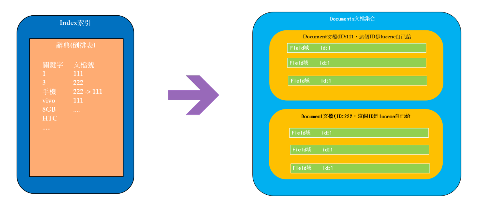

# 1.數據查詢方法

## 1.2.1. 順序掃描法
* 算法描述：
  * 所謂順序掃描，例如要找內容包含一個字符串的文件，就是一個文檔一個文檔的看，對於每一個文檔，
從頭看到尾，如果此文檔包含此字符串，則此文檔為我們要找的文件，接著看下一個文件，直到掃描完
所有的文件。
* 優點：
  * 查詢準確率高
* 缺點：
  * 查詢速度會隨著查詢數據量的增大， 越來越慢
* 使用場景：
    *  數據庫中的like關鍵字模糊查詢
    *  文本編輯器的Ctrl + F 查詢功能

## 1.2.2. 倒排索引
Lucene會對文檔建立倒排索引
* 1、 提取資源中關鍵信息， 建立索引 （目錄）
* 2、 搜索時，根據關鍵字（目錄），找到資源的位置
* 算法描述：
  * 查詢前會先將查詢的內容提取出來組成文檔(正文), 對文檔進行切分詞組成索引(目錄), 索引和文檔有關聯
關係, 查詢的時候先查詢索引, 通過索引找文檔的這個過程叫做全文檢索。


## 為什麼倒排索引比順序掃描快?
* 理解 : 因為索引可以去掉重複的詞, 漢語常用的字和詞大概等於, 字典加詞典, 常用的英文在牛津詞典也
有收錄.如果用計算機的速度查詢, 字典+詞典+牛津詞典這些內容是非常快的. 但是用這些字典, 詞典組成
的文章卻是千千萬萬不計其數. 索引的大小最多也就是字典+詞典. 所以通過查詢索引, 再通過索引和文檔
的關聯關係找到文檔速度比較快. 順序掃描法則是直接去逐個查詢那些不計其數的文章就算是計算的速
度也會很慢.
* 優點：
查詢準確率高
查詢速度快， 並且不會因為查詢內容量的增加， 而使查詢速度逐漸變慢
* 缺點：
索引文件會佔用額外的磁盤空間， 也就是佔用磁盤量會增大。
* 使用場景：
海量數據查詢

## 什麼是全文檢索

計算機索引程序通過掃描文章中的每一個詞，對每一個詞建立一個索引，指明該詞在文章中出現的次數
和位置，當用戶查詢時，檢索程序就根據事先建立的索引進行查找，並將查找的結果反饋給用戶的檢索
方式

lucene官網： http://lucene.apache.org/

# 2.索引流程

### 1. 原始内容
* 原始內容是指要索引和搜索的內容。
* 原始內容包括互聯網上的網頁、數據庫中的數據、磁盤上的文件等。

#### a.創建POJO

```java
public class Sku {
	//商品id
	private String id;
	//價格
	private Integer price;
	
	private String name;
	
	//庫存
	private Integer num;
	//圖片
	private String image;
	//分類名稱
	private String categoryName;
	//品牌
	private String brandName;
	//規格
	private String spec;
	//銷量
	private Integer saleNum;

  //getter setter....
}
```

#### b.創建DAO


### 2.採集數據(獲取文檔)

* 從互聯網上、數據庫、文件系統中等獲取需要搜索的原始信息，這個過程就是信息採集，採集數據的目
的是為了對原始內容進行索引。
* 採集數據分類：
  * 1、對於互聯網上網頁，可以使用工具將網頁抓取到本地生成html文件。
  * 2、數據庫中的數據，可以直接連接數據庫讀取表中的數據。
  * 3、文件系統中的某個文件，可以通過I/O操作讀取文件的內容。
* 在Internet上採集信息的軟件通常稱為爬蟲或蜘蛛，也稱為網絡機器人，爬蟲訪問互聯網上的每一個網
頁，將獲取到的網頁內容存儲起來。

### 3.創建文檔

- 獲取原始內容的目的是為了索引，在索引前需要將原始內容創建成文檔（Document），文檔中包括一
個一個的域（Field），域中存儲內容。
- 這裡我們可以將磁盤上的一個文件當成一個document，Document中包括一些Field，如下圖：


注意：每個Document可以有多個Field，不同的Document可以有不同的Field，同一個Document可以
有相同的Field（域名和域值都相同）

### 4.分析文檔

- 將原始內容創建為包含域（Field）的文檔（document），需要再對域中的內容進行分析，分析成為一
個一個的單詞。
- 比如下邊的文檔經過分析如下：
- 原文檔內容：
  - vivo X23 8GB+128GB 幻夜藍 全網通4G手機
  - 華為 HUAWEI 麥芒7 6G+64G 亮黑色 全網通4G手機
- 分析後得到的詞：
  - vivo, x23, 8GB, 128GB, 幻夜, 幻夜藍, 全網, 全網通, 網通, 4G, 手機, 華為, HUAWEI, 麥芒7。 。 。 。

### 5.索引文檔

- 對所有文檔分析得出的語彙單元進行索引，索引的目的是為了搜索，最終要實現只搜索被索引的語彙單
元從而找到Document（文檔）。
- 創建索引是對語彙單元索引，通過詞語找文檔，這種索引的結構叫倒排索引結構。
- 倒排索引結構是根據內容（詞彙）找文檔，如下圖：


倒排索引結構也叫反向索引結構，包括索引和文檔兩部分，索引即詞彙表，它的規模較小，而文檔集合
較大。

## Lucene底層存儲結構



# 3.搜尋流程

搜索就是用戶輸入關鍵字，從索引中進行搜索的過程。根據關鍵字搜索索引，根據索引找到對應的文
檔，從而找到要搜索的內容。


# 7分詞器

## 7.1分詞器介紹

- 在對Document中的內容進行索引之前，需要使用分詞器進行分詞 ，分詞的目的是為了搜索。分詞的主
要過程就是先分詞後過濾。

  - 分詞:採集到的數據會存儲到Document物件的Field域中，分詞就是將Document中的Field的value值切分成一個一個的詞
  - 過濾:包括去除標點符號過濾，去除停用詞過濾(的、是、a、an、the...)、大寫轉乘小寫(因為大寫字母在lucene裡是當成關鍵字使用)、詞的
形還原（複數形式轉成單數形參、過去式轉成現在式。。。）等。


- 什麼是停用詞？停用詞是為節省存儲空間和提高搜索效率，搜索引擎在索引頁面或處理搜索請求時會自
動忽略某些字或詞，這些字或詞即被稱為Stop Words(停用詞)。比如語氣助詞、副詞、介詞、連接詞
等，通常自身並無明確的意義，只有將其放入一個完整的句子中才有一定作用，如常見
的“的”、“在”、“是”、“啊”等。
- 對於分詞來說，不同的語言，分詞規則不同。 Lucene作為一個工具包提供不同國家的分詞器


## 7.2第3方分詞器 IK-analyzer

- 擴過展詞點:
  - 放專有名詞，或者是我們認為需要強制將某一些自分成一個詞，凡事出現在擴展辭典中的詞，就會被強制分成同一個詞
- 停用辭典:
  - 凡事出現在停用辭典中的詞，都會被過濾掉